# ☕ Java - James Gosling

> Started in 1991 -> Oak -> 1995 -> Java (breed of Coffee)

- Java is _statically typed_, so variable type must be declared before use.
- Use `var` (Java 10+) for type inference.
- Java is a compiled language, so you must compile your code before you can run it.

## Features

- Simple
- Platform Independent
- Object-Oriented Programming (OOP)
- Architectural Neutral
- Secure
- Robust
- Portable
- High Performance
- Faster
- Distributed
- Multithreaded
- Dynamic
- Interpreted

- Java is everywhere
- Write Once, Run Anywhere **(WORA)**

**Sun Microsystems**

> -> Java -> owned by Oracle -> So, Java is a product of Oracle.

`Platform` : it is an environment where you can run your programs.

`Library`: Java Library is a collection of pre-defined classes.

> - To Compile a Java File → `javac FileName.java`
> - To Run a Java File → `java FileName`

### Interpreter & Compiler

Java is a compiled language, so you must compile your code before you can run it.

    > Java Code -> Java Compiler (javac) -> Java Virtual Machine (JVM) -> Java Bytecode (JVM) -> Executable Code (OS)

JVM has an Interpreter which is known as **Just-In-Time** (JIT) compiler.

    > Java Code -> Compile (Compiler) -> Bytecode -> Independent

> Hello.java -> javac Hello.java -> Hello.class

> Hello.class -> Java Virtual Machine (JVM) -> Executable Code (OS)

> - **JVM** : Dependent on OS
> - **Bytecode** : Independent

Class files are **bytecode** files. Java files are **source code** files.

### Java Installation

- Download Java 17 (LTS) from Adoptium Temurin
- Install it normally
- Check installation: `java -version`

> - **JDK** : Java Development Kit - to develop code
> - **JRE** : Java Runtime Environment - to run code

Class file -> Class loader -> Byte Code verifier -> Interpreter -> Runtime -> Hardware

### Java Naming Conventions

- Class name starts with a capital letter
- Method name starts with a lowercase letter
- Variable name starts with a lowercase letter

> - **PascalCase** : `HelloWorld`
> - **CamelCase** : `helloWorld`
> - **SnakeCase** : `hello_world`

### `public static void main(String[] args)` explained

```java
class Demo{
    public static void main(String[] args) {
        System.out.println("Hello, World!");
    }
}
```

- Save this file as `Demo.java`
- To compile: `javac Demo.java`
- To run: `java Demo`

#### Parameters used

- `class` keyword is used to declare a class in java.
- `public` keyword is an access modifier which represets visibility, it means it is visible to all.
- `static` is a keyword, if we declare any method as static , it is known as static method. The core advantage of static method is that there is no need to create an object to invoke the static method.
  The **main** method is executed by the JVM, so it doesn't require to create object to inovke the main method. So it saves memory.
- `void` keyword is used to declare the return type of the method; it means it doesn't return any value.
- `main` represents the entry point of the program.
- `String[] args` is used to accept command-line arguments.
- `System.out.println()` is used to print the output on the console. `System` is a class in the java.lang package. The `out` is a static variable in the `System` class, and is an insurance of java.io.PrintStream. The `println()` method is used to print the output on the console. The `println` is a method of java.io.PrintStream; this method is overloaded to print message to output destination, which is typically a console or a file.

> ❓ **Difference between print and println**
> ➡ `print` method doesn't add a new line character at the end of the output, while `println` method adds a new line character at the end of the output.
> The `println()` method can also be used without parameters, to position the cursor on the next line.

> ❓ **What happens at compile time?**
> ➡ At compile time, java file is compiled by Java Compiler (it does not interact with OS) and converts java code into bytecode.

    Java Code (Demo.java) →  Compiler  →  Bytecode (Demo.class)

The compiler reads the source code and generates bytecode from it. The bytecode is then stored in a file with the same name as the source file, but with a `.class` extension.

> ❓ **What happens at run time?**
> ➡ The JVM reads the bytecode and executes it.

> ❓ **Can you save a java source file by other name than the class name?**
> ➡ Yes, if the class is not public. It is explained by the example below:

```java
class Demo{
    public static void main(String[] args) {
        System.out.println("Hello, World!");
    }
}
```

- Save this file as `Simple.java`

        Simple.java → Compiler  →  Bytecode (Demo.class)

- To compile: `javac Simple.java`
- To run/execute: `java Demo`

> ❓ **Can you have multiple classes in a java source file?**
> ➡ Yes.

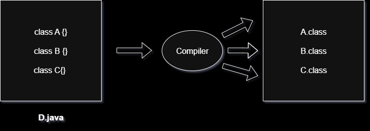

## 2. Differences Between JDK, JRE and JVM
JDK (Java Development Kit) provides tools and libraries to develop Java applications, working with JRE and JVM. JRE (Java Runtime Environment) offers the libraries and JVM needed to run Java programs. JVM (Java Virtual Machine) executes the compiled Java bytecode on the system.


> 📝: Java bytecode can run on any machine with a JVM, but JVM implementations are platform-dependent for each operating system.

### JDK (Java Development Kit)
JDK is a software development kit used to build Java applications. It contains the JRE and a set of development tools.

- Includes compiler (javac), debugger, and utilities like jar and javadoc.
- Provides the JRE, so it also allows running Java programs.
- Required by developers to write, compile, and debug code.

**Components of JDK:**

- JRE (JVM + libraries)
- Development tools (compiler, jar, javadoc, debugger)

**Note:**
- JDK is only for development (it is not needed for running Java programs)
- JDK is platform-dependent (different version for windows, Linux, macOS)

#### Working of JDK:
- **Source Code (.java)**: Developer writes a Java program.
- **Compilation**: The JDK’s compiler (javac) converts the code into bytecode stored in .class files.
- **Execution**: The JVM executes the bytecode, translating it into native instructions.

### JRE (Java Runtime Environment)
JRE provides an environment to run Java programs but does not include development tools. It is intended for end-users who only need to execute applications.

- Contains the JVM and standard class libraries.
- Provides all runtime requirements for Java applications.
- Does not support compilation or debugging.

**Note:**
- JRE is only for running applications, not for developing them.
- It is platform-dependent (different builds for different OS).

#### Working of JRE:
- **Class Loading**: Loads compiled .class files into memory.
- **Bytecode Verification**: Ensures security and validity of bytecode.
- **Execution**: Uses the JVM (interpreter + JIT compiler) to execute instructions and make system calls.

### JVM (Java Virtual Machine)
JVM is the core execution engine of Java. It is responsible for converting bytecode into machine-specific instructions.

- Part of both JDK and JRE.
- Performs memory management and garbage collection.
- Provides portability by executing the same bytecode on different platforms.

**Note:**
- JVM implementations are platform-dependent.
- Bytecode is platform-independent and can run on any JVM.
- Modern JVMs rely heavily on Just-In-Time (JIT) compilation for performance.

#### Working of JVM


1. **Loading**: Class loader loads bytecode into memory.
2. **Linking**: Performs verification, preparation, and resolution.
3. **Initialization**: Executes class constructors and static initializers.
4. **Execution**: Interprets or compiles bytecode into native code.

### JDK vs JRE vs JVM
| Aspect              | JDK                                      | JRE                                      | JVM                                                   |
|---------------------|-------------------------------------------|-------------------------------------------|--------------------------------------------------------|
| **Purpose**             | Used to develop Java applications         | Used to run Java applications             | Executes Java bytecode                                |
| **Platform Dependency** | Platform-dependent (OS specific)          | Platform-dependent (OS specific)          | JVM is OS-specific JVM, but bytecode is platform-independent |
| **Includes**            | JRE + Development tools (javac, debugger, etc.) | JVM + Libraries (e.g., rt.jar)            | ClassLoader, JIT Compiler, Garbage Collector          |
| **Use Case**            | Writing and compiling Java code           | Running a Java application on a system               | Converts bytecode into native machine code            |

## 3. Data Types

Java has two main categories of data types:

> - **Primitive** (store actual values, fixed size in memory)
> - **Non-Primitive (Reference)** (store addresses/references to objects)

### Primitive Data Types

1. **Integer Types**

   - `byte` → 1 byte (8-bit)
   - `short` → 2 bytes (16-bit)
   - `int` → 4 bytes (32-bit)
   - `long` → 8 bytes (64-bit)

2. **Floating-Point Types**

   - `float` → 4 bytes (32-bit, decimal, ~7 digits precision)
   - `double` → 8 bytes (64-bit, decimal, ~15 digits precision)

3. **Boolean Type**

   - `boolean` → 1 bit (value is `true` or `false`)

4. **Character Type**
   - `char` → 2 bytes (16-bit, Unicode character)

### Non-Primitive Data Types

- Strings
- Arrays
- Classes
- Interfaces

**Example**

```java
public class DataTypeExample {
    public static void main(String[] args) {
        byte b = 100;
        int age = 25;
        double salary = 55000.50;
        char grade = 'A';
        boolean isJavaFun = true;

        System.out.println("Byte: " + b);
        System.out.println("Age: " + age);
        System.out.println("Salary: " + salary);
        System.out.println("Grade: " + grade);
        System.out.println("Java is fun? " + isJavaFun);
    }
}
```

- `char` : Use single quotes
- `String` : Use double quotes

📖 **Important Rule – You Cannot Change the Type of a Variable**  
Once a variable is declared with a type, it cannot change to another type later in the program.

**Example**

```java
int myNum = 5;       // myNum is an int
// myNum = "Hello";  // ❌ Error: cannot assign a String to an int

String myText = "Hi"; // myText is a String
// myText = 123;      // ❌ Error: cannot assign a number to a String
```

> ❓ _What is the difference between primitive and reference data types?_
> ➡ Primitive stores **actual value**. Reference stores **address of the object in heap memory**.

## 4. Operators

Operator in java is a symbol that performs an operation on one or more operands.

### Java Operator Precedence

When a calculation contains more than one operator, Java follows order of operations rules to decide which part to calculate first.

For example, multiplication happens before addition:

Example:

```java
int result1 = 2 + 3 * 4;     // 2 + 12 = 14
int result2 = (2 + 3) * 4;   // 5 * 4 = 20

System.out.println(result1); // 14
System.out.println(result2); // 20
```

🤨 Why Does This Happen?  
In 2 + 3 \* 4, the multiplication is done first, so the answer is 14.

If you want the addition to happen first, you must use parentheses: (2 + 3) \* 4, which gives 20.

> 📝: Always use parentheses ( ) if you want to make sure the calculation is done in the order you expect. It also makes your code easier to read.

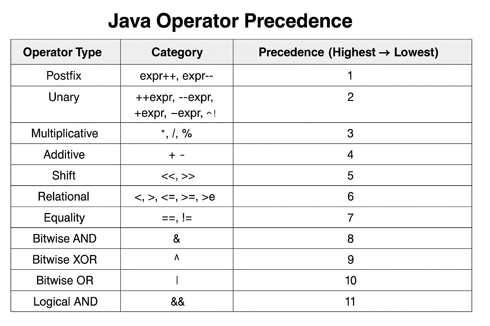

**Order of Operations**
Here are some common operators, from highest to lowest priority:

- () - Parentheses
- \*, /, % - Multiplication, Division, Modulus
- +, - - Addition, Subtraction
- <,>, >=, <= - Comparison
- ==, != - Equality
- && - Logical AND
- || - Logical OR
- = - Assignment

```java
class Output{
    public static void main(String[] args) {
        int a =3 , c=4;
        boolean b = true;
        System.out.println("b= " + b);
        b = false;
        System.out.println("b= " + b);
        if(b)
          System.out.println("b= " + b);
        b = true;
        if(b)
          System.out.println("b= " + b);
        if(b)
         System.out.println("b= " + b);
    }
}
```

Output:

```
b= true
b= false
b= true
b= false
```

> ❓ _What is the difference between `==` and `=`?_
> ➡ `==` checks if two values are equal, while `=` assigns a value to a variable.

```java
int  a = 5;
int b = a ++;

System.out.println(a); // 6
System.out.println(b); // 5
```

```java
int a = 29;
a--;
a -= ++a;
System.out.println(a); // 0
```

```java
int a = 8;
int b = ++a + (--a) + a
System.out.println(a); // 8
System.out.println(b); // 25
```

## 5. OOPs (Object Oriented Programming)

OOP stands for **Object-Oriented Programming**.

Procedural programming is about writing procedures or methods that perform operations on the data, while object-oriented programming is about creating objects that contain both data and methods.

Object-oriented programming has several advantages over procedural programming:

- OOP is faster and easier to execute

- OOP provides a clear structure for the programs

- OOP helps to keep the Java code DRY "Don't Repeat Yourself", and makes the code easier to maintain, modify and debug

- OOP makes it possible to create full reusable applications with less code and shorter development time

> 📝: The "**Don't Repeat Yourself**" (DRY) principle is about reducing the repetition of code. You should extract out the codes that are common for the application, and place them at a single place and reuse them instead of repeating it.

Object-Oriented Programming is a methodology or paradigm to design a program using classes and objects. It simplifies the software development and maintenance. Main Concepts - **Inheritance**, **Polymorphism**, **Abstraction**, **Encapsulation**.


### Key Features of OOP in Java:
- Structures code into logical units (classes and objects)
- Keeps related data and methods together (encapsulation)
- Makes code modular, reusable and scalable
- Prevents unauthorized access to data
- Follows the DRY (Don’t Repeat Yourself) principle

### What are Classes and Objects?

Classes and objects are the two main aspects of object-oriented programming.

Look at the following illustration to see the difference between class and objects:

- class : Fruit
- objects : Apple, Banana, Mango

So, a class is a template for objects, and an object is an instance of a class.

When the individual objects are created, they inherit all the variables and methods from the class.

Everything in Java is associated with classes and objects, along with its `attributes` and `methods`. For example: in real life, a car is an object. The car has attributes, such as weight and color, and methods, such as drive and brake.

A Class is like an object constructor, or a "blueprint" for creating objects.

**Properties of Java Classes**

- Class is not a real-world entity. It is just a template or blueprint, or a prototype from which objects are created.
- A class itself does not occupy memory for its attributes and methods until an object is instantiated.
- A Class in Java can contain Data members, methods, a Constructor, Nested classes, and interfaces.

> 📝: Objects (non-primitive types) are always allocated on the heap, while their reference variables are stored on the stack.

**Object Instantiation (Declaring Objects)**

When an object of a class is created, the class is said to be instantiated. All the instances share the attributes and the behavior of the class. But the values of those attributes, i.e. the state are unique for each object. A single class may have any number of instances.

---

`String[] args` is a parameter. It is a variable that is passed to the method. It is used to store the command-line arguments passed to the program.

```java
class abc {
    public static void main(String[] args) {

    }
}
```

### Why `main` uses `String[] args` (and not int[], float[], etc.)

1. **Command-line arguments are always text**

   - When you run a Java program from the terminal, everything after the class name is passed as **plain strings**.
   - Example:
     ```bash
     java MyApp 10 20
     ```
     The JVM receives `"10"` and `"20"` (strings), not numbers.

2. **Strings are universal**

   - Using `String[]` allows the program to accept any kind of input — numbers, words, file paths, flags like `-help`, etc.
   - If the parameter type were `int[]`, you couldn’t pass non-numeric input like `"hello"`.

3. **Conversion to other types is possible**

   - Strings can be converted to the required type inside the program:
     ```java
     int x = Integer.parseInt(args[0]);
     double y = Double.parseDouble(args[1]);
     ```
   - This gives flexibility: one program can handle multiple input formats.

4. **Defined by the JVM specification**
   - The JVM only looks for the method signature:
     ```java
     public static void main(String[] args)
     ```
   - If you use `int[]`, `float[]`, or any other type, the JVM will not recognize it as the entry point.

✅ **In summary:**  
Command-line input always comes in as text. `String[] args` ensures Java can accept any kind of input, and the program can later parse those strings into numbers or other data types as needed.

### Advantage of OOPs over Procedure-Oriented Programming Language
Object-oriented programming (OOP) offers several key advantages over procedural programming:
- By using objects and classes, you can create reusable components, leading to less duplication and more efficient development.
- It provides a clear and logical structure, making the code easier to understand, maintain, and debug.
- OOP supports the DRY (Don't Repeat Yourself) principle.This principle encourages minimizing code repetition, leading to cleaner, more maintainable code. Common functionalities are placed in a single location and reused, reducing redundancy.
- By reusing existing code and creating modular components, OOP allows for quicker and more efficient application development

### Disadvantages of OOPs
- OOP has concepts like classes, objects, inheritance etc. For beginners, this can be confusing and takes time to learn.
- If we write a small program, using OOP can feel too heavy. We might have to write more code than needed just to follow the OOP structure.
- The code is divided into different classes and layers, so in this, finding and fixing bugs can sometimes take more time.
- OOP creates a lot of objects, so it can use more memory compared to simple programs written in a procedural way.

## 6. Variables in Java

Variables are containers to store data in memory. Each variable has a name, type and value. It is the basic unit of storage in a program. Java has 4 types of variables.

- `Local Variables`: Declared inside a method, constructor, or block. Accessible only within that block.
- `Instance Variables`: Declared inside a class but outside any method. Each object of the class has its own copy.
- `Static Variables`: Declared with the static keyword inside a class. Shared by all objects of the class.
- `Final Variables`: Declared with final keyword. Value cannot be changed once assigned.

```java
class A {
    // Instance variable (belongs to each object)
    int a;

    // Static variable (shared by all objects)
    static int b;

    // Final variable (cannot be changed)
    final int c = 10;

    void m() {
        int d=5;   // Local variable (belongs to a method, must be initialized before use)
        System.out.println("Local variable d: " + d);
    }
}

class XYZ {
    public static void main(String[] args) {
        A obj1 = new A();  // Creating first object of class A
        A obj2 = new A();  // Creating second object of class A

        // Instance variable: each object has its own copy
        obj1.a = 20;
        obj2.a = 50;

        // Static variable: shared among all objects
        A.b = 100;

        // Printing values
        System.out.println("obj1.a = " + obj1.a); // 20
        System.out.println("obj2.a = " + obj2.a); // 50
        System.out.println("Static variable b = " + A.b); // 100
        System.out.println("Final variable c = " + obj1.c); // 10

        obj1.m(); // prints local variable
    }
}
```

Output:

```
obj1.a = 20
obj2.a = 50
Static variable b = 100
Final variable c = 10
Local variable d: 5
```

📝 This way you clearly demonstrate:

    - Instance variable → different for each object.
    - Static variable → shared across all objects.
    - Final variable → constant (cannot change once set).
    - Local variable → lives inside a method.

### Instance Variables & Static Variables

> 📝: We can use an `instance` variable only through the object of the class in which it is defined. **Instance variables** have default values. For numbers, the default value is 0; for booleans, it is False; and for Object refrences it is Null.

```java
class abc {
    int a; // instance variable
    public static void main(String[] args) {
        System.out.println(a); // displays 0
    }
}

class xyz {
 public static void main(String[] args) {
     abc a1 = new abc();
     a1.display(); // calling instance method

     abc a2 = new abc();
     a2.a = 10;
     a2.display(); // display 10
 }
}
```

```java
class abc{
    int  a; // instance variable
    public static void main(String[] args) {
        System.out.println(a); // displays 0
    }
}
```

📝: We can't access instance variable without object in `main()` even if both are present in the same class. To access an instance variable in `main()`:

    abc a1 = new abc(); // creating object of class abc
    System.out.println(a1.a);  // accessing instance variable using object

```java
class xyz {
    static int a; // static variable
    public static void main(String[] args) {
        System.out.println(a); // accessing static variable directly
    }
}
```

📝: However, if the instance variable is declared `static`, we can directly (without an object) access that variable in the `main()`.

❓ **Why do we need abc obj = new abc();?**

- `a` is an instance variable → it belongs to each object of the class.
- To access an instance variable inside a static method (like `main`), you must first create an object of that class.
- That’s why `obj.a` works: you created an object (`obj`) and then accessed its variable.

❓ **What if you don’t create an object?**

If you write just `System.out.println(a);`, it won’t compile.

You’ll get:

`non-static variable a cannot be referenced from a static context`

Because `main` is static and cannot directly access non-static members (like `a`) without an object.

creating an object (`new abc()`) is necessary here because `a` is an instance variable.
If you want to avoid creating an object, you’d need to make `a` static.

> 📝: **Static** variable retains the values. **Instance** variables have their won memories, so the values get overwritten.

> 📝: **Static (Class)** variables and **Instance** variables both are member variables because they are both associated with a specific class, but the difference between them is `Class (Static)` variables only have one copy that is shared by all the different objects of a class, whereas every object has it's own personal copy of an `instance`.

```java
class abc {
   static int a; // Static variables default to 0 if not explicitly initialized.
   public static void main(String[] args) {
       abc a1 = new abc();
       a1.a = 10; // This sets the class variable `a` to 10.
       System.out.println(a1.a); // 10

       abc a2 = new abc();
       a2.a = 5; // Even though we used a2, `a` is static → same variable is updated.
       System.out.println(a2.a); // 5

       abc a3 = new abc(); // Creates another object, but static variable `a` is still shared.
       System.out.println(a3.a); // 5
       a3 = a1; // Just makes a3 refer to the same object as a1. But since `a` is static, it doesn’t matter.

       System.out.println(a1.a); // 5

       System.out.println(new abc().a); // 5 // Even with a brand-new object, static variable is still the same.
   }
}
```

Output:

```
10
5
5
5
5
5
```

⚡ So the key takeaway:

- **Static variables are shared across all instances.**
- Changing them via any object (or even class name `abc.a`) updates the single shared copy.

## 7. Loops

`for`, `while`, `do-while`, `foreach`

### for loop

Used when you know beforehand how many times you want to run the loop.

```java
for (int i = 0; i < arr.length; i++) {
    System.out.println(arr[i]);
}
```

Output:

```
1
2
3
4
5
```

### foreach loop (Enhanced For Loop)

Syntax: `for(Type var:array) { }`

The `foreach` loop is used to traverse array or collection (i.e. for accessing array). It works on elements basis not index. It returns elements one by one in the defined variable.

```java
for (int i : arr) {
    System.out.println(i);
}
```

Output:

```
1
2
3
4
5
```

### while loop

Used when the number of iterations is unknown and depends on a condition.

```java
int i = 0;
while (i < arr.length) {
    System.out.println(arr[i]);
    i++;
}
```

Output:

```
1
2
3
4
5
```

### do-while loop

Similar to `while`, but executes the code at least once before checking condition.

```java
int i = 0;
do {
    System.out.println(arr[i]);
    i++;
} while (i < arr.length);
```

Output:

```
1
2
3
4
5
```

📝 **Difference between while and do-while:**

- `while` → checks condition first, may run 0 times.
- `do-while` → executes at least once before checking condition.

## 8. Arrays

Array is a collection of similar data types. Arrays are used to store multiple values in a single variable.

```java
int[] numbers = new int[5]; // Declaration + Memory allocation
numbers[0] = 10;            // Assigning values
numbers[1] = 20;

int[] values = {1, 2, 3, 4, 5}; // Declaration + Initialization in one step
```

### Array declaration

```java
int arr[] = new int[3];
int arr1[] = {10, 20, 30, 40};
int arr2[] = new int[]{10, 20, 30, 40};

char a[] = new char[3];
new char[] = {'A', 'B', 'C'};
```

### Multidimensional Arrays

```java
int arr[][] = {{10, 20}, {10, 20, 30}, {30, 40, 4, 5, 6}, {2}};

int len = arr[0].length;
System.out.println(arr[1][1]);  // prints 20
System.out.println(arr[1][2]);  // prints 30
```

```java
for(int i = 0; i < arr.length; i++) {
   for(int j = 0; j < arr[i].length; j++) {
      System.out.println(arr[i][j]);
   }
}

int arr[][] = new int[][] {{10, 20, 30, 40}, {10, 5}}
```

```java
int arr[][] = new int[3][3];
arr[0] = new int [10];
arr[1] = new int [20];
arr[2] = new int [30];
```

> 📖 Arrays are **fixed in size** (cannot be resized after creation).

Default values:

- `int` → 0
- `boolean` → false
- `Object` → null

> Arrays in Java are objects stored in heap memory.

**❓ Difference between Array and ArrayList**

- Array → Fixed size, can hold primitives and objects.
- ArrayList → Dynamic size, only holds objects (wrapper classes needed for primitives).

### Array Operations: Reversing and Summing Arrays

```java
// Class to perform array operations
class Arr {

    // Method to reverse an array
    int[] rev(int a[]) {
        // Initialize two pointers: i from start, j from end
        for (int i = 0, j = a.length - 1; i < j; i++, j--) {
            int temp = a[i];   // Swap the elements at i and j
            a[i] = a[j];
            a[j] = temp;
        }
        return a;  // Return the reversed array
    }

    // Static method to add two arrays element-wise
    static int[] sum(int a[], int a1[]) {
        // Create a new array to store the sum
        int c[] = new int[a.length];
        for (int i = 0; i < a.length; i++) {
            c[i] = a[i] + a1[i];   // Add corresponding elements
        }
        return c;   // Return the resultant array
    }
}

// Main class
class xyz {
    public static void main(String[] args) {
        // Create an object of Arr to use non-static methods
        Arr s1 = new Arr();
        
        // Reverse the first array {3,2,1} → {1,2,3}
        int A[] = s1.rev(new int[]{3, 2, 1});
        
        // Reverse the second array {1,2,3} → {3,2,1}
        Arr s2 = new Arr();
        int B[] = s2.rev(new int[]{1, 2, 3});
        
        // Add the two reversed arrays element-wise
        // A = {1,2,3}, B = {3,2,1} → C = {4,4,4}
        int C[] = Arr.sum(A, B);

        // Reverse the sum array again
        Arr s3 = new Arr();
        int result[] = s3.rev(C);

        // Print the final reversed array
        // Since arrays printed directly won't show elements,
        // we use Arrays.toString() for readable output
        System.out.println(java.util.Arrays.toString(result));
    }
}
```
Output:
```
[4, 4, 4]
```
🧭 **Quick Real-World Analogy**

Reversing an array is like flipping a line of people — the person at the start goes to the end, and vice versa.
Adding arrays is like combining two teams’ scores position-wise — first player’s score + first player’s score, and so on.

🔹 **1. Arrays in Java**

> Arrays are fixed-size, indexed, and homogeneous data structures.

- Syntax for declaration:

        int[] arr = new int[5];
        int[] arr = {1, 2, 3, 4};

- Index starts at **0 and ends at length - 1**.

🔹 **2. Reversing an Array**

**Logic**: Swap the first element with the last, second with the second-last, and so on until the middle is reached.

    for (int i = 0, j = arr.length - 1; i < j; i++, j--) {
        int temp = arr[i];
        arr[i] = arr[j];
        arr[j] = temp;
    }

🧩 Concept Used:
- Two-pointer approach (start and end)
- Array element swapping

🔹 **3. Summing Two Arrays**

**Logic**: Add corresponding elements of two arrays and store in a third array.
Example:

    A = [1, 2, 3]
    B = [4, 5, 6]
    C = [5, 7, 9]

**Code:**

    for (int i = 0; i < a.length; i++) {
        c[i] = a[i] + a1[i];
    }

🧩 **Concept Used**:
- Iteration over arrays using `for` loop
- Element-wise operation
- Returning an array

🔹 **4. Returning Arrays from Methods**

Arrays can be returned just like **primitive data types**.

- Example:

        int[] rev(int a[]) { ... return a; }

- The returned array holds changes because **arrays are passed by reference** (not by value).

🔹 5. Static vs Non-static Methods

- Static methods (like `sum()`) can be called without creating an object:

    Arr.sum(A, B);

- Non-static methods (like `rev()`) require an object:

    Arr obj = new Arr();
    obj.rev(A);

❓ **Explain how arrays are passed to methods in Java.**
➤ Arrays are passed by reference, meaning the method can modify the original array.

❓ **Can arrays of different lengths be added?**
➤ Not directly — it will cause `ArrayIndexOutOfBoundsException`. You must handle it manually.

❓ **What happens if you return an array from a method — does it create a copy or return a reference?**
➤ It returns a reference to the same array object in memory.

---

📝 **Data Types**

- `byte` : 1 byte
- `char` : 2 bytes
- `int` : 4 bytes
- `float` : 4 bytes
- `long` : 8 bytes
- `double` : 8 bytes
- `boolean` : 1 byte
- `short` : 2 bytes
- `String` : 2 bytes per character
- `Object` : 4 bytes

> 📝: **Primitive data types are stored in stack and objects are stored in heap.**

> 📝: **Primitive data types are faster than objects.**

📝: Arrays are faster than ArrayList.

📝: Wrapper classes are faster than primitive data types.

## 9. Functions (methods)

A function (in Java, commonly called a **method**) is a block of code that performs a specific task. Methods help in _code reusability_ and _modularity_.

### Structure of a Method

```java
 accessModifier keyword returnType functionName(parameterList) {
    function body;
}
```

```java
    returnType functionName(parameterList) {
        function body;
    }
```

**Example:**

```java
class abc {
    void display{ // function declaration
        System.out.println("Function body");
    }
}

class xyz {
    public static void main(String[] args) {
        abc a1 = new abc(); // creating object of class abc
        a1.display(); // function call
    }
}
```

> 📝: We can't declare two functions having same name & same signature in a class or it'll generate `compile time error`.

> 📝: We can't call a function before it is declared.

```java
class abc{
    int a;
    void display{
        System.out.println(a);
    }
}

class xyz{
    public static void main(String[] args) {
        abc a1 = new abc();
        a1.a = 23;
        a1.display(); // displays 23

        new abc().display(); // displays 0
        abc a2 = new abc();
        a2.display(); // displays 0
    }
}
```

Output:

```
23
0
0
```

> 📝: Non-static member can be accessed in a static function but vice versa is not possible.

```java
class abc{
    int a, b; // instance variable
    void display() {
        int c = 10, d =20; // local variable
        a = c;
        b = d;
    }
    void output() {
        System.out.println(a + " " + b);
    }
}

class xyz {
    public static void main(String[] args) {
        abc a1 = new abc();
        a1.display(); // initializes a and b
        abc a2 = new abc();
        a2.output();  // prints 0 0
        a1.output();  // prints 10 20
    }
}

```

First `display()` is called by using `a1` object of class `abc`, it will set the values of `a` and `b` as 10, 20 respectively.
Then `output()` is called by `a2` object of class `abc`. It will print the values of `a` and `b` which are 0, 0 respectively.
At last, `output()` is called which displays `a`, `b` as set by `display()` function which is 10, 20 respectively.

Output:

```
0 0
10 20
```

📝: Methods **must be defined inside a class** in Java.

- `main()` is also a method (entry point of program).

- Methods can be:

  - With return value (e.g., `int add()` returns a number).

  - Without return value (`void greet()` just performs an action).

> 📝 Method Signature → Consists of method name and parameter list.

Example: `add(int a, int b)` is the method signature.

📝 **Difference between Function and Method:**

- In general programming → "Function" = **block of reusable code.**
- In Java → **functions are always inside a class, so they’re called methods.**

> 📝: **Method overloading** allows a class to have multiple methods with the same name but different parameter lists.

> 📝: **Constructor overloading** allows a class to have multiple constructors with different parameter lists.

> 📝: **Method overriding** allows a subclass to provide a different implementation for a method that is already defined in the superclass.

### Java Scope
In Java, variables are only accessible inside the region where they are created. This is called **scope**.

#### Method Scope
Variables declared directly inside a method are available anywhere in the method following the line of code in which they were declared:
```java  
public class Main {
  public static void main(String[] args) {

    // Code here CANNOT use x

    int x = 100;

    // Code here CAN use x
    System.out.println(x);
  }
}
```

#### Block Scope
A block of code refers to all of the code between curly braces `{ }`.

Variables declared inside a block of code are only accessible by the code between the curly braces, and only after the line in which the variable was declared:
```java
public class Main {
  public static void main(String[] args) {

    // Code here CANNOT use x

    { // This is a block

      // Code here CANNOT use x

      int x = 100;

      // Code here CAN use x
      System.out.println(x);

    } // The block ends here

    // Code here CANNOT use x

  }
}
```
> 📝 : A block of code can stand alone, or be part of an `if`, `while`, or `for` statement. In a `for` loop, the variable declared in the loop header (like `int i = 0`) only exists inside the loop.

#### Loop Scope
Variables declared inside a for loop only exist inside the loop:
```java
public class Main {
  public static void main(String[] args) {

    for (int i = 0; i < 5; i++) {
      System.out.println(i); // i is accessible here
    }

    // i is NOT accessible here
  }
}
```
- The `for` loop has its own block (`{ ... }`).
- The variable `i` declared in the loop header (`int i = 0`) is only accessible inside that loop block.
- Once the loop ends, `i` is destroyed, so you can't use it outside.

Why this matters:

Loop variables are not available outside the loop.

You can safely reuse the same variable name (`i`, `j`, etc.) in different loops in the same method:
```java
public class Main {
  public static void main(String[] args) {

    for (int i = 0; i < 3; i++) {
      System.out.println("Loop 1: " + i);
    }

    for (int i = 0; i < 2; i++) {
      System.out.println("Loop 2: " + i);
    }
  }
}
```
#### Class Scope
Variables declared inside a class but outside any method have class scope (also called fields). These variables can be accessed by all methods in the class:
```java
public class Main {
  int x = 5; // Class variable

  public static void main(String[] args) {
    Main myObj = new Main();
    System.out.println(myObj.x); // Accessible here
  }
}
```

### Recursion
Recursion is the technique of making a function call itself. This technique provides a way to break complicated problems down into simpler problems which are easier to solve.

**Recursion Example**
Adding two numbers together is easy to do, but adding a range of numbers is more complicated. In the following example, recursion is used to add a range of numbers together by breaking it down into the simple task of adding two numbers:
```java
public class Main {
  public static int sum(int k) {
    if (k > 0) {
      return k + sum(k - 1);
    } else {
      return 0;
    }
  }

  public static void main(String[] args) {
    int result = sum(10);
    System.out.println(result);
  }
}
```

When the `sum()` method is called, it adds parameter `k` to the sum of all numbers smaller than `k` and returns the result. When `k` becomes 0, the method just returns 0. When running, the program follows these steps:

10 + sum(9)
10 + ( 9 + sum(8) )
10 + ( 9 + ( 8 + sum(7) ) )
...
10 + 9 + 8 + 7 + 6 + 5 + 4 + 3 + 2 + 1 + sum(0)
10 + 9 + 8 + 7 + 6 + 5 + 4 + 3 + 2 + 1 + 0
Since the method does not call itself when `k` is 0, the program stops there and returns the result.

**Halting Condition**

Just as loops can run into the problem of infinite looping, recursive methods can run into the problem of infinite recursion. Infinite recursion is when the method never stops calling itself. Every recursive method should have a halting condition, which is the condition where the method stops calling itself. In the previous example, the halting condition is when the parameter `k` becomes 0.

It is helpful to see a variety of different examples to better understand the concept. In this example, the method adds a range of numbers between a start and an end. The halting condition for this recursive method is when **end** is not greater than **start**:

Use recursion to add all numbers from 5 to 10 (5+6+7+8+9+10):
```java
public class Main {
  public static int sum(int start, int end) {
    if (end > start) {
      return end + sum(start, end - 1);
    } else {
      return end;
    }
  }

  public static void main(String[] args) {
    int result = sum(5, 10);
    System.out.println(result);
  }
}
```
> Be careful with recursion: it's easy to accidentally write a method that never stops or uses too much memory. But when written correctly, recursion can be both efficient and elegant.

**Countdown with Recursion:** 
This example demonstrates how to use recursion to create a countdown function:
```java
public class Main {
  static void countdown(int n) {
    if (n > 0) {
      System.out.print(n + " ");
      countdown(n - 1);
    }
  }

  public static void main(String[] args) {
    countdown(5);
  }
}
```
The method calls itself with `n - 1` until `n` becomes `0`.

**Calculate Factorial with Recursion**
This example uses a recursive method to calculate the factorial of 5:
```java
public class Main {
  static int factorial(int n) {
    if (n > 1) {
      return n * factorial(n - 1);
    } else {
      return 1;
    }
  }

  public static void main(String[] args) {
    System.out.println("Factorial of 5 is " + factorial(5));
  }
}
```
Factorial means multiplying a number by every number below it, down to 1. For example, the factorial of 5 is: 5 * 4 * 3 * 2 * 1 = 120. By definition, 0! is also 1.

### Returning Object from a Method

A function can return any data type, including class objects.

```java
    class abc{
        static xyz getObj() { 
            return new xyz(); // returns xyz object
        }
    }

    class xyz {
        int sum(int a, int b) {
            return a + b;
        }
    }

    class mno {
       public static void main(String[] args) {
        // Direct call — object returned by getObj() is used immediately
        System.out.println(abc.getObj().sum(10, 20));

        /* Equivalent approach:
        xyz x1 = abc.getObj();  // getObj() returns xyz object
        int c = x1.sum(10, 20);
        System.out.println(c);
        */
        }
    }
```

Output:

```
30
```
- `getObj()` returns a **new object** of class `xyz`.
- The expression `abc.getObj()` returns that object reference, which can be used directly to call methods of `xyz`.
- This technique helps **avoid explicit object creation** in the calling method.

📝: The **return type** of the method must match the **class type** of the object being returned.
e.g., `static xyz getObj()` → must return a `xyz` object.

📝: You can either:
- **store the returned object in a variable**, or
- **use it directly in a chained method call** (`abc.getObj().sum(10, 20)`).

📝: Static methods can return objects even though they belong to the class (not an instance).

### ⚙️ Static Context Notes

Static methods can also return objects, even though they belong to the class (not an instance).

> 📝: Static methods can't access **instance variables** without an object.

```java
class abc {
    int a;
    static xyz getObj() {
        System.out.println(a); // ❌ error — cannot access instance variable
        return new xyz();
    }
}
```
> 📝: Static variable **cannot be declared in local scope** (inside methods).

**Example: Static Variable Behavior**
```java
class abc{
    static int a;
    public static void main(String[] args) {
        abc a1 = new abc();
        a1.a = 90; // changes static variable
        abc a2 = new abc();
        a2.a = 40; // overwrites previous value
        a1.display(); // prints 40
    }
    void display() {
        System.out.println(a);
    }
}
```
Output:
```
40
```

> 📝: Static variable retains the previous value of the recent object.
> 📝: Instance variables can't be declared in local scope.

#### 💬 Key Takeaways

- **Static variable** → shared by all objects; retains last updated value.
- **Instance variable** → unique for each object; requires an object to access.
- **Static variable / method** → can be accessed using class name (`ClassName.var` or `ClassName.method()`).
- **Instance variable / method** → requires an object reference (`obj.var` or `obj.method()`).

## 10. `this` Keyword

The `this` keyword is a reference variable in Java that refers to the current object of a class.
It is used to avoid ambiguity, call constructors, and pass the current object as an argument.

```java
class abc {
    int a, b; // instance variable
    void display() {
        int a = 10, b = 20; // local variable
        this.a = a; // this keyword is used to access instance variables // 'this.a' refers to instance variable
        this.b = b;  // assigns local b to instance b
    }
    void output() {
        System.out.println(a + " " +b);
    }
}

class xyz {
    public static void main(String[] args) {
        abc a1 = new abc();
        a1.display(); // initializes instance variables a and b using local values
        a1.output(); // prints: 10 20

        abc a2 = new abc();// again assigns values
        a2.output();   // prints: 10 20
    }
}
```

- Without `this`:
  The local variables `a` and `b` would shadow (hide) the instance variables, leaving the instance variables uninitialized (default `0`).

- With `this`:
  We explicitly tell Java:

> "Assign the value of the local variable `a` to the instance variable `a` of this object."

That’s why `a1.output()` prints 10 20 instead of 0 0.

Output:

```
 10  20
 10  20
```

📝: `this` variable holds the value of the current object.
The `this` keyword can be used to refer current class instance variable. If there is ambiguity between the instance variables and parameteres, `this` keyword resolves the problem of ambguity.

> 📝:The keyword `this` is used only within instance methods or constructors.

- `this` cannot be used inside `static` methods (since static methods do not belong to an object).

- `this` is **automatically added by the compiler** when accessing instance variables, but we use it explicitly when needed for clarity.

### this variable

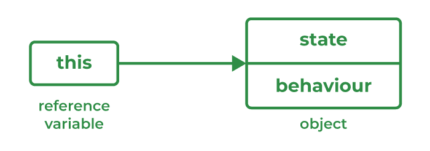]

```java
class xyz {
    int a, b;
    void display(int a, int b) {
        this.a = a;
        this.b = b;
    }
    void output() {
        System.out.println(a + " " + b);
    }
}

class mno{
    public static void main(String[] args) {
        xyz x1 = new xyz();
        x1.display(10, 20);
        x1.output(); // prints 10 20
    }
}
```

Output:

```
10 20
```

> 📝: In Java, `this` is a reference variable that refers to the current object.

- By the use of `this` keyword, we can refer to any member of the current object within an instance method or constructor.
- `this`keyword can be used to refer to the current object, and it always acts as a reference to an object in which method was invoked.
- There are various uses of `this` keyword in Java. These are:
  - `this` can be used to refer current instance variable. [Example: `this.a;`]
  - `this` can be used to invoke current instance method (implicity). [Example: `this.display();`]
  - `this` can be used to invoke current class constructor. [Example: `this();`]

## 11. Types of functions

| Type                                        | Description                                                   | Example                                                                    |
| ------------------------------------------- | ------------------------------------------------------------- | -------------------------------------------------------------------------- |
| 1. Without arguments & without return value | Method does not take any input, and does not return anything. | `java\nvoid greet() {\n    System.out.println("Hello!");\n}\n`             |
| 2. Without arguments & with return value    | Method does not take input, but returns a value.              | `java\nint getNumber() {\n    return 10;\n}\n`                             |
| 3. With arguments & without return value    | Method takes input, but does not return anything.             | `java\nvoid printSum(int a, int b) {\n    System.out.println(a + b);\n}\n` |
| 4. With arguments & with return value       | Method takes input and also returns a value.                  | `java\nint add(int a, int b) {\n    return a + b;\n}\n`                    |

### Parameterized functions

```java
class abc {
    int c;
    void display(int a, int b) {
        c = a + b;
        System.out.println(c);
    }
}

class xyz {
    public static void main(String[] args) {
        abc a1 = new abc();
        a1.display(10, 20); // prints 30
        System.out.println(a1.c); // prints 30
    }
}
```

Output:

```
30
30
```

📝: Parameters are added to a constructor in the same way that they are added to a method, just declare them inside the paranthesis after constructor's name.

#### Passing Array as an Argument in a function

```java
class abc {
    int c;
    void display(int a[])
    {
        for(int i = 0; i < a.length; i++)
            c += a[i];
        System.out.println(c);
    }
}

class xyz {
    public static void main(String[] args) {
        // int arr[] = {10, 20, 30, 40};
        abc a1 = new abc();
        a1.display(new int[]{10, 20, 30, 40});  // prints 100
        System.out.println(a1.c);  // prints 100
    }
}
```

Output:

```
100
100
```

> 📝: Java doesn't support **default arguments**, like C++.

## 12. Method Overloading (Compile Time Polymorphism)

Same function name & different parameters are called **method overloading**.

> 📝: **Compile Time Polymorphism** is a feature of Java that allows a single method name to be used for multiple different functions with different parameters.

```java
class xyz {
    void display(int a, int b) {
        int c = a + b;
        System.out.println(c);
    }
    void display(int a){
        System.out.println(a);
    }
}

class mno{
    public static void main(String[] args) {
        xyz x1 = new xyz();
        x1.display(10, 20); // prints 30
        xyz x2 = new xyz();
        x1.display(30); // prints 30
    }
}
```

Output:

```
30
30
```

## 13. var args

Variable length Arguments

**Syntax:** `typeName... parameterName`

```java
class xyz{
    void sum(int... arr) { // var args
        int sum = 0;
        for(int k:arr) {
            sum += k;
        }
        System.out.println(sum);
    }
}

class mno{
    public static void main(String... args) { // we can use var args here as well
        xyz x1 = new xyz();
        x1.sum(10, 20, 30); // prints 60
         x1.sum(10, 20, 30, 40); // prints 100

    }
}
```

Output:

```
60
100
```

- `int... arr` → means **zero or more `int` arguments**.

- Inside the method, Java treats `arr` like a normal array.

- You can only have **one varargs parameter** in a method, and it must be the last parameter.

```java
void display(String msg, int... nums) { ... } // ✅ valid
void display(int... nums, String msg) { ... } // ❌ invalid
```

## 14. Passing Object as Argument

In Java, we can pass objects as **arguments** to methods. Since everything in Java is pass-by-value, what actually gets passed is the **reference (address)** of the object, not the actual object itself.

```java
class xyz{
    void sum(){
        System.out.println("hello");
    }
}

class mno{
    xyz x1; // Reference of class xyz

    void output(xyz x1) { // takes xyz object as argument
        this.x1 = x1;     // assign to instance variable
        x1.sum();         // call method of xyz
    }
}

class pqr{
    public static void main(String... args) {
        xyz kk = new xyz(); // create object of xyz
        mno m1 = new mno(); // create object of mno
        m1.output(kk); // pass object kk of class xyz to output()
    }
}
```

Output:

```
hello
```

- When we write `m1.output(kk);`, the reference of object `kk` is passed.
- Inside the method `output(xyz x1)`, the parameter `x1` now refers to the same object as `kk`.
- This means changes made to `x1` inside the method will affect the original object `kk`.

> 📝: Objects are passed by **reference value** → meaning the reference (memory address) is copied, so both variables point to the same object in heap memory.

--

- When you pass an object to a method, what’s actually passed is the **reference (address)** of the object.

- This means:
  - The method can call the object’s methods.
  - The method can modify the object’s fields (since it has the reference).

## 15. Passing Array of Objects to a method

```java
class abc{
    String s;
    void display(){
        System.out.println(s);
    }
    void callObjectArray(abc a1[]) {
        a1[0].display();
        a1[1].display();
    }
    public static void main(String... args) {
        abc a1 = new abc();
        a1.s = "A";
        abc a2 = new abc();
        a2.s = "B";
        abc a3 = new abc();

        // Method 1: Using an array reference
        // Passing pre-created array of objects
        /*  abc arr[] = new abc[2];
            arr[0] = a1;
            arr[1] = a2;
            a3.callObjectArray(arr);
        */

       // Method 2: Passing anonymous array of objects
       // Passing array of objects directly (inline)
       a3.callObjectArray(new abc[]{a1, a2}); // passing array of objects
    }
}
```

- An array can store **objects** just like primitives.
- `new abc[]{a1, a2}` is an **anonymous array** — you don’t store it in a variable, just directly pass it.
- Inside the method, you can use the array just like any normal array.
- Useful in scenarios like:

  - Passing multiple students (objects) to a method.
  - Processing a list of employees, products, etc.

- Arrays in Java can hold objects (references), not just primitive values.
- When you pass an array of objects, you’re passing the **reference** to that array (so changes inside the method affect the original array).
- You can either:
  - Create the array beforehand and pass it.
  - Or directly pass a **new array literal** in the method call (`new abc[]{obj1, obj2}`).

> 📝: Arrays in Java are objects, not primitives.

> 📝: If we declare the function callObjectArray as static method, we won't need an object and we can call the function as: `abc.callObjectArray(new abc[] {a1, a2});`

## 16. Returning Value by a Method

The `return` keyword has a specific meaning in Java compiler. It is only used with a method to specify if that method will return certain value to the calling method.
`return` keyword forces the method to retrun value to the calling method of a particular type.

```java
    class abc {
    int display(int a, int b) {
        return a + b;
    }

    public static void main(String... args) {
        abc a1 = new abc();
        int c = a1.display(10, 20);
        System.out.println(c);

        // Alternatively:
        System.out.println(new abc().display(10, 20));
    }
}
```

- `a1.display(10, 20)` → calls the instance method and returns `30`.
- `new abc().display(10, 20)` → creates a temporary object and immediately calls the method on it.
- Both print `30`, but the second one does not store any reference to the object.

Output:

```
30
30
```

> 📝: We can't overload a function even if its return type is different, but it contains same signature.

❌ Example: Invalid Overloading (Different Return Type Only)

```java
    class abc{
        int display(int a, int b){
             return a + b;
        }
        float display(int a, int b){
             return a + b;
        }
    }
```

In the above class `abc`, even if the return type of the two `display()` functions is different, we can't define two functions having same name, unless its signature is different.

**Why is this invalid?**

- Both methods have the **same name** (`display`) and **same parameter list** (`int, int`).
- Java identifies methods by their **name and parameter list only** (not return type).
- The compiler cannot decide which method to call, since both look identical at call time.

🧩 error: method display(int,int) is already defined in class abc

✅ Example: Valid Overloading (Different Parameters)
```java
class abc {
    int display(int a, int b) {
        return a + b;
    }

    float display(float a, float b) {
        return a + b;
    }
}
```
Now the compiler can distinguish between the two methods because the **parameter types differ** (`int vs. float`).

> 📝: In Java, **method signature = method name + parameter list**

> Return type is not part of the method signature.

## 17. Print an array element by element

When you print an array directly in Java (e.g., `System.out.println(arr);`),
it doesn’t print the elements — instead, it prints the **memory address** (like `[C@15db9742`).
This is because arrays in Java are **objects**, not primitive values.

To print elements **one by one**, you must **traverse (iterate)** the array using a loop.

```java
 class abc{
    char[] display(String s) // defining array of char type
    {
        char ar[] = new char[s.length()];
        for(int i = 0; i < ar.length(); i++)
        {
            ar[i] = s.charAt(i); // returns a char value at given index no
        }
        return ar;
    }
    public static void main(String... args) {
        abc a1 = new abc();
        char am[] = a1.display("hello");
        // System.out.println(am); // would print memory reference, not characters
        for(char p: am){ // for-each loop to print each character
            System.out.println(p);
        }
    }
 }
```
Output:
```
h
e
l
l
o
```

- **Arrays are objects** in Java, so printing them directly prints the reference (like `[C@hashcode`).
- To view individual elements, use a loop (`for`, `for-each`, or `while`).
- `String.charAt(index)` returns the character at a specific position.
- You can return an array from a method just like any other object.
- `for (char p : am)` is a for-each loop, introduced in Java 5, ideal for reading array elements sequentially.

- The method `charAt(int index)` returns the character at the specified index.
The index value should lie between `0` and `length() - 1` (the length of the string minus 1).

- `.length` → **Property** (not method) used to find the size of **an array**.
Example:
```java
int size = arr.length;
```

- `.length()` → **Method** used to find the length of a **String**.
Example:
```java
int len = str.length();
```

This distinction avoids confusion between Strings and Arrays — both have “length,” but one uses a _method_ and the other a _field_.

> 📝: If you want to **print an array without loops** (for debugging), use: `System.out.println(Arrays.toString(am));` (but remember to `import java.util.Arrays;`)

## 18. Passing Objects as arguments

In Java, you can **pass objects as parameters** to methods just like variables.

When you pass an object to a method, its **reference** (memory address) is passed, not the actual copy of the object.

This means that changes made to the object inside the method affect the original object (since both refer to the same memory location).

```java
    class pqr {
        void sum(){
            System.out.println("World");
        }
    }
    class xyz{
        void sum(){
            System.out.println("Hello");
        }
    }
    class mno {
    xyz x1; // Reference to xyz class object
    pqr p1; // Reference to pqr class object

    // Method accepts two objects as parameters
    void output(xyz x1, pqr p1) {
        // 'this' keyword refers to current object of mno
        this.x1 = x1; // assign parameter reference to instance variable
        this.p1 = p1; // assign parameter reference to instance variable

        x1.sum(); // calls xyz.sum()
        p1.sum(); // calls pqr.sum()
    }
}

class abc {
    public static void main(String... args) {
        xyz kk = new xyz();   // create object of xyz
        mno m1 = new mno();   // create object of mno
        m1.output(kk, new pqr()); // passing object references to output()
    }
}
```
Output:
```
Hello
World
```

Explanation:

- `m1.output(kk, new pqr());`
→ The method `output()` is called with two **object arguments**:
one existing object (`kk` of `xyz`) and one anonymous object (`new pqr()`).
→ kk (object of xyz) and new pqr() (new object of pqr) are passed as **references**.
- Inside `output(xyz x1, pqr p1)`:
→ The parameters `x1` and `p1` now refer to the **same memory** locations as the objects `kk` and `new pqr()` created in `main()`.
- Inside the method:
  - `this.x1 = x1;` → assigns the `xyz` object reference to instance variable x1.
  - `this.p1 = p1;` → assigns the `pqr` object reference to instance variable p1.
  - Then `x1.sum()` prints "Hello" and `p1.sum()` prints "World".

 💬 **Important Concepts:**
- Java is **pass-by-value**, even for objects — but the _value passed_ is the **reference** to the object.
So both caller and callee refer to the _same_ object in memory.

- This means that **modifying an object inside a method** will reflect in the calling method,
because both point to the same memory address.

- If you create a **new object** inside the method and reassign the parameter, it won’t affect the original reference outside the method.

- When an **object** is passed to a method, Java passes the **reference value** (address in memory).
This means:
  - The method can call the object’s methods.
  - The method can modify the object’s fields.

- **Objects are never passed by value** (_copy of the object_) —
only the reference is copied and passed.

- You can pass:
  - Pre-created objects (`kk`), or
  - Anonymous objects (`new pqr()`).

📘 **Key Takeaways:**

✅ You can pass multiple objects as arguments in a single method.

✅ The method can call functions of those objects or even modify their data.

⚠️ Remember: both the caller and callee share the same memory reference.

📝 If you modify the object inside the method, the change reflects outside too — since both refer to the same object in the heap.

## 19. String

String is basically an object that represents sequence of char values.

```java
class abc{
    public static void main(String... args) {
        String s = "1234hello";
        String str = s + "hello"; 
        System.out.println(str); // displays 1234hellohello
    }
}
```

Output:

```
1234hellohello
```

Explanation:
- `String s = "1234hello";` → creates a string object `s` with value "1234hello".
- `String str = s + "hello";` → creates a new string object `str` by concatenating `s` and "hello".
- `System.out.println(str);` → prints the value of `str`, which is "1234hellohello".

💬 **Important Concepts:**

- String is a **class** that represents a sequence of characters.
- Strings are **immutable**, which means they cannot be changed once created.
- String objects are created using double quotes.
- String concatenation is done using the `+` operator. The `+` operator concatenates strings.

```java
String str = "hello";

int len = str.length();     // returns length of the string (5)
char ch = str.charAt(3);    // returns the character at index 3 → 'l'

System.out.println("Length: " + len);
System.out.println("Character at index 3: " + ch);
```

- `str.length()` → returns an int representing the number of characters in the string.
- `str.charAt(index)` → returns the character at the given index (0-based).

        - For "hello",
                charAt(0) → 'h'
                charAt(1) → 'e'
                charAt(2) → 'l'
                charAt(3) → 'l'
                charAt(4) → 'o'

- The valid index range is `0` to `length() - 1`.

```java
String st = "Welcome";
for(int i=0; i < st.length(); i++) // length() returns the length of the string
{
    System.out.println(st.charAt(i)); // prints each character
}
```

Output:
```
W
e
l
c
o
m
e
```

```java
String st = "Welcome";
char arr[] = new char[st.length()]; // array of char type
for(int i=0; i < st.length(); i++)
{
    arr[i] = st.charAt(i); // returns a char value at given index no
    System.out.println(p); // prints each character
}
```
Output:
```
W
e
l
c
o
m
e
```
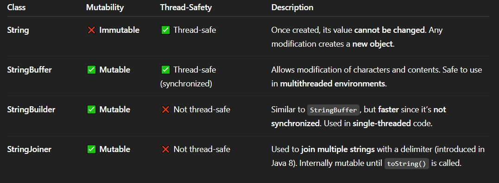

- String : Immutable
- StringBuffer : Mutable
- StringBuilder : Mutable
- StringJoin : Mutable

**Immutable** → cannot change the object once created (`String`)

**Mutable** → can modify contents without creating new object (`StringBuffer`, `StringBuilder`, `StringJoiner`)

**Thread-safety** → `StringBuffer` is synchronized (safe in multithreading), others are not.

        int b = arr.length // to calculate length of an array

```java
class abc{
    int a = 10;
    String ss = "hello";
    public static void main(String... args) {
        abc a1 = new abc();
        System.out.println(a1.a);
        System.out.println(a1.ss);
    }
}
```
📝: As instance variable requires an object to be able to access it throughout any method in the class; we aren't able to access the instance variable in a static method directly (using variable's name only).

As static methods don't require objects for their invokation and instance variable can't be accessed without an object.

📝: Instance variables can be accessed directly by calling the variable name inside the class. However, within static menthods (when instance variables are given accessibility), they should be called using the fully qualified name. `ObjectReference.VariableName`

📝: `substring(int beginIndex)` returns a new string that is a substring of this string.
`substring(int beginIndex, int endIndex)` returns a new string that is a substring of this string. The substring includes the characters at the specified beginIndex and excludes the character at endIndex. Thus, the length of the returned substring is `endIndex - beginIndex`.

```java
class abc{
    public static void main(String... args) {
        String s = "1234hello";
        String sst = s + "hello";
        s = s + "hello"; // concatenate String s
        System.out.println(sst);
        System.out.println(s);
    }
}
```

### String Concatenation  

In Java, string concatenation forms a new string that is combination of multiple strings.
There are two ways to concatenate strings in Java:
- `+` operator
- `concat()` method

- After a string literal, all the `+` will be treated as string concatenation operator.

> ⚠ : Java uses the `+` operator for **both addition and concatenation**.
Numbers are added. Strings are concatenated.

### To print a string character by character

You can use a `for loop` with `charAt()` method.

```java
class abc {
    public static void main(String... args) {
        String s = "Arigatou!";
        for(int i = 0; i < s.length(); i++)
        {
            System.out.println(s.charAt(i));
        }
    }
}
```
Output:
```
A
r
i
g
a
t
o
u
!
```

### To store a string into an array

```java
class abc {
    public static void main(String... args) 
    {
        String s = "Sakura";
        char ar[] = new char[s.length()];
        for(int i = 0; i < ar.length; i++)
        {
            ar[i] = s.charAt(i);
            System.out.println(ar[i]);
        }
    }
}
```
Output:
```
S
a
k
u
r
a
```

## 20. Wrapper Class

A wrapper class is a class whose object **wraps** or contains a primitive data types.
When we create an 'object' to a wrapper class, it contains a field and in this field, we can store a primitive data type.
In other words, we can wrap a primitve value into a wrapper class.

❓ **Why there is need for wrapper classes?**
➤ Wrapper classes are used to convert any data types into an  object. The primitve data types are not objects; they do not belong to any class; they are defined in the language itself. Sometimes, it is required to convert data types into objects in Java language.

> 📝: Wrapper class is defined in `java.lang.*` package.

The eight classes of `java.lang.package` are known as wrapper classes in Java.

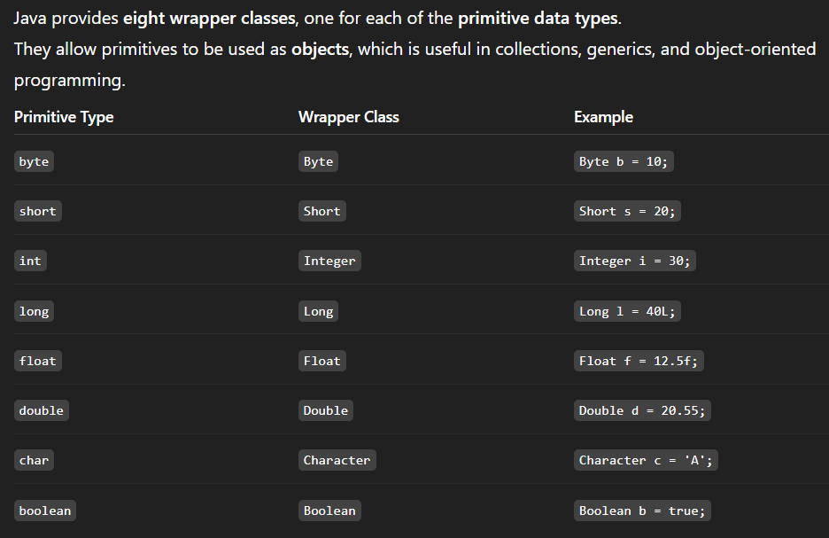

- **Purpose**:
Wrapper classes "wrap" primitive values into objects so they can be stored in classes like `ArrayList`, `HashMap`, etc.

- **Autoboxing:**
Automatic conversion of a primitive to its wrapper class.

        Integer num = 5;  // int → Integer automatically

- **Unboxing:**
Automatic conversion of a wrapper object back to its primitive.

        int x = num;  // Integer → int automatically

- **All wrapper classes are immutable** — once created, their value cannot be changed.

- In Java, the wrapper classes — `Byte`, `Short`, `Integer`, `Long`, `Float`, and `Double` are subclasses of the abstract class `Number`.
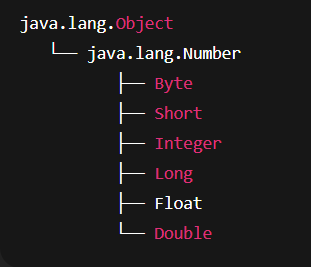

- Number is an abstract class in `java.lang` package.
- It provides **methods to convert numeric values** to different primitive types.
- Subclasses of `Number` represent **numeric wrapper classes**.

- **The wrapper classes are not thread-safe.**

📝: Wrapper class in Java provides the mechanism to convert a primitive data type into an object and vice versa.

- Number → Abstract superclass for numeric wrapper classes.

- The classes `Character` and `Boolean` are not subclasses of `Number` because they represent non-numeric data types.

## 21. Boxing, Unboxing, Autoboxing

### Boxing

**Encapsulating value in an object.** Converting primitive data types into object is called boxing, and this is taken care by the compiler. Therefore, while using a wrapper class you just need to pass the value of the primitive data type to the constructor of the wrapper class.

```java
class Demo {
    public static void main(String[] args) {
        int a; 
        Integer b = new Integer(10); // boxes int into an Integer object (manual boxing)
        System.out.println(b);         // prints 10 (toString() of Integer)
        System.out.println(b.intValue()); // unboxes Integer to primitive int
 }
}
```
**Explanation**

- `int a;` → **Declares a primitive variable** `a` (but here it’s unused).
- `Integer b = new Integer(10);` → **Creates a wrapper object** for the primitive value 10.
  - This is **manual boxing** (before Java 5).

  - In modern Java (Java 9+), using new Integer(10) is **deprecated** — use autoboxing instead:

            `Integer b = 10;`  // autoboxing (preferred)

- `System.out.println(b);` → Prints `10`, since `Integer.toString()` returns the numeric value as a string.
- `b.intValue()` → Converts (unboxes) the wrapper object `b` back to a primitive `int`.

### Unboxing

**Converting a wrapper object back to a primitive value.** Unboxing is done automatically by the compiler. This is called **autoboxing**.

    int b = a.intValue(); // unboxing 

```java
class Demo {
    public static void main(String[] args) {
        Integer a = new Integer(10);  // manual boxing (deprecated in modern Java)
        int b = a.intValue();         // explicit unboxing
        System.out.println(b);        // prints 10

        // OR (preferred - auto-unboxing)
        Integer x = 20;   // autoboxing
        int y = x;        // auto-unboxing
        System.out.println(y);  // prints 20
    }
}
```

**Explanation:**

- `Integer a = new Integer(10);` → creates an **Integer object** with value `10`.
- `a.intValue()` → **explicitly converts** the wrapper object `a` into primitive `int`.
- `int y = x;` → **auto-unboxing** — Java automatically converts the wrapper `Integer` to primitive `int`.

⚙️**Key Notes**

- Unboxing is the **reverse** of boxing/autoboxing.
- It happens automatically when:
  - Assigning a wrapper object to a primitive variable.
  - Using a wrapper in arithmetic operations.

            Integer num = 50;
            int result = num + 10;  // auto-unboxed → 60

- **All wrapper classes** (`Integer`, `Double`, `Float`, etc.) support unboxing.

### Autoboxing

Autoboxing is the automatic conversion that the Java compiler makes between the primitive types and their corresponding object wrapper classes. It is done when you assign a primitive value to a variable of a wrapper class or when you use a primitive value in an arithmetic operation.
For example, converting an `int` to an `Integer`, a `double` to a `Double`, and so on.

```java
    int a = 10;
    Integer a = 10;  // autoboxing

    int b = a;  // auto-unboxing
    // casting object into primitive type automatically done by compiler
```

```java
    int a = 5; 
    // Integer b = a;  
    Integer b = Integer.valueOf(a); 
```
`valueOf()` method is used to convert a primitive type to a wrapper object. It is a static method of the `Integer` class.

```java
    // String to primitive type
    String s = "20";
    int i = Integer.parseInt(s);
```
`parseInt()` method is used to convert a string to a primitive integer value.

```java
    String s = "20.5";
    double d = Double.parseDouble(s);
```
`parseDouble()` method is used to convert a string to a primitive double value.

```java
    String s = "hello";
    int i = Integer.parseInt(s); // ❌ runtime error - // throws NumberFormatException
```
💡 Reason: `"hello"` cannot be parsed into a number.
The `Integer.parseInt()` method expects a numeric string like `"10"` or `"123"`.

**String to Class Type:**
```java
   class Demo {
    public static void main(String[] args) {
        String s = "123";   // numeric string

        // String → int (primitive)
        int num = Integer.parseInt(s);
        System.out.println(num);  // 123

        // String → Integer (class type)
        Integer obj = Integer.valueOf(s);
        System.out.println(obj);  // 123
    }
}   
```
- `Integer.parseInt(String s)` → returns primitive int
- `Integer.valueOf(String s)` → returns Integer object

✅ Works only if `s` contains numeric characters (e.g., `"10"`, `"200"`).

❌ Throws `NumberFormatException` if `s` contains non-numeric characters.

**Primitive to String:**
```java
   int a = 5;                            // primitive int
    String s1 = Integer.toString(a);       // int → String
    System.out.println(s1);                // prints "5"

    Integer b = 9;                         // Wrapper class object
    String s2 = Integer.toString(b);       // Integer → String
    System.out.println(s2);                // prints "9"
```
- `Integer.toString()` is an **overloaded method** that can take either an `int` or an `Integer` object.
- This conversion is useful when you need to display numeric values as text or concatenate them with strings.

| Conversion Type        | Method Used                 | Example                |
| ---------------------- | --------------------------- | ---------------------- |
| int → String           | `Integer.toString(int)`     | `Integer.toString(5)`  |
| Integer → String       | `Integer.toString(Integer)` | `Integer.toString(a)`  |
| any primitive → String | `String.valueOf(primitive)` | `String.valueOf(10.5)` |
| quick conversion       | `+ ""`                      | `num + ""`             |

- Wrapper classes bridge the gap between **primitive types** and **objects**.
- **Autoboxing** → primitive → wrapper
- **Unboxing** → wrapper → primitive
- **All wrapper classes are immutable** and belong to the `java.lang` package.
- Numeric wrappers inherit from Number, providing conversion methods like `intValue()`, `doubleValue()`, etc.
- Wrapper classes are **not thread-safe**.

> 📝: Autoboxing and unboxing feature converts primitive into object and object into primitive automatically. The automatic conversion of **primitive into object** is known as `autoboxing` and vice-versa `unboxing`.

**Primitive to Wrapper**: `AUTOBOXING`
```java
    class Wrap1 {
        public static void main(String[] args) {
            int a = 10;
            Integer i = Integer.valueOf(a); // converting int to Integer
            Integer j = a; // autoboxing, now compiler will write Integer.valueOf(a) internally
            System.out.println(a+ " " + i + " " + j);
        }
    }
```
Output:

```
10 10 10
```
Explanation:

- `Integer.valueOf(a)` → explicit boxing (manual conversion)
- `Integer j = a;` → implicit boxing (autoboxing)
- `System.out.println()` automatically calls `toString()` on `Integer` objects, so all print as numbers.

**Wrapper to Primitive**: `UNBOXING`
```java
    class Wrap2 {
        public static void main(String[] args) {
            Integer a = new Integer(3);
            int i = a.intValue(); // converting Integer to int
            int j = a; // unboxing, now compiler will write a.intValue() internally
            System.out.println(a+ " " + i + " " + j);
        }
    }
```
Output:
```
3 3 3
```
Explanation:
1. `Integer a = new Integer(3);`
- Creates an **Integer object** `a` wrapping the primitive value `3`.
- This is manual boxing (explicit object creation).

2. `int i = a.intValue();`
- **Explicit unboxing**: Converts the `Integer` object a to primitive int using intValue() method.

3. `int j = a;`
- **Auto-unboxing**: Compiler automatically converts `Integer` to `int` behind the scenes (`a.intValue()` is called internally).

4. `System.out.println(a + " " + i + " " + j);`
- Prints all three values:

  - `a` → the `Integer` object, automatically converted to string via `toString()`.
  - `i` → primitive int.
  - `j` → primitive int from auto-unboxing.

> 📝: Autoboxing/unboxing lets you mix primitives and wrapper objects seamlessly in expressions.

## 22. String Class

The `String` class in Java is used to create and manipulate sequences of characters. It is one of the most commonly used classes in Java. Objects of the String class are **immutable**, which means they **cannot be changed once created.**

### Key Features of the String Class

**1. Immutable**

Immutable means that once a String object is created, its value cannot be changed.

Example:
```java
public class Main {
    public static void main(String[] args) {
        String text = "hello";
        text.charAt(0) = 'H';  // compile-time error
    }
}
```
**Explanation**: The line `text.charAt(0) = 'H';` causes a compile-time error because `charAt(0)` returns a read-only char, not a variable. String is immutable in Java, you cannot modify its characters directly.

**2. Thread-Safe**

String in Java is thread-safe because it is immutable, allowing safe access by multiple threads without synchronization.

**3. Supports Various Utility Methods**

String is a predefined final class in Java present in java.lang package. It provides various methods to create, manipulate, and compare strings, like `length()`, `charAt()`, `concat()`, `equals()`, etc.

Example:
```java
import java.io.*;
​
class Demo {
    public static void main (String[] args) {
    String str = "hello geeks";
    System.out.println("Length of String-> "+str.length()); 
    System.out.println("Changed String -> "+str.toUpperCase());
    }
}
```
Output:
```
Length of String-> 11
Changed String ->HELLO GEEKS
```

**4. Implements Interfaces**
The String class in Java implements three important interfaces.

 1. **CharSequence**: Allows access to characters in the string using `charAt()`, `length()`, etc.

 2. **Comparable<String>**: Enables comparing two strings lexicographically using `compareTo()`

 3. **Serializable**: Allows string objects to be converted into a byte stream

### String Constructors in Java

In Java, String constructors are used to create new String objects from different sources like character arrays, byte arrays, or another string. Although strings in Java are usually created using string literals, the String class also provides constructors for more control.

Let us check these constructors using a example demonstrating the use of them.

**Example of String Constructor:**
Below is the implementation of string constructors in Java.
```java
import java.io.*;
​
class Geeks {
    public static void main(String[] args) {
        
        // Constructor 1: Creating string using new keyword
        String str1 = new String("Hello Java");
        System.out.println("String using new keyword: " + str1);
​
        // Constructor 2: Creating string from character array
        char[] charArray = { 'J', 'A', 'V', 'A' };
        String str2 = new String(charArray);
        System.out.println("String from char array: " + str2);
​
        // Constructor 3: Creating string from byte array
        byte[] byteArray = { 72, 101, 108, 108, 111 };
        String str3 = new String(byteArray);
        System.out.println("String from byte array: " + str3);
    }
}
```
Output:
```
String using literal: GeeksforGeeks
String using new keyword: Hello Java
String from char array: JAVA
String from byte array: Hello
```

## 23. Character Class

Java provides a wrapper class `Character` in `java.lang` package. An object of type `Character` contains a single field, whose type is `char`. The Character class offers a number of useful class (i.e., static) methods for manipulating characters. You can create a `Character` object with the `Character` constructor.

**Creating a Character object:**

    Character ch = new Character('a');

The above statement creates a Character object which contains '`a`' of type char. There is only one constructor in the Character class that expects an argument of char data type.

If we pass a primitive char into a method that expects an object, the compiler automatically converts the char to a Character class object. This feature is called **Autoboxing** and **Unboxing**.

> 📝: The **Character class is immutable** like String class i.e once it's object is created, it **cannot be changed**.

### Methods in Character Class  

The methods of Character class are as follows:

**1. boolean isLetter(char ch)**: This method is used to determine whether the specified char value(ch) is a letter or not. The method will return true if it is letter([A-Z],[a-z]), otherwise return false. In place of character, we can also pass ASCII value as an argument as char to int is implicitly typecasted in java.

**Syntax:**

    boolean isLetter(char ch)

**Parameters:**

**ch** - a primitive character

**Returns**: It returns true if ch is an alphabet, otherwise, return false

**Example**:
```java
// Java program to demonstrate isLetter() method
​
public class Test {
    public static void main(String[] args)
    {
        System.out.println(Character.isLetter('A'));
​
        System.out.println(Character.isLetter('0'));
    }
}
```
Output:
```
true
false
```

**2. boolean isDigit(char ch)**: This method is used to determine whether the specified char value(ch) is a digit or not. Here also we can pass ASCII value as an argument.

**Syntax:**

    boolean isDigit(char ch)

**Parameters:**
**ch** - a primitive character

**Returns**: It returns true if ch is a digit, otherwise, return false

**Example:**
```java
// Java program to demonstrate isDigit() method
​
public class Test {
    public static void main(String[] args)
    {
        // print false as A is character
        System.out.println(Character.isDigit('A'));
​
        System.out.println(Character.isDigit('0'));
    }
}
```
Output:
```
false
true
```

**3. boolean isWhitespace(char ch)**: It determines whether the specified char value(ch) is white space. Whitespace includes space, tab, or newline.

**Syntax:**

    boolean isWhitespace(char ch)

**Parameters:**

ch - a primitive character
Returns: It returns true if ch is whitespace, otherwise, returns false.

Example:
```java
// Java program to demonstrate isWhitespace() method
​
public class Test {
    public static void main(String[] args)
    {
        System.out.println(Character.isWhitespace('A'));
        System.out.println(Character.isWhitespace(' '));
        System.out.println(Character.isWhitespace('\n'));
        System.out.println(Character.isWhitespace('\t'));
​
        // ASCII value of tab
        System.out.println(Character.isWhitespace(9));
​
        System.out.println(Character.isWhitespace('9'));
    }
}
```
Output:
```
false
true
true
true
true
false
```

**4. boolean isUpperCase(char ch)**: It determines whether the specified char value(ch) is uppercase or not.

**Syntax:**

    boolean isUpperCase(char ch)

**Parameters:**
**ch** - a primitive character

**Returns**: It returns true if ch is upper case, otherwise, returns false.

Example:
```java
// Java program to demonstrate isUpperCase() method
​
public class Test {
    public static void main(String[] args)
    {
        System.out.println(Character.isUpperCase('A'));
        System.out.println(Character.isUpperCase('a'));
        System.out.println(Character.isUpperCase(65));
    }
}
```
Output:
```
true
false
true
```

**5. boolean isLowerCase(char ch)**: It determines whether the specified char value(ch) is lowercase or not.

**Syntax:**

    boolean isLowerCase(char ch)

**Parameters**:

**ch** - a primitive character

**Returns**: It returns true if ch is lower case, otherwise, returns false.

**Example:**
```java
// Java program to demonstrate isLowerCase() method
​
public class Test {
    public static void main(String[] args)
    {
        System.out.println(Character.isLowerCase('A'));
        System.out.println(Character.isLowerCase('a'));
        System.out.println(Character.isLowerCase(97));
    }
}
```
Output:
```
false
true
true
```

**6. char toUpperCase(char ch)**: It returns the uppercase of the specified char value(ch). If an ASCII value is passed, then the ASCII value of its uppercase will be returned.

**Syntax:**

    char toUpperCase(char ch)

**Parameters:**

**ch** - a primitive character

**Returns:** It returns the uppercase form of the specified char value.

**Example:**
```java
// Java program to demonstrate toUpperCase() method
​
public class Test {
    public static void main(String[] args)
    {
        System.out.println(Character.toUpperCase('a'));
        System.out.println(Character.toUpperCase(97));
        System.out.println(Character.toUpperCase(48));
    }
}
```
Output:
```
A
65
48
```

**7. char toLowerCase(char ch)**: It returns the lowercase of the specified char value(ch).

**Syntax**:

    char toLowerCase(char ch)

**Parameters:**

**ch** - a primitive character

**Returns:** It returns the lowercase form of the specified char value.

Example:
```java
// Java program to demonstrate toLowerCase() method
​
public class Test {
    public static void main(String[] args)
    {
        System.out.println(Character.toLowerCase('A'));
        System.out.println(Character.toLowerCase(65));
        System.out.println(Character.toLowerCase(48));
    }
}
```
Output:
```
a
97
48
```

**8. toString(char ch):** It returns a String class object representing the specified character value(ch) i.e a one-character string. Here we cannot pass ASCII value.

**Syntax:**

    String toString(char ch)

**Parameters:**

**ch** - a primitive character

**Returns:** It returns a String object.

**Example:**
```java
// Java program to demonstrate toString() method

```java
public class Test {
    public static void main(String[] args)
    {
        System.out.println(Character.toString('x'));
        System.out.println(Character.toString('Y'));
    }
}
```
Output:
```
x
Y
```
---
1. **valueOf()**

    Returns an `Integer` object holding the value of the specificed primitive.

2. **toString()**

    Returns a `String` object representation of the specified int or Integer.

3. **parseInt()**
    The `parseInt()` method in the `Integer` class is used to convert a string into a primitive `int`.

    It is a **static method** — meaning it belongs to the `Integer` class and can be called without creating an object.

    - Commonly used for converting **numeric input strings** (like from user input, files, or APIs) into integers.

    - Always ensure the string contains only digits (and an optional minus sign for negatives).

4. **doubleValue()**

    This method returns the value of this `Integer` as a double.

5. **floatValue()**
    This method returns the value of this `Integer` as a double.

6. **intValue()**
    This method returns the value of this `Integer` as an `int`.

7. **longValue()**
    This method returns the value of this `Integer` as a long.

❓ **Why Java is not a pure object oriented language?**

▶ Java is not a pure object-oriented language **because it supports primitive data types** such as `int`, `byte`, `short`, `long`, `float`, `double`, `char`, and `boolean`. These are **not objects**, but rather **basic data types** that exist for performance and memory efficiency.

In a **pure OOP language** (like Smalltalk), **everything is an object** — including numbers, booleans, and even control structures.
However, in Java, primitives are treated differently and do not require object wrappers to perform basic operations.
```java
int a = 10;           // primitive, not an object
Integer b = 20;       // wrapper class object
System.out.println(a + b);  // works due to autoboxing/unboxing
```
Java is **object-based** and **object-oriented**, but not **purely object-oriented** because it includes **non-object primitives** for efficiency.

❓ **Is String is a wrapper class in Java?**
▶ No. String is not a wrapper class, simply because there is no parallel primitive type that it wraps.

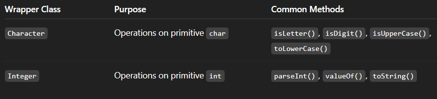

All wrapper classes in Java (`Byte`, `Short`, `Integer`, `Long`, `Float`, `Double`, `Character`, `Boolean`) are **immutable** and belong to the package java.lang.
They help in converting between **primitive types and objects**, enabling use in **collections**, **generics**, etc.

## 24. Date class

The `Date` class encapsulates the current date and time.

> Standard Time of Java : 1970, 1 Jan, 00:00:00 GMT (midnight)

> Java calculates any amount of time in milliseconds.
> `import java.util.*;` package contains Date class.

➡ Date ➡ Calendar ➡ Simple Date-Time Format

```java
import java.util.*;
class abc {
    public static void main(String[] args) {
        Date d = new Date(); // Create a new Date object representing the current date and time
        System.out.println(d);  // Print the Date object
        // Default toString() gives a readable format like: // Sat Oct 18 17:30:41 IST 2025
        }
    }
```
Output:
```
Wed Oct 22 13:45:12 IST 2025
```
- `java.util.Date` represents **date** and **time**.
- `new Date()` creates a Date object with the **current system date and time**.
- Printing a `Date` object directly calls its `toString()` **method**, which shows the date in a human-readable format.

> The class `Date` represents a specific instant in time, with millisecond precision.

The class **Date** represents a specific instant in time, with millisecond precision. The Date class of `java.util` package implements **Serializable**, **Cloneable** and **Comparable** interface. It provides constructors and methods to deal with date and time with java. Constructors

- **Date()** : Creates date object representing current date and time.
- **Date(long milliseconds)** : Creates a date object for the given milliseconds since January 1, 1970, 00:00:00 GMT.
- **Date(int year, int month, int date)**
- **Date(int year, int month, int date, int hrs, int min)**
- **Date(int year, int month, int date, int hrs, int min, int sec)**
- **Date(String s)**

> 📝 : The last 4 constructors of the Date class are Deprecated.

```java
// Java program to demonstrate constuctors of Date
import java.util.*;
​
public class Main
{
    public static void main(String[] args)
    {
        Date d1 = new Date(); // uses the default constructor to get the current system date and time.
        System.out.println("Current date is " + d1);
        Date d2 = new Date(2323223232L); // creates a date object representing 2323223232 milliseconds after January 1, 1970.
        System.out.println("Date represented is "+ d2 );
    }
}
```
Output:
```
Current date is Wed Oct 22 13:45:12 IST 2025
Date represented is Thu Jan 27 12:53:43 IST 1970
```
⚠️ Note: The `Date(long millis)` constructor interprets the long value as **milliseconds since epoch (Jan 1, 1970)**.

### Important Methods

- **boolean after(Date date)** : Tests if current date is after the given date.
- **boolean before(Date date)** : Tests if current date is before the given date.
- **int compareTo(Date date)** : Compares current date with given date. Returns 0 if the argument Date is equal to the Date; a value less than 0 if the Date is before the Date argument; and a value greater than 0 if the Date is after the Date argument.
- **long getTime()** : Returns the number of milliseconds since January 1, 1970, 00:00:00 GMT represented by this Date object.
- **void setTime(long time)** : Changes the current date and time to given time.

```java
// Program to demonstrate methods of the java.util.Date class
import java.util.*;

public class Main {
    public static void main(String[] args) {

        // Creating Date objects
        // ⚠️ The following constructor is deprecated (year starts from 1900, month from 0)
        Date d1 = new Date(2000, 11, 21); // Deprecated way
        Date d2 = new Date();              // Current system date and time
        Date d3 = new Date(2010, 1, 3);    // Deprecated way

        // Check if d3 comes after d1
        boolean a = d3.after(d1);
        System.out.println("Date d3 comes after date d1: " + a);

        // Check if d3 comes before d2
        boolean b = d3.before(d2);
        System.out.println("Date d3 comes before date d2: " + b);

        // Compare two dates (returns 0 if equal, <0 if before, >0 if after)
        int c = d1.compareTo(d2);
        System.out.println("Comparison result of d1 and d2: " + c);

        // Get milliseconds since January 1, 1970 (Epoch time)
        System.out.println("Milliseconds from Jan 1, 1970 to d1: " + d1.getTime());

        // Set a new time in milliseconds
        System.out.println("Before setting: " + d2);
        d2.setTime(204587433443L);
        System.out.println("After setting: " + d2);
    }
}
```
The Date(int year, int month, int date) constructor adds 1900 to the year and treats month as 0-indexed.

That’s why new Date(2000, 11, 21) → Dec 21, 3900.

Always prefer `java.time.LocalDate`, `Instant`, or `Calendar` for modern, accurate date handling.
Output:
```
Date d3 comes after date d1: true
Date d3 comes before date d2: false
Comparison result of d1 and d2: 1
Milliseconds from Jan 1, 1970 to d1: 60935500800000
Before setting: Sat Oct 18 17:30:41 UTC 2025
After setting: Fri Jun 25 21:50:33 UTC 1976
```

- `Date.after(Date when)` → returns `true` if this date is after the given date.
- `Date.before(Date when)` → returns `true` if this date is before the given date.
- `Date.compareTo(Date anotherDate)` → compares two dates chronologically.
- `Date.getTime()` → returns time in milliseconds since epoch (`01-01-1970 00:00:00 UTC`).
- `Date.setTime(long time)` → sets the date object using milliseconds since epoch.

> 💡 **Modern alternative:** Use `java.time.LocalDate`, `LocalDateTime`, or `Instant` (Java 8+) instead of the deprecated constructors of Date.

### Calendar Class

- Package: `java.util.Calendar`
- It’s an **abstract class** used to work with dates and times more flexibly than `Date`.
- You **cannot instantiate it directly**; you use `Calendar.getInstance()` to get a concrete subclass object (usually `GregorianCalendar`).

```java
    import java.util.*;
    class abc{
        // Get an instance of Calendar (returns GregorianCalendar by default)
        Calendar c = Calendar.getInstance();

        // Retrieve the current date of the month (1 to 31)
        int j = c.get(Calendar.DATE); // Get the current date // int constant passed in the get() method
        // j has the range of 1 to 31
    }
```
- `Calendar.getInstance()` returns a **Calendar object initialized to the current date and time.**
- `Calendar.DATE` is a **constant** representing the day of the month.
- Months in `Calendar` are **zero-based**: January = 0, February = 1, ..., December = 11.
- `get()` can also retrieve **YEAR, MONTH, HOUR, MINUTE, SECOND**, etc.

> 📝: `final` keyword is used to declare a variable constant.

- The `get()` fetches current time-date from the OS.
```java
    int month = c.get(Calendar.MONTH); // 0 = January, 11 = December
    int year  = c.get(Calendar.YEAR);  // Current year

    int j = c.get(Calendar.DATE); // Get the current date
    int k = c.get(Calendar.HOUR); // Get the current hour

    int l = c.get(Calendar.AM_PM); // 0 = AM, 1 = PM

    int n = c.get(Calendar.MONTH); // displays 9 
    // because months are zero-indexed, so October → 9
```

> **`TimeZone`** is passed in the `getInstance()`, if we don't pass time, it'll return default time.
```java
import java.util.*;
class abc{
    public static void main(String... args) {
        String arr[] = TimeZone.getAvailableIDs();
        for(String id : arr){
            TimeZone tz = TimeZone.getTimeZone(id);
            Calendar c = Calendar.getInstance(tz);
            System.out.println(c.get(Calendar.HOUR) + ":" + c.get(Calendar.MINUTE) + ":" + c.get(Calendar.SECOND) + " " + id);
        }
    }
}
```
Output:
```
 7:35:10 Asia/Kolkata
9:05:10 Asia/Tokyo
23:35:10 America/New_York
4:35:10 Europe/London
...
```

**Explanation:**

1. `TimeZone.getAvailableIDs()`
→ Returns an array of all valid time zone IDs (like `"Asia/Kolkata"`, `"America/New_York"`, `"Europe/London"`, etc.).

2. `TimeZone tz = TimeZone.getTimeZone(id);`
→ Gets a `TimeZone` object corresponding to each ID.

3. `Calendar c = Calendar.getInstance(tz);`
→ Creates a `Calendar` instance for that specific time zone.

4. `c.get(Calendar.HOUR)` etc.
→ Extracts the hour, minute, and second according to that time zone.

5. `System.out.println(...)`
→ Prints the time along with the time zone ID.

The exact output depends on:
- Your system’s clock
- The time when you run the program
- The number of available time zones in your Java runtime

▶ **Code to print/calculate the execution time of the program:**
```java
long l = System.getCurrentMillSeconds(); // return the current time in milliseconds

long e = System.getCurrentMillSeconds(); // return the current time in milliseconds

// double totalTime = l - e; 
// System.out.println("Execution time: " + totalTime + " milliseconds");
System.out.println("Execution time: " + (e - l) + " milliseconds");
```

### Factory Method
>
> 📝: A method which is static, and returns the object of the same class.
- It is often used to **control object creation**, apply **caching**, or **encapsulate complex instantiation logic**.
```java  
class Car {
    private String model;

    // Private constructor to control object creation
    private Car(String model) {
        this.model = model;
    }

    // Factory method: static method that returns Car objects
    public static Car createCar(String model) {
        return new Car(model);
    }

    public void display() {
        System.out.println("Car model: " + model);
    }
}

public class Main {
    public static void main(String[] args) {
        // Using factory method to create objects
        Car c1 = Car.createCar("BMW");
        Car c2 = Car.createCar("Audi");

        c1.display();
        c2.display();
    }
}
```
Output:
```
Car model: BMW
Car model: Audi
```

**Key Points:**

- The **constructor can be private** to prevent direct object creation.
- The **static factory method** controls how objects are created.
- Can **return cached objects**, **subclass objects**, or objects with **specific configurations**.
- Helps **encapsulate object creation logic** and can make code cleaner.

## 25. String Handling

```java
    String s = "welcome";

    byte arr[] = s.getBytes();
    // returns byte code of the given String. in other words, it returns sequence of bytes.

    for(int b: arr) // here Implicit Casting is done automatically
    System.out.println((char)b); // Explicit Casting
```

```java
String s = "Welcome";
String s1 = "Welcome";

System.out.println(s.equals(s1)); // compares String s and s1
System.out.println(s == s1); // compares the object of s and s1
```
Output:
```
true
true
```
**Explanation:**

🔹 **`equals()` method**

- In the `String` class, `.equals()` is **overridden** to compare **the actual content** (the sequence of characters).

- So `s.equals(s1)` → compares `"Welcome"` with `"Welcome"`, and returns **true**.

🔹 **`==` operator**

- The `==` operator compares **object references** — i.e., whether both variables refer to the **same object in memory**.

- In Java, **string literals** like `"Welcome"` are **interned** — meaning they are stored in a special pool called the **String Constant Pool (SCP)**.

- If you create two strings with the same literal value, both references point to the **same object** in the SCP.

Hence,
`System.out.println(s == s1);` → returns true, because both `s` and `s1` refer to the same `"Welcome"` object in the pool.

🧪 **Additional note:**

If you had created the strings using `new`, the result would differ:
```java
String s = new String("Welcome");
String s1 = new String("Welcome");

System.out.println(s.equals(s1)); // true (content is same)
System.out.println(s == s1);      // false (different memory objects)
```

Here, `==` returns `false` because both strings are **different objects** even though their contents match. Because new String() explicitly creates **two different objects** in heap memory — even though they hold the same text.

> 📝: **Conclusion:** Use `.equals()` to compare the content of two `String` objects, and use `==` to compare **object references**.

→ **equalsIgnoreCase()**

```java
String s = "Welcome";
String s1 = "welcome";

// Compares the content of the strings with case sensitivity.
System.out.println(s.equals(s1)); // "Welcome" vs "welcome" → the first character 'W' vs 'w' differ.

// Compares the content of the strings ignoring case.
System.out.println(s.equalsIgnoreCase(s1)); // "Welcome" vs "welcome" → all characters match if you ignore case.
```
Output:
```
false
true
```

→ **contains()**

```java
String s = "Welcome";
boolean b = s.conatin("el"); // true
boolean b = s.conatin("El"); // false
```

→ **indexOf()**
if the character isn't present then it returns -1 or else it'll return the index of the character.

- indexOf(ch)

        int j = s.indexOf('e'); // returns 1
        int j = s.indexOf('E'); // returns -1

- indexOf(ch, int fromIndex)

        int j = s.indexOf('l', 2); // returns 3
leave starting 2 indices and then search for that character.

→ **lastIndexOf()**

    int j = s.lastIndexOf('e');    

- Returns the **index of the last occurrence** of the specified character in the string.
- Indexing in Java strings starts from 0.

| Character | Index |
| --------- | ----- |
| W         | 0     |
| e         | 1     |
| l         | 2     |
| c         | 3     |
| o         | 4     |
| m         | 5     |
| e         | 6     |

- The character `'e'` occurs at index `1` and `6`.
- `lastIndexOf('e')` returns the **last occurrence**, which is **6**.

Output:
```
6
```
→ **split()**
splits the string and returns an array of substrings based on the specified delimiter.

```java
String s = "Welcome to Java";
String[] arr = s.split(" "); // splits the string into substrings based on spaces.
```
Output:
```
["Welcome", "to", "Java"]
```

→ **toUpperCase()** and **toLowerCase()**

```java
String s = "Welcome";
String s1 = s.toUpperCase(); 
String s2 = s.toLowerCase(); 
```
Output:
```
WELCOME
welcome
```

→ **toCharArray()**

    char arr [] = s.toCharArray();

- The method toCharArray() converts the string into a character array.

- Each character in the string becomes an element in the array, in the same order.  

```java
String s = "Welcome";
char arr[] = s.toCharArray();

System.out.println(Arrays.toString(arr));
```
Output:
```
['W', 'e', 'l', 'c', 'o', 'm', 'e']
```
- `arr[0]` → `'W'`

- `arr[1]` → `'e'`

- `arr[6]` → `'e'`

This is useful when you want to **manipulate individual characters** of a string.

→ **trim()**
removes whitespaces from right or left side of the string.

    String s = s.trim();

→ **startsWith()** and **endsWith()**

```java
String s = "Hello World";
boolean b = s.startsWith("Hello"); // true
boolean b = s.endsWith("d"); // true
```
→ **isEmpty()**

    boolean b = s.isEmpty();

→ **replace()**

    **replace('original character' , 'new character');**

```java
String s = "Welcome";
String s1 = s.replace('e', 'E'); // 'e' will be replaced with 'E'
```
Output:
```
WelcomE
```

→ **concat()**

```java
String s = "Welcome";
String s1 = " to Java";
String s2 = s.concat(s1);
```
Output:
```
Welcome to Java
```

→ **compareTo()**

compareTo() is a **case-sensitive** method.

    **int c = s.compareTo(String anotherString);** // returns 0 if equal, <0 if before, >0 if after

It compares strings on the basis of Unicode value of each character in the Strings.

    int s = s1.compareTo(s2);

- if `s1 > s2` → returns 1
- if `s1 < s2` → returns -1
- if `s1 == s2` → returns 0

⚙️ **Special Case :  When One String is Empty**

If one of the strings is empty:

- `"abc".compareTo("")` → returns **positive** (equal to the length of `"abc"`)

- `"".compareTo("abc")` → returns **negative** (equal to `-3`)

If you compare string with blank or empty string, it returns length of the string. If second string is empty, result would be poisitive. If the first string is empty, result would be negative.

```java
class abc{
    public static void main(String[] args) {
        String s1 = "Hibino";
        String s2 = "";
        String s3 = "Kafka";
        System.out.println(s1.compareTo(s2));
        System.out.println(s2.compareTo(s3));
    }
}
```
Output:
```
6
-5
```

**Explanation:**

1. s1.compareTo(s2) → "Hibino".compareTo("")
    - Since s2 is empty, the result = length of s1 = 6 → +6

2. s2.compareTo(s3) → "".compareTo("Kafka")
    - Since s2 is empty, the result = -length of s3 = -5

→ **split()**
The mthod `split()` is used for splitting a String into its substrings based on the given delimiter/regular expression(regex).

```java
class SplitExample{
    public static void main(String[] args) {
        String s1 = "Java string split method";
        String[] words = s1.split("\\s"); // splits the string into substrings based on whitespaces.
        for(String w : words) {
            System.out.println(w);
        }
    }
}
```
Output:
```
Java
string
split
method
```
---
> `indexOf()` method returns index of given character value or substring. If it is not found, it returns -1. The index counter starts from 0.

> `lastIndexOf()` method returns index of last occurrence of given character value or substring. If it is not found, it returns -1. The index counter starts from 0.

## 26. Typecasting

Assigning a value of one data type to a variable of another data type is called **Typecasting**.
In Java, type casting is classified into two types:
1. Widening Casting (Implicit)
    - Also known as **automatic type conversion**.
    - Occurs when a smaller data type is converted to a larger data type.
    - No explicit casting is required.

Conversion order:

    byte → short → int → long → float → double

2. Narrowing Casting (Explicitly done)

    - Must be done manually by the programmer.
    - May lead to **data loss** or **precision loss**.

Conversion order:

    double → float → long → int → short → byte

## 27. Java Scanner Class

The `Scanner` class is used to get user input, and it is found in the `java.util` package.

The Java `Scanner` class breaks the input into tokens using a delimiter that is whitespace by default. It provides many mthods to read and parse various primitve values.

    Scanner sc = new Scanner(System.in);

- String `next()` → returns the next token in the input as a string.
- String `nextLine()` → it moves the scanner position to the next line and returns the value as a string.
- byte `nextByte()` → it scans the next token in the input as a byte.
- short `nextShort()` → it scans the next token in the input as a short.

Similarly, we have following functions:
- int `nextInt()`
- long `nextLong()`
- float `nextFloat()`
- double `nextDouble()`

➡ **to get input from console**
```java
import java.util.Scanner;
class ScannerTest1{
    public static void main(String[] args) {
        Scanner sc = new Scanner(System.in); // create a Scanner object
        System.out.println("Enter your age : ");
        int age = sc.nextInt();
        System.out.println("Enter your name : ");
        String name = sc.nextLine();
        System.out.println("Enter your fee : ");
        double fee = sc.nextDouble();
        System.out.println("Age : " + age + "\nName : " + name + "\nFee : " + fee);
        sc.close(); // close the scanner
    }
}
```
Output:
```
Enter your age : 
25
Enter your name : 
Mikasa
Enter your fee : 
5000.0
Age : 25
Name : Mikasa
Fee : 5000.0
```

➡ **Scanner class with delimiter:**
The `\s` represents whitespace.

```java
import java.util.*;
class ScannerTest2{
    public static void main(String... args) {
        String input = "10 tea 20 coffee 30 tea biscuits";
        Scanner sc = new Scanner(input).useDelimiter("\\s");
        System.out.println(s.nextInt());
        System.out.println(s.next());
        System.out.println(s.nextInt());
        System.out.println(s.next());
        s.close();
    }
}
```
Output:
```
10
tea
20
coffee
```

➡ **join() function**

In JDK 8, there's a new function `join()` introduced.
It is a **static function** which is called as `String.join()` (using the classname)

    String.join(String delimiter, String... elements)

```java
class JoinExample{
    public static void main(String[] args) {
        String ss = String.join(" ", "Java", "is", "great");
        System.out.println(ss); 
    }
}
```
Output:
```
Java is great
```

The `java.lang.String.join()` method concatenates the given elements with the given delimiter and returns the concatenated string.

## 28. Email Validation

```java
import java.util.*;
class EmailValidation {
    public static void main(String[] args) {

        Scanner sc = new Scanner(System.in); // create Scanner object for user input
        System.out.println("Enter your email : ");
        String email = sc.nextLine(); // take email input from user

        // basic checks: does it start or end with '.'
        boolean b = email.endsWith(".");
        boolean b1 = email.startsWith(".");

        // find the position of the last '.'
        int l = email.lastIndexOf(".");

        // count number of '@' symbols
        int atCount = 0;
        for (int i = 0; i < email.length(); i++) {
            if (email.charAt(i) == '@') {
                atCount++;
            }
        }

        // flag to mark invalid cases
        boolean inValid = false;

        // invalid if contains double dots, ".@" or "@."
        if (email.contains("..") || email.contains("@.") || email.contains(".@")) {
            inValid = true;
        }

        // split email into username and domain using '@'
        String divs[] = email.split("@");
        String uN = divs[0]; // username part
        String dN = divs[1]; // domain name part

        // validation conditions:
        // - must have exactly one '@'
        // - username should not end with '.'
        // - must not contain invalid patterns
        if ((atCount == 1) && (uN.endsWith(".") == false) && (inValid == false)) {
            System.out.println("\n'Valid email address'\n");
        } else {
            System.out.println("\n'Invalid email address'\n");
        }

        // display extracted username and domain
        System.out.println("Username : " + uN);
        System.out.println("Domain Name : " + dN);

        sc.close(); // close the scanner
    }
}
```

1. `Scanner` class - used for user input from console.

2. **String methods used:**

- `endsWith()`, `startsWith()` → to check beginning/end characters.
- `contains()` → to check for invalid patterns.
- `split("@")` → separates username and domain.
- `charAt()` → used in loop to count `@` symbols.

3. **Logic:**

- Valid emails have **exactly one '@'**.
- Cannot start or end with `.`.
- Cannot have sequences like `..`, `@.`, or `.@`.
- `lastIndexOf(".")` — gives position of last `.` (can be used for checking domain endings if needed).

4. **Potential improvements:**

- Add check to ensure domain contains a `.` (like `gmail.com`).
- Use regex for more advanced validation later.

## 29. Switch-Case Statement
Apart from the if-else blocks, there are also switch cases where you can define multiple cases based on a single switch.

```java
import java.util.Scanner;

public class Main {

    public static void main(String[] args) {
        Scanner scanner = new Scanner(System.in);

        System.out.print("What is the first operand? ");
        int a =scanner.nextInt();

        // consumes the dangling newline character
        scanner.nextLine();

        System.out.print("What is the second operand? ");
        int b = scanner.nextInt();

        // consumes the dangling newline character
        scanner.nextLine();

        System.out.print("What operation would you like to perform? ");
        String operation = scanner.nextLine();

        switch (operation) {
            case "sum":
                System.out.printf("%d + %d = %d", a, b, a+b);
                break;
            case "sub":
                System.out.printf("%d - %d = %d", a, b, a-b);
                break;
            case "mul":
                System.out.printf("%d * %d = %d", a, b, a*b);
                break;
            case "div":
                if (b == 0) {
                    System.out.print("Can't divide by zero!");
                } else {
                    System.out.printf("%d / %d = %d", a, b, a / b);
                }
                break;
            default:
                System.out.printf("Invalid Operation!");
        }
        scanner.close();
    }
}
```
This is a very simple calculator program. The program prompts the user for two numbers and then asks what operation they would like to perform.

Every switch-case statement will have one switch and multiple cases. When you say `case "sum"`, the program checks whether the value of the switch or the `operation` variable in this is `sum` or not.

If it matches, the case body will execute. If none of the cases match, the `default` case will be executed.

And about that `break` statement. It does what it sounds like: stops the program from going into the next case.

If you remove the `break` statements, all the cases will be executed one after the other until the `default` case has been reached.

## 30. StringBuffer Class
The StringBuffer class in Java represents a sequence of characters that can be modified, which means we can change the content of the StringBuffer without creating a new object every time. It represents a mutable sequence of characters.

- StringBuffer is a mutable String.
- StringBuffer is a different class from String class.
- `java.lang.StringBuffer` extends (or inherits from) `Object` class.

```java
    StringBuffer b = "hello"; // error
    StringBuffer b = new StringBuffer("hello");
```
- Whenever we initialize an object of StringBuffer, it reserves 
16 bytes of memory for the object.

```java
    StringBuffer b = new StringBuffer();
    System.out.println(b.capacity()); // 16
```
- `capacity()` returns the number of characters that the buffer can hold.

```java
    StringBuffer b = new StringBuffer(100);
    System.out.println(b.capacity()); // 100
```

> Note: The default capacity of StringBuffer is 16 characters.

> 📝: Java StringBuffer class is `thread-safe`, i.e., multiple threads cannot access it simultaneously. So, it is safe and will result in an order.

```java
StringBuffer b = new StringBuffer("hello");
System.out.println(b.capacity()); // calculates the total allocated capacity // will display 21 (i.e., 16 + 5 bytes of hello)
System.out.println(b.length()); // returns the number of characters in the buffer
```

**Explanation:**

1. `capacity()`
- When you create a StringBuffer with an initial string,
Java allocates **16 extra characters of space** in addition to the string’s length.
- Formula:

        capacity = 16 + initialString.length()

- So for `"hello"` → length = 5 → capacity = 16 + 5 = **21**.

2. `length()`
- Returns the **number of characters currently stored** in the buffer.
- `"hello"` has 5 characters → b.length() = **5**.
---
- Unicode escape sequences in Java always start with \u followed by **4 hexadecimal digits**.
- These sequences are **replaced before compilation**, meaning they can even appear in identifiers (though that’s not recommended).

```java
char a = '\u0024'; // Unicode for $
char rupee = '\u20B9'; // Unicode for ₹

b.append("World"); // Concatenates String // will display hello World

System.out.println(b.charAt(2)); // returns character at given index
```

> 📝: `Object` class is the **super class** of all the classes. `toString()` is the function of the **Object** class.

    String ss = b.toString();

`toString()` converts StringBuffer into String class type.

→ `setCharAt(int index)` used to return the character at the given index.

```java
b.setCharAt(2, 'H'); // will display heHlo (replaced l with H on the index 2)
```

→ `b.setLength()` used to set the length of the StringBuffer.

```java
b.setLength(5); // set length of the StringBuffer to 5
```

→ insert(int offset, String s) insert the specified string with this string at the specified position. The `insert()` method is overloaded like `insert(int, char)`, `insert(int, int)`, `insert(int boolean)`, `insert(int ,float)`, `insert(int, double)`, etc. 
```java
    b.insert(3, "hello"); 
    System.out.println(b); // will display hehhello World
```

→ `reverse()` used to reverse the StringBuffer.
→ `capacity()` is used to calculate the total allocated capacity.

```java
    b.reverse(); // will display dlroW olleh
    System.out.println(b.capacity()); // will display 21
```
→ `ensureCapacity(int minimumCapacity)` used to ensure that the capacity of the StringBuffer is at least the specified minimum capacity.

```java
    b.ensureCapacity(100); // will ensure that the capacity of the StringBuffer is at least 100
    System.out.println(b.capacity()); // will display 100
```

→ `delete(int startIndex, int endIndex)` is used to delete the string from specified startIndex to endIndex.
The substring begins at the specified start and extends to the character at the index before the end (endIndex-1) or the end of the sequence if no such character exists.
```java
    b = new StringBuffer("hehhello");
    b.delete(2, 5); // will delete the substring from index 2 to index 5
    System.out.println(b); // will display hehello
```

→ `deleteCharAt(int index)` is used to delete the character at the specified position(index) in the sequence. This sequence is shortened by one `char`.
```java
    b = new StringBuffer("hehhello");
    b.deleteCharAt(2); // will delete the character at index 2
    System.out.println(b); // will display hehello
```
→ `replace(int startIndex, int endIndex, String str)` is used to replace the string from startIndex to endIndex with the specified string.

→ `indexOf(String str)` returns the index within this string of the first occurrence of the specified substring, or -1 if there is no such occurrence.
```java
    System.out.println(b.indexOf("h")); // will display 0
    System.out.println(b.indexOf("l")); // will display 3
```

→ `lastIndexOf(String str)` returns the index within this string of the last occurrence of the specified substring, or -1 if there is no such occurrence.
→ `substring(int beginIndex)` returns a new `String` that is a substring of this string beginning at the specified beginIndex.
→ `substring(int beginIndex, int endIndex)` returns a new `String` that is a substring of this string beginning at the specified beginIndex and ending at the specified endIndex.

```java
    System.out.println(b.substring(2)); // will display hhello
    System.out.println(b.substring(2, 5)); // will display hhe
```

> Note: The `append()` method is used to add a string to the end of the StringBuffer.

```java
    b.append("World");
    System.out.println(b); // will display hehhello World
```

The `java.lang.StringBuffer` class is a **thread-safe**, **mutable** sequence of characters.
- A StringBuffer is like a String, but it is **mutable**(can be modified).
- They are safe for use by multiple threads. 
- Every StringBuffer has a **default capacity of 16 characters**.

### Features of StringBuffer Class:

The key features of StringBuffer class are listed below:

- Unlike String, we can modify the content of the StringBuffer without creating a new object.
- All methods of StringBuffer are synchronized, making it safe to use in multithreaded environments.
- Ideal for scenarios with frequent modifications like append, insert, delete, or replace operations.

### Advantages of using StringBuffer

The advanatages of StringBuffer class are listed below:

- **Mutable**: StringBuffer are mutable it means that we can change the content after the object has been created, on the other hand String are immutable once it created it can not be modified.
- **Efficient**: Since StringBuffer objects are mutable, it is suitable in scenarios where we need to modify the string multiple times. If we do the same thing with string, everytime a new object is created and the old one is deleted, which is very bad in terms of performance and memory.

> Note: Both String and StringBuffer objects are thread safe, but in different ways.  On the other hand immutable objects like String are thread-safe because their state can not be modified once they are created.

### Disadvantage of StringBuffer

- **Slower in single-threaded programs**: It's synchronized, meaning it ensures thread safety by allowing only one thread to access it at a time. However, in single-threaded environments, this synchronization is unnecessary and slows down performance compared to non-synchronized classes like StringBuilder.
- **Less efficient than StringBuilder**: For non-threaded use cases, StringBuilder is faster and has similar functionality. Also, StringBuffer operations like `append()` or `insert()` make the code longer compared to using simple '`+`' with String.

## 31. StringBuilder Class

StringBuilder class is used to create **mutable (modifiable) string**. It is same as StringBuffer class expect that it is **non-synchronized**. It is faster than StringBuffer class. Is is available since JDK 1.5.


### StringBuilder vs String vs StringBuffer


### When to Use Which one?

- If a string is going to remain constant throughout the program, then use the String class object because a String object is **immutable**.
- If a string can change (for example: lots of logic and operations in the construction of the string) and will only be accessed from a **single thread**, using a StringBuilder is good enough.
- If a string **can change** and will be accessed from **multiple threads**, use a StringBuffer because StringBuffer is synchronous, so you have **thread-safety**.
- If you don't want thread-safety than you can also go with StringBuilder class as it is not synchronized.

**Conclusion:**
- Objects of String are immutable, and objects of StringBuffer and StringBuilder are mutable.
- StringBuffer and StringBuilder are similar, but StringBuilder is faster and preferred over StringBuffer for single-threaded program. If thread-safety is needed, then StringBuffer is used.

### Reversing a String using StringBuilder class
```java
import java.util.Scanner;
class ReverseString{
    public static void main(String[] args) {
        System.out.println("Enter a string to reverse: ");
        Scanner read = new Scanner(System.in);
        String str = read.nextLine();
        StringBuilder sb = new StringBuilder();
        for(int i = str.length()-1; i >= 0; i--) {
            sb.append(str.charAt(i));
        }
        System.out.println(sb.toString());
    }
}
```
**Output:**
```
Enter a string to reverse: 
Hello
olleH
```
 ✨ **Alternate Method:** use `reverse()` of StringBuilder.
```java 
StringBuilder sb = new StringBuilder();
System.out.println(sb.reverse().toString());
```

## 32. Mutable String
- A mutable string is a string that can be **modified (changed)** after it is created.
- In Java, the `String` class creates **immutable** objects — meaning once a string object is created, it **cannot be changed**.
- If you modify it (like concatenating or replacing characters), a **new object** is created in memory, and the old one is discarded.
- To handle cases where you need to **modify strings frequently**, Java provides two mutable alternatives:
    - `StringBuffer`
    - `StringBuilder`

🔹 **Why Mutable Strings?**

Mutable strings are useful when:

- You need to **append**, **insert**, **delete**, or **replace** characters many times.
- You’re working with **loops** that build long strings (e.g., file I/O, text formatting, JSON building, etc.)

Creating many immutable `String` objects would waste memory and CPU cycles due to constant creation and garbage collection.

🔹 Difference Between `String`, `StringBuffer`, and `StringBuilder`
| Feature       | String                    | StringBuffer                    | StringBuilder                   |
| ------------- | ------------------------- | ------------------------------- | ------------------------------- |
| Mutability    | ❌ Immutable               | ✅ Mutable                       | ✅ Mutable                       |
| Thread Safety | ✅ Thread-safe (immutable) | ✅ Thread-safe (synchronized)    | ❌ Not thread-safe               |
| Performance   | Slower for concatenation  | Slower (due to synchronization) | Fastest (no synchronization)    |
| Use Case      | When data won’t change    | When thread safety is needed    | When thread safety isn’t needed |

```java 
// Immutable String
String s = "Hello";
s.concat(" World");
System.out.println(s); // Output: Hello (not modified)

// Mutable StringBuffer
StringBuffer sb = new StringBuffer("Hello");
sb.append(" World");
System.out.println(sb); // Output: Hello World
```

- Use `String` when text **does not change often**.
- Use `StringBuilder` when text changes **frequently and no thread-safety** is required.
- Use `StringBuffer` when **multiple threads** might access/modify the string concurrently.

## 33. Substring
A part of a string is called a **substring** — a smaller section or “slice” of the original string.
In Java, substring extraction is done using the `substring()` method of the `String` class.

A part of String is called **Substring**. In other words, Substring is a subset of another String. In case of substring `startIndex` in inclusive and `endIndex` is exclusive.

You can get substring from the given string object by one of two methods:
1. `substring(int startIndex)` returns new String object containing the substring of the given String from specified `startIndex`(inclusive).
2. `substring(int startIndex, int endIndex)` returns new String object containing the substring of the given String from specified `startIndex`(inclusive) to `endIndex`(exclusive).

```java
String s = "hello";
System.out.println(0,2); // Output: he
// 0 → 'h' (included), 2 → 'l' (excluded)
//  In above substring, 0 points to h but 2 points to e (because endIndex is exclusive). 
```
In the above example, the substring method returns a substring of the given String from index 0(inclusive) to index 2(exclusive).

```java
class TestSubstring{
    public static void main(String... args){
        String s = "SachinTendulkar";
        System.out.println(s.substring(6)); // Tendulkar
        System.out.println(s.substring(0,6)); // Sachin
    }
}
```

`substring()` is useful in:
- Parsing filenames or extensions
- Extracting usernames or domains from emails
- Tokenizing or pattern-based string operations

## 34. Constructor
Constructor is a special method which is used to initialize the object. It is called automatically when object is created.
- Constructor is always declared with class name.

        <class_name>() {}

- Similar to functions, but they have no return type.
- It is used for object initialization.
- If you don't create a constructor and create an object; it'll be created by default constructor.

```java
ABC(){ // default constructor
    a = 10; 
}
```
> 📝: Everytime an object is created using `new()` keyword, atleast one constructor is called. It is called a **default constructor**.

## 35. Types of Constructors
There are Four types of constructors in Java


#### **1. Default Constructor**
A default constructor has no parameters. It’s used to assign default values to an object. If no constructor is explicitly defined, Java provides a default constructor.

```java
class Test{
    int a;
    Test(){
        a = 10;
    }
}
```
Output:
```
Default constructor
```

> 📝: It is not necessary to write a constructor for a class because the Java compiler automatically creates a default constructor (a constructor with no arguments) if your class doesn’t have any.

> 📝: Default constructor is used to provide the default values to the object like 0, null etc depending on the type.

> Default constructor is also called **no-arg constructor**. 

#### **2. Parameterized Constructor**
A constructor that has parameters is known as parameterized constructor. If we want to initialize fields of the class with our own values, then use a parameterized constructor.
- used to provide different values to the distinct objects.
```java
class ABC{
    int a, b;
    ABC(int a, int b){
        this.a = a;
        this.b = b;
    }
    output(){
        System.out.println(a + " " + b);
    }
}
```

A **parameterized constructor** allows you to initialize object fields with **specific values at the time of object creation**, rather than using default ones.

```java
class abc{
    String on;
    abc(String on){
        this.on = on;
    }
    String rev(){
        String m = "";
        for(int i = on.length()-1; i >= 0; i--){
            m += on.charAt(i); // obtaining characters of the original String individually from end by using charAt() and concatenating them to a new String by using the "+" operator
        }
        return m;
    }
    public static void main(String... args){
        abc a = new abc("Radha");
        System.out.println(a.rev());
    }
}
```

1. **Difference between default and parameterized constructor**

   | Type          | Definition                                                        | Example                       |
   | ------------- | ----------------------------------------------------------------- | ----------------------------- |
   | Default       | Provided automatically by Java if no other constructor is defined | `Student() {}`                |
   | Parameterized | Defined by the user with parameters                               | `Student(String n, int a) {}` |

2. **Using `this` keyword**

   - The `this` keyword differentiates between instance variables and local parameters when they share the same name.

     ```java
     class Box {
         int length;
         Box(int length) {
             this.length = length;
         }
     }
     ```

3. **Overloading constructors**

   - A class can have **multiple constructors** with different parameter lists.

     ```java
     class Box {
         int l, b, h;
         Box() { l = b = h = 0; }                 // Default
         Box(int x) { l = b = h = x; }            // Cube
         Box(int l, int b, int h) {               // Cuboid
             this.l = l; this.b = b; this.h = h;
         }
     }
     ```

4. **Constructor chaining**

   - One constructor can call another using `this()`.

     ```java
     class Example {
         Example() {
             this(10);
             System.out.println("Default constructor");
         }
         Example(int x) {
             System.out.println("Parameterized constructor with value: " + x);
         }
         public static void main(String[] args) {
             new Example();
         }
     }
     ```

     **Output:**

     ```
     Parameterized constructor with value: 10
     Default constructor
     ```

5. **No return type**

   - A constructor **never has a return type**, not even `void`.
   - If you add one, it becomes a **method**, not a constructor.

---

❓: **Can a constructor return a value?**
   → No, constructors don’t return any value, not even `void`.

❓: **Can we overload constructors in Java?**
   → Yes, by changing the number or type of parameters.

❓: **What happens if no constructor is defined in a class?**
   → Java automatically provides a default constructor.

❓: **Can a constructor call another constructor?**
   → Yes, using `this()` keyword.

❓: **What is the purpose of `this` in parameterized constructors?**
   → To differentiate between instance variables and parameters.

❓: **Can constructors be `static`, `final`, or `abstract`?**
   → No, constructors cannot have these modifiers.

❓: **Can a constructor call a method?**
   → Yes, but it should be used carefully since the object might not be fully constructed yet.


#### **3. Copy Constructor in Java**
Unlike other constructors copy constructor is passed with another object which copies the data available from the passed object to the newly created object.
```java
class Test{
    int a;
    Test(Test t){
        this.a = t.a;
    }
}
```
Output:
```
Copy constructor
```

> 📝:  Java does not provide a built-in copy constructor like C++. We can create our own by writing a constructor that takes an object of the same class as a parameter and copies its fields.

## 36. Access Modifiers
Access Modifiers in Java define the **visibility (scope)** of classes, methods, and variables across different parts of a program.
They help achieve **encapsulation**, ensuring that sensitive data or methods are protected from unintended access.

There are 4 types of access modifiers available in Java: 


| Modifier                   | Within Class | Same Package | Subclass (same pkg) | Subclass (different pkg) | Other Packages |
| -------------------------- | ------------ | ------------ | ------------------- | ------------------------ | -------------- |
| **private**                | ✅            | ❌            | ❌                   | ❌                        | ❌              |
| **default** *(no keyword)* | ✅            | ✅            | ✅                   | ❌                        | ❌              |
| **protected**              | ✅            | ✅            | ✅                   | ✅                        | ❌              |
| **public**                 | ✅            | ✅            | ✅                   | ✅                        | ✅              |

(✅ = Accessible, ❌ = Not Accessible)

### 1. Private Access Modifier

- Declared using `private` keyword.
- Accessible **only within the same class**.
- Cannot be accessed outside the class (even by subclass).
```java
class A {
    private int data = 40;
    private void msg() { System.out.println("Hello Java"); }
}

public class Test {
    public static void main(String[] args) {
        A obj = new A();
        // System.out.println(obj.data);  // ❌ Compile-time error
        // obj.msg();                     // ❌ Compile-time error
    }
}
```

✅ **Use Case**:
Encapsulation — to protect sensitive data and internal logic from outside interference.

### 2. Default Access Modifier (Package-private)

- If **no access modifier** is specified, it is default.
- Accessible **within the same package** only.
```java
// File: pack1/A.java
package pack1;
class A {
    void msg() { System.out.println("Hello from A"); }
}

// File: pack1/B.java
package pack1;
class B {
    public static void main(String[] args) {
        new A().msg(); // ✅ Same package → Accessible
    }
}
```

But if another class tries to access `A` from **another package**,
it will get ❌ **Compile-time error**.

### 3. Protected Access Modifier

- Declared using `protected` keyword.
- Accessible **within the same package and in subclasses of other packages (via inheritance)**.
```java
package pack1;
public class A {
    protected void msg() { System.out.println("Hello from A"); }
}

package pack2;
import pack1.A;
class B extends A {
    public static void main(String[] args) {
        B obj = new B();
        obj.msg(); // ✅ Accessible through inheritance
    }
}
```

✅ **Use Case**:
When you want subclasses (even in different packages) to access certain members,
but still keep them hidden from non-subclass outsiders.

### 4. Public Access Modifier

- Declared using `public` keyword.
- Accessible **from anywhere** in the project.
```java
package pack1;
public class A {
    public void msg() { System.out.println("Hello from A"); }
}

package pack2;
import pack1.A;
class B {
    public static void main(String[] args) {
        A obj = new A();
        obj.msg(); // ✅ Accessible globally
    }
}
```

✅ Use Case:
When members/methods are meant to be **shared and reused globally**.

---

Comparison Table of Access Modifiers in Java
| **Access Level**  | **Modifier** | **Accessible Within**     |
| ----------------- | ------------ | ------------------------- |
| Most Restrictive  | `private`    | Same class only           |
| ↓                 | *default*    | Same package              |
| ↓                 | `protected`  | Same package + subclasses |
| Least Restrictive | `public`     | Everywhere                |


💡 **Conceptual Notes :**
- Access modifiers **cannot** be applied to **local variables**.
- **Top-level classes** can only be declared as:
    - public
    - default (no modifier)
- **Protected** members are visible outside package **only through inheritance**.
- Proper usage ensures **data hiding, security, and modularity** in code.

### When to Use Each Access Modifier in Real-World Projects
- **Private**: The idea should be use as restrictive access as possible, so private should be used as much as possible.
- **Default (Package-Private)**: Often used in package-scoped utilities or helper classes.
- **Protected**: Commonly used in inheritance-based designs like framework extensions.
- **Public**: This is used for API endpoints, service classes, or utility methods shared across different parts of an application.

| Modifier      | Scope                | Example Usage                 |
| ------------- | -------------------- | ----------------------------- |
| **private**   | Class-only           | Sensitive data like passwords |
| **default**   | Package-only         | Internal helpers              |
| **protected** | Package + Subclasses | Base class features           |
| **public**    | Global               | APIs, library classes         |

## 37. Getter and Setter Methods
Getter and Setter methods are **used to access and modify private data members** of a class.
They form the foundation of **Encapsulation**, one of the four pillars of Object-Oriented Programming (OOP).

### Why Use Getters and Setters?

In Java, we make class fields **private** to restrict direct access.
But sometimes we still need **controlled access** — that’s where getters and setters come in.

✅ **Getter (Accessor)** → retrieves value

✅ **Setter (Mutator)** → updates value safely


### **Encapsulation Concept**

Encapsulation = **Data Hiding + Controlled Access**

- Data is kept private.
- Access is provided via public methods (getters/setters).
- Allows validation before updating variables.

```java
class Student {
    // private data members
    private String name;
    private int age;

    // getter method for name
    public String getName() {
        return name;
    }

    // setter method for name
    public void setName(String name) {
        this.name = name;
    }

    // getter method for age
    public int getAge() {
        return age;
    }

    // setter method for age with validation
    public void setAge(int age) {
        if(age > 0)
            this.age = age;
        else
            System.out.println("Invalid age!");
    }
}

public class Test {
    public static void main(String[] args) {
        Student s = new Student();
        s.setName("Asha");
        s.setAge(20);

        System.out.println("Name: " + s.getName());
        System.out.println("Age: " + s.getAge());
    }
}
```
 **Output**

```
Name: Ankita
Age: 22
```
🔸 **Key Points**

| Concept               | Description                                       |
| --------------------- | ------------------------------------------------- |
| **Encapsulation**     | Wrapping data and methods together.               |
| **Private Variables** | Hidden from outside classes.                      |
| **Getters**           | Used to read the private data.                    |
| **Setters**           | Used to modify private data.                      |
| **Validation**        | We can add logic to check input before assigning. |

### **Advantages of Using Getters and Setters**

1. **Encapsulation** – hides the internal implementation.
2. **Control** – you can validate data before setting values.
3. **Flexibility** – allows changes to implementation without breaking code.
4. **Readability** – consistent naming conventions (`getX()`, `setX()`).

⚙️ **Java Naming Conventions**

| Type           | Naming Rule          | Example      |
| -------------- | -------------------- | ------------ |
| Getter         | `get` + VariableName | `getName()`  |
| Setter         | `set` + VariableName | `setName()`  |
| Boolean Getter | `is` + VariableName  | `isActive()` |

**Example: Boolean Field**
```java
class Lamp {
    private boolean isOn;

    public boolean isOn() {   // getter for boolean
        return isOn;
    }

    public void setOn(boolean isOn) {
        this.isOn = isOn;
    }
}
```
🚀 **Real-World Use**

- Commonly used in **Java Beans**, **POJOs**, and **model classes**.
- IDEs like Eclipse or IntelliJ can auto-generate them (`Alt + Insert` → Getters/Setters).

📋 **Summary Table**

| **Access Type** | **Purpose**             | **Method Example**                 |
| --------------- | ----------------------- | ---------------------------------- |
| **Getter**      | Access private variable | `public String getName()`          |
| **Setter**      | Modify private variable | `public void setName(String name)` |
| **Validation**  | Restrict invalid data   | `if(age > 0) this.age = age;`      |

🧩 **In Short**

> “Getters and Setters are the gatekeepers of your private data.”

They protect your fields, control changes, and keep your code safe, modular, and maintainable.


## 38. Constructor Overloading
A private constructor cannot be accessed from outside the class. It is commonly used in:

- **Singleton Pattern**: To ensure only one instance of a class is created.
- Utility/Helper Classes: To prevent instantiation of a class containing only static methods.

```java
class GFG {

    // Private constructor
    private GFG(){
        
        System.out.println("Private constructor called");
    }

    // Static method
    public static void displayMessage(){
        
        System.out.println("Hello from GFG class!");
    }
}

class Main{
    
    public static void main(String[] args){
        
        // GFG u = new GFG(); // Error: constructor is private
       GFG.displayMessage();
    }
}
```
Output:
```
Hello from GFG class!
```

📝:If there is no constructor in a class, compiler automatically creates a default constructor.

```java
ABC() {} // default constructor
ABC(int a, int b) {retrun a + b;} // Parameterized constructor
```
> If we have defined any parameterized constructor, then compiler will not create default constructor, and vice versa; if we don't define any constructor, the compiler creates the default constructor by default during compilation.

> **Recursive Constructor calling is invalid in Java.**


Demonstration of **constructor parameterization and method overriding** (`toString()`)
```java
class abc{
    String name;
    int roll;

     // Parameterized constructor
    abc(String name, int roll) {
        this.name = name;
        this.roll = roll;
    }

    // Overriding toString() method from Object class
    public String toString(){ 
        return name + " " + roll;
    }
    public static void main(String[] args) {
        abc a1 = new abc("ABC", 1);
        System.out.println(a1); // compiler automatically calls a1.toString()
    }
}
```
**Concept Breakdown**

🔹 **Parameterized Constructor**

- Accepts parameters to initialize the object directly at creation.
- The `this` keyword differentiates instance variables from parameters.

```java
abc(String name, int roll) {
    this.name = name; // refers to instance variable
    this.roll = roll;
}
```

🔹 **Overriding `toString()`**

- Every Java class implicitly extends `java.lang.Object`.

- The `Object` class has a default `toString()` method that returns:

  ```
  <ClassName>@<HexadecimalHashCode>
  ```

  Example: `abc@7a81197d`

- By **overriding `toString()`**, we can define what should be printed when we display an object.

```java
public String toString() {
    return name + " " + roll;
}
```
Now, instead of showing the hashcode, it prints the actual object data.

---

Output:
```
ABC 1
```
---
- `System.out.println(a1);` automatically calls `a1.toString()`.
- Overriding `toString()` makes debugging and logging much more readable.
- Common practice in Java Beans, POJOs, and model classes.

---

⚙️ **Related Concepts:**

- **Default `toString()` Behavior Example:**

  ```java
  class Student {
      int id = 1;
  }
  public class Test {
      public static void main(String[] args) {
          Student s = new Student();
          System.out.println(s); // prints Student@<hashcode>
      }
  }
  ```

- **Why Override?**
  - To display meaningful info instead of memory address.
  - Improves readability and debugging output.

❓ **Why do we override `toString()` in Java?**
 → To provide a customized string representation of an object that reflects its state, instead of the default memory address.

---

> 📝: If you wnat to represent any object as a string, `toString()` method is used. The `toString()` method returns the string representation of the object.

> 📝: If you print any object, java compiler internally invokes the `toString()` method on the object.

> By overriding, the `toString()` method of the Object class, we can return values of the object, so we don't need to write much code.

## 39. ASCII (American Standard Code for Information Interchange)
**ASCII** stands for **American Standard Code for Information Interchange**.
It is a **character encoding standard** used to represent text (letters, digits, symbols, and control characters) in computers and other digital devices.

The ASCII pronounced 'ask-ee', is strictly a seven-bit code based on the English alphabet. ASCII codes are used to represent alphanumeric data. The code was first published as a standard in `1967`. 

- Each **character** (A–Z, a–z, 0–9, symbols, etc.) is assigned a **unique numeric code** between `0` and `127`.
- These numbers are stored and processed as **binary values (0s and 1s)** inside the computer.
- ASCII ensures that computers and devices can **exchange and interpret text** consistently.

💻 **ASCII Range**
| Type                     | Decimal Range | Characters/Examples                          |
| ------------------------ | ------------- | -------------------------------------------- |
| **Control Characters**   | 0 – 31        | `\n` (newline), `\t` (tab), etc              |
| **Printable Characters** | 32 – 126      | Letters, digits, punctuation                 |
| **Extended ASCII**       | 128 – 255     | Includes extra symbols, used by some systems |

To summarize, the range of ASCII values for capital letters spans from 65 to 90, while for small letters, it extends from 97 to 122. Allocated in alphabetical sequence, the values for "A" and "Z" are 65 and 90, respectively, in uppercase. Similarly, the values for "a" and "z" in lowercase are 97 and 122, respectively.


**Examples**

| Character   | ASCII Decimal | ASCII Binary |
| ----------- | ------------- | ------------ |
| `A`         | 65            | 01000001     |
| `a`         | 97            | 01100001     |
| `0`         | 48            | 00110000     |
| ` ` (space) | 32            | 00100000     |
| `!`         | 33            | 00100001     |

🧩 **ASCII in Java**

In Java, every character (`char`) is internally represented as a **Unicode value**,
but the first 128 Unicode values are **identical to ASCII**.

```java
class ASCIIExample {
    public static void main(String[] args) {
        char ch = 'A';
        int asciiValue = ch;  // Implicit typecasting char → int
        System.out.println("Character: " + ch);
        System.out.println("ASCII value: " + asciiValue);
    }
}
```

**Output:**

```
Character: A
ASCII value: 65
```

🔁 **Reverse Conversion (int → char)**

You can also convert an ASCII code back to its character using **type casting**:

```java
class ASCIIReverse {
    public static void main(String[] args) {
        int code = 97;
        char ch = (char) code; // Explicit typecasting int → char
        System.out.println("Character: " + ch);
    }
}
```

**Output:**

```
Character: a
```
---
🔸 **char to ASCII**
```java
char ch = 'a';
int asciiValue = (int) ch; // Explicit typecasting char → int
System.out.println("ASCII value: " + asciiValue); // 97
```

🔸 **ASCII to char**
```java
int code = 65;
char ch = (char) code; // Explicit typecasting int → char
System.out.println("Character: " + ch); // A
```

🔸 **ASCII to String**
```java
int num [] = {65,120,98};
String str = null;
for(int i: num){
    str = Character.toString((char)i); // Explicit typecasting int → char
    System.out.println(str); // A, x, b
}
```

🔸 **String to ASCII**
```java
String test = "ABCD";
for(int i=0; i<test.length(); i++){
    char c = test.charAt(i); // extracting ASCII from string
    System.out.println(c); // 65, 66, 67, 68
}
```

🔸 **Character arithmetic**
 ```java
char ch1, ch2;
ch1 = 88;      // ASCII 88 → 'X'
ch2 = 'Y';     // ASCII 89
ch2++;         // Increment character (Y → Z)
System.out.println(ch1 + " " + ch2); // Character arithmetic example
```
✅ Explanation:
Characters can be incremented since they’re internally numbers (`'Y' + 1 = 'Z'`).

⚙️ **Practical Uses of ASCII in Java**

1. **Character arithmetic**

   ```java
   char next = (char) ('A' + 1); // 'B'
   ```
2. **Character comparison**

   ```java
   if ('A' < 'a') System.out.println("Uppercase comes first in ASCII");
   ```
3. **Validating input**

   ```java
   if (ch >= '0' && ch <= '9') System.out.println("Digit detected");
   ```
4. **Encoding/decoding** text in communication systems.

🧩 **Key Notes**

- ASCII uses **7 bits** to represent each character (values `0–127`).
- **Extended ASCII** (used in old systems) uses **8 bits (0–255)**.
- **Unicode** is a superset of ASCII — includes characters from all languages.
- Java’s `char` type is **2 bytes (16 bits)**, hence supports Unicode by default.

| Feature             | ASCII                                              |
| ------------------- | -------------------------------------------------- |
| Full Form           | American Standard Code for Information Interchange |
| Bit Length          | 7-bit (128 characters)                             |
| Character Range     | 0 – 127                                            |
| Type                | Character Encoding Standard                        |
| Used In             | English text representation                        |
| Relation to Unicode | Unicode’s first 128 values = ASCII                 |

📘 **Real-World Analogy**

Think of ASCII as a **translator** that tells computers what each character (like ‘A’ or ‘#’) means in numbers.
Without ASCII (or Unicode), your computer would not know how to display or interpret letters and symbols.

## 40. Inheritance
- Java supports only 3 types of Inheritance: `Single`, `Mutli-level`, `Hierarchical`.
- We can't inherit multiple classes because **Java doesn't support multiple inheritance**.

> Inheritance represents the "**is-a**" relationship, also known as **parent-child** relationship.

```java
class abc{ // parent class (Super Class)
    void display(){
        System.out.println("hello");
    }
}
class xyz extends abc{ // child class (Sub Class)
    void disp(){
        System.out.println("world");
    }
}
class mno {
    public static void main(String[] args) {
        xyz obj = new xyz();
        obj.display();
        obj.disp();
    }
}
```
### Types of Inheritance
**1. Single Inheritance**

In single inheritance, a sub-class is derived from only one super class. It inherits the properties and behavior of a single-parent class. Sometimes, it is also known as simple inheritance.

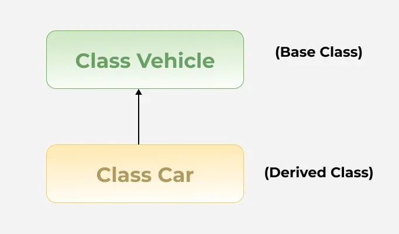

**2. Multilevel Inheritance**

In Multilevel Inheritance, a derived class will be inheriting a base class and as well as the derived class also acts as the base class for other classes.

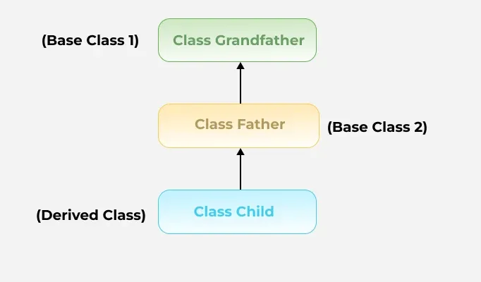

**3. Hierarchical Inheritance**

In hierarchical inheritance, more than one subclass is inherited from a single base class. i.e. more than one derived class is created from a single base class. For example, cars and buses both are vehicle


**4. Multiple Inheritance (Through Interfaces)**
In Multiple inheritances, one class can have more than one superclass and inherit features from all parent classes.

> 📝: that **Java does not support multiple inheritances** with classes. In Java, we can achieve multiple inheritances **only through Interfaces**. 

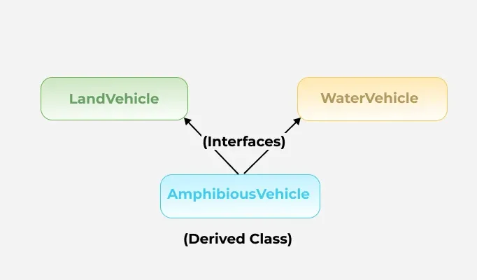

### Upcasting
    abc obj = new xyz();
- `obj` → reference of `abc`
- `xyz` → object of class `xyz`

        obj.display(); // accessing member function of class abc
        obj.disp(); // error // we can't access member of class xyz
  When reference variable of **Parent** class refers to the object of **Child** class, it it known as **upcasting**.

        

### Why use Inheritance in Java
- For **Method Overriding**  (so that runtime polymorphism can be achieved.)
- For Code Reusability.

### What Can Be Done in a Subclass?
In sub-classes we can inherit members as is, replace them, hide them or supplement them with new members: 

- The inherited fields can be used directly, just like any other fields.
- We can declare new fields in the subclass that are not in the superclass.
- The inherited methods can be used directly as they are.
- We can write a new instance method in the subclass that has the same signature as the one in the superclass, thus **overriding** it (as in the example above, toString() method is overridden).
- We can write a new static method in the subclass that has the same signature as the one in the superclass, thus hiding it.
- We can declare new methods in the subclass that are not in the superclass.
- We can write a subclass constructor that invokes the constructor of the superclass, either implicitly or by using the keyword `super`.

### Advantages of Inheritance in Java
- **Code Reusability**: Inheritance allows for code reuse and reduces the amount of code that needs to be written. The subclass can reuse the properties and methods of the superclass, reducing duplication of code.
- **Abstraction**: Inheritance allows for the creation of abstract classes that define a common interface for a group of related classes. This promotes abstraction and encapsulation, making the code easier to maintain and extend.
- **Class Hierarchy**: Inheritance allows for the creation of a class hierarchy, which can be used to model real-world objects and their relationships.
- **Polymorphism**: Inheritance allows for polymorphism, which is the ability of an object to take on multiple forms. Subclasses can override the methods of the superclass, which allows them to change their behavior in different ways.

### Disadvantages of Inheritance in Java
- **Complexity**: Inheritance can make the code more complex and harder to understand. This is especially true if the inheritance hierarchy is deep or if multiple inheritances is used.
- **Tight Coupling**: Inheritance creates a tight coupling between the superclass and subclass, making it difficult to make changes to the superclass without affecting the subclass.

> ❓: Why **multiple inheritance** is not supported in Java?

▶ To reduce the complexity and simplify the language, multiple inheritance is not supported in Java.

Consider a scenario where A, B and C are three classes. The C class inherits A and B classes. If A and B classes have same method and you call it from child class object, there will be ambiguity to call method of A or B class.
Since compile time errors are better than runtime errors, Java renders compile time error if you inherit 2 classes. so whether you have same method or different, there will be compile time error now.

## 41. Polymorphism  (Method Overriding - Runtime Polymorphism)
Polymorphism means "**many forms**", and it occurs when we have many classes that are related to each other by inheritance.

It works hand-in-hand with inheritance:
- Inheritance lets one class derive attributes & methods from another.
- Polymorphism lets those methods perform differently for different subclasses.

**Inheritance** lets us inherit attributes and methods from another class. **Polymorphism** uses those methods to perform different tasks. This allows us to perform a single action in different ways.

**Why And When To Use "Inheritance" and "Polymorphism"?**
✨ It is useful for code reusability: reuse attributes and methods of an existing class when you create a new class.


### Types of Polymorphism
Polymorphism in Java is mainly of 2 types as mentioned below: 
1. **Method Overloading**: Also, known as compile-time polymorphism, is the concept of Polymorphism where more than one method share the same name with different signature(Parameters) in a class. The return type of these methods can or cannot be same.

2. **Method Overriding**: Also, known as run-time polymorphism, is the concept of Polymorphism where method in the child class has the same name, return-type and parameters as in parent class. The child class provides the implementation in the method already written.

Below is the implementation of both the concepts:
```java
// Parent Class
class Parent {
    // Overloaded method (compile-time polymorphism)
    public void func() {
        System.out.println("Parent.func()");
    }

    // Overloaded method (same name, different parameter)
    public void func(int a) {
        System.out.println("Parent.func(int): " + a);
    }
}

// Child Class
class Child extends Parent {
    // Overrides Parent.func(int) — runtime polymorphism
    @Override
    public void func(int a) {
        System.out.println("Child.func(int): " + a);
    }
}

public class Main {
    public static void main(String[] args) {
        Parent parent = new Parent();
        Child child = new Child();
        Parent polymorphicObj = new Child();  // Upcasting

        // Method Overloading (compile-time)
        parent.func();        // Parent.func()
        parent.func(10);      // Parent.func(int): 10

        // Method Overriding (runtime)
        child.func(20);       // Child.func(int): 20

        // Polymorphism in action (runtime binding)
        polymorphicObj.func(30);  // Child.func(int): 30
    }
}
```
Output:
```
Parent.func()
Parent.func(int): 10
Child.func(int): 20
Child.func(int): 30
```

> Runtime Polymorphism (achieved by method overriding) or **'Dynamic Method Dispatch'** is a process in which a call to an overriden method is resolved at runtime rather than compile-time.
In this process, an overriden method is called through the reference variable of a superclass. The determination of the method to be called is based on the object being referred to by the reference variable.

| Type                          | Timing          | Achieved By        | Example                                    |
| ----------------------------- | --------------- | ------------------ | ------------------------------------------ |
| **Compile-time Polymorphism** | At compile time | Method Overloading | Same method name, different parameter list |
| **Runtime Polymorphism**      | At runtime      | Method Overriding  | Subclass redefines parent method           |

### Method Overriding - Runtime Polymorphism
If we have two methods both in parent & child class of same name, second method is overridden. This is called **Method Overriding**.

- Even if we use upcasting, same name functions will be overrided. (cz the display() of `abc` class doesn't exist now).
- Works during runtime via dynamic method dispatch.
- The object type, not the reference type, determines which method runs.
- Static methods cannot be overridden — only hidden.
- Data members can't be overriden.
```java
class abc{
    int a =10;
}
class xyz extends abc{
    int a =20;
}
class mno{
    public static void main(String[] args) {
        abc a1 = new xyz(); // upcasting
        System.out.println(a1.a); // prints 10
    }
}
```
✅ **Explanation**: Variables depend on reference type, not object type.

> ⚙️ **Static Methods Are Not Overridden**
They are bound at **compile time**.
Defining another static method in a subclass **hides** the parent method.

#### Rules for Java Method Overriding
1. Same method **name and parameter list**.
2. Must exist an **IS-A relationship** (inheritance).
3. Return type must be the **same or covariant** (a subclass of parent return type).
4. Static and private methods **cannot be overridden**.
5. Constructors are **not inherited**, hence cannot be overridden.

> 📝: In Java, we can't inherit multiple classes because **Java doesn't support multiple inheritance**.

-  picks which method to run at run time, based on the actual object type, not just the reference variable type.
- The `@Override` annotation catches mistakes like typos in method names.

#### Usage of Java Method Overriding
- Method overriding is used to provide a specific implementation of a method in a subclass that differs from the implementation in the superclass.
- Method overriding is used to achieve **runtime polymorphism**.

> 📝: Method overriding is not allowed in Java if the method in the child class has a different return type from the method in the parent class.

```java
class Animal {
    void move() {
        System.out.println("Animal is moving.");
    }
    void eat() {
        System.out.println("Animal is eating.");
    }
}

class Dog extends Animal {
    @Override
    void move() { // overridden method
        System.out.println("Dog is running.");
    }
    void bark() {
        System.out.println("Dog is barking.");
    }
}

public class Geeks {
    public static void main(String[] args) {
        Dog d = new Dog();
        d.move();  // calls overridden move()
        d.eat();   // calls inherited method
        d.bark();  // own method
    }
}
```
Output:
```
Dog is running.
Animal is eating.
Dog is barking.
```
**Explanation**: 
- `move()` is overridden in `Dog`.
- `eat()` is inherited unchanged.
- `bark()` is Dog’s own method.

The Animal class defines base functionalities like move() and eat(). The Dog class inherits from Animal and overrides the move() method to provide a specific behavior Dog is running. Both classes can access their own methods. When creating a Dog object, calling move() executes the overridden method.

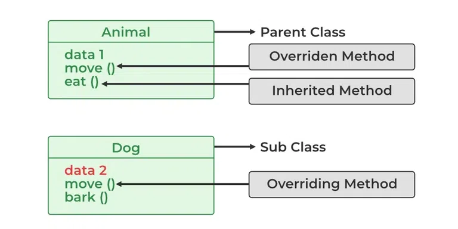

> 📝: Constructors are not member methods, and so are not inherited by subclasses. However, the constructor of the superclass is called when the subclass is instantiated.

They’re not methods; but a subclass must call a superclass constructor (implicitly or explicitly).
```java
class ABC{
    int a, b;
    ABC(int a, int b){
        this.a = a;
        this.b = b;
    }
    int sum(){
        return a + b;
    }
}
class XYZ extends ABC{
    XYZ(int a, int b){
        super(a, b); // calls parent constructor
    }
}
class mno{
    public static void main(){
        XYZ x1 = new XYZ(10, 20);
        System.out.println(x1.sum()); // Output: 30
    }
}
```

💡 **Accessing Parent Class Members**
We can also access member function or variables of parent class using `super` keyword.
```java
super.display(); // Calls parent class method
super();         // Calls parent class constructor
```

### Special Cases in Overriding
**1. Calling Parent Method Using super**

The `super` keyword can invoke the parent class method from the overriding method.

**2. Final Methods Cannot Be Overridden**

If we don't want a method to be overridden, we declare it as `final`.

**3. Static Methods**
- Static methods cannot be overridden; defining a static method in a subclass with the same signature as in the superclass hides the superclass method.
- Instance methods can be overridden, but a subclass cannot override a superclass static method.
- A static method in a subclass with the same signature as a superclass static method hides the original method.

**4. Private Methods**
- Private methods cannot be overridden because they are not visible to subclasses.
- A subclass method with the same name is treated as a new, independent method, unrelated to the parent class.

**5. Covariant Return Types**
- In method overriding, the return type of the overriding method can be a subclass of the return type of the overridden method.
- This feature is known as covariant return type and allows more specific return types in the subclass.

| Case                       | Description                                                           |
| -------------------------- | --------------------------------------------------------------------- |
| **`super` keyword**        | Used to call parent method or constructor.                            |
| **`final` methods**        | Cannot be overridden.                                                 |
| **Static methods**         | Cannot be overridden; only hidden.                                    |
| **Private methods**        | Not visible to child classes, hence not overridden.                   |
| **Covariant return types** | Overriding method can return a subclass type of parent’s return type. |


### Why Do We Use Method Overriding?
- To change or enhance the behavior of an existing method in a subclass.
- To achieve runtime polymorphism — method calls depend on the actual object type.
- To reuse method names logically, reducing redundancy.

📋 **Summary : Overloading vs Overriding in Java**

| Concept                | Compile-time / Runtime            | Description                                                                                                                 | Example                                                           |
| ---------------------- | --------------------------------- | --------------------------------------------------------------------------------------------------------------------------- | ----------------------------------------------------------------- |
| **Method Overloading** | **Compile-time**                  | Same method name but **different parameter lists** (type, number, or order). Determined at compile time.                    | `void show(int a)` and `void show(String b)`                      |
| **Method Overriding**  | **Runtime**                       | Subclass redefines a **method with the same signature** as in parent class. Decided by **object type**, not reference type. | `class A { void display() } class B extends A { void display() }` |
| **Data Members**       | **Compile-time (not overridden)** | Variables are **not polymorphic**. Access depends on **reference type**, not object type.                                   | `A obj = new B(); System.out.println(obj.x);` — uses `A`’s `x`    |
| **Static Methods**     | **Compile-time (hidden)**         | Can’t be overridden; they are **method-hidden**, chosen based on reference type.                                            | `A.show()` vs `B.show()`                                          |
| **Private Methods**    | **Compile-time (inaccessible)**   | Not inherited, hence can’t be overridden. Subclass may define a method with same name, but it’s **completely separate**.    | `private void display()` in both parent and child are unrelated   |

- **Overloading** = compile-time polymorphism (method signature differs).
- **Overriding** = runtime polymorphism (method signature same, object differs).

> If you overload static method in Java, it is the example of **compile-time polymorphism**.

> Java doesn't support **multiple inheritance** due to the ambiguity (data loss).
To reduce the complexity and simplify the language, multiple inheritance is not supported in Java.

## 42. `super` keyword
The `super` keyword in java is a reference variable which is used to refer immediate parent class object. Whenever you create the instance of subclass, an instance of parent class is created implicitly which is referred by `super` reference variable.

It helps access **parent class members** (variables, methods, constructors) that are **hidden or overridden** by the child class.

### Usage of `super` keyword
1. `super` can be used to refer immediate parent class instance variable.
2. `super` can be used to invoke immediate parent class method. (it is used if function is overriden.)
3. `super()` can be used to invoke immediate parent class constructor.

| Purpose                                 | Description                                                                   | Example                                            |
| --------------------------------------- | ----------------------------------------------------------------------------- | -------------------------------------------------- |
| 1️⃣ Access parent class **variables**   | When a subclass has a variable with the same name as the parent class         | `super.variableName`                               |
| 2️⃣ Call parent class **methods**       | When the subclass overrides a method but still wants to call parent’s version | `super.methodName()`                               |
| 3️⃣ Invoke parent class **constructor** | To initialize parent class fields before executing subclass constructor       | `super()` (must be first statement in constructor) |

> `super()` is added in each class constructor automatically by compiler if there is no `super()` or `this()`.


> 📝: The call to super() must be the **first statement** in the subclass constructor.

As we know well that default constructor is provided by compiler automatically if there is no constructor. But, it also adds `super()` as the first statement.

### **Rules of `super`**

1. `super()` must be **the first statement** in a constructor.
2. You **cannot** use both `this()` and `super()` in the same constructor.
3. `super` is **used only within a subclass constructor or method**.
4. If you don’t call `super()` explicitly, Java automatically calls the **no-argument constructor** of the parent class.

⚙️ Difference Between `this` and `super`
| Feature          | `this`                                  | `super`                           |
| ---------------- | --------------------------------------- | --------------------------------- |
| Refers to        | Current class instance                  | Immediate parent class instance   |
| Access           | Current class members                   | Parent class members              |
| Constructor call | Calls another constructor of same class | Calls constructor of parent class |
| Usage location   | Within the same class                   | Inside subclass only              |

> 📝: `super` improves clarity in inheritance, avoids ambiguity, and supports **constructor chaining** — a core part of OOP design.

## 43. Abstraction
Abstraction in Java is the process of hiding internal implementation details and showing only essential functionality to the user. It focuses on what an object does rather than how it does it.

- Abstraction hides the complex details and shows only essential features.
- Abstract classes may have methods without implementation and must be implemented by subclasses.
- By abstracting functionality, changes in the implementation do not affect the code that depends on the abstraction.

The `abstract` keyword is a non-access modifier, used for classes and methods:
1. **Abstract class**: is a restricted class that cannot be used to create objects (to access it, it must be inherited from another class).
- A class that is declared with `abstract` keyword, is known as **abstract class** in Java. It can have abstract and non-abstract methods (methods with body).
- It needs to be extended and its method implemented. It cannot be instantiated.

2. **Abstract method**: can only be used in an abstract class, and it does not have a body. The body is provided by the subclass (inherited from).
- A method that is declared as `abstract` and does not have implementation is known as abstract method.
- Syntax:
    ```java
    abstract void methodName(); // no body in abstract method
    ```

### How to Achieve Abstraction in Java?
Java provides two ways to implement abstraction, which are listed below:
- Abstract Classes (Partial Abstraction)
- Interface (100% Abstraction)

```java
abstract class XYZ{
    abstract void display();
    void disp(){
        System.out.println("Hello");
    }
}
class mno exteds XYZ{
    void display(){ // here abstract method of XYZ is extended so that mno class won't become abstract
        System.out.println("Hi");
    }
    public static void main(String... args){
        XYZ x1 = new mno(); // object of child class mno as we can't initialize object of abstract class
        x1.display(); // x1 is reference of class XYZ
        x1.disp();
    }
}
```
- **Rule 1:** If there is any abstract method in a class, the class must be declared as abstract.
- **Rule 2:** If you are extending any abstract class that have abstract method, you must either provide the implementation of the method or make the class abstract.

### Key Features of Abstraction
1. An abstract class has no use until unless it is extended by some other class.
2. If you declare an abstract method in a class then you must declare the class abstract as well. You can't have abstract method in a concrete class. Its vice versa is not always true: If a class is not having any abstract method then also it can be marked as abstract.
3. Abstract method has no body.
4. It must be overidden. An abstract class must be extended and in a same way abstract method must be overriden.
5. The class which is extending abstract class must override all the abstract methods.

> **Defining `main()` in an abstract class :**
```java
abstract class abc{
    public static void main(String... args){
        System.out.println("Hello");
    }
}
```
`main()` isn't called by an object nor we can define its object. Therefore, adhering the property of abstract class. As abstract class cannot be instantiated.

### Advantages of Abstraction
- Abstraction makes complex systems easier to understand by hiding the implementation details.
- Abstraction keeps different part of the system separated.
- Abstraction maintains code more efficiently.
- Abstraction increases the security by only showing the necessary details to the user.

### Disadvantages of Abstraction
- It can add unnecessary complexity if overused.
- May reduce flexibility in implementation.
- Makes debugging and understanding the system harder for unfamiliar users.
- Overhead from abstraction layers can affect performance.

### Common Mistakes to Avoid
The common mistakes that can occur and we should avoid when working with Abstraction in Java are listed below:

- **Not Implementing Abstract Methods**: Always make sure that the abstract methods are implemented in the concrete subclass.
- **Overusing Abstraction**: Avoid making everything abstract when it’s not required. Use abstraction only when it enhances the design.
- **Inconsistent Method Signatures in Subclasses**: When you override abstract methods, please make sure the method signature matches exactly, any mistake can cause errors.

❓ **Why And When To Use Abstract Classes and Methods?**
▶ To achieve security - hide certain details and only show the important details of an object.

❓ **Why can't we create the object of abstract class?**
▶ Because these classes are incomplete, they have abstract methods that have no body so if Java allows you to create object of this class then if someone calls the abstract method using that object then *what* would happen? There would be no actual implementation of the method to invoke. Also, becuase an object is concrete. An abstract class is like a template, so you have to extend it and build on it before you can use it.

🧩 **Analogy**: Think of an abstract class as an **architectural plan** - you can’t live in a plan; you can only live in a **house built from that plan**.
Similarly, you can only create an object from a **concrete subclass**, not from the abstract class itself.

⚠️ **Common Misconceptions about Abstract Classes**
| ❓ **Misconception**                                                | ✅ **Clarification / Truth**                                                                                                                                                                                                         |
| ------------------------------------------------------------------ | ----------------------------------------------------------------------------------------------------------------------------------------------------------------------------------------------------------------------------------- |
| **1. Abstract classes cannot have constructors.**                  | ❌ False. Abstract classes **can have constructors**, and they are often used to **initialize common fields** when a subclass object is created. The constructor of an abstract class is called **when a subclass is instantiated**. |
| **2. All methods in an abstract class must be abstract.**          | ❌ False. An abstract class can have **both abstract and non-abstract (concrete)** methods. This allows defining **shared functionality** along with **enforced structure**.                                                         |
| **3. Abstract classes cannot have variables or data members.**     | ❌ False. They can have **instance variables**, **static variables**, and **final variables** — just like any other class.                                                                                                           |
| **4. Abstract classes cannot extend other classes.**               | ❌ False. An abstract class **can extend** another **abstract or concrete** class and **can also implement interfaces**.                                                                                                             |
| **5. You cannot create references of an abstract class.**          | ❌ False. You **can declare a reference variable** of an abstract class type — you just **cannot instantiate** it directly. This is essential for **polymorphism**.                                                                  |
| **6. Abstract classes must contain at least one abstract method.** | ❌ False. A class can be declared abstract **even without any abstract methods**, often used to **prevent direct instantiation**.                                                                                                    |
| **7. Abstract classes are the same as interfaces.**                | ❌ False. Abstract classes can have **state (fields)** and **implemented methods**, while interfaces define **pure contracts** (methods without state).                                                                              |

> Abstract classes act as **partially implemented blueprints**, combining both concrete behavior and abstract structure - bridging the gap between a simple class and a pure interface.


## 44. Anonymous Class
It is an inner class without a name and for which only a single object is created.

It should be used if you have to override method of class or interface.
Java Anonymous inner class can be created by two ways:
- Class (may be abstract or concrete)
- Interface

An **anonymous class** in Java is a **local inner class without a name**, used to create a **one-time object** with a custom implementation.
It is typically used when you need to **override a method** of a class or interface without formally declaring a subclass.

### Internal working of Anonymous Class
✅ **Key Features**

- Declared and instantiated **at the same time**.
- Has **no name** (defined within an expression).
- Used when a **single instance** of a class is required.
- Commonly used in **GUI applications**, **event handling**, and **thread creation**.

### **Syntax**
The syntax of an anonymous class expression is like the invocation of a constructor, except that there is a class definition contained in a block of code. 
```java
ParentType ref = new ParentType() {
    // body of anonymous class
    @Override
    public void someMethod() {
        // overridden method logic
    }
};
```

### Difference between regular class(normal classes) and Anonymous Inner class

- A normal class can implement any number of interfaces but the anonymous inner class can implement only one interface at a time.
- A regular class can extend a class and implement any number of interfaces simultaneously. But anonymous Inner class can extend a class or can implement an interface but not both at a time.
- For regular/normal class, we can write any number of constructors but we can't write any constructor for anonymous Inner class because the anonymous class does not have any name and while defining constructor class name and constructor name must be same.

### **Internal Working of Anonymous Class**

1. The compiler **creates a separate class file** (e.g., `Main$1.class`) for the anonymous class.
2. This class **extends** the given superclass (or **implements** the given interface).
3. The object of this compiler-generated class is **assigned** to the reference variable.

```java
abstract class pqr{
    abstract void di();
}
abstract class XYZ {
    abstract void display();
    void disp(){
        System.out.println("Hello");
    }
}
class mno {
    public static void main(String... args){
        XYZ x1 = new XYZ() { // anonymous class
            void display(){
                System.out.println("Hi");
            }
        }
        x1.display();

        pqr p1 = new pqr(){
            void di(){
                System.out.println("Hey");
            }
        };
        p1.di();
    }
}
```
- A class is created but its name is decided by the compiler which extends the `XYZ` class and provides the implementation of the `display()` method.
- An object of **Anonymous class** is created that is referred by `x1` reference variable of `XYZ` type.

### When to Use Anonymous Classes?
Use anonymous classes when:
- You need a **one-time** subclass or interface implementation.
- You want to **override methods quickly** without defining a new named class.
- You’re writing **short, localized behavior**, especially:

  - Event listeners (`ActionListener`, `MouseListener`)
  - Runnable threads
  - Callback implementations

**Example 1 – Anonymous Class Extending an Abstract Class**
```java
abstract class XYZ {
    abstract void display();
    void disp() {
        System.out.println("Hello from XYZ");
    }
}

public class Demo {
    public static void main(String[] args) {
        XYZ obj = new XYZ() { // Anonymous inner class
            void display() {
                System.out.println("Hi from Anonymous Class");
            }
        };
        obj.display();  // calls overridden method
        obj.disp();     // inherited method
    }
}
```

**Output:**
```
Hi from Anonymous Class
Hello from XYZ
```

---
**Example 2 – Anonymous Class Implementing an Interface**
```java
interface Greet {
    void sayHello();
}

public class Main {
    public static void main(String[] args) {
        Greet g = new Greet() {
            public void sayHello() {
                System.out.println("Hello, World!");
            }
        };
        g.sayHello();
    }
}
```

**Output:**
```
Hello, World!
```

---
**Example 3 – Anonymous Class with a Concrete Class**
```java
class Parent {
    void show() {
        System.out.println("Parent show()");
    }
}

public class Test {
    public static void main(String[] args) {
        Parent p = new Parent() {
            void show() {
                System.out.println("Overridden show() in Anonymous class");
            }
        };
        p.show();
    }
}
```

**Output:**
```
Overridden show() in Anonymous class
```
Use anonymous classes when you need to create a short class for one-time use. For example:
- Overriding a method without creating a new subclass
- Implementing an interface quickly
- Passing small pieces of behavior as objects

### **Rules and Limitations**

1. Anonymous classes **cannot have constructors** (since they don’t have a name).
2. They can **access final or effectively final variables** from the enclosing scope.
3. They **cannot define static members** (except static final constants).
4. **Only one anonymous class** can be created per expression.

---

### Advantages
- Concise and clean syntax for one-time subclasses.
- Reduces boilerplate code.
- Improves readability for short-lived logic.

### Disadvantages
- Cannot be reused elsewhere.
- Harder to debug due to lack of name.
- Makes the code less readable if overused.

---

### Real-World Example: Runnable Thread

```java
public class ThreadDemo {
    public static void main(String[] args) {
        Thread t = new Thread(new Runnable() {
            public void run() {
                System.out.println("Thread running via anonymous class");
            }
        });
        t.start();
    }
}
```

**Output:**

```
Thread running via anonymous class
```

| Use Case                  | Extends / Implements | Purpose                         | Can Have Constructor? | Example Use Case               |
| ------------------------- | -------------------- | ------------------------------- | --------------------- | ------------------------------ |
| Abstract / Concrete Class | `extends`            | To override a method            | ❌ No                  | Custom subclass for 1-time use |
| Interface                 | `implements`         | To provide quick implementation | ❌ No                  | Runnable, ActionListener etc.  |

---

**In short:**
> An *anonymous class* is perfect when you need a **one-off** subclass or interface implementation that won’t be reused — clean, quick, and concise. 

## 45. Encapsulation
Encapsulation is defined as the **process of wrapping data (variables) and the methods into a single unit**, typically a **class**. It is the mechanism that binds together the code and the data. It manipulates. Another way to think about encapsulation is that it is a protective shield that prevents the data from being accessed by the code outside this shield. 

- Technically, in encapsulation, the variables or the data in a class is hidden from any other class and can be accessed only through any member function of the class in which they are declared.
- In encapsulation, the data in a class is hidden from other classes, which is similar to what data-hiding does. So, the terms "encapsulation" and "data-hiding" are used interchangeably.
- Encapsulation can be achieved by declaring all the variables in a class as private and writing public methods in the class to set and get the values of the variables.


### Implementation of Encapsulation in Java
- **Declare data as private**: Hide the class data so it cannot be accessed directly from outside the class.
- **Use getters and setters**: Keep variables private and provide public getter and setter methods for controlled access and safe modification, often with validation.
- **Apply proper access modifiers**: Use private for data hiding and public for methods that provide access.

### Best Practices for Encapsulation
- Always give the most restrictive access level that still allows the code to work. This helps hide implementation details and reduces coupling.
- Expose data through methods (getters/setters) rather than making fields public. This gives more control (validation, lazy initialization, invariants, etc.).
- Use validation logic inside setters to ensure correct data.
- Avoid unnecessary setters if data should not be modified externally (e.g., IDs).

### Advantages of Encapsulation
- **Data Hiding**: Encapsulation restricts direct access to class variables, protecting sensitive data from unauthorized access.
- **Improved Maintainability**: Changes to internal implementation can be made without affecting external code that uses the class.
- **Enhanced Security**: Encapsulation allows validation and control over data, preventing invalid or harmful values from being set.
- **Code Reusability**: Encapsulated classes can be reused in different programs without exposing internal logic.
- **Better Modularity**: Encapsulation promotes organized, modular code by keeping data and methods together within a class.

### Disadvantages of Encapsulation
- **Increased Code Complexity**: Writing getter and setter methods for every variable can make the code longer and slightly more complex.
- **Performance Overhead**: Accessing data through methods instead of directly can introduce a minor performance cost, especially in performance-critical applications.
- **Less Flexibility in Some Cases**: Over-restricting access to class members may limit the ability of other classes to extend or use the class efficiently.

### Why Encapsulation?
- Better control of class attributes and methods
- Class attributes can be made **read-only** (if you only use the `get` method), or **write-only** (if you only use the `set` method)
- Flexible: the programmer can change one part of the code without affecting other parts
- Increased security of data

## 46. Interface
- Like a class, an interface can have methods and variables, but the methods declared in interface are by default abstract (only method signature, no today).
- The members of an interface are `public`, `static` and `final` by nature.
- Java Interface also represents **IS-A** relationship.

```java
// Declaring an interface using the 'interface' keyword
interface abc{ 
    int a = 10; // 'a' is public, static, and final by default (constant)

    void display(); // Abstract method (no body) – implicitly public and abstract
}

// Class 'xyz' implements interface 'abc'
class xyz implements abc{

    // Must provide implementation for all abstract methods in the interface
    public void display(){
        System.out.println("hello");
    }

    public static void main(String... args){
        // Reference of interface type, object of implementing class
        abc a1 = new xyz();

        a1.display(); // Calls overridden display() method

        // a1.a = 20; // ❌ Error: Cannot modify 'a' because it’s final (constant)
        
        // Accessing interface variable using interface name (recommended way)
        System.out.println(abc.a); // ✅ Output: 10
    }
}
```
- A class that implements interface must implement all the methods declared in the interface. To implement interface use `implements` keyword.
- Since Java doesn't support multiple inheritance in case of class, but by using interface it can achieve multiple inheritance.
- Interface are used to implement **abstraction**.

❓ **Why use interfaces when we have abstract class?**
▶ The reason is, abstract classes may contain non-final variables, whereas variables in interface are `final`, `public` and `static`.

### Important points about Interface
- We can't create instance (interface can't be instantiated) of interface but we can make reference of it that refers to the object of its implementing class.
- A class can **implement** more than one interface.
    

- An interface can **extend** another interface or interfaces (more than one interface).
    

- A class that implements interface must implement all the methods in interface.
- All the methods are `public` and `abstract`. And all the fields are `public`, `static` and `final`.
- It is used to achieve **multiple inheritance**.

```java
// Declaring an interface 'Bank'
interface Bank{
    int a = 10; // Interface variable — public, static, and final by default

    int getInterest(); // Abstract method — must be implemented by any class that implements this interface
}

// SBI class implements Bank interface and provides its own implementation
class SBI implements Bank{
    public int getInterest(){
        return 9;  // SBI offers 9% interest
    }
}

// PNB class implements Bank interface and provides its own implementation
class PNB implements Bank{
    public int getInterest(){
        return 7; // PNB offers 7% interest
    }
}
class xyz {
    public static void main(String... args){
         // Creating a reference variable of type Bank (interface)
        Bank b = new PNB();  // Object of PNB assigned to Bank reference

        // Calls PNB's implementation of getInterest()
        System.out.println(b.getInterest());  // Output: 7

        // Reassigning same reference variable to SBI object
        b = new SBI();

        // Calls SBI's implementation of getInterest()
        System.out.println(b.getInterest());  // Output: 9
    }
}
```
**How It Works :**
- `interface Bank` defines a **contract** — any class implementing it **must** define `getInterest()`.
- Both `SBI` and `PNB` **implement** the same interface, providing their own method logic.
- The reference `Bank b` can hold an object of any class that implements `Bank` → demonstrating **runtime polymorphism**.
- The method executed depends on the **actual object type** (`SBI` or `PNB`), not the reference type (`Bank`).
---

- Interfaces specify what a class must do and not how. It is the **blueprint of the class**.
- An Interface is about capabilities like a `Bank` may be an interface and any class implementing `Bank` must be able to (or must implement) `getInterest()`. So it specifies a set of methods that the class has to implement.
- If a class implements an interface and does not provide method bodies for all functions specified in the interface, then class must be declared `abstract`.
- We have to override all the members of an Interface.

### Why And When To Use Interfaces?
1) To achieve security - hide certain details and only show the important details of an object (interface).

2) Java does not support "multiple inheritance" (a class can only inherit from one superclass). However, it can be achieved with interfaces, because the class can implement multiple interfaces. Note: To implement multiple interfaces, separate them with a comma (see example below).
---
**Notes**:
- Private methods can only be called inside default or static methods.
- Static methods are accessed using the interface name, not via objects.
- To implement an interface, use the implements keyword.
- Interfaces define **what** a class should do, not **how** it should do it.
- All variables in interfaces are constants (`public static final`).
- All methods are **public and abstract** by default (till Java 7).
- A class **implements** an interface, not extends it.
- You can **implement multiple interfaces**, achieving multiple inheritance in Java.

### Relationship Between Class and Interface
A class can extend another class and similarly, an interface can extend another interface. However, only a class can implement an interface and the reverse (an interface implementing a class) is not allowed.

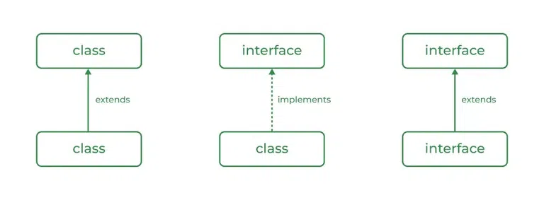

### When to Use Class and Interface?
**Use a Class when:**
- Use a class when you need to represent a real-world entity with attributes (fields) and behaviors (methods).
- Use a class when you need to create objects that hold state and perform actions
- Classes are used for defining templates for objects with specific functionality and properties.

**Use a Interface when:**
- Use an interface when you need to define a contract for behavior that multiple classes can implement.
- Interface is ideal for achieving abstraction and multiple inheritance.

> **Implementation**: To implement an interface, we use the keyword `implements`

### Multiple Inheritance in Java Using Interface
Java does not support multiple inheritance with classes to avoid ambiguity, but it supports multiple inheritance using interfaces.


```java
import java.io.*;

// Add interface
interface Add{
    int add(int a,int b);
}

// Sub interface
interface Sub{
  	int sub(int a,int b);
}

// Calculator class implementing Add and Sub 
class Cal implements Add , Sub
{
  	// Method to add two numbers
  	public int add(int a,int b){
      	return a+b;
    }
  
  	// Method to sub two numbers
  	public int sub(int a,int b){
    	return a-b;
    }
}
class GFG{
    // Main Method
    public static void main (String[] args){
        
      	// instance of Cal class
      	Cal x = new Cal();
      	System.out.println("Addition : " + x.add(2,1));
      	System.out.println("Substraction : " + x.sub(2,1));
    }
}
```
Output:
```
Addition : 3
Substraction : 1
```

---
- Like **abstract classes**, interfaces **cannot** be used to create objects.
- Interface methods do not have a body - the body is provided by the "implement" class
- On implementation of an interface, you must override all of its methods
- Interface methods are by default `abstract` and `public`
- Interface attributes are by default `public`, `static` and `final`
- An interface cannot contain a constructor (as it cannot be used to create objects)

### JDK 8 New Features Added in Interfaces 
There are certain features added to Interfaces in JDK 8 update mentioned below:

1. **Default Methods**
- Interfaces can define methods with default implementations.
- Useful for adding new methods to interfaces without breaking existing implementations.

Prior to JDK 8, interface could not define implementation. We can now add default implementation for interface methods.
This default implementation has special use and does not affect the intention behind interfaces.

Suppose we need to add a new method in an existing interface. Obviously the old code will not work as the classes have not implemented those new functions. So with the help of default implementation, we will give a deafult body for the newly added functions. Then the old codes will still work.
```java
interface in1{
    final int a = 10;
    default void display() {
        System.out.println("hello");
    }
}
class testClass implements in1{
    public static vod main(String... args) {
        testClass t = new testClass();
        t.display();
    }
}
```

2. **Static Methods**
- Interfaces can now include static methods.
- These methods are called directly using the interface name and are not inherited by implementing classes.

Another feature that was added in JDK 8 is that we can now define static methods in interfaces that can be called independently without an object. 
> These methods are not inherited.
```java
interface in1{
    static void display(){
        System.out.println("Hello");
    }
}
class testClass implements in1 {
    public static void main(String... args){
        in1.display();
    }
}
```

> Due to a new upgrade in JDK 8, now we can declare a non-abstract method in an interface, using `default` keyword.

```java
// Define interface ABC with one abstract method
interface ABC {
    void display(); // implicitly public and abstract
}

// Another interface A with same method signature
interface A {
    void display(); // implicitly public and abstract
}

// Another interface B with same method signature
interface B {
    void display(); // implicitly public and abstract
}

// Interface C extends multiple interfaces (ABC, A, and B)
// Demonstrates multiple inheritance using interfaces
interface C extends ABC, A, B {
    void display(); // still abstract; all parent display() methods merge into one
}

class XYZ {
    public static void main(String... args) {

        // Anonymous class implementing interface C
        // Since C is an interface, we must provide implementation for display()
        C c1 = new C() {
            public void display() {
                System.out.println("Hello");
            }
        };

        // Call display() method from anonymous class
        c1.display(); // Output: Hello
    }
}
```
- Interfaces in Java can **extend multiple interfaces**, achieving multiple inheritance of type.
- When multiple parent interfaces define the **same method signature**, they are merged into one — no conflict occurs.
- You can’t instantiate an interface directly, but you can use an **anonymous class** to provide implementation on the spot.

> A class implements interface but one interface extends another interface.

3. **Functional Interface**
- Functional interfaces can be used with **lambda expressions** or **method references**.
- The @FunctionalInterface annotation can be used to indicate that an interface is a functional interface, although it’s optional.

```java
@FunctionalInterface
public interface Calculator {
    int compute(int x, int y); // single abstract method
}
```

###  JDK 9 New Features Added in Interfaces
From Java 9 onwards, interfaces can contain the following also:

**Private Methods**
- Interface can now include private methods.
- Private methods are defined within the interface but it cannot be accessed by the implementing classes.
- Private methods cannot be overridden by implementing classes as they are not inherited.

```java
interface Vehicle {
    // Private method for internal use
    private void startEngine() {
        System.out.println("Engine started.");
    }
    
    // Default method that uses the private method
    default void drive() {
         // Calls the private method
        startEngine(); 
        System.out.println("Vehicle is now driving.");
    }
}

class Car implements Vehicle {
    // Car class implements Vehicle interface and inherits the default method 'drive'
}

public class Main {
    public static void main(String[] args) {
        Car car = new Car();
        // This will call the default method, which in turn calls the private method
        car.drive();  
    }
}
```
Output
```
Engine started.
Vehicle is now driving.
```

### Extending Interfaces
One interface can inherit another by the use of keyword extends. When a class implements an interface that inherits another interface, it must provide an implementation for all methods required by the interface inheritance chain.

❓: **Multiple inheritance is not supported through class in Java but it is possible by interface, why?**
▶ Multiple inheritance is not supported in case of class because of ambiguity. But it is supported in case of interface because there is no ambiguity as implementation is provided by the implementation class.

```java
interface Printable{
    void print();
}
interface Showable{
    void print();
}

class TestInterface implements Printable, Showable{
    public void print(){
        System.out.println("hello");
    }
    public static void main(String... args){
        TestInterface obj = new TestInterface();
        obj.print();
    }
}
```
In the above example,`Printable` and `Showable` interface have same methods but its impleentation is provided by class `TestInterface`, so there is no ambiguity.

### Internal addition by Compiler
The Java compiler adds `public` and `abstract` keywords before the interface method.
More, it adds `public`, `static` and `final` keywords before data members.

In other words, Interface fields are `public`, `static` and `final` by default, and methods are **public** and **abstract**.

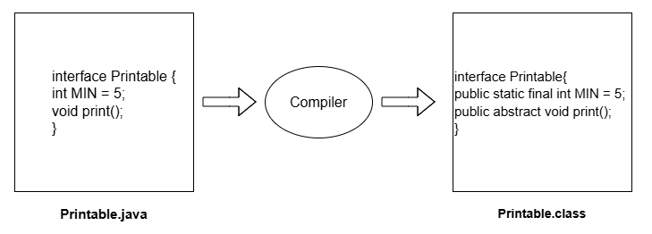

Although Class and Interface seem the same there are certain differences between Classes and Interface. The major differences between a class and an interface are mentioned below:

| **Feature**          | **Class**                                                            | **Interface**                                                                                                     |
| -------------------- | -------------------------------------------------------------------- | ----------------------------------------------------------------------------------------------------------------- |
| **Instantiation**    | You **can create objects** of a class (unless it’s abstract).        | You **cannot create objects** of an interface directly.                                                           |
| **Variables**        | Can have **instance, static, and final** variables.                  | All variables are **`public static final`** (constants only).                                                     |
| **Methods**          | Can have **concrete (defined)** and **abstract** methods.            | All methods are **abstract by default** (till Java 7). From Java 8+, can have **default** and **static** methods. |
| **Inheritance**      | Supports **single inheritance** (a class can extend only one class). | Supports **multiple inheritance** (a class can implement multiple interfaces).                                    |
| **Constructors**     | Can have **constructors** (for object initialization).               | **No constructors** allowed in interfaces.                                                                        |
| **Access Modifiers** | Can use **private, protected, public, or default** modifiers.        | All members are **`public` by default**.                                                                          |
| **Keyword**          | Declared using the `class` keyword.                                  | Declared using the `interface` keyword.                                                                           |
| **Default Methods**  | ❌ Does **not support** default methods.                              | ✅ Supports **default methods** (introduced in **JDK 8**).                                                         |
| **Static Methods**   | ✅ Can have **static methods**.                                       | ✅ Supports **static methods** (introduced in **JDK 8**).                                                          |
| **Private Methods**  | ✅ Can have **private methods**.                                      | ✅ Supports **private methods** (introduced in **JDK 9**).                                                         |
| **Main Method**      | ✅ Can have `main()` for execution.                                   | ✅ Can have `main()` (since **JDK 8**, via static methods).                                                        |

- A class defines both data and behavior - it’s a blueprint to create objects.
- An interface defines only behavior (method signatures) - it’s a contract that classes must follow.

## 47. Abstract Class vs. Interface
| Feature              | Abstract Class                                                      | Interface                                                                                  |
| -------------------- | ------------------------------------------------------------------- | ------------------------------------------------------------------------------------------ |
| **Keyword**          | `abstract`                                                          | `interface`                                                                                |
| **Method Type**      | Can have abstract **and** concrete methods                          | All methods are **abstract** (Java 7); can have **default** & **static** methods (Java 8+) |
| **Variables**        | Can have instance & static variables                                | All variables are `public static final` (constants)                                        |
| **Access Modifiers** | Methods can be `public`, `protected`, or `default`                  | All methods are implicitly `public`                                                        |
| **Inheritance Type** | Supports **single inheritance**                                     | Supports **multiple inheritance**                                                          |
| **When to Use**      | When you need to share **partial implementation** across subclasses | When you only need to define a **contract or capability**                                  |
| **Object Creation**  | Cannot be instantiated directly                                     | Cannot be instantiated directly                                                            |
| **Constructors**     | Can have constructors                                               | Cannot have constructors                                                                   |

- Use **abstract classes** when classes share common behavior.
- Use **interfaces** when unrelated classes must adhere to a common set of methods (e.g., `Comparable`, `Runnable`, `Cloneable`).

**Abstraction**: Hiding the internal implementation of the feature and only showing the functionality to the users, i.e., what it works(showing), how it works (hiding). Both abstract class and interface are used for abstraction.

###  When to use what?
🔸 **Abstract Class**
- In Java application, there are some related classes that need to share some lines of code then you can put these lines of code within abstract class and this abstract class should be extended by all these related classes.
- You can define non-static or non-final field(s) in abstract class, so that via a method you can access and modify the state of Object to which they belong.
- You can except that the classes that extend an abstract class have many common methods or fields, or require access modifiers other than **public** (such as protected and private).

🔸 **Interface**
- It is **total abstraction**, all methods declared within an interface must be implemented by the class(es) that implements this interface.
- A class can implement more than one interface. It is called **multiple inheritance**.
- You want to **specify the behaviour** of particular data type, but not concerned about who implements its behaviour.

---
🧩 Additional Points to Add

**1. Real-world Analogy**

> An **abstract class** is like a *partially built house*—some rooms (methods) are complete, some are just blueprints.
> An **interface** is like a *design contract*—it just specifies what rooms must exist, but not how they’re built.

**2. Java 8+ Enhancements in Interfaces**
Add a line under the table or in a note:

> Since **Java 8**, interfaces can have `default` and `static` methods; since **Java 9**, they can also include `private` methods — bringing them conceptually closer to abstract classes, though still without state or constructors.

**3. Implementation Relationship Summary**
```
Class → extends → Abstract Class
Class → implements → Interface
Interface → extends → Interface
```

**4. Key Differences Summary (Quick Glance)**

| Criteria             | Abstract Class                         | Interface                                   |
| -------------------- | -------------------------------------- | ------------------------------------------- |
| Nature               | Partial abstraction                    | Full abstraction                            |
| Code Reuse           | Allows code reuse via concrete methods | No code reuse (till Java 8 default methods) |
| Multiple Inheritance | Not allowed                            | Allowed                                     |
| Performance          | Slightly faster (less indirection)     | Slight overhead due to abstraction layer    |
| Usage                | Common behavior across related classes | Common capability across unrelated classes  |

## 48. Exception Handling
Exception is an event that disrupts the normal flow of the program.

It is one of the powerful **mechanism to handle the runtime errors** so that normal flow of the application can be maintained.

The core advantage of exception handling is **to amintain the normal flow of the application**. Exception normally disrupts the normal flow of the application that is why we use exception handling.

### Hierarchy of Java Exception Classes


### Types of Exceptions
There are mainly two types of exceptions: **Checked** and **Unchecked**; where `error` is considered unchecked exception.
The SunMicrosystem says there are three types of exceptions:

1. Checked Exception ➡ **Compile Time**
The classes that extend `Throwable` class except `RuntimeException` and `Error` are known as **checked exception**. eg, `IOException`, `SQLException`, `ClassNotFoundException`.

2. Unchecked Exception ➡ **Run Time**
The classes that extend `RuntimeException` are known as **unchecked exceptions**. eg, `ArithemeticException`, `NullPointerException`, `ArrayIndexOutOfBoundsException`, etc.
Unchecked exceptions are not checked at compile-time rather they are checked at runtime.

3. `error`
Error is irrecoverable. eg, `OutOfMemoryError`, `VirtualMachineError`, `AssertionError`, etc.

**Runtime Exceptions**:
- `ArithmeticException`
- `ArrayIndexOutOfBoundsException`
- `StringIndexOutOfBoundsException`
- `ClassCastException`
- `NullPointerException`
- `NumberFormatException`

**Checked Exception**:
- `IOException`
- `FileNotFoundException`
- `ClassNotFoundException`
- `InterruptedException`


---
### Exception Handling Keywords
1. `try`
2. `catch`
3. `finally`
4. `throw`
5. `throws`


### `try-catch`
- `try` block is used to enclose code that might throw an exception. It must be used within the method.
- The `try` block must be followed by either `catch` or `finally` block.

```java
try {
    // code that might throw an exception
} catch (Exception e) {
    // handle the exception
} finally {
    // code that will be executed regardless of whether an exception occurred or not
}
```
If an error occurs, we can use `try...catch` to catch the error and execute some code to handle it:

```java
class A{
    public static void main(String... args){
        int a = 10;
        int b = 0;
        try{
            int c = a/b;
            System.out.println(c);
        } catch(ArithmeticException e){
            System.out.println(" Error: " + e.getMessage());
        }
    }
}
```
- The try block contains code that might throw an exception,
- The catch block handles the exception if it occurs.

#### Internal Working of try-catch Block:

- JVM executes code inside the try block.
- If an exception occurs, remaining try code is skipped and JVM searches for a matching catch block.
- If found, the catch block executes.
- Control then moves to the finally block (if present).
- If no matching catch is found, the exception is handled by JVM’s default handler.
- The finally block always executes, whether an exception occurs or not.

> 📝: When an exception occurs and is not handled, the program terminates abruptly and the code after it, will never execute.

 

The JVM firstly checks whether the exception is handled or not. If exception is not handled, JVM provides a default exception handler that performs the following tasks:
- Prints out exception description.
- Prints the stack trace (hierarchy of methods where the exception occurred).
- Causes the profram to terminate.

But if exception is handled by the application programmer, normal flow of the application is maintained, i.e., rest of the code is executed.

#### How to use command line arguments
```java
class A{
    public static void main(String... args){
        try{
            System.out.println(args[0]);
            System.out.println(args[1]);
            System.out.println(args[2]);
        } catch(ArrayIndexOutOfBoundsException e){
            System.out.println(" Error: " + e.getMessage());
        }
    }
}
```

> From JDK 7, we can use multiple exceptions in a `catch` block separated by `|` **OR** operator.
```java
catch(ArrayIndexOfBoundsException | ArithemeticException e){
    System.err.print("Exception occurred");
    // System.err.print("Exception occur " + e.toString());
}
```
- `catch` block is used to handle the exception. It must be used after the `try` block only.
- You can use multiple `catch` blocks with a single `try`.

```java
catch(Exception e) {
    e.printStackTrace();
}
```

```java
catch(Exception e){
    System.err.println("Exception occurred " + e);
}
```
`Exception` class consists of all the exceptions. So, instead of mentioning exceptions individually, just use class name.

#### Nested try-block
We can use method nested try-block. Sometimes a situation may arise where a part of a block may causeone error and the entire block itself may cause another error. In such cases, exception handlers have to be nested.

```java
try {
    try{
        int len = atgs.length;
        int b = 10/len;
    } catch (ArithmeticException e) {
        System.out.println(args[0]);
        System.out.println(args[1]);
        System.out.println(args[2]);
    }
} catch (Exception e){
    e.printStackTrace();
}
catch(Exception ee){

}
```
📝: At a time only one Exception is occurred and at a time only one catch block is executed.
📝: All `catch` blocks must be ordered from most specific to most general, i.e., `catch` for `ArithemeticException` must come before `catch` for Exception.

> 📝: We can't use child class exception below a top class ('Exception') exception.
```java
catch (Exception e){}
catch (ArithemeticException e){} // error
```

### `finally`
`finally` block is a block that is used to **exceute importent code** such as closing connection, stream.

- `finally` block is always executed, whether an exception occurs or not.
- `finally` block is used to release resources, such as closing a file or a database connection.
- `finally` block follows `try-catch` block.
```java
try{
    int len = 10;
    b = 40/len;
} catch(ArithmeticException e){
    System.err.println("Exception occur " + e);
}
finally{
    System.out.println("Exception occurred!!");
}
```

❓: **Why use `finally` block?**
▶ `finally` block in Java can be used to put 'cleanup' code such as closing a file, a database connection, etc. Finally block is always executed, whether an exception occurs or not.

> If you have to perform different tasks at the occurences of different Exceptions, use java mutli-catch blocks.

#### Internal working of finally block


> If you don'thandle exception, before terminating the program, JVM excutes finally block (if any).

📝: For each `try` block there can be zero or more `catch` blocks, but only one `finally` block.

> The `finally` block will not be executed if program exists (either by calling `System.exit()` or by causing a fatal error that causes the process to `abort()`). 

 

### `throw`
`throw` is used to explicitly throw an exception. We can throw either checked or unchecked exception in java by throw keyword. The `throw` keyword is mainly used to throw custo exception.

**Syntax:** 

    throw exception;
**Example:**
```java 
throw new IOException("Sorry, device error!");
```    

```java
class A{
    public static void main(String... args){
        int a = 10;
        if(a > 0){
            throw new ArithmeticException("Invalid Number.");
        }
    }
}
```

### `throws`
`throws` used to declare an exception. It gives an **information to the programmer that there may occur an exception** so it is better for the programmer to provide the exception handling code so that normal flow can be maintained. 

Declares exceptions that a method might throw, informing the caller to handle them. It is mainly used with checked exceptions (explained below). If a method calls another method that throws a checked exception, and it doesn’t catch it, it must declare that exception in its `throws` clause

```java
import java.io.*;

class Demo {
    static void readFile(String fileName) throws IOException {   
        FileReader file = new FileReader(fileName);
    }

    public static void main(String[] args){
        try {
            readFile("test.txt");
        } catch (IOException e){
            
            System.out.println("File not found: " + e.getMessage());
        }
    }
}
```

❓: **Which exception should be declared?**
▶ Checked exception only, becuase:
- Unchecked Exception: under you control so correct your code.
- error: beyond your control. eg, you are unable to do anything if there occurs `VirtualMachineError` or `StackOverflowError`.

> 📝: If you're calling a method that declares an exception, you must either **caught**(handle exception using try-catch) or **declare**(specifying throws with method) the exception.

```java 
import java.io.*;

class A{
    // Checked Exception0
    public static void main(String... args) throws IOException{ 
        int a = 10;
        if(a > 0){
            throw new IOException("Invalid Number.");
        }
    }
}
```

### Custom Exceptions (User defined exceptions) : Checked
```java
class CustomException extends Exception{
    CustomException(String message){
        super(message);
    }
    class pqr{
        int getData(int a) throws Exception {
            int (a > 0) {
                throw new CustomException("Error!");
            }
            return a;
        }
    }
    class A{
        public static void main(String... args) throws Exception{
            pqr p = new pqr();
            System.out.println(p.getData(10));
        }
    }
}
```

### How Does JVM Handle an Exception?
When an Exception occurs, the JVM creates an exception object containing the error name, description and program state. Creating the exception object and handling it in the run-time system is called throwing an exception. There might be a list of the methods that had been called to get to the method where an exception occurred. This ordered list of methods is called call stack. Now the following procedure will happen:

- The run-time system searches the call stack for an exception handler
- It starts searching from the method where the exception occurred and proceeds backward through the call stack.
- If a handler is found, the exception is passed to it.
- If no handler is found, the default exception handler terminates the program and prints the stack trace.

        Exception in thread "abc" Name of Exception : Description
        // Call Stack

```java 
class abc{
    public static void main(String args[])
    {
        // Taking an empty string
        String s = null;
      
        // Getting length of a string
        System.out.println(s.length());
    }
}
```

## 49. Inner Classes (Nested Classes)
An **inner class** is a class **defined inside another class**.
It helps logically group classes that are only used in one place, improving **encapsulation and readability**.

**Syntax:**

```java
class Outer {
    class Inner {
        // Inner class body
    }
}
```
- Java inner class or nested class is a class which is declared inside the class or interface. 
- We use inner classes to logically group classes and interfaces in one place so that it can be more readable and maintainable.

```java
// Outer class A
class A {
    // Static nested class B (inner class inside class A)
    // Because it's static, it can be accessed without creating an object of A
    static class B {

        // Static variable inside nested class
        static int a = 10;
    }
}

// Separate class with main() method
class xyz {
    public static void main(String... args) {
        // Accessing static variable 'a' of static nested class B
        // Syntax: OuterClass.InnerClass.variable
        System.out.println(A.B.a);
    }
}
```
- Additionally, it can **access all the members of the outer class** including private data members and methods.
```java
// Outer class A
class A {

    // Non-static inner class B
    // This inner class can access ALL members of class A (including private)
    class B {
        int a;   // Instance variable inside inner class
    }
}

class xyz {
    public static void main(String... args) {
        // Creating object of outer class A
        A a1 = new A();

        // Creating object of inner class B using outer class instance
        // Syntax: outerObject.new InnerClass()
        A.B b1 = a1.new B();

        // Alternatively:
        // A.B b1 = new A().new B();

        // Assigning value to inner class variable
        b1.a = 10;

        // Printing value
        System.out.println(b1.a);
    }
}
```

> A ➡ B ➡ C
```java
A a1 = new A();
A.B b1 = a1.new B();
A.B.C c1 = b1.new C();
```

### **Types of Inner Classes in Java**

| Type                          | Defined As            | Can Access Outer Members?               | Static/Non-static | Typical Use Case                                            |
| ----------------------------- | --------------------- | --------------------------------------- | ----------------- | ----------------------------------------------------------- |
| **1. Non-static Inner Class** | Inside another class  | ✅ Yes (even private)                    | Non-static        | Helper classes tightly coupled to outer class               |
| **2. Static Nested Class**    | With `static` keyword | ❌ Only static members of outer class    | Static            | When inner class doesn’t need outer instance                |
| **3. Local Inner Class**      | Inside a method       | ✅ Yes (final or effectively final vars) | Non-static        | Used within a specific method only                          |
| **4. Anonymous Inner Class**  | No name               | ✅ Depends                               | Non-static        | For quick implementation (e.g., interfaces, event handlers) |

---

**1. Non-static Inner Class**
```java
class Outer {
    private String message = "Hello from Outer";

    class Inner {
        void display() {
            System.out.println(message); // can access private members
        }
    }
}
public class Test {
    public static void main(String[] args) {
        Outer outer = new Outer();
        Outer.Inner inner = outer.new Inner(); // creating inner class object
        inner.display();
    }
}
```
**Output:**
```
Hello from Outer
```
---
**2. Static Nested Class**
```java
class Outer {
    static int data = 50;
    static class Inner {
        void msg() {
            System.out.println("Data: " + data);
        }
    }
}
public class Test {
    public static void main(String[] args) {
        Outer.Inner obj = new Outer.Inner(); // no Outer object needed
        obj.msg();
    }
}
```
**Output:**
```
Data: 50
```
---

**3. Local Inner Class**
```java
class Outer {
    void outerMethod() {
        System.out.println("Inside outerMethod()");
        class LocalInner {
            void innerMethod() {
                System.out.println("Inside local inner class");
            }
        }
        LocalInner obj = new LocalInner();
        obj.innerMethod();
    }
}
public class Test {
    public static void main(String[] args) {
        new Outer().outerMethod();
    }
}
```
**Output:**
```
Inside outerMethod()
Inside local inner class
```
---
**4. Anonymous Inner Class**
Used when you need to override a method or implement an interface **once**.

```java
abstract class Animal {
    abstract void sound();
}
public class Test {
    public static void main(String[] args) {
        Animal dog = new Animal() {
            void sound() {
                System.out.println("Dog barks");
            }
        };
        dog.sound();
    }
}
```
**Output:**
```
Dog barks
```
---

| Concept                 | Description                                                          |
| ----------------------- | -------------------------------------------------------------------- |
| **Inner Class**         | A class defined within another class.                                |
| **Static Nested Class** | Does not require outer instance.                                     |
| **Local Inner Class**   | Defined within a method or block.                                    |
| **Anonymous Class**     | Declared and instantiated together.                                  |
| **Encapsulation**       | Inner classes can access outer private data, supporting data hiding. |

---
### **Advantage of Inner Class**

1. Nested classes represent a special type of relationship that is **it can access all the members (data members and methods) of outer class** including private.
2. Nested classes are used to develop more readable and maintainable code because it logically group classes and interfaces in one place only.
3. **Code Optimization**: It requires less code to write.

### **Real-World Example**

Inner classes are heavily used in:

- GUI event handling (`ActionListener`, `MouseAdapter`)
- Multithreading callbacks
- Encapsulating helper logic (e.g., `Map.Entry` inside `HashMap`)

---

### **Output Comparison**

| Inner Class Type | Needs Outer Object? | Has Name? | Common Use              |
| ---------------- | ------------------- | --------- | ----------------------- |
| Non-static       | ✅ Yes               | ✅ Yes     | Access outer members    |
| Static           | ❌ No                | ✅ Yes     | Independent logic       |
| Local            | ✅ Within method     | ✅ Yes     | Method-scoped logic     |
| Anonymous        | ✅ Yes               | ❌ No      | One-time implementation |

> Inner classes → connect one class logically inside another
  Together, they strengthen **encapsulation, hierarchy, and modularity** in OOP design.

## 50. File Handling
- File handling is an important part of any application.
- Java has several methods for creating, reading, updating, and deleting files.
- The `File` class from the `java.io` package, allows us to work with files.
- To use the File class, create an object of the class, and specify the filename or directory name:
```java
import java.io.File;  // Import the File class
File myObj = new File("filename.txt"); // Specify the filename
```

 

- A stream is a sequence of data. In Java, a stream is composed of bytes.
- stream (bytecode) 
    - InputStream : **System.in**
    - Outputstream : **System.out** , **System.err**


 

### Why File Handling is Required?
- To store data permanently instead of keeping it only in memory.
- To read and write data from/to files for later use.
- To share data between different programs or systems.
- To organize and manage large data efficiently.
- To support file handling, Java provides the `File` class in the `java.io` package.

### File Class
File class in Java (from the `java.io` package) is used to represent the name and path of a file or directory. It provides methods to create, delete, and get information about files and directories.
```java
// Importing File Class
import java.io.File;
class abc{
    public static void main(String[] args){      
        // File name specified
        File obj = new File("myfile.txt");
        System.out.println("File Created!");
    }
}
```
Output:
```
File Created!
```
In Java, I/O streams are used to perform input and output operations on files.

### I/O Streams in Java
In Java, I/O streams are the fundamental mechanism for handling input and output operations. They provide a uniform way to read data from various sources (files, network, memory) and write data to different destinations.

Java I/O streams are categorized into two main types based on the type of data they handle:

1. **Byte Streams**
In Java, Byte Streams are used to handle raw binary data such as images, audio files, videos or any non-text file. They work with data in the form of 8-bit bytes.

 

The two main abstract classes for byte streams are:

- InputStream: for reading data (input)
- OutputStream: for writing data (output)
Since abstract classes cannot be used directly, we use their implementation classes to perform actual I/O operations.

- FileInputStream: reads raw bytes from a file.
- FileOutputStream: writes raw bytes to a file.
- BufferedInputStream / BufferedOutputStream: use buffering for faster performance.
- ByteArrayInputStream: reads data from a byte array as if it were an input stream.
- ByteArrayOutputStream: writes data into a byte array, which grows automatically.

2. **Character Streams**

In Java, Character Streams are used to handle text data. They work with 16-bit Unicode characters, making them suitable for international text and language support.


The two main abstract classes for character streams are:

- Reader: Base class for all character-based input streams (reading).
- Writer: Base class for all character-based output streams (writing).
Since abstract classes cannot be used directly, we use their implementation classes to perform actual I/O operations.

- FileReader: reads characters from a file.
- FileWriter: writes characters to a file.
- BufferedReader: reads text efficiently using buffering; also provides readLine() for reading lines.
- BufferedWriter: writes text efficiently using buffering.
- StringReader: reads characters from a string.
- StringWriter: writes characters into a string buffer.

> Use Byte Streams when working with binary data (images, audio, video, executable files) and use Character Streams when working with text data (characters, strings, text files).

- `File` class doesn't works on data, it only works on files.

```java
import java.io.File;
class A{
    public static void main(String... args){
        // File name specified
        File obj = new File("f://mm.txt");
        boolean b = obj.delete(); // returns true if the file is deleted
        System.out.println(b);
    }
}
```
- To make a directory `mkdir()` method is used.

```java
import java.io.*;
class A extends File{
    A(String path){
        super(path);
    }
    public static void main(String... args){
        for (int i = 0; i < 10; i++){
            A f = new A("f://mm/dir" + i); // code to create multiple directories in a directory named 'mm'
            f.delete();
        }
    }
}
```

```java
import java.io.*;
class A extends File{
    A(String path){
        super(path);
    }
    public static void main(String... args) throws Exception{
        A a1 = new A("f://mm/myfile.pdf");
        a1.createNewFile();
    }
}
```
- If a directory contains contents, it won't be deleted, first its contents (files/directories) must be deleted.

**Code to find all the files in a drive:**
```java
import java.io.*;
class A extends File{
    A(String path){
        super(path)
    }
    public static void main(String... args){
        A a1 = new A("f://");
        String arr[] = a1.list();
        for(String p: arr){
            System.out.println(p);
        }
    }
}
```

**Code to calculate free space in a drive:**
```java
A a1 = new A("C://");
double d = ((a1.getFreeSpace()/1024)/1024)/1024;
System.out.println(d);
```
> Function to get/calculate total space of a drive: `getTotalSpace()`.

## 51. File Class
The `File` Class is an abstract representation of file and directory pathname.
The **File** class have several methods for working with directories and files such as creating new directories or files, deleting and renaming directories or files etc.

A directory is a collection of files and subdirectories. A directory inside a directory is known as subdirectory.

```java
import java.io.File;  // Import the File class
File f = new File("E://abc.txt");
f.setWritable(false); // file can't be modified
```

> 📝: In Java, creating a file object does not mean creating a file. Instead, a file object is an abstract representation of the file or directory pathname (specified in the parenthesis).

### Java File Handling

#### **A) File Operations Overview**

These are the general *tasks* we perform with files.

| Operation               | Method            | Class        | Description                                         |
| ----------------------- | ----------------- | ------------ | --------------------------------------------------- |
| Create file             | `createNewFile()` | `File`       | Creates a new empty file if it doesn’t exist.       |
| Read file               | `read()`          | `FileReader` | Reads file data character-by-character.             |
| Write file              | `write()`         | `FileWriter` | Writes data into a file.                            |
| Delete file             | `delete()`        | `File`       | Deletes a file or empty directory.                  |
| Create directory        | `mkdir()`         | `File`       | Creates a single directory.                         |
| List directory contents | `list()`          | `File`       | Returns all files/subdirectories as a string array. |

---

#### **B) Java `File` Class Methods**

Below is a complete table of commonly used methods **inside `java.io.File`**.

| Method              | Description                                   |
| ------------------- | --------------------------------------------- |
| `getName()`         | Returns the name of file/directory.           |
| `getAbsolutePath()` | Returns the full absolute path.               |
| `canRead()`         | Checks if file is readable.                   |
| `canWrite()`        | Checks if file is writable.                   |
| `exists()`          | Returns true if file/directory exists.        |
| `isDirectory()`     | Checks if path refers to a directory.         |
| `isFile()`          | Checks if path refers to a regular file.      |
| `length()`          | Returns file size in bytes.                   |
| `createNewFile()`   | Creates a new empty file.                     |
| `delete()`          | Deletes file/directory (must be empty).       |
| `list()`            | Returns names of files/directories in folder. |
| `mkdir()`           | Creates a directory.                          |
| `mkdirs()`          | Creates directory including parent folders.   |
| `getFreeSpace()`    | Returns available disk space (bytes).         |
| `getTotalSpace()`   | Returns total disk space.                     |
| `getUsableSpace()`  | Space available to JVM.                       |

---

#### **C) FileReader & FileWriter Methods**

**FileReader (for reading characters)**

| Method         | Description                   |
| -------------- | ----------------------------- |
| `read()`       | Reads one character.          |
| `read(char[])` | Reads into a character array. |
| `close()`      | Closes the reader.            |

**FileWriter (for writing characters)**

| Method            | Description                |
| ----------------- | -------------------------- |
| `write(int c)`    | Writes a single character. |
| `write(String s)` | Writes a string.           |
| `write(char[])`   | Writes char array.         |
| `close()`         | Closes the writer.         |
| `flush()`         | Forces write to disk.      |


Full list of methods available only in `java.io.File` class.
| **Sr. No.** | **Method**          | **Description**                                                                     |
| ----------- | ------------------- | ----------------------------------------------------------------------------------- |
| **1**       | `getName()`         | Returns the name of the file or directory.                                          |
| **2**       | `getAbsolutePath()` | Returns the absolute (full) path of the file or directory.                          |
| **3**       | `canRead()`         | Returns **true** if the file exists and can be read by the application.             |
| **4**       | `canWrite()`        | Returns **true** if the file exists and can be modified (written).                  |
| **5**       | `exists()`          | Returns **true** if the file or directory actually exists.                          |
| **6**       | `isDirectory()`     | Returns **true** if the path exists and is a directory.                             |
| **7**       | `isFile()`          | Returns **true** if the path exists and is a regular file (not a directory).        |
| **8**       | `length()`          | Returns file size in **bytes**. Returns 0 for directories.                          |
| **9**       | `createNewFile()`   | Creates a new empty file **if it does not already exist**. Returns true on success. |
| **10**      | `delete()`          | Deletes the file or empty directory. Returns true on success.                       |
| **11**      | `list()`            | Returns a **String[]** of names inside a directory (files + directories).           |
| **12**      | `mkdir()`           | Creates a single directory. Returns true if created successfully.                   |
| **13**      | `mkdirs()`          | Creates multiple directories. Returns true if created successfully.                 |
| **14**      | `renameTo()`        | Renames the file or directory. Returns true if renamed successfully.              |

---

### Java File I/O (Input/Output Streams)

#### Counting Hidden & Visible Files in a Directory
```java
// Listing Files & Checking Attributes (isHidden, isDirectory, etc.)
import java.io.*;
class A extends File { // ❌ NOTE: You should NOT extend File class.
// File is a final representation; we don’t need inheritance here.
    public static void main(String... args){
        File f = new File("f://"); // Create File object for the target directory

        int hidden = 0;
        int visible = 0;

        String path[] = f.list(); // List the names of all files/folders inside the directory

        // Null check (in case path is empty or drive not found)
        if(path == null){
            System.out.println("Directory not found or empty.");
            return;
        }

        // Loop through each file/folder
        for(String p:path) {
            File ff = new File(p); // Create File object for every item

            if(ff.isHidden()){
                hidden++;
            } else {
                visible++;
            }
        }
        System.out.println("HIDDEN" + hidden);
        System.out.println("VISIBLE" + visible);
    }
}
```
**Explanation:**
- `File.list()` returns all file/folder names inside a directory.
- `isHidden()` checks whether the file is hidden.
- Counts visible and hidden items.

#### FileInputStream – Skipping Bytes While Reading a File
```java
// FileInputStream: Reading Bytes & Using skip()
class A{
    public static void main(String... args) throws IOException{
        File f = new File("f://tt.txt");
        FileInputStream fin = new FileInputStream(f);
        int i;
        // Read until end of file (-1)
        while((i = fin.read()) != -1){
            fin.skip(2); // ❗ Skips 2 bytes after each read
            System.out.print((char)i); // print current character
        }
    }
}
```
**Explanation:**
- Reads the file one byte at a time.
- After reading each byte, `skip(2)` jumps forward by 2 bytes.
- So effectively reads every **3rd character**.

#### Merge two files (SequenceInputStream) 
Read the data from two files and writes into another file.
```java 
// SequenceInputStream: Merging Multiple Input Streams
class A{
    public static void main(String... args) throws IOException{
        File f = new File("f://mp.mp3");
        FileInputStream fin = new FileInputStream(f); // Input file 1
        FileInputStream fin1 = new FileInputStream("f://mp1.mp3"); // Input file 2
        SequenceInputStream ss = new SequenceInputStream(fin, fin1); // Combines two streams into one
        FileOutputStream fout = new FileOutputStream("f://Nfile.mp3"); // Output file

        int i;
        // Reads from merged stream
        while((i = ss.read()) != -1){
            fout.write(i); // write into new file
            System.out.print((char)i);
        }
        // Close streams
        ss.close();
        fin.close();
        fin1.close();
        fout.close();

        System.out.println("Files merged successfully.");
    }
}
```
**Explanation:**
- `SequenceInputStream` merges **multiple input streams** into one continuous stream.
- Reads from `fin` first → then automatically switches to `fin1`.
- Useful for merging text files, audio, etc.

#### Taking Keyboard Input (BufferedInputStream) & Writing Into a File
```java
import java.io.*;
class A {
    public static void main(String... args) throws IOException {
        FileOutputStream fout = new FileOutputStream("f://tt.txt");
        // Read input from keyboard via System.in
        BufferedInputStream bb = new BufferedInputStream(System.in);
        System.out.println("Enter data (Press 'N' to stop):");

        int i;
        // Reads until 'N' is typed
        while((i = bb.read()) != 'N'){
            fout.write(i);
        }
        fout.close();
    }
}

```
Takes the data from the keyboard (console) and stores it in the file.

**Explanation:**
- Takes input from keyboard byte-by-byte.
- Stops writing when character `'N'` is entered.
- Stores typed content into `tt.txt`.

#### Append Mode in FileOutputStream
```java
// Appending Data to a File (FileOutputStream append = true)
FileOutputStream fout = new FileOutputStream("f://tt.txt", true); // set true for the appendable mode
String s = "Hello";
fout.write(s.getBytes()); // convert string → byte[]
fout.close();
```
**Explanation:**
- Setting `true` enables *append mode* (does not overwrite file).
- `getBytes()` converts String into byte array.

#### ByteArrayInputStream – Read Data from Byte Array
As the name suggests, it can be used to read byte array as input stream.

Java ByteArrayInputStream class contains an internal buffer which is used to read byte array as stream. In this stream, the data is read from a byte array.

The buffer of ByteArrayInputStream automatically grows according to data.

```java
// ByteArrayInputStream: Reading Bytes from Memory Buffer
FileOutputStream fout = new FileOutputStream("f://output.txt");
byte arr[] = "welcome".getBytes();
ByteArrayInputStream bb = new ByteArrayInputStream(arr);
int i;
while((i = bb.read()) != -1){
    fout.write(i); // write to the file
    System.out.print((char)i); // print to the console
}

fout.close();
bb.close();
```
**Explanation:**
- `ByteArrayInputStream` lets you treat a byte array as a file.
- Useful for:
    - Testing I/O
    - Processing data in memory
    - Object serialization/deserialization

➡ **Partial Read Using ByteArrayInputStream**
```java
// ByteArrayInputStream with Offset & Length
ByteArrayInputStream by = new ByteArrayInputStream(arr, 0, 3); // reads arr from index 0 to 3
```
**Explanation:**
- Reads only part of the array: from index `0` to `3` (3 bytes).
- Useful when you want only a portion of data to be processed.


#### PrintStream – Writing Formatted Data to Streams
PrintStream class provides methods to write data to another stream. The PrintStream class automatically flushes the data so there is no need to call `flush()` method. Moreover, its methods don't throw `IOException`.

PrintStream provides convenient `print()` and `println()` methods to write data to:
- `console (System.out)`
- files

It **auto-flushes and never throws `IOException`**.

**Example 1: Printing to Console**
```java
PrintStream out = new PrintStream(System.out); // prints data on the screen
out.print("hi");
```
**Example 2: Printing to a File**
```java
FileOutputStream f = new FileOutputStream("f://tt.txt");
PrintStream out = new PrintStream(f); // prints data in file
out.print("hello");
```

#### FileOutputStream – Writing Raw Bytes to a File
It is an output stream used for writing data to a file.

`FileOutputStream` is used to write byte data such as:
- text
- images
- audio
- binary files

▶ **Writing a Single Byte**
```java
FileOutputStream fout = new FileOutStream ("D://t.txt");
fout.write(65); // writes ASCII 65 → 'A'
// The content of a text file t.txt is set with the data 'A'
```
**Result:** File contains the character `A`.

▶ **Writing a String**
```java 
FileOutputStream fout = new FileOutputStream("D:\\t.txt");
String s = "Welcome";
byte b[] = s.getBytes(); // converting String into byte array 
fout.write(b); // content of text file tt.txt is set with the data 'Welcome'
```

#### FileInputStream – Reading Raw Bytes from a File
`FileInputStream` reads byte-oriented data, typically:
- images, videos, audio
- binary files

It can read text, but for character data `FileReader` is preferred.

This class obtains input bytes from a file. 

It is used for reading byte-oriented data (streams of raw bytes) such as image data, audio, video, etc.

You can also read character-stream data. But, for reading streams of chracters, it is recommended to use `FileReader` class.

▶ **Read a Single Character**
```java 
FileInputStream file = new FileInputStream("D://tt.txt");
int i = file.read(); // reads a single character  // reads 1 byte
System.out.println((char)i); // prints the character // convert byte → character
```
`tt.txt` File Content: `Welcome`
After executing the above code, you will get a single character from the file which is `87` (in byte form). To see the text, you need to convert it into character.
Output: `W`

▶ **Read All Characters**
```java
FileInputStream fin = new FileInputStream("D://tt.txt");
int i = 0;
while((i = fin.read()) != -1){
    System.out.print((char)i);
}
```
Output: `Welcome`

#### SequenceInputStream – Reading Multiple Streams Sequentially
`SequenceInputStream` combines **two input streams** into one stream.
It reads the first completely, then the second.

This class is used to read data from multiple streams. It reads data sequentially (one by one).

**Reading t1.txt + t2.txt**
```java
import java.io.*;
class A{
    public static void main(String... args) throws Exception{
        FileInputStream input1 = new FileInputStream("f://t1.txt");
        FileInputStream input2 = new FileInputStream("f://t2.txt");
        SequenceInputStream inst = new SequenceInputStream(input1, input2);
        int i;
        while((i = inst.read()) != -1){
            System.out.print((char)i);
        }
        input.close();
        input1.close();
        input2.close();
    }
}
```

let, `t1.txt`: Java IO Programming.
     `t2.txt`: SequenceInputStream class.

Output:
```
Java IO Programming. SequenceInputStream class.
```

#### BufferedInputStream – Fast Reading with Internal Buffer
`BufferedInputStream` improves performance using an internal buffer.

Instead of reading byte-by-byte from disk, it loads data in **chunks**.

This class is used to read information from stream. It internally uses buffer mechanism to make the performance fast.

The important points about BufferedInputStream:
- When the bytes from the stream are skipped or read, the internal buffer automatically refilled from the contained input stream, many bytes at a time.
- When a BufferedInputStream is created, an internal buffer array is created.

**Key Points:**
- Uses internal buffer array.
- When reading → first checks buffer.
- If buffer empty → fetches a **bulk batch** of bytes from disk.
- More efficient than `FileInputStream`.

### BufferInputStream vs FileInputStream

| No.                    | **BufferedInputStream**                                                                                                                                                                                                                    | **FileInputStream**                                                                                                     |
| ---------------------- | ------------------------------------------------------------------------------------------------------------------------------------------------------------------------------------------------------------------------------------------ | ----------------------------------------------------------------------------------------------------------------------- |
| **1**                  | It is **buffered**.                                                                                                                                                                                                                        | It is **not buffered**.                                                                                                 |
| **2**                  | Reads bytes from another InputStream (e.g., FileInputStream).<br>It **wraps** another stream. <br><br>`java<br>FileInputStream fis = new FileInputStream("c:/myFile.txt");<br>BufferedInputStream bis = new BufferedInputStream(fis);<br>` | Reads bytes **directly from a file**. <br><br>`java<br>FileInputStream fis = new FileInputStream("c:/myFile.txt");<br>` |
| **3**                  | `read()` mostly reads data from the **buffer**.<br>If buffer is empty → it fetches a *chunk* of bytes from disk and fills the buffer.                                                                                                      | Each `read()` call directly accesses the **file system**, reading **1 byte at a time** → very slow.                     |
| **4**                  | Supports **mark()** and **reset()**. <br>An internal buffer array is created and refilled as needed, reading many bytes at once.                                                                                                           | Does **NOT** support mark/reset. <br>Reads bytes one-by-one from disk.                                                  |
| **5**                  | Much **faster** due to buffering.                                                                                                                                                                                                          | **Slower** because of frequent disk I/O calls.                                                                          |
| **6**                  | Example: If reading 256 bytes, it may read 128 bytes at a time → only **2 system calls**.                                                                                                                                                  | If reading 256 bytes, it makes **256 system calls** (1 per byte).<br>Very slow.                                         |
| **Real-World Analogy** | Like YouTube **buffering** the video → smooth playback.                                                                                                                                                                                    | No buffering → video would hang every second.                                                                           |

---

❓ **Why do we use the `File` class in Java?**
➡ Because `File` class represents **file or directory paths** and allows us to check properties like *hidden, readable, writable, exists*, etc.

❓ **Can the `File` class read or write data?**
➡ No. `File` class **cannot** read/write data. It only represents **metadata/path**.
To read/write, we use streams like **FileInputStream, FileOutputStream**.

 ❓ **How do we count hidden and visible files in a directory?**
➡ By calling `f.list()` to get all file names and then checking each file with
`isHidden()` → hidden
otherwise → visible.

 ❓ **What does `skip()` do in FileInputStream?**
➡ `skip(n)` moves the cursor forward by **n bytes** without reading them.

 ❓ **How do we merge two files in Java?**
➡ Use `SequenceInputStream` to combine two input streams and write the result using `FileOutputStream`.

❓ **How do we take input from keyboard and save it to a file?**
➡ Wrap `System.in` in `BufferedInputStream`, read byte-by-byte, and write into `FileOutputStream`.

❓ **How to append data to an existing file?**
➡ Create FileOutputStream with **append mode ON**:
`new FileOutputStream("file.txt", true)`

❓ **What is ByteArrayInputStream?**
➡ A stream that reads data from a **byte array**, not from a file.
Useful for testing, converting strings to streams, in-memory data processing.

❓ **Why use ByteArrayInputStream?**
➡ Because it allows:
* reading data without actual file
* fast in-memory operations
* treating strings/bytes like an InputStream


❓ **What does `ByteArrayInputStream(arr, 0, 3)` mean?**
➡ It creates a stream that reads only a **portion** of array → from index `0` up to `3`.

## 52. Multithreading
Process of executing multiple threads simultaneously.

Thread is basically a lightweight sub-process, a smallest unit of processing. Multiprocessing and Multithreading, both are used to achieve **multitasking**.

But we use Multithreading than multiprocessing because threads share a common memmory area. They don't allocate separate memory area so saves memory, and context-switching between the threads takes less time than process.

Multithreading in Java is a feature that enables a program to run multiple threads simultaneously, allowing tasks to execute in parallel and utilize the CPU more efficiently. A thread is a lightweight, independent unit of execution inside a program (process).

- A process can have multiple threads.
- Each thread runs independently but shares the same memory.


### Key Features of Multithreading
- A thread is the smallest unit of execution in Java.
- Threads share the same memory space but run independently.
- Java provides the Thread class and Runnable interface to create threads.
- Multithreading ensures better CPU utilization by executing tasks simultaneously.
- Synchronization is needed to prevent data inconsistency when threads share resources.

**Example:** Imagine a restaurant kitchen. Multiple chefs (threads) are preparing different dishes at the same time. This speeds up service and utilizes all available resources (CPU).


### Java Threads
A thread is a lightweight sub-process, a smallest unit of processing. It is a separate path of execution.

Threads are independent, if there occurs exception in one thread, it doesn't affect other threads. It shares a common memory area.

 

As shown in the fig, thread is executed inside the process. There is context-switching between the threads. There can be multiple processes inside the OS and one process can have multiple threads.

> 📝: At a time one thread is executed only.

Threads allows a program to operate more efficiently by doing multiple things at the same time.

Threads can be used to perform complicated tasks in the background without interrupting the main program.
> 📝: In Multithreading, more than one tasks work simultaneously.


1. Process-based Thread – **Multitasking**
- This refers to running multiple processes at the same time.
- Example: Running Chrome, VS Code, and Spotify simultaneously.
- Each process has its own memory, and switching between them is multitasking.

2. Thread-based Thread – **Multithreading**
- This refers to running multiple threads inside the same process.
- Example: A single program where one thread handles UI, another handles I/O, another handles computation.
- Threads share the same memory of the process.

> 📝: **Java doesn't support multitasking**. Multitasking is handled by the OS.

🔸 **In Short :**
- **Multitasking** = multiple processes running together.
- **Multithreading** = multiple threads within one process running together.

### Thread vs Process
| **Point**               | **Process**                                          | **Thread**                                                     |
| ----------------------- | ---------------------------------------------------- | -------------------------------------------------------------- |
| **Definition**          | A program in execution.                              | A lightweight segment of a process.                            |
| **Creation Time**       | Takes more time to create.                           | Takes less time to create.                                     |
| **Termination Time**    | Takes more time to terminate.                        | Takes less time to terminate.                                  |
| **Context Switching**   | Slow, heavyweight switch.                            | Fast, lightweight switch.                                      |
| **Memory Usage**        | Has its own memory, PCB, stack, address space.       | Shares parent’s memory, has its own TCB & stack.               |
| **Communication**       | Less efficient, requires IPC (pipes, sockets, etc.). | Efficient — threads communicate via shared memory.             |
| **Independence**        | Processes run independently.                         | Threads depend on each other.                                  |
| **Blocking Behavior**   | One blocked process does not affect others.          | If one user-level thread blocks, all may block.                |
| **Changes Propagation** | Parent process changes don’t affect child processes. | Changes in main thread may affect all threads (shared memory). |
| **Weight**              | Heavyweight.                                         | Lightweight.                                                   |
| **Data Sharing**        | Processes do *not* share data.                       | Threads *share* data.                                          |
| **Use of System Calls** | Requires system calls for creation.                  | No system call (created via APIs).                             |
| **Execution Model**     | Used in multiprogramming (multiple processes).       | Used in multithreading (multiple threads in one process).      |
| **OS Involvement**      | OS must handle process switching.                    | Thread switching may occur without OS involvement.             |

#### ➕ Advantages of Process
- Processes work independently in their own memory, ensuring no interference and better security.
- Resources like CPU and memory are allocated effectively to optimize performance.
- Processes can be prioritized to ensure important tasks get the resources they need.

#### ➖ Disadvantages of Process
- Frequent switching between processes can slow down the system and reduce speed.
- Improper resource management can cause deadlocks where processes block each other.
- Too many processes increase the size of the process table, consuming memory and slowing operations like searching and updating.

#### ➕ Advantages of Thread
- When there is heavy computation + I/O work, threads enable parallelism and speed up execution.
- Threads are lightweight, so they are much faster to create and destroy than processes.
- Threads allow applications to handle multiple tasks at the same time (e.g., browser loading page + playing video + scrolling).

#### ➖ Disadvantages of Thread
- Threads share memory, so one thread can accidentally overwrite or corrupt data used by another thread.
- Threads share resources like file handles — one closing a file can break another thread that is using it.
- Creating too many threads can degrade performance or exhaust system memory.

### Creating a Thread


There are two ways to create a thread, both are defined in `java.lang` package:

1.**Extending the Thread class**

 It can be created by extending the Thread class and overriding its run() method:

```java
public class Main extends Thread {
  public void run() {
    System.out.println("This code is running in a thread");
  }
}
```
2. **Implementing the Runnable Interface**

Another way to create a thread is to implement the `Runnable` interface:

```java
public class Main implements Runnable {
  public void run() {
    System.out.println("This code is running in a thread");
  }
}
```
> `run()` method of `Runnable` interface is an **abstract method**, so we have to override it, whenever we use it.

> **Differences between "extending" and "implementing" Threads :**
 The major difference is that when a class extends the Thread class, you cannot extend any other class, but by implementing the Runnable interface, it is possible to extend from another class as well, like: class `MyClass extends OtherClass implements Runnable`.

**Which method is better?**

✔ Use Runnable when:
- You want to extend another class
- You want to share the same job among multiple threads
- Code is cleaner and more flexible

✔ Use Thread when:
- You want full control by overriding Thread class itself
- Rarely preferred

> 📝: Java does not support multiple inheritance → so Runnable is usually used.

> A thread can be started **only once**. 
Calling `start()` again → `IllegalThreadStateException`.

### Thread Class
Thread is a line of execution within a program. Each program can have multiple associated threads. Each thread has a priority which is used by the thread scheduler to determine which thread must run first. Java provides a thread class that has various method calls to manage the behavior of threads by providing constructors and methods to perform operations on threads. 

A Thread is a program that starts with a method() frequently used in this class only known as the `start()` method. This method looks out for the `run()` method which is also a method of this class and begins executing the body of the `run()` method. Here, keep an eye on the `sleep()` method which will be discussed later below.

> 📝: Every class that is used as a thread must implement `Runnable` interface and override its run method.

**Syntax:**
```java
public class Thread extends Object implements Runnable
```

**Thread Class - Common Methods**
| Method                                | Description                                                                                       |
| ------------------------------------- | ------------------------------------------------------------------------------------------------- |
| `run()`                               | Entry point of a thread. Contains the code that executes when the thread starts.                  |
| `start()`                             | Calls the `run()` method internally and starts a new thread of execution.                         |
| `static sleep(long millis)`           | Makes the **current thread** sleep for the specified milliseconds. Throws `InterruptedException`. |
| `isAlive()`                           | Returns `true` if the thread is still running; otherwise `false`.                                 |
| `join()`                              | Causes the current thread to wait until the specified thread finishes execution.                  |
| `setPriority(int pr)`                 | Changes the priority of the thread.                                                               |
| `int getPriority()`                   | Returns the priority of the thread.                                                               |
| `setName(String n)`                   | Sets/changes the name of the thread.                                                              |
| `String getName()`                    | Returns the name of the thread.                                                                   |
| `wait()` / `notify()` / `notifyAll()` | Methods of the **Object** class; used for inter-thread communication.                             |

#### Running Threads in Java
There are two methods used for running Threads in Java:
- `run()` Method: Contains the code for the thread. Calling it directly behaves like a normal method call.
- `start()` Method: Launches a new thread and internally calls `run()` concurrently.

#### Thread by extending Thread Class
```java
class A extends Thread {
    public void run() {
        for(int i = 0; i <= 10; i++) {
            try {
                Thread.sleep(1000);  // make child thread sleep for 1 second
            } catch(InterruptedException e) { }
            
            System.out.println("Child Thread " + i);
        }
    }

    public static void main(String... args) {
        A a1 = new A();
        a1.start();  // start child thread

        for(int i = 0; i <= 10; i++) {
            try {
                Thread.sleep(1000);  // main thread sleeps
            } catch(InterruptedException e) { }
            
            System.out.println("Main Thread " + i);
        }
    }
}
```
Explanation: 
- Creates a child thread by extending `Thread`
- Both **Main Thread** and **Child Thread** run loops simultaneously
- Each prints numbers 0–10
- Both sleep for 1 second in each iteration → outputs interleave

> 📝: As you know that at a time only one thread is executed. If you sleep a thread for the specified time, the thread schedular picks up another thread and so on.

> 📝: `Thread` Class extends `Object` class and implements `Runnable` Interface.

```java
class A extends Thread{
    static volatile int count = 5;
    public void run() {
        while(count > 0) {}
        System.out.println("Loop terminate");
    }
    public static void main(String... args){
        A a1 = new A();
        a1.start();
        try{ Thread.sleep(5000); } // wait for 5 sec
        catch(Exception e) {}
        count = -1; // update shared variable
        System.out.println("Main terminate");
    }
}
```

> 📝: **volatile keyword**: Declaring a volatile variable means: The value of this variable will never be cached thread-locally: all reads and writes will go straight to 'main memory'.

`volatile` is used in multithreading to ensure **visibility** of a variable across all threads.

✔ What it does
* Value is **never cached** by threads
* All reads/writes go **directly to main memory**
* All threads see the **latest** updated value immediately

✔ Good for
* Flags (`running`, `stop`)
* Status variables
* Simple read/write shared variables

❌ What it does NOT do
* Does **not** provide locking
* Does **not** make operations atomic
* Does **not** replace `synchronized`

> ✔ `volatile` = **visibility only**, not atomicity.

```java
class Worker extends Thread {
    volatile boolean running = true;

    public void run() {
        while(running) { }
    }
}
```

### Life Cycle of a Thread (controlled by JVM)
A thread passes through different states like New, Runnable, Running, Waiting and Terminated. The lifecycle is managed by the JVM and thread scheduler.

A thread passes through different states like New, Runnable, Running, Waiting and Terminated. The lifecycle is managed by the JVM and thread scheduler.


During its thread life cycle, a Java thread transitions through several states from creation to termination.
- **New**: Thread object is created but not started.
- **Runnable**: Thread is ready to run and waiting for CPU allocation.
- **Running**: Thread is executing its run() method.
- **Waiting/Blocked**: Thread waits for a resource or another thread.
- **Terminated**: Thread completes execution or is stopped.

### Thread Priorities
Threads can be assigned priorities to influence scheduling decisions. Higher priority threads are given preference by the thread scheduler.

### Synchronization
Synchronization ensures that multiple threads do not interfere with each other while accessing shared resources. It helps prevent data inconsistency and race conditions.

### Inter-thread Communication
Threads can communicate using methods like wait(), notify() and notifyAll(). This enables coordination between multiple threads.

### Deadlock
Deadlock occurs when two or more threads wait indefinitely for resources locked by each other. Java provides techniques to avoid and resolve deadlocks.

### Thread Safety
Thread safety ensures correct program execution when multiple threads access shared data. Techniques include synchronized, volatile and ThreadLocal.

### Concurrency Utilities (java.util.concurrent)
The concurrency package provides tools like Executors, Callable, Future and Thread Pools. These simplify managing multithreaded applications.

### Advantages of Multithreading in Java
1. It doesn't block the user because threads are independent and you can perform multiple operations at same time.
2. You can perform many operations together so it saves time.
3. Threads are independent so it doesn't affect other threads if exception occur in a single thread. 


- **Improved Performance**: Multiple tasks can run simultaneously, reducing execution time.
- **Efficient CPU Utilization**: Threads keep the CPU busy by running tasks in parallel.
- **Responsiveness**: Applications (like GUIs) remain responsive while performing background tasks.
- **Resource Sharing**: Threads within the same process share memory and resources, avoiding duplication.
- **Better User Experience**: Smooth execution of tasks like file downloads, animations, and real-time updates.

### Real-World Applications


## 53. Runnable Interface
The `Runnable` interface is a functional interface that defines a single method, `run()`, which is used to execute a task in a separate thread.

The `Runnable` interface is a **functional interface** that contains **one abstract method**, run().
It represents a task that can be executed by a thread.

📝 **Key Idea:**
- **Runnable** = What to do (task)
- **Thread** = Who will do it (worker)

A `Thread` object is responsible for scheduling and running the `Runnable` task.

### Why Use Runnable?
- Java **does not support multiple inheritance**, so if your class extends something else, it cannot extend Thread.
- Runnable is preferred for **clean separation** of *task* and *execution mechanism*.
- Allows the **same Runnable task** to be executed by multiple threads.

### Thread by implementing Runnable interface:
The `Runnable` interface should be implemented by any class whose instances are intended to be executed by a thread.
Runnable interface have only one method named `run()`.

The class must implement `Runnable` and **override** the `run()` method.
```java
class A implements Runnable {
    A() {
        Thread t = new Thread(this); // Providing object of class that implements Runnable interface to the Thread class
        t.start(); // This calls run() in a new thread
    }
    public void run() {
        for(int i = 0; i <= 10; i++) {
            try {Thread.sleep(1000);}
            catch(Exception e) {}
            System.out.println("Child Thread");
        }
        public static void main(String... args) {
            A a1 = new A(); // Runnable object created → Thread starts

            for(int i = 0; i <= 10; i++) {
                try {Thread.sleep(1000);}
                catch(Exception e) {}
                System.out.println("Main Thread");
            }
        }
    }
}
```
- A class implementing `Runnable` **does NOT become a thread**.
- You must create a **Thread object** and pass the Runnable to it.
- `new Thread(this)` tells Java: "*Run my run() method inside a new thread.*"

> 📝: If you are not extending the `Thread` class, your class object would not be treated as a thread object. So you need to explicitly create `Thread` class object.
We are passing the object of your class that implements `Runnable` so that your class `run()` method may execute.

**Example with Thread names (Multiple Threads)**
```java
class A implements Runnable{
    String name;
    Thread t;
    A(String name){
        this.name = name;

        t = new Thread(this);  // associate Runnable with a Thread
        t.setName(name);       // give thread a name
        t.start();             // start execution in new thread
    }
    public void run(){
        for(int i=0;i<=10;i++){
            try { Thread.sleep(1000); }
            catch(Exception e) {}
            System.out.println(t.getName()); // prints thread name
        }
    }
    public static void main(String... args){
        A a1 = new A("One");
        A a2 = new A("Two");
        A a3 = new A("Three");
        A a4 = new A("Four");
        A a5 = new A("Five");
        for(int i = 0; i <= 10; i++){
            try{ Thread.sleep(1000); }
            catch(Exception e) {}
            System.out.println("Main Thread");
        }
    }
}
```

- Threads created using the same `Runnable` share the **same object**, but different threads.
- Each `Thread` object maintains **its own stack**, but all share the **same heap**.
- Calling `t.start()` → executes `run()` in **parallel** with the main thread.
- You must **never** call `run()` directly → it will run like a normal method, not a thread.

### When to Use Which?
✔ Use **extends Thread** when:
- Your class does not extend any other class
- You want to customize Thread class itself

✔ Use **implements Runnable** when (recommended) :
- Your class already extends another class (preferred because Java doesn’t support multiple inheritance)
- You want cleaner, modular code
- You want to share the same task among multiple threads
- You prefer composition over inheritance

> 📝: Runnable is the standard and preferred approach in enterprise applications.

## 54. `isAlive()` Method
The `isAlive()` method of the `Thread` class is used to check whether a thread is **still running** or **has finished its execution**. 
It returns **true** if the thread upon which it is invoked is **alive**; otherwise, it returns **false**.

```java
public final boolean isAlive()
```

✔ **What it returns**

* **true** → Thread is still running (Runnable/Running state)
* **false** → Thread has finished execution or has not started yet

### Why use `isAlive()`?

It helps to:
* Check if a thread is still active
* Confirm if a thread has completed execution
* Debug or monitor thread behavior
* Coordinate between threads

**Basic `isAlive()` Usage :**
```java
class A implements Runnable{
    String name;
    Thread t;
    int time;
    A(String name, int time){
        this.time = time;// sleep time for each thread
        this.name = name;     // thread name

        t = new Thread(this); // passing Runnable object to Thread
        t.setName(name);      // assigning thread name

        t.start();            // start the thread → calls run() internally
    }
    public void run(){
        for (int i = 0; i<=10; i++){
            try{ Thread.sleep(time); // each thread sleeps for its own time
            } catch(Exception e) {}
            System.out.println(t.getName()); // print thread name
        }
    }
    public static void main(String... args){
        // Create 5 threads with different names + sleep times
        A a1 = new A("One", 1000);
        A a2 = new A("Two", 200);
        A a3 = new A("Three", 500);
        A a4 = new A("Four", 800);
        A a5 = new A("Five", 900);

        // Main thread prints isAlive() status for each thread
        for(int i = 0; i <= 10; i++){
            try{ Thread.sleep(1000); }
            catch(Exception e) {}
            System.out.println(a1.t.getName() + "" + a1.t.isAlive());
            System.out.println(a2.t.getName() + "" + a2.t.isAlive());
            System.out.println(a3.t.getName() + "" + a3.t.isAlive());
            System.out.println(a4.t.getName() + "" + a4.t.isAlive());
            System.out.println(a5.t.getName() + "" + a5.t.isAlive());
        }
    }
}
```
**Explanation:**
- Each object of class `A` creates **its own thread** with custom sleep duration.
- `isAlive()` returns:
    - **true** → thread is still running (hasn't completed `run()`)
    - **false** → thread finished executing
- Threads with **shorter sleep times** will finish earlier.
- Main thread continues running independently and monitors thread status.
---
`isAlive()` tests if this thread is alive. A thread is alive if it has been started and has not yet died. There is a transitional period from when a thread is running to when a thread is not running. After the `run()` method returns, there is a short period of time before the thread stops. If we want to know if the `start` method of the thread has been called or if thread has been terminated, we must use `isAlive()` method.
This method is used to find out if a thread has actually been started and has yet not terminated.

`isAlive()` checks whether a thread is **still active**.
A thread is considered **alive** if:

* It has been **started** using `start()`
* Its `run()` method **has not finished yet**

There is a brief transitional moment after the `run()` method completes but before the thread fully stops. During this time, the thread may still be considered alive.

`isAlive()` is useful when you want to confirm:

* Whether the thread’s `start()` method has been called
* Whether the thread has **not yet terminated**
* Whether the thread has completed its execution or is still running

In short:

> **`isAlive()` helps determine if a thread has actually started and has not yet finished running.**

* A thread becomes "alive" **only after** calling `start()`.
* Calling `run()` directly does **NOT** make a thread alive.
* A thread remains alive until the `run()` method completes.
* After completion, `isAlive()` always returns `false`.

## 55. Life Cycle of a Thread (Thread States controlled by JVM)
The lifecycle of the thread in Java is controlled by JVM.


1. **New**: The thread is in new state if you create an instance of `Thread` class but before the invocation of `start()` method.
2. **Runnable**: The thread is in `Runnable` state after the invocation of `start()` method, but the thread schedular has not selected it to be the running thread.
3. **Running**: The thread is in running state if the thread schedular has selected it.
4. **Non-Runnable (Blocked)**: This is the state when the thread is still alive, but is currently not eligible to run.
5. **Terminated**: A thread is in terminated or dead state when its `run()` method exists.

### Thread Schedular in Java
- It is the part of the JVM that decides which thread should run.
- There is no guarantee that which runnable thread will be chosen to run by the thread schedular.
- Only one thread at a time can run in a single process.
- The thread schedular mainly uses preemptive or time-slicing scheduling to schedule the threads.

### Starting a thread
`start()` method of `Thread` class is used to start a newly created thread. It performs following tasks:
- A new thread starts (with new callstack).
- The thread moves from **New** state to **Runnable** state.
- When the thread gets a  chance to execute, its target `run()` method will run.

> 📝: `start()` methods only schedules the thread for execution and not actually begins the execution of the thread. The execution of the thread is started when the JVM calls the `run()` method of the thread once the CPU Schedular picks this scheduled thread for execution.

## 56. Synchronization
Synchronization in Java is a mechanism that ensures that **only one thread** can access a shared resource (like a variable, object, or method) at a time. It prevents concurrent threads from interfering with each other while modifying shared data.

The capibility to control the access of multiple threads to nay shared resource.

Java Synchronization is better option where we want to allow only one thread to access the shared resource.

**Syntax :**
```java
synchronized (object reference expression){
    // code block
}
```
✔ **What Synchronization Does**

Synchronization works by **locking** the object on which the synchronized method or block is executed.

Only one thread can hold the lock at a time.
```java
synchronized void output(String s, int time)  // synchronized method
```
Synchronization ensures that only one thread at a time can access a shared resource by locking the object on which the synchronized method is called.

It prevents inconsistent results when multiple threads modify shared data simultaneously.

✔ **Capability**: Control access of multiple threads to any shared resource.

✔ **Goal**: Prevent thread interference and data inconsistency.
```java
class A{
    synchronized void output(String s, int time) // synchronized method
    {
        System.out.println("[");
        try{ Thread.sleep(time);}
        catch(InterruptedException e) {}

        System.out.println(s);
        
        try{ Thread.sleep(time);}
        catch(InterruptedException e) {}
        System.out.println("]");
    }
}
class B implements Runnable{
    A a1;
    Thread t1;
    int time;
    String s;
    B(String s, int time, A a1){
        this.time = time;
        this.s = s;
        this.a1 = a1;

        t = new Thread(this);
        t.start();
    }
    public void run(){
        a1.output(s.time); // calling synchronized method
    }
}
class C{
    public static void main(String... args){
        A a1 = new A(); // ONE shared object

        B b1 = new B("hi hello", 700, a1);
        B b2 = new B("hi welcome", 300, a1);
        B b3 = new B("hi ABC", 500, a1);
    }
}
```
- When multiple threads call the same **synchronized method**, only **one** thread can execute it at a time.
- All other threads **wait** until the lock is released.
- The lock belongs to the **object**, not the method.

> 📝: When a thread invokes a synchronized method, it automatically acquires the lock for that object and releases it when the thread completes its task.

**Synchronization block**
Use when only a **small portion** of code needs synchronization.
```java
public void run(){
    synchronized(a1) // locking a1 object
    { a1.output(s.time); }
}
```
Synchronized blocks in Java are marked with the `synchronized` keyword.
A synchronized block in Java is synchronized on some object. All synchronized blocks synchronized on the same object can only have one thread executing inside them at the same time.
All other threads attempting to enter the synchronized block are blocked until the thread inside the synchronized block exists the block.

### Why use Synchronization
The synchronization is mainly used to:
- To prevent thread interference.
- To prevent consistency problem.

### Ways to Achieve Synchronization


1. **Synchronized Methods :**
A synchronized method ensures that only one thread can execute it at a time on the same object instance
2. **Synchronized Blocks :**
Instead of synchronizing an entire method, Java allows synchronization on specific blocks of code. This improves performance by locking only the necessary section.
3. **Static Synchronization :**
Static synchronization is used to synchronize static methods. In this case, the lock is placed on the class object rather than the instance.

### Types of Synchronization
There are two type of synchronizations in Java which are listed below:

1. **Process Synchronization :**
Process Synchronization is a technique used to coordinate the execution of multiple processes. It ensures that the shared resources are safe and in order.
2. **Thread Synchronization in Java :**
Thread Synchronization is used to coordinate and ordering of the execution of the threads in a multi-threaded program. There are two types of thread synchronization are mentioned below:
    - Mutual Exclusive
    - Cooperation (Inter-thread communication in Java)

### Concept of Lock (Monitor)
Every Java object has one **monitor lock**.

A thread must:
1. **Acquire the lock**
2. Execute synchronized code
3. **Release the lock**

Other threads wait until the lock is free.

Synchronization is built around an internal entity known as the lock or monitor. Every object has an lock associated with it.

By convention, a thread that needs consistent access to an object's fields has to acquire the object's lock before accessing them, and then release the lock when it's done with them.

### Synchronized block
Synchrnoized block can be used to perform synchronization on any specific resource  of the method.

Suppose you have 50 lines of code in your method, but you want to synchronize only 5 lines, you can use **synchronized block**.

If you put all the codes of the method in the synchronized block, it will work same as the synchronized method.

#### Why use synchronized blocks
- Prevents locking the entire method
- Increases performance
- Allows fine-grained control over critical sections

> ✔ **Only the code inside the synchronized block is locked.**

#### Points to remember for Synchronization block
* Used to lock **only specific code**, not the entire method.
* Useful when only a few lines need synchronization.
* All synchronized blocks synchronized on the **same object** allow only **one thread** at a time.
- Synchronized block is used to lock an object for any shared resource.
- Scope of synchronized block is smaller than the method.

| Concept             | Meaning                                     |
|---------------------|----------------------------------------------|
| Synchronized Method | Locks the entire method                      |
| Synchronized Block  | Locks only a specific part of the code       |
| Lock / Monitor      | Every object has one intrinsic lock (monitor)|
| Purpose             | Prevent thread interference & inconsistency  |
| Limitation          | Can reduce performance due to locking        |

### Volatile Keyword
The volatile keyword in Java ensures that all threads have a consistent view of a variable's value. It prevents caching of the variable's value by threads, ensuring that updates to the variable are immediately visible to other threads.

#### Working of Volatile Modifier
- It applies only to variables.
- volatile guarantees visibility i.e. any write to a volatile variable is immediately visible to other threads.
- It does not guarantee atomicity, meaning operations like count++ (read-modify-write operations) can still result in inconsistent values

#### Volatile vs Synchronized
| **Feature**        | **Synchronized**                                     | **Volatile**                                               |
|----------------|--------------------------------------------------|--------------------------------------------------------|
| **Applies to**     | It applies only to blocks or methods.                                | It applies to variables only.                                         |
| **Purpose**        | It ensures *mutual exclusion* and visibility     | It ensures *visibility* of changes to variables across threads |
| **Performance**    | Performance is *relatively low* compared to volatile because of the acquisition and release of the lock.         | Performance is *relatively high* (Faster - no locking mechanism involved) compared to synchronized Keyword.                  |

## 57. Inter-Thread Communication (ITC)
> Always use in **Synchronization**

Inter-Thread Communication in Java allows **multiple threads to communicate and cooperate with each other**, especially when they share resources.
It prevents problems like **busy waiting**, where a thread keeps checking a condition repeatedly and wastes CPU time.

Inter-thread communication in Java is a mechanism in which a thread is paused from running in its critical section, and another thread is allowed to enter (or lock) the same critical section to be executed.

> 📝: Inter-thread communication is also known as **Cooperation** in Java.

**Problem with Polling:**
- This wastes many CPU cycles and makes the implementation inefficient. 
- This slows down the execution, and it keeps on checking the condition repeatedly.

**How does Java Multi-Threading Tackle this problem?** 

To avoid polling, Java uses three methods, namely, `wait()`, `notify()`, and `notifyAll()`. All these methods belong to the object class, so all classes have them. They must be used within a synchronized block only. 

- **`wait()`** : It tells the calling thread to give up the lock and go to sleep until some other thread enters the same monitor and calls `notify()`.
- **`notify()`** : It wakes up one single thread called `wait()` on the same object. It should be noted that calling `notify()` does not give up a lock on a resource.
- **`notifyAll()`** : It wakes up all the threads called `wait()` on the same object.

> 📝 These methods belong to **Object class**, not Thread class, because **every object in Java has a lock (monitor)**.

```java
class C {
    int amount = 10000;

    // Withdraw money (THREAD-1)
    synchronized void withMoney(int am) {
        System.out.println("Trying to withdraw: " + am);

        // If balance is insufficient, wait for deposit
        if (am > amount) {
            System.out.println("Amount insufficient... waiting for deposit...");

            try {
                wait();   // Thread releases lock & waits
            } catch (Exception e) {}

            // After notify(), lock is re-acquired and execution continues
        }
        amount = amount - am;
        System.out.println("Withdrawal successful. Total amount = " + amount);
    }

    // Add money (THREAD-2)
    synchronized void addMoney(int am) {
        amount = amount + am;
        System.out.println("Amount added successfully: " + am);

        notify();  // Wakes up one waiting thread
        // notifyAll();  // (Use this if multiple threads are waiting)
    }

    public static void main(String... args) {
        C c1 = new C();

        // Thread for withdrawing money
        new Thread(new Runnable() {
            public void run() {
                c1.withMoney(30000);
            }
        }).start();

        // Thread for adding money
        new Thread(new Runnable() {
            public void run() {
                try { Thread.sleep(2000); } catch(Exception e) {}
                c1.addMoney(50000);
            }
        }).start();
    }
}
```
Inter-Thread Communication happen via objects. Once the thread is accessing the object any other thread has to wait until this thread release the object. The accessing thread notifies all the waiting thread via `notify()` or `notifyAll()` method defined in **Object** class.

Inter-Thread Communication or **'Co-operation'** is aall about allowing synchronized threads to communicate with each other.

**Co-operation** is a mechanism in  which a thread is paused running in its critical section and another thread is allowed to enter (or lock) in the same critical section to be executed. It is implemented by following methods of **Object** class:

**1. `wait()`**

causes current thread to release the lock and wait until either another thread invokes the `notify()` method or the `notifyAll()` method for this object, or a specified amount of time has elapsed.

The current thread must own this object's monitor, so it must be called from the synchronized method only otherwise it will throw exception.
```java
public final void wait() throws InterruptedException // waits until object is notified
```
```java
public final void wait (long timeeout) throws InterruptedException // waits for the specified amount of time 
```

**2. `notify()`**
wakes up a single thread that is waiting on this object's  monitor. If any threads are waiting on this object, one of them is chosen to be awakened. The choice is arbitrary and occurs at the discretion of the implementation.

**Syntax :**

    public final void notify()

**3. `notifyAll()`**
wakes up all threads that are waiting on this object's monitor.

**Syntax :**

    public final void notifyAll()

### Understanding the process of Inter-Thread Communication
The image below demonstrates the concept of **Thread Synchronization** and **Inter-Thread Communication in Java**:

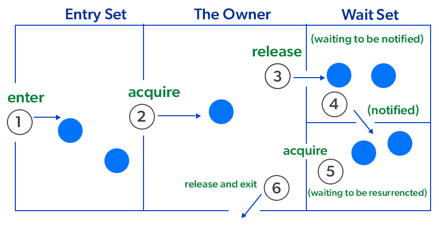

The point to point explanation of the above diagram as follows:

1. **Threads try to acquire the object lock.**
2. One thread enters the synchronized method and acquires the lock.
3. If the thread calls `wait()`:

   * It **releases the lock**
   * Moves to **WAITING** state
4. When another thread calls `notify()` / `notifyAll()`:

   * Waiting thread moves to **RUNNABLE (Notified)** state
5. Thread again tries to acquire the lock

   * Only then it continues execution
6. After `run()` completes, the thread releases the lock and exits monitor.

### Why Inter-Thread Communication?

To allow threads to **coordinate** when they depend on each other.

Examples:
* Producer thread waits for space to produce
* Consumer thread waits for items to consume
* One thread waits while another completes a task

ITC helps achieve:
* Efficient waiting (no CPU wastage)
* Proper sequencing of tasks
* Smooth cooperation between threads

### **Methods Used for ITC**

**1. `wait()`**

* Causes the calling thread to **release the lock** and **enter waiting state**.
* It waits until another thread calls `notify()` or `notifyAll()` on the **same object**.

**2. `notify()`**

* Wakes **one** waiting thread (chosen randomly) that is waiting on the same object's monitor.

**3. `notifyAll()`**

* Wakes **all** waiting threads on that object.
* Only one will acquire the lock first and continue.

### Important Rules

* Must be used **inside synchronized block or method**.
* Thread must hold the object’s **monitor lock** to call them.
* These methods are for **communication**, not locking.

Example:

```java
synchronized(obj) {
    obj.wait();
}
```

### How It Works

| Scenario                | Action                       |
| ----------------------- | ---------------------------- |
| Producer produces value | Consumer must wait           |
| Consumer consumes value | Producer must wait           |
| `wait()` used           | Thread releases lock & waits |
| `notify()`              | Wakes a waiting thread       |
| `notifyAll()`           | Wakes all waiting threads    |

### Purpose of Inter-Thread Communication

* Avoid **polling** (busy-loop checking)
* Save **CPU time**
* Proper **synchronization** between dependent threads
* Create coordinated workflows

---
* ITC helps threads **cooperate** using `wait()`, `notify()`, and `notifyAll()`.
* Must be used in **synchronized** context.
* Designed to avoid unnecessary CPU usage and ensure proper communication.
* Essential for producer-consumer, task pipelines, and sequential multithreading.

## 58. API (Application Programming Interface)
It is a document that contains description of all the features of a product or software. It represents classes and interfaces that software programs can follow to communicate with each other. An API can be created for applications, libraries, operating systems, etc.

> 📝: An API is a set of routines, protocols, and tools for building software applications.
An API expresses a software component in terms of its operations, inputs, outputs, and underlying types.

Java API is a list of all classes that are part of the JDK. It includes all Java packages, classes, and interfaces, laong with their methods, fields and constructors. These pre-written classes provide a tremendous amount of functionality to a programmer.

APIs, or Application Programming Interfaces, are the invisible backbone of modern software development. They enable different applications, platforms, or systems to communicate and exchange data seamlessly, powering everything from your weather app to your favorite e-commerce checkout.

Imagine you’re at a restaurant:

- You (the client) place an order with the waiter.
- The waiter (the API) conveys your request to the chef (the server).
- The chef prepares the food (processes the request) and gives it to the waiter.
- The waiter delivers it back to your table (response).

This is exactly how APIs work in software the API takes a request, sends it to the server, retrieves the data, and returns the response.


### Why Do We Need APIs?
APIs are critical to building scalable, flexible, and connected systems. Here’s why developers rely on them:

- **Reusability**: Avoid reinventing the wheel by leveraging existing APIs (e.g., Google Maps API, Stripe Payments API).
- **Efficiency**: Save development time by integrating ready made functionalities.
- **Scalability**: Enable modular, distributed systems that can grow easily.
- **Integration**: Connect multiple platforms web, mobile, IoT, or analytics.
- **Automation**: APIs allow machines to talk to machines without manual input.

Example:
If you want to show weather updates in your app, instead of building a weather system, you can simply use the `OpenWeatherMap API` to fetch the data instantly.

### How Do APIs Work?
APIs operate through a request response cycle between a client and a server

- **Request**: The client sends a request to an API endpoint (URI).
- **Processing**: The API forwards the request to the server.
- **Response**: The server processes and sends back the requested data.
- **Delivery**: The API returns the server’s response to the client.

This communication happens over the HTTP/HTTPS protocol, with additional security via headers, tokens, or cookies.

### Types of API Architectures:
1. **REST (Representational State Transfer) :**
    - A simple, flexible API architecture that uses HTTP methods (GET, POST, PUT, DELETE) for communication.
    - Data Format: JSON, XML.

2. **SOAP (Simple Object Access Protocol) :**
    - A more rigid protocol that requires XML based messaging for communication. Strict and secure protocol using XML for structured messaging.
    - Data Format: XML

3. **GraphQL:**
    - Modern query language that lets clients fetch only the data they need.
    - Data Format: JSON

4. **gRPC:**
    - High performance framework using Protocol Buffers (Protobuf).
    - Data Format: Binary

#### What are REST APIs?
REST stands for **Representational State Transfer**, and follows the constraints of REST architecture allowing interaction with RESTful web services. It defines a set of functions (GET, PUT, POST, DELETE) that clients use to access server data. The functions used are:

- GET (retrieve a record)
- PUT (update a record)
- POST (create a record)
- DELETE (delete the record)

Its main feature is that REST API is stateless, i.e., the servers do not save clients' data between requests.

### API Integration
API Integration connects two or more systems so they can exchange data automatically.
For example:
- Connecting your e-commerce store to a payment gateway (Stripe API).
- Syncing CRM software (like Salesforce) with a marketing platform.

In today’s cloud driven ecosystem, API integrations are the backbone of automation and interoperability.

### Advantages of APIs
- **Efficiency**: Enable faster development using reusable components.
- **Integration**: Seamlessly connect different systems and services.
- **Automation**: Reduce manual effort by automating workflows.
- **Scalability**: Simplify distributed and modular system design.
- **Innovation**: Unlock new functionalities and integrations.

### Disadvantages of APIs
- **High Cost**: Developing and maintaining APIs requires expertise.
- **Security Risks**: Exposed endpoints can be vulnerable to attacks.
- **Versioning Challenges**: Managing updates without breaking compatibility.
- **Dependency Risk**: Relying on third-party APIs introduces failure points.

## 59. JDBC (Java Database Connectivity)
JDBC (Java Database Connectivity) is an application programming interface (API) for the programming language Java, which defines how a client may access a database. It is a Java-based access technology used for Java Databse Connectivity.

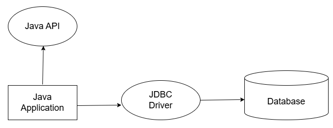

Java JDBC is a Java API to connect and execute query with the database. JDBC API uses JDBC Drivers to connect with the database.
We can use JDBC API to access tabular data stored into any relational database.

### Features of JDBC
- **Platform Independent**: Write once, run anywhere (Java-based).
- **Database Independent**: Works with any relational database using drivers.
- **Standard API**: Provides a standard set of interfaces (Connection, Statement, ResultSet, etc.).
- **Secure**: Uses Java security model and exception handling.
- **Easy to Use**: Simplifies database connectivity with simple method calls.
- **Supports SQL**: Can execute SQL queries directly from Java code.

❓: **Why should we use JDBC?**

▶ We can use JDBC API to handle database using Java programs and can perform following activities:
1. Connect to the database.
2. Execute queries and update statements to the database.
3. Retrieve the result recieved from the database.

###  JDBC Architecture
JDBC Architecture defines how Java applications interact with databases through drivers using a standard API.


JDBC architecture consists of two main layers
1. **JDBC API** (Application Layer)
    - Provides Java applications with the interface to interact with databases.
    - Contains classes and interfaces in the java.sql and javax.sql packages.
    - Example interfaces: Connection, Statement, PreparedStatement, ResultSet.

2. **JDBC Driver API** (Driver Layer)
    - Acts as a bridge between JDBC API calls and the actual database.
    - Converts Java method calls into database-specific calls.

### JDBC Classes and Interfaces
Java Database Connectivity (JDBC) is a Java API that enables communication between a Java application and a database. It provides a standard set of classes and interfaces to interact with different database systems. Establishing database connectivity is essential for applications that require data storage and retrieval.

Some popular interfaces of JDBC API are listed below:
- **Driver interface**: Handles communication between Java application and the database.
- **Connection interface**: Represents a session/connection with a specific database.
- **Statement interface**: Used to execute simple SQL queries without parameters.
- **PreparedStatement interface**: Used to execute precompiled parameterized SQL queries.
- **CallableStatement interface**: Used to call stored procedures in the database.
- **ResultSet interface**: Represents the data retrieved from a SELECT query.
- **ResultSetMetaData interface**: Provides information about columns of a ResultSet.
- **DatabaseMetaData interface**: Provides information about the database (tables, drivers, etc.).
- **RowSet interface**: A scrollable and updatable version of ResultSet.

Some important Classes of JDBC API are listed below:
- **DriverManager class**: Manages and loads database drivers to establish connections.
- **Blob class**: Represents binary large objects (e.g., images, audio, video).
- **Clob class**: Represents character large objects (e.g., text files, large strings).
- **Types class**: Defines constants for SQL data types.

### DB Connectivity Steps
There are 5 steps to connect any Java application with the database using JDBC:

#### Step 1: Register the Driver Class
The `forName()` method of `Class` class is used to register the driver class. This method is used to dynamically load the driver class.

Syntax of `forName()` :
```java
public static void forName(String className) throws ClassNotFoundException;
```
Example:
```java
// Register the driver class
Class.forName("com.mysql.jdbc.Driver");
```
When you call `Class.forName(String className)`, following happens:
'A call to `forName("X")` causes the class named `X` to be initialized'. where initialization involves code in static block to be executed.

- `Class.forName()` actually loads a given Java class in JVM, it has to exist in your classpath for the same.
- when you load a JDBC driver class that way, driver would have same JDBC specific settings to be executed as a very first step of Java Database Access Logic, it is also known as **driver registration**.
- To do so each and every Driver Class has one STATIC code block where such logic register a driver in current JVM is executed.
- Static code blocks are executed automatically the moment the driver class is loaded into JVM memory (during class initialization).
- Hence, it is important to register the driver class before actually connecting to the database.

> 📝: Since JDBC 4.0 (Java 6+), drivers are auto-loaded if present in the classpath, so manual loading is usually unnecessary.

#### Step 2: Create the `Connection` object
The `getConnection()` method of `DriverManager` class is used to establish connection with the database.

Syntax for `getConnection()` :
```java
public static Connection getConnection(String url, String name, String password) throws SQLException
```

Example:
```java
// Establish a connection to the database
Connection con = null;
con = DriverManager.getConnection("jdbc:mysql://localhost:3306/ATM", "root", "");
```
In the above example, we are creating a connection to a MySQL database running on the local machine. The URL specifies the protocol ("`jdbc:mysql://`"), the hostname ("`localhost`"), the port number (`3306`), and the database name ("ATM").

The `DriverManager.getConnection()` method establishes the connection based on the provided URL, username, and password. If the connection is successful, a connection object named "con" is created.

Ensure that the necessary JDBC driver JAR file is available in the project's classpath. Different databases require different JDBC drivers, so make sure to include the appropriate driver for the specific database system.

Once the connection is established, proceed to the next steps of creating statements, executing queries, and interacting with the database.

#### Step 3: Create the `Statement` object
The `createStatement()` method of `Connection` interface is used to create statement. The object of statement is responsible to execute queries with the database.

Syntax of `createStatement()` method:
```java
public Statement createStatement() throws SQLException
```
Example:
```java
// Create a Statement object
Statement stmt = con.createStatement();
```
In the above example, the `createStatement()` method is called on the connection object to create a `Statement` object named stmt. This statement object acts as a channel for sending SQL commands to the database.

Execute queries, retrieve results, and perform database operations with the statement object created. The statement object offers methods such as executeQuery() to execute SELECT queries and executeUpdate() for other types of queries that modify the data.

Remember to handle exceptions that may occur during the execution of statements, using try-catch blocks or throwing the exceptions as needed.

> 📝: In real-world application, it is recommended to use `PreparedStatement` or `CallableStatement` instead of `Statement` for executing SQL queries.

#### Step 4: Execute the query
The `executeQuery()` method of `Statement` interface is used to execute queries to the database. This method returns the object of `ResultSet` that can be used to get all the records of a table.

Syntax of `executeQuery()`:
```java
public ResultSet executeQuery(String sql) throws SQLException
```

Example:
```java
// Execute a SELECT query 
String query = "SELECT * from emp";
ResultSet rs = stmt.executeQuery(query);

// Process the results
while(rs.next()){
    // Retrieve data from the result set
    int age = rs.getInt("age");
    String name = rs.getString("name");

    // Do something with the retrived data
    System.out.println("Name: " + name + "Age: " + age );

    // alternate way: 
    //System.out.println(rs.getInt(1) + " " + rs.getString(2)); 
}
```
In the above example, we are executing a SELECT query to retrieve data from a table named "emp". The `executeQuery()` method is called on the statement object with the SQL query as the parameter. It returns a `ResultSet` object named `rs` that holds the result of the query.

We can then iterate over the `rs` using the `next()` method to access each row of the result. Using the appropriate getter methods (`getString()`, `getInt()`, etc.), we can retrieve the values of specific columns from the current row. In this example, we retrieve the "name" and "age" columns and print them.

Remember to handle any exceptions that may occur during query execution or result processing.

By executing queries, companies can retrieve data from the database and perform various operations on it. JDBC provides flexibility in working with different types of queries, allowing developers to interact with the database effectively.

#### Step 5: Close the `Connection` object
After executing the queries and processing the results, it is important to close the database connection to release the resources and ensure proper cleanup. Closing the connection is necessary to free up system resources, close any open database connections, and avoid potential memory leaks.

By closing `Connection` object statement and `ResultStatement` will be closed automatically. The `close()`method of `Connection` interface is used to close the connection.

Syntax of `close()`:
```java
public void close() throws SQLException
```

Example:
```java
// Close the connection and release resources
rs.close();
stmt.close();
con.close();
```
In the example above, the `close()` method is called on the `rs`, `stmt`, and `con` objects in that order. When you close the ResultSet, Statement, and Connection objects in the opposite order of how they were created, you make sure that all of the resources they use are released correctly.

If someone retrieved data from the database, they need to close the Result Set object. It is important to close the Statement object so that any database locks and resources tied to executing statements can be released. Lastly, closing the Connection object makes sure that the database connection is closed, which frees up system resources.

Ensuring the orderly termination of a database connection is a critical aspect of effective database management and good programming practice, particularly in a Java-based application utilizing the JDBC API. The explicit closure of a database connection, even if the application's lifecycle is nearing its conclusion, guarantees the proper release of system resources, thereby avoiding potential memory leaks or resource saturation.

Additionally, closing connections diligently helps maintain an efficient connection pool. Connection pooling is a well-known strategy to manage the number of open connections to a database, enhancing the overall performance and scalability of the application. By effectively closing connections when they are no longer needed, the application prevents unnecessary resource usage and ensures that connections are readily available in the pool for future database interactions.

With the advent of Java 7, the introduction of the try-with-resources construct has considerably streamlined the handling of resources such as Connection, ResultSet, and Statement in JDBC.

In this approach, the resource is declared in the try statement itself, which ensures that the resource is always closed at the end of the statement, whether the try block executes successfully or an exception is thrown. This greatly simplifies the task of resource management, and eliminates the need for explicit invocation of the close() method in a finally block.

This construct ensures the correct closure of resources and adds an additional layer of resilience to the application. Incase of an exception or error, it guarantees the safe and orderly termination of the resource, thereby mitigating the risk of resource leakage or saturation.

> 📝: It is recommended to use try-with-resources to automatically close resource like Connection, Statement and ResultSet.

### Establishing JDBC Connection

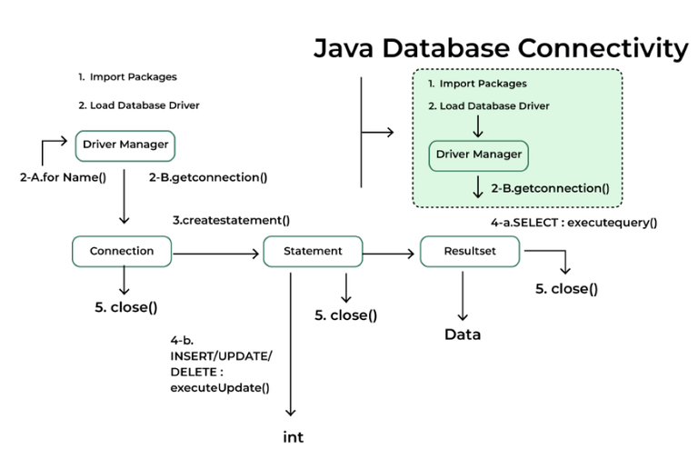

To perform database operations using JDBC, follow these standard steps:

1. **Import JDBC package**: Include `java.sql` classes for database operations.
2. **Load and register driver**: Load the JDBC driver class to enable communication using `forname()` method
3. **Establish connection**: Use `DriverManager` to connect to the database.
4. **Create statement**: Create `Statement` or `PreparedStatement` to send SQL queries.
5. **Execute query**: Run SQL commands like SELECT, INSERT, UPDATE or DELETE using `executeQuery()`, `executeUpdate()`, or `execute()` methods of `Statement` / `PreparedStatement`.
6. **Process results**: Retrieve and handle data from `ResultSet`.
7. **Close resources**: Release database connections and objects.

```java
import java.sql.*;

public class JDBCDemo {
    public static void main(String[] args) {
        String url = "jdbc:mysql://localhost:3306/school";
        String user = "root";
        String password = "your_password";

        try {
            // 1. Load Driver (Optional for newer JDBC versions)
            Class.forName("com.mysql.cj.jdbc.Driver");

            // 2. Establish Connection
            Connection con = DriverManager.getConnection(url, user, password);

            // 3. Create Statement
            Statement stmt = con.createStatement();

            // 4. Execute Query
            ResultSet rs = stmt.executeQuery("SELECT * FROM students");

            // 5. Process Results
            while (rs.next()) {
                System.out.println(rs.getInt("id") + " " + rs.getString("name") + " " + rs.getInt("age"));
            }

            // 6. Close resources
            rs.close();
            stmt.close();
            con.close();
        } catch (Exception e) {
            e.printStackTrace();
        }
    }
}
```

### Prerequisites for MySQL JDBC Connection
Before writing JDBC code, make sure you have:

1. Database Installed and Running:
- Install a relational database (e.g., PostgreSQL, MySQL).
- Create a database and a user.

2. JDBC Driver (Connector JAR):
- JDBC requires a driver to connect with the database.
- Download the JAR or add Maven dependency.

### Crud Operation with JDBC
CRUD stands for Create, Read, Update, Delete, which are the four basic operations performed on a database using JDBC.

- **Create**: Used to insert new records into the database (INSERT query).
- **Read**: Used to fetch records from the database (SELECT query).
- **Update**: Used to modify existing records in the database (UPDATE query).
- **Delete**: Used to remove records from the database (DELETE query).

### JDBC Exception Handling
When we communicate  with databases,some problems occur like:

- Invalid SQL syntax bad query
- Connection time out problem 
- Wrong data types mentioned
- miss  database drivers

To handle these issues gracefully, JDBC provides exception handling mechanisms

Example:
```java
catch (SQLException e) {
    System.out.println("Error: " + e.getMessage());
    System.out.println("SQL State: " + e.getSQLState());
    System.out.println("Error Code: " + e.getErrorCode());
}
```

### Transactions in JDBC
A transaction is a sequence of SQL operations that are executed as a single unit of work. Transactions help maintain data consistency and integrity in applications. By default, JDBC runs in auto-commit mode (each SQL statement is committed immediately). To manage transactions manually:

- `setAutoCommit(false)`: disables auto-commit.
- `commit()`: permanently saves changes.
- `rollback()`: undoes changes since last commit.

Example:
```java
con.setAutoCommit(false);

PreparedStatement ps1 = con.prepareStatement("UPDATE accounts SET balance=balance-100 WHERE id=1");
PreparedStatement ps2 = con.prepareStatement("UPDATE accounts SET balance=balance+100 WHERE id=2");

ps1.executeUpdate();
ps2.executeUpdate();

con.commit();  // commit if both succeed
con.rollback(); // rollback if error
```

## 60. DriverManager Class
The `DriverManager` Class acts as an interface between user and drivers. It keeps track of the drivers that are available and handles establishing a connection between a database and the appropriate driver. The `DriverManager` class maintained a list of driver classes that have registered themselves by calling the method `DriverManager.registerDriver()`.
```java
public static Connection getConnection(String url);
```
method of `DriverManager` class is used to establish the connection with the specified url.

`DriverManager` is a core JDBC class used to **manage JDBC drivers** and **establish database connections**. It works as a mediator between the Java application and the database drivers.

### **Purpose of DriverManager**

* Maintains a **list of registered JDBC drivers**
* Selects the **appropriate driver** based on the database URL
* Establishes a **connection** with the target database
* Provides **logging/tracing** support for debugging

### **Driver Registration**

JDBC drivers register themselves automatically when their class is loaded into the JVM.

This happens inside the driver’s **static block**:

```java
static {
    DriverManager.registerDriver(new com.mysql.jdbc.Driver());
}
```

#### JDBC 4.0+ (Java 6 onwards)

Manual registration using `Class.forName()` is **usually NOT required** because drivers auto-register using:

```
META-INF/services/java.sql.Driver
```

Still, you may see this in old code:

```java
Class.forName("com.mysql.jdbc.Driver"); // optional in modern apps
```

### **Establishing a Connection**

`DriverManager` provides overloaded `getConnection()` methods:

```java
public static Connection getConnection(String url);
public static Connection getConnection(String url, String user, String password);
public static Connection getConnection(String url, Properties info);
```

Example:

```java
Connection con = DriverManager.getConnection(
    "jdbc:mysql://localhost:3306/ATM", "root", ""
);
```

- ✔ Returns a `Connection` object
- ✔ Chooses the appropriate driver based on URL prefix (e.g., `jdbc:mysql://`)
- ✔ Throws `SQLException` if connection fails

### **Login Timeout (Useful in Real Apps)**

```java
DriverManager.setLoginTimeout(10); // seconds
```

Sets max waiting time for establishing a DB connection.

### **Logging**

```java
DriverManager.println("Connection attempt started...");
```

Used mostly for debugging JDBC operations.

### **DriverManager vs DataSource**

| DriverManager                                | DataSource                      |
| -------------------------------------------- | ------------------------------- |
| Simple, easy to use                          | Used in enterprise applications |
| No connection pooling                        | Supports connection pooling     |
| Every call creates new connection → **slow** | Reuses connections → **fast**   |
| Suitable for small apps/testing              | Preferred for production        |

> 📝 **DataSource is recommended** for real-world applications because it improves performance and scalability.

---

**Summary**
* `DriverManager` loads and manages JDBC drivers.
* Provides multiple `getConnection()` methods to create DB connections.
* Since JDBC 4.0, drivers auto-register (manual `Class.forName()` rarely needed).
* `DataSource` is preferred over `DriverManager` in enterprise applications.

## 61. Connection interface
The **`Connection`** interface represents a **session** between a Java application and a database.
Once a connection is created, SQL queries can be executed, transactions can be managed, and database metadata can be accessed.

A `Connection` object acts as a **factory** for:
* `Statement`
* `PreparedStatement`
* `CallableStatement`
* `DatabaseMetaData`

A `Connection` is obtained using:
```java
Connection con = DriverManager.getConnection(url, user, password);
```
> 📝 **By default, a Connection is in auto-commit mode**, meaning each SQL statement is committed immediately after execution.

> To perform manual transaction control, auto-commit must be set to **false**.

### Connection URL Format

Every DB vendor has a specific URL format.

**General format:**
```java
jdbc:subprotocol:subname
```

**Example for MySQL:**
```java
jdbc:mysql://hostname:port/dbname

jdbc:mysql://localhost:3306/dbname
```

### Responsibilities of the Connection Interface

A `Connection` object is responsible for:
1. Establish communication with the database
2. Creating statement objects (`Statement`, `PreparedStatement`, `CallableStatement`)
3. Managing database transactions (`commit()`, `rollback()`, `setAutoCommit()`)
4. Provide metadata about database/schema (`DatabaseMetaData`)
5. Managing session-level settings (isolation level, read-only mode)
6. Release database resources when closed

### What Happens When a Connection is Created

A Connection object:
- User authentication occurs
- A session is created on the database server
- Isolation level and auto-commit settings are initialized
- Memory/resources are allocated

❓: **Does closing a Connection close its Statements and ResultSets?** 
▶ Yes. Closing a Connection **automatically closes all** Statements and ResultSets created from it.

> Direct connections are slow. Real apps use **DataSource with connection pooling** (HikariCP, Apache DBCP).
For enterprise applications, `Connection` objects are usually obtained from a connection pool (DataSource), not from `DriverManager`.

### Connection Methods

**1. Create Statement Objects**

```java
Statement createStatement()
Statement createStatement(int resultSetType, int resultSetConcurrency)
PreparedStatement prepareStatement(String sql)
CallableStatement prepareCall(String sql)
```
These methods create different types of SQL-executing objects.

**2. Transaction Management**

```java
void setAutoCommit(boolean autoCommit)
void commit()
void rollback() // drops all changes made since the previous commit/rollback
```

* **Auto-commit (default: true)** means each query runs as a separate transaction.
* Turning auto-commit **OFF** allows grouping multiple queries into one transaction.

**3. Savepoint Management**

Connections support savepoints.
```java
Savepoint setSavepoint()
Savepoint setSavepoint(String name)
void rollback(Savepoint savepoint)
void releaseSavepoint(Savepoint savepoint)
```
Useful for partial rollbacks within a transaction.

**4. Isolation Levels (Prevent Dirty Reads, etc.)**

```java
void setTransactionIsolation(int level) // Sets transaction isolation level.
int getTransactionIsolation() // Returns current isolation level.
```

JDBC Levels:
* `TRANSACTION_NONE`
* `TRANSACTION_READ_UNCOMMITTED`
* `TRANSACTION_READ_COMMITTED`
* `TRANSACTION_REPEATABLE_READ`
* `TRANSACTION_SERIALIZABLE` (highest)

> Used to prevent issues like dirty read, non-repeatable read, phantom read.

**5. Metadata Access**

```java
DatabaseMetaData getMetaData()
```

Used to get information about:

* Tables
* Columns
* Primary keys
* Drivers
* DB capabilities

**6. Connection Close**

```java
void close()
boolean isClosed()
```

Releases:
- Database session
- JDBC resources
- All Statements & ResultSets created by this connection

**7. Other Useful Methods**

```java
boolean isReadOnly()
void setReadOnly(boolean readOnly)

String getCatalog()
void setCatalog(String catalog)

void setHoldability(int holdability)
int getHoldability()
```
---

* `Connection` is the central object for interacting with a database.
* Used to create SQL statements and manage transactions.
* Supports rollback, commit, savepoints, and isolation levels.
* Must be **closed** after use (or use try-with-resources).

> 📝: A Connection is **expensive** to create
That’s why **Connection Pooling** (`DataSource`) is used in real applications.

📝: Connection should always be closed.
Even inside a `finally` block or using **try-with-resources**:
```java
try (Connection con = DriverManager.getConnection(url, user, pass)) {
    // DB operations
}
```

> 📝: **One connection → many statements** 
You do NOT need a new connection for every query.

## 62. Statement interface
The `Statement` interface is used to execute static SQL queries (queries without parameters).
It acts as a factory for `ResultSet`, meaning it returns `ResultSet` objects for SELECT queries.

A `Statement` object is created using a `Connection`:
```java
Statement stmt = con.createStatement();
```
### Responsibilities of Statement

* Executing SQL queries (SELECT, INSERT, UPDATE, DELETE)
* Returning results (`ResultSet`)
* Executing DDL commands (CREATE, DROP, ALTER)
* Supporting batch execution
* Providing simple SQL execution without parameters

> 📝 **Statement is NOT safe for user input**.
Because it uses string concatenation → **SQL Injection risk** (PreparedStatement solves this.)

### **Methods of Statement Interface** 

**1. `executeQuery(String sql)`** 

Executes **SELECT** queries only.
Returns a `ResultSet`.

```java
ResultSet rs = stmt.executeQuery("SELECT * FROM employees");
```

**2. `executeUpdate(String sql)`**

Executes **INSERT, UPDATE, DELETE**, and **DDL** statements.
Returns an integer → number of rows affected.

```java
int rows = stmt.executeUpdate("DELETE FROM emp WHERE id = 5");
```

**3. `execute(String sql)`** 

Executes **any** SQL statement (useful when you don’t know the type of result).

Returns:

* **true** → query returned a ResultSet
* **false** → query returned an update count

```java
boolean result = stmt.execute("CREATE TABLE test(id INT)");
```

**4. `addBatch()` & `executeBatch()`** 

Used to execute a batch of SQL commands.

```java
stmt.addBatch("INSERT INTO emp VALUES(1,'Asha')");
stmt.addBatch("INSERT INTO emp VALUES(2,'Ankita')");
int[] results = stmt.executeBatch();
```

> ✔ Improves performance by reducing round trips to the database.

### Limitations of Statement

* **Not parameterized** → prone to **SQL Injection**
* Slower performance when executing repeated queries
* Requires creating SQL strings manually
* Harder to maintain and debug

> 📝 **Because of these limitations, `PreparedStatement` is preferred over `Statement` in real-world applications.**

```java
import java.sql.*;

class FetchRecord {
    public static void main(String... args) throws Exception {

        Class.forName("com.mysql.jdbc.Driver");
        Connection con = DriverManager.getConnection(
            "jdbc:mysql://localhost:3306/PROJECT_NAME",
            "root", ""
        );

        Statement stmt = con.createStatement();

        // Example: DELETE query
        int result = stmt.executeUpdate("DELETE FROM emp75 WHERE id = 13");
        System.out.println(result + " record(s) affected.");

        con.close();  // closes Statement & ResultSet automatically
    }
}
```

* `Statement` → used for static SQL
* `executeQuery()` → SELECT only
* `executeUpdate()` → DML + DDL
* `execute()` → returns true/false
* `executeBatch()` → multiple commands
* Not safe for user input → use PreparedStatement
* Closing Connection closes Statement automatically
- Statement is used for executing **simple (non-parameterized)** SQL.
- Provides methods to run queries and receive results.
- Vulnerable to SQL Injection → not ideal for dynamic input.
- `PreparedStatement` is preferred for security and performance.

## 63. ResultSet Interface
The **`ResultSet`** interface represents the result of a **SELECT** query in JDBC. It provides methods to iterate through rows and retrieve column values.

Whenever we execute:
```java
ResultSet rs = stmt.executeQuery("SELECT * FROM table");
```
the database returns the rows inside a `ResultSet` object.

A `ResultSet` object is returned by:
```java
Statement.executeQuery()
PreparedStatement.executeQuery()
CallableStatement.executeQuery()
```

### What is ResultSet?
- A `ResultSet` contains **tabular data** returned by the database.
- It is a **cursor** that points to rows returned by a database query.
- Cursor initially points **before the first row**.
- You use `next()` to move to the next row.
- Data is accessed via **getXxx()** methods (`getInt()`, `getString()`, etc.).

### Cursor Movement in ResultSet

**Default behavior**: Forward-only, read-only cursor.

```java
rs.next();     // moves to next row  
rs.previous(); // only if scrollable ResultSet  
rs.first();  
rs.last();  
rs.absolute(5); // moves to 5th row  
```

These require **scrollable ResultSet**:

```java
Statement stmt = con.createStatement(
     ResultSet.TYPE_SCROLL_INSENSITIVE,
     ResultSet.CONCUR_READ_ONLY
);
```

### **Types of ResultSet**

**1. Based on Cursor Movement**
| Type                      | Meaning                                        |
| ------------------------- | ---------------------------------------------- |
| `TYPE_FORWARD_ONLY`       | moves only forward                             |
| `TYPE_SCROLL_INSENSITIVE` | scrollable cursor; does NOT reflect DB changes |
| `TYPE_SCROLL_SENSITIVE`   | scrollable cursor; DOES reflect DB changes     |

**2. Based on Concurrency**
| Constant           | Description                                    |
| ------------------ | ---------------------------------------------- |
| `CONCUR_READ_ONLY` | ResultSet is read-only                         |
| `CONCUR_UPDATABLE` | Allows modifying DB directly through ResultSet |

Example:

```java
Statement stmt = con.createStatement(
    ResultSet.TYPE_SCROLL_SENSITIVE,
    ResultSet.CONCUR_UPDATABLE
);
```

### **ResultSet Methods**

**1. Cursor Navigation Methods**

```java
boolean next()
boolean previous()
boolean first()
boolean last()
boolean absolute(int row)
boolean relative(int rows)
int getRow()
```

**2. Data Retrieval Methods (getXxx)**

```java
int getInt(int columnIndex)
int getInt(String columnLabel)

String getString(int columnIndex)
String getString(String columnLabel)

double getDouble()
float getFloat()
boolean getBoolean()
Date getDate()
```

Columns can be fetched using **index** (1-based) or **column name**.

**3. Update Methods (updatable ResultSet)**

```java
updateInt()
updateString()
updateRow()
insertRow()
deleteRow()
```

**4. Metadata Methods**

```java
ResultSetMetaData getMetaData()
```

This allows reading:

* number of columns
* column names
* column types

---

### Basic ResultSet Usage

```java
Statement stmt = con.createStatement();
ResultSet rs = stmt.executeQuery("SELECT id, name, salary FROM emp");

while(rs.next()) {
    int id = rs.getInt("id");
    String name = rs.getString("name");
    int salary = rs.getInt("salary");

    System.out.println(id + " | " + name + " | " + salary);
}
```

### ResultSet Key Points
* Column indexing starts from **1**, not 0.
* Always close `ResultSet` after use (or rely on try-with-resources).
* Closing a `Connection` closes its `Statement` and `ResultSet` automatically.
* Use column names for readability, but indexes are faster.
* ResultSet points *before* the first row until `next()` is called.

### **Limitations of ResultSet**

* Not thread-safe
* Cannot move backward unless scrollable
* Updatable ResultSet support depends on the driver
* Large results may consume memory

---
* `next()` → moves cursor to next row (returns false at end)
* Two ways to retrieve data: by index or column label
* Default ResultSet = **forward-only + read-only**
* You can make it scrollable using: `createStatement(type, concurrency)`
* Updatable ResultSet supports `updateRow()`, `insertRow()`, `deleteRow()`
* `ResultSetMetaData` used to get structure information
* Cursor starts **before first row**
- `ResultSet` is used to fetch and navigate data returned by SELECT queries.
- Provides cursor movement and **getXxx()** methods.
- `absolute()`, `relative()`, `previous()` → work only on scrollable ResultSet.
- Supports forward-only, scrollable, read-only, or updatable modes.
- Must be closed properly to release DB resources.
- Closing Connection automatically closes ResultSet & Statement.

## 64. PreparedStatement Interface

The **`PreparedStatement`** interface is a sub-interface of `Statement` used to execute **parameterized**, **precompiled**, and **secure** SQL queries.

A `PreparedStatement` improves:
* **Performance** → SQL is compiled once and reused.
* **Security** → Prevents **SQL Injection**.
* **Readability** → No string concatenation.
* **Maintainability** → Parameters are set using setter methods.

### What is a Parameterized Query?

```sql
INSERT INTO emp VALUES (?, ?, ?)
```

Each **?** is a placeholder whose value is provided at runtime using setter methods such as:

```java
ps.setInt(1, 101);
ps.setString(2, "Asha");
ps.setDouble(3, 55000);
```

❓: **Why Use PreparedStatement?**
▶ Improves Performance: The performance of the application will be faster if you use `PreparedStatement` interface because query is compiled only once.

| Feature            | Statement                 | PreparedStatement |
| ------------------ | ------------------------- | ----------------- |
| SQL Precompilation | ❌ No                      | ✔ Yes             |
| Security           | ❌ SQL Injection risk      | ✔ Safe            |
| Performance        | Slow for repeated queries | Fast & cached     |
| Parameters         | ❌ String concatenation    | ✔ Setter methods  |
| Readability        | Low                       | High              |

❓: **How to Obtain a PreparedStatement?**

Use `Connection.prepareStatement()`:

```java
PreparedStatement ps = con.prepareStatement("INSERT INTO emp VALUES (?, ?, ?)");
```

### Methods of PreparedStatement Interface

**1. Setter Methods (setXxx)**

Used to bind values to parameters (`?` placeholders):

```java
ps.setInt(1, 101);
ps.setString(2, "Asha");
ps.setDouble(3, 50000.50);
ps.setDate(4, new java.sql.Date(System.currentTimeMillis()));
```

Common methods:

```java
setInt()
setString()
setDouble()
setFloat()
setBoolean()
setDate()
setLong()
setObject()
```

**2. Execution Methods**

```java
int executeUpdate()       // For INSERT, UPDATE, DELETE
ResultSet executeQuery()  // For SELECT
boolean execute()         // For any SQL query
```

Examples:

```java
int rows = ps.executeUpdate();
ResultSet rs = ps.executeQuery();
```

**3. Batch Methods**

PreparedStatements fully support batch execution:

```java
ps.addBatch();
int[] results = ps.executeBatch();
```

Efficient for bulk inserts.

**4. Clear Parameter Methods**

```java
ps.clearParameters();
```

Resets all `?` values (useful in loops).

### Advantages of PreparedStatement

1. Precompiled SQL → Faster Execution
2. Prevents SQL Injection
3. Cleaner Code (no string concatenation)
4. Reusability
5. Supports batch updates
6. Automatically escapes special characters

### Limitations of PreparedStatement

* SQL cannot be changed dynamically (only parameters can).
* Not suited for building dynamic table/column names.
* Need a new PreparedStatement for each SQL structure.

---
* `PreparedStatement` is used for **parameterized SQL**.
* Prevents **SQL Injection**.
* Query compiled only once → **high performance**.
* Use `setXxx()` methods to bind values.
* `executeQuery()` → SELECT
* `executeUpdate()` → INSERT/UPDATE/DELETE
* Preferred over `Statement` for real applications.

### CRUD Operations Using PreparedStatement
Let's create a table as given below:
```sql
CREATE TABLE emp(
    id NUMBER(10),
    name VARCHAR2(50),
    salary NUMBER(10)
);
```

**1. insert records**
```java
import java.sql.*;

class InsertPrepared{
    public static void main(String... args){
        try{
            // Load and register Oracle JDBC driver
            Class.forName("oracle.jdbc.driver.OracleDriver");

            // Create Connection object
            Connection con = DriverManager.getConnection("jdbc:oracle:thin:@localhost:1521:xe", "system", "oracle");

            /* 
               PreparedStatement with parameter placeholders (?)
               SQL is precompiled → faster execution.
            */
            PreparedStatement stmt = con.prepareStatement("insert into emp values(?, ?, ?)");

            // Setting values for each ? parameter
            stmt.setInt(1, 101);          // 1 → first ?
            stmt.setString(2, "Shaurya"); // 2 → second ?
            stmt.setFloat(3, 55000);      // 3 → salary column

            int i = stmt.executeUpdate(); // Executes INSERT statement
            System.out.println(i + " records inserted.");

            con.close(); // Always close connection
        } catch(Exception e) {
            System.out.println(e);
        }
    }
}
```
- SQL is compiled once → reused by DB → **high performance**
- `?` placeholders prevent SQL injection
- `executeUpdate()` → used for INSERT/UPDATE/DELETE

**2. update record**
```java
PreparedStatement stmt = con.prepareStatement("update emp set name=? where id=?");
stmt.setString(1, "Dhairya"); // new name
stmt.setInt(2, 101);           // WHERE id = ?
int i = stmt.executeUpdate();
System.out.println(i + " records updated.");
```
- Order of `?` matters.
- Changing **only values**, not SQL structure → prepared statements are reusable.

**3. delete record**
```java
PreparedStatement stmt = con.prepareStatement("delete from emp where id=?");
stmt.setInt(1, 101);
int i = stmt.executeUpdate();
System.out.println(i + " records deleted.");
```
Use DELETE with conditions; always avoid deleting without WHERE.

**4. retrieve record**
```java
PreparedStatement stmt = con.prepareStatement("select * from emp");
ResultSet rs = stmt.executeQuery();
while(rs.next()){
    // Retrieve using column index or column name
    System.out.println(rs.getInt(1) + " " + rs.getString(2));
}
```
- `executeQuery()` returns a ResultSet.
- Cursor starts **before** first row.
- Use `next()` to iterate row-by-row.

**5. insert records until user press n**
```java
import java.sql.*;
import java.io.*;

class RS{
    public static void main(String... args){
        // Load driver
        Class.forName("oracle..jdbc.driver.OracleDriver");

        // Establish connection
        Connection con = DriverManager.getConnection("jdbc:oracle:thin:@localhost:1521:xe", "system", "oracle");
        // Prepared SQL with 3 parameters
        PreparedStatement ps = con.prepareStatement("insert into emp values(?, ?, ?)");

        BufferedReader br = new BufferedReader(new InputStreamReader(System.in));

        do{
            // Reading employee details from console
            System.out.println("Enter id: ");
            int id = Integer.parseInt(br.readLine());
            System.out.println("Enter name: ");
            String name = br.readLine();
            System.out.println("Enter salary: ");
            float salary = Float.parseFloat(br.readLine());

            // Setting data into prepared statement
            ps.setInt(1, id);
            ps.setString(2, name);
            ps.setFloat(3, salary);

            // Execute insert
            int i = ps.executeUpdate();
            System.out.println(i + " records affected.");

            System.out.println("Do you want to continue (Y/N)? ");
            String s = br.readLine();

            //if (s.startsWith("n") || s.startsWith("N")) { break; }
            if (s.equalsIgnoreCase("n")) {
                break;
            }
        } while(true);
        con.close(); // important: close connection
    }
}
```
- `PreparedStatement` can be reused in a loop.
- Only values change, SQL stays same → major performance advantage.
- `clearParameters()` can be used if needed.
- Always close Connection.

### Statement vs PreparedStatement - Comparison Table
| Feature / Aspect       | **Statement**                       | **PreparedStatement**                                      |
| ---------------------- | ----------------------------------- | ---------------------------------------------------------- |
| **Type of SQL**        | Static SQL (fixed query)            | Parameterized SQL (uses `?` placeholders)                  |
| **Compilation**        | Compiled every time                 | Precompiled once & reused                                  |
| **Performance**        | Slower for repeated queries         | Faster (compiled + cached by DB)                           |
| **Security**           | ❌ Vulnerable to SQL Injection       | ✔ Safe - prevents SQL Injection                            |
| **Parameter Handling** | Requires string concatenation       | Uses setter methods (`setInt()`, `setString()`, etc.)      |
| **Readability**        | Lower (messy concatenation)         | High (cleaner and structured)                              |
| **Dynamic SQL**        | SQL structure can change at runtime | SQL structure is fixed; only parameters change             |
| **Batch Support**      | Supports batch operations           | More efficient batch operations                            |
| **Use Case**           | Simple, static queries              | Repeated, secure, parameterized queries                    |
| **Reusability**        | Not reusable for different values   | Reusable for multiple executions with different parameters |
| **Recommended For**    | Rare, simple statements             | Real-world applications; secure & efficient operations     |

❓: **Why PreparedStatement is Better?**
- Prevents SQL Injection
- Precompiled → faster
- Clean code (no string concatenation)
- Supports batch operations
- Type-safe (setInt, setString, setFloat, etc.)

❓: **Real-world usage of PreparedStatement?**
`PreparedStatement` is used **90%** of the time in enterprise apps.
`Statement` is rarely used except for DDL or simple queries.

## 65. Collections
The **Collection Framework** in Java is a unified architecture to **store, retrieve, manipulate, and aggregate** groups of objects efficiently.

Java Collections support operations like **searching, sorting, insertion, deletion, iteration**, etc., through well-defined interfaces and ready-made implementations.

> A **Collection** represents a **single unit of objects** (a group).

### What is a framework in Java
A *framework* is:
* A **ready-made architecture**
* A set of **classes and interfaces**
* **Optional**, but makes development faster and standardized

### What is Collection Framework
The Collection framework represents a unified architecture for storing and manipulating a group of objects. It has:
- Interfaces and its implementations, i.e., Classes
- Algorithm

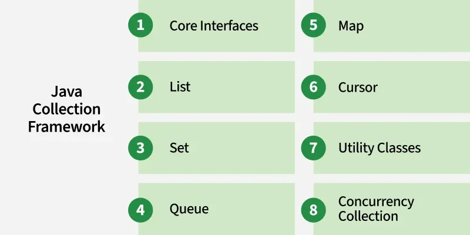

The Collection Framework represents a **unified architecture** for storing and manipulating a group of objects. It contains:

* **Interfaces**
* **Classes (Implementations)**
* **Algorithms** (sorting, searching, etc.)

#### **Root Interfaces**
Java Collection Framework has two main roots:
| Root Interface | Package     | Represents                                                         |
| -------------- | ----------- | ------------------------------------------------------------------ |
| `Collection`   | `java.util` | Group of individual objects                                        |
| `Map`          | `java.util` | Key–value pairs (not part of Collection hierarchy but part of JCF) |

### Features of Java Collection Framework
- Provides ready-to-use data structures (e.g., `ArrayList`, `HashSet`, `HashMap`).
- Offers interfaces (`Collection`, `List`, `Set`, `Map`, `Queue`) to define standard behaviors.
- Supports **dynamic resizing**, unlike arrays with a fixed size.
- Includes algorithms (sorting, searching, iteration) via the **Collections utility class**.
- Improves **code reusability**, **performance** and **maintainability** by reducing boilerplate code.
- Enables **easy iteration** using Iterator and for-each loop

### Hierarchy of Collection Framework
A Collection is a group of objects treated as a single unit.

Java provides a powerful Collection Framework supporting interfaces like:
* **List**
* **Set**
* **Queue**
* **Deque**
* **Map** (separate hierarchy)

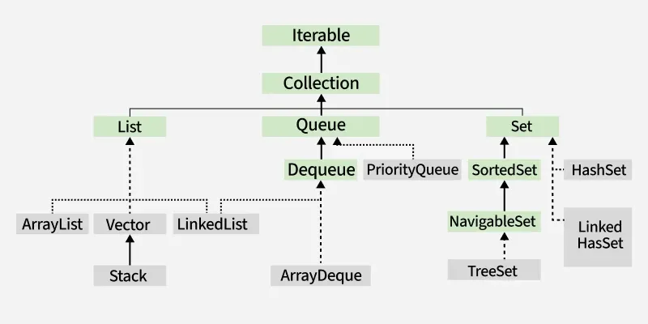

```java
Collection
├── List
│   ├── ArrayList
│   ├── LinkedList
│   ├── Vector
│   └── Stack
├── Set
│   ├── HashSet
│   ├── LinkedHashSet
│   ├── TreeSet
│   └── EnumSet
├── Map
│   ├── HashMap
│   ├── LinkedHashMap
│   ├── TreeMap
│   └── EnumMap
└── Queue
    ├── ArrayDeque
    ├── LinkedList
    └── PriorityQueue
```

### Need for Collection Framework
Before JDK 1.2:

* Developers used **Arrays**, **Vectors**, and **HashTables**
* No common interface
* Different syntax for similar operations (iteration, adding elements)
* Vectors had many **final methods**, making extension impossible
* No standard mechanisms for searching, sorting, or dynamic resizing

To solve these problems, Java introduced the **Collection Framework**, providing standard APIs and powerful data structures.

### Real World Example
Managing a library with thousands of books:

* Without a framework → manual storing, searching, sorting
* With a framework → use a catalog system to instantly search, add, or remove books

Similarly, the Collection Framework acts like a **catalog** for managing objects.

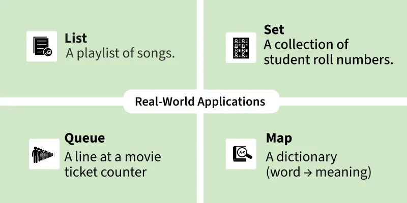

### Advantages of Collection Framework
**1. Consistent API :**
The API has a basic set of interfaces like `Collection`, `Set`, `List` or `Map`. All classes (`ArrayList`, `LinkedList`, `Vector`, etc) that implement these interfaces have some common set of methods.

**2. Reduces programming effort :**
A programmer doesn't have to worry about the design of `Collection`, and he can focus on its best use in his program.

**3. Increases program speed and quality :**
Increases performance by providing high performance implementations of useful data structures (Dynamic arrays, Linked lists, Hash tables, Balanced trees, Queues and deques) and algorithms.

**4. Reusability**
Standard interfaces ensure code is easy to reuse and maintain.

**5. Algorithm Support**
Class **`Collections`** provides:
* `sort()`
* `binarySearch()`
* `shuffle()`
* `reverse()`
* `min()`
* `max()`
* `frequency()`

### Key Interfaces in the Collection Framework

#### List Interface (`java.util.List`)
The **List** interface represents an **ordered**, **index-based**, and **duplicate-allowed** collection.

It preserves the insertion order and allows positional access using indexes (0, 1, 2…).

* Ordered collection
* Allows duplicate elements
* Supports index-based operations (add, get, remove by index)

✔ Implementations: `ArrayList`, `LinkedList`, `Vector`, `Stack`

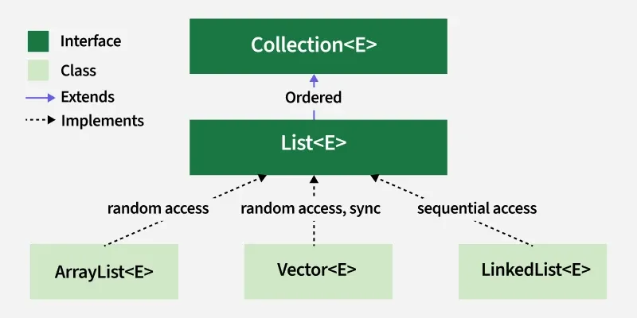

#### Set Interface (`java.util.Set`)
The **Set** interface represents a collection that **does not allow duplicate elements**.

It models the mathematical set abstraction and may or may not maintain order depending on the implementation.

* No duplicate elements allowed
* Ordering depends on implementation

  * `HashSet` → No order
  * `LinkedHashSet` → Insertion order
  * `TreeSet` → Sorted order

✔ Implementations: `HashSet`, `LinkedHashSet`, `TreeSet`, `EnumSet`

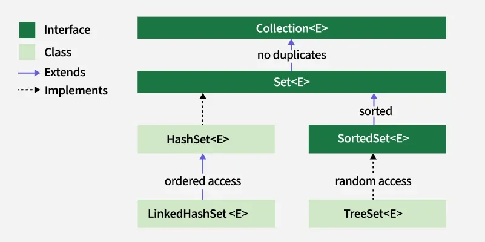

#### Map Interface (`java.util.Map`)
The **Map** interface represents a structure that maps **keys to values**.
Each key must be **unique**, but values may be duplicated.
Not a child of `Collection` but a major part of JCF.

* Stores data in **key-value pairs**
* Keys are unique
* Values can be duplicated

✔ Implementations: `HashMap`, `LinkedHashMap`, `TreeMap`, `Hashtable`, `EnumMap`


#### Queue / Deque Interface (`java.util.Queue`, `java.util.Deque`)
**Queue Interface**

The **Queue** interface represents a collection designed for **FIFO (First-In-First-Out)** order.

Used for task scheduling, buffering, and asynchronous data transfer.

* FIFO order by default
* Used for waiting lines, processing tasks
* Supports methods like `offer()`, `poll()`, `peek()`

✔ Implementations: `LinkedList`, `PriorityQueue`, `ArrayDeque`

**Deque Interface**

A **Deque** (Double Ended Queue) allows insertion and deletion at **both ends**.

It can work as either a **Queue** (FIFO) or **Stack** (LIFO).

* Insert/remove from both ends
* More flexible than Queue
* Preferred over `Stack` (legacy class)

✔ Implementations: `ArrayDeque`, `LinkedList`


## 66. List Interface
List is an dynamic array which is implemented by `ArrayList` (dynamic array based) and `LinkedList` (static array).

The `List` interface in Java extends the `Collection` interface and is part of the `java.util` package. It is used to store ordered collections where duplicates are allowed and elements can be accessed by their index.

### Key Characteristics of List Interface

- Ordered collection → preserves insertion order
- Allows duplicates → you can add the same value multiple times.
- Allows null values
- Index-based access (`get(int index)`)
- Supports positional insertion & deletion (`add(index, element)`, `remove(index)`)
- Supports **random access** (fast in ArrayList) and **sequential access** (fast in LinkedList).
- Provides ListIterator for **bidirectional traversal**
- `java.util.List` is a child interface of `Collection`.

### List Interface Declaration

> 📝: After the introduction of **Generics** in Java 1.5, it is possible to restrict the type of object that can be stored in the `List`.
```java
List <Obj> list = new List<Obj>();
```

> 📝: `List` Interface is the subinterface of Collection. It contains methods to insert and delete elements in index basis. It is a factory of `ListIterator` interface.
Declaration:
```java
public interface List<E> extends Collection <E>
```

> `ListIterator` interface is used to traverse the element in backward and forward direction. `ListIterator` is a child interface of `Iterator`.

### Important List Implementations

| Implementation | Underlying Structure         | Performance                   | Features                |
| -------------- | ---------------------------- | ----------------------------- | ----------------------- |
| **ArrayList**  | Dynamic array                | Fast read, slow insert/delete | Most used               |
| **LinkedList** | Doubly linked list           | Fast insert/delete, slow read | Implements List & Queue |
| **Vector**     | Dynamic array (synchronized) | Slower due to synchronization | Legacy                  |
| **Stack**      | Vector-based                 | LIFO operations               | Legacy                  |


- `List` interface is predefined and extends Collection interface. Collection interface externs iterable interface.
- `Set` interface accepts unique elements.
- **Sorted Set**: handles sorted set. Inherits `Set` interface.

```java
import java.util.*;

// POJO (Plain Old Java Object) class representing a Student
class Student {
    String name;
    int roll;

    // Setter for name
    public void setName(String name) {
        this.name = name;
    }

    // Getter for name
    public String getName() {
        return this.name;
    }

    // Setter for roll number
    public void setRoll(int roll) {
        this.roll = roll;
    }

    // Getter for roll number
    public int getRoll() {
        return this.roll;
    }
}

class abc {
    public static void main(String... args) {

        // Creating Student Object 1
        Student s1 = new Student();
        s1.setName("Shaurya");
        s1.setRoll(2);

        // Creating Student Object 2
        Student s2 = new Student();
        s2.setName("Dhairya");
        s2.setRoll(13);

        // Creating a generic ArrayList that can store ANY data type (NOT recommended)
        ArrayList<Student> a1 = new ArrayList<Student>();  
        // This restricts ArrayList to store ONLY Student type objects

        a1.add(s1);   // Adding Student object at index 0
        a1.add(s2);   // Adding Student object at index 1

        // ❌ ERROR: You CANNOT add non-Student objects into ArrayList<Student>
        // a1.add(6);     // Integer → Not allowed
        // a1.add("Karuna"); // String → Not allowed
        // a1.add(null);  // Null is technically allowed but avoided

        // Correct way: remove type restrictions OR use raw ArrayList
        // ArrayList a1 = new ArrayList();  // (raw type) → allows everything

        // Printing size of ArrayList (should be 2)
        System.out.println(a1.size());  

        // Printing details of Student at index 0
        System.out.println(a1.get(0).getName() + " " + a1.get(0).getRoll());

        // Using RAW ArrayList (no generics)
        ArrayList m = new ArrayList();
        m.add(20);   // Integer
        m.add(40);   // Integer
        m.add(a1);   // Adding ArrayList<Student> inside m

        // Retrieving the inner list stored at index 2
        List ll = (List) m.get(2);  
        // Now ll = a1 (which contains Student objects)

        // Casting the object at index 0 from ll into a Student
        Student s = (Student) ll.get(0);

        System.out.println(s.getName());  // Prints name of first student

        // ❌ m.get(2).get(0).getName() → Not allowed directly because m.get(2) returns Object
        // ✔ Correct way:
        Student s3 = (Student) ((List)m.get(2)).get(0);
        System.out.println(s3.getName());
    }
}
```

**1. Raw vs Generic ArrayList**
```java
ArrayList<Student> a1 = new ArrayList<>();
```
- ✔ Only allows **Student objects**
- ✔ Type-safe
- ✔ No ClassCastException
- ❌ Cannot add other data types

```java
ArrayList m = new ArrayList();
```
- ✔ Allows ANY data type
- ❌ Runtime errors
- ❌ No type safety
- ❌ Needs casting

**2. Why We Need Casting?**

Because raw ArrayList returns **Object**, e.g.:

```java
Object obj = m.get(2); 
```
To use inner list methods, we must convert it:

```java
List ll = (List) obj;
Student s = (Student) ll.get(0);
```

**3. Why Generics Are Better?**

Because:
- Prevent wrong data types
- No casting needed
- Compile-time safety

---
**Rewritten Code (100% Type-Safe, Using Generics Properly)**
```java
import java.util.*;

// A simple POJO (Plain Old Java Object)
class Student {
    private String name;
    private int roll;

    // setters
    public void setName(String name) { this.name = name; }
    public void setRoll(int roll) { this.roll = roll; }

    // getters
    public String getName() { return this.name; }
    public int getRoll() { return this.roll; }

    @Override
    public String toString() {
        return name + " (" + roll + ")";
    }
}

class Main {
    public static void main(String... args) {

        // Creating Student objects
        Student s1 = new Student();
        s1.setName("Shaurya");
        s1.setRoll(2);

        Student s2 = new Student();
        s2.setName("Dhairya");
        s2.setRoll(13);

        // -------------------------------
        // 1. A type-safe ArrayList<Student>
        // -------------------------------
        ArrayList<Student> students = new ArrayList<>();
        students.add(s1);
        students.add(s2);

        System.out.println("Total students = " + students.size());
        System.out.println(students.get(0).getName() + " " + students.get(0).getRoll());

        // ---------------------------------------------
        // 2. A type-safe List<List<Student>>
        //    (instead of mixing integers, strings etc.)
        // ---------------------------------------------
        List<List<Student>> masterList = new ArrayList<>();
        masterList.add(students);

        // Directly accessing student without casting
        Student s = masterList.get(0).get(0);

        System.out.println(s.getName());
        System.out.println(masterList.get(0).get(0).getName());
    }
}
```
**What Changed & Why It’s Better Now**

✔ **1. No raw types**

earlier code had:

```java
ArrayList m = new ArrayList();
```
That allows *any type* → unsafe.

Now:

```java
List<List<Student>> masterList = new ArrayList<>();
```
➡ Type-safe, compiler-checked.

✔ **2. No need for casting**

Earlier you had:

```java
List ll = (List) m.get(2);
Student s = (Student) ll.get(0);
```
Casting = unsafe + error-prone.

Now:

```java
Student s = masterList.get(0).get(0);
```

➡ Zero casting.

✔ **3. Proper generics everywhere**

Mixed data types were removed:

Your old code:

```java
a1.add(6);
a1.add("Karuna");
a1.add(null);
```
A `List<Student>` **must not** contain integers/strings.

Now:

```java
ArrayList<Student> students = new ArrayList<>();
```
➡ Only `Student` objects allowed.

✔ **4. Added `toString()` for better debugging**

So printing a Student automatically displays readable info.

✔ **5. Clean structure + meaningful variable names**

- `a1` ➝ `students`
- `m` ➝ `masterList`
- `ll` ➝ removed

Readable code = maintainable code.

### ListIterator (Travelling Forward & Backward)

`ListIterator` extends `Iterator` and provides more functionality:

```java
ListIterator<E> listIterator()
```

**Features:**
* Traverse **forward** and **backward**
* Add elements while iterating
* Replace elements while iterating

```java
ListIterator<String> it = list.listIterator();

while (it.hasNext()) {
    System.out.println(it.next());
}

while (it.hasPrevious()) {
    System.out.println(it.previous());
}
```

### ArrayList vs LinkedList

| Feature       | ArrayList       | LinkedList             |
| ------------- | --------------- | ---------------------- |
| Structure     | Dynamic array   | Doubly linked list     |
| Access Speed  | Fast (O(1))     | Slow (O(n))            |
| Insert/Delete | Slow (shifting) | Fast (change pointers) |
| Memory        | Less            | More                   |

### Why Use Generics in List?
Generics prevent storing wrong data types:

```java
List<Student> list = new ArrayList<>();  // type-safe
```

Benefits:
* No need for casting
* Compile-time checking
* Avoids ClassCastException

### When to Use Which List?

* **Use ArrayList** → when access speed is important
* **Use LinkedList** → when frequent add/remove operations
* **Use Vector/Stack** → NOT recommended (legacy, synchronized)

### List is NOT Thread-Safe

To make a List thread-safe:

```java
List<Integer> safeList = Collections.synchronizedList(new ArrayList<>());
```

### Real-World Example of List
List is like a playlist where:
- Songs have positions (indexes)
- You can add duplicate songs
- You can reorder them
- You can insert at any position
```java
List<String> shoppingList = new ArrayList<>();
shoppingList.add("Milk");
shoppingList.add("Bread");
shoppingList.add("Eggs");

System.out.println(shoppingList);
```
---

* List allows duplicates, Set does not
* List is ordered, Set is not (except LinkedHashSet)
* ArrayList = Random Access, LinkedList = Node Access
* ListIterator supports bidirectional traversal, Iterator does not
* Use generics for type safety

## 67. ArrayList Class
An ArrayList in Java is a **resizable** (or dynamic) array from the `java.util.ArrayList` package that can grow or shrink automatically as elements are added or removed, unlike regular arrays with a fixed size. It inherits `AbstractList` class and implements `List` interface.

- **Indexed Access**: Elements can be accessed using their index, just like arrays.
- **Allows Duplicates**: Duplicate elements are allowed.
- **Maintains Insertion Order**: Elements are stored in the order they are inserted.
- **Not Synchronized**: ArrayList is not thread-safe. To make it thread-safe, you must wrap it manually using `Collections.synchronizedList()`.
- In Java ArrayList class, **manipulation is slow** because a lot of shifting needs to be occurred if any element is removed from the ArrayList.

### Why ArrayList?

The normal array in Java has a fixed size.
ArrayList solves this limitation by providing a dynamic array that grows and shrinks automatically.

### Features of ArrayList
- Dynamic resizing (grows automatically)
- Duplicates allowed
- Null values allowed
- Maintains insertion order
- Random access (fast get() using index)
- Heterogeneous objects allowed (only if raw type is used — NOT recommended)
- Implements List Interface

### Hierarchy of ArrayList class
It implements `List` Interface which is a sub-interface of `Collection` Interface.


Java `ArrayList` class extends `AbstractList` class which implements `List` interface. The `List` interface extends `Collection` & `Iterable` interfaces in hierarchical order.

### ArrayList class declaration
```java
public class ArrayList<E> extends AbstractList<E> implements List<E>, RandomAccess, Cloneable, Serializable
```

- **Non-generic** (raw type) – NOT recommended
```java
ArrayList list = new ArrayList();
```

- **Generic** (type-safe) – Recommended
```java
ArrayList<String> names = new ArrayList<>();
ArrayList<Integer> nums = new ArrayList<>();
ArrayList<Student> students = new ArrayList<>();
```

### ArrayList Constructors in Java
Java provides multiple constructors to create an ArrayList based on different requirements:

**1. ArrayList()**

Creates an empty ArrayList with default initial capacity.
```java
ArrayList<Integer> arr = new ArrayList<>();
```
**2. ArrayList(Collection<? extends E> c)**

Creates an ArrayList initialized with elements from the specified collection.
```java
ArrayList<String> arr = new ArrayList<>(collection); 
```
**3. ArrayList(int initialCapacity)**

This constructor is used to build an array list with the initial capacity being specified.
```java
ArrayList<Double> arr = new ArrayList<>(20);
```

### **Methods of ArrayList**
**1. Add elements**

```java
add(E e)
add(int index, E e)
addAll(Collection c)
```
**2. Access elements**

```java
get(int index)
set(int index, E value)
```
**3. Remove elements**

```java
remove(int index)
remove(Object o)
clear()
```
**4. Searching**

```java
contains(Object o)
indexOf(Object o)
lastIndexOf(Object o)
```
**5. Size and Capacity**

```java
size()
isEmpty()
ensureCapacity(int minCapacity)
trimToSize()
```

### ArrayList Iteration Methods**

**1. Normal for-loop**
```java
for (int i = 0; i < list.size(); i++)
    System.out.println(list.get(i));
```

**2. Enhanced for-loop**
```java
for (String s : list)
    System.out.println(s);
```

**3. Iterator**
```java
Iterator<String> it = list.iterator();
while(it.hasNext())
    System.out.println(it.next());
```

**4. ListIterator (forward & backward)**
```java
ListIterator<String> it = list.listIterator();
while(it.hasNext())      // forward
    System.out.println(it.next());

while(it.hasPrevious())  // backward
    System.out.println(it.previous());
```

### Internal Working

ArrayList is internally backed by:

```java
Object[] elementData;
```

**When capacity is full:**
* A **new array** is created with **1.5x old size**
* Old data is copied into the new array
* New element is added

This makes insertion sometimes costly → **O(n)**

But element access is very fast → **O(1)**

### Advantages of ArrayList

* Fast random access (`O(1)`)
* Dynamic resizing
* Easy to use
* Supports index-based operations
* Good for frequent **read** operations

### Disadvantages of ArrayList

* Slower insert/delete in the **middle** (shifting happens)
* Not synchronized → not thread-safe
* Frequent resizing may reduce performance

### When to use ArrayList?

- When fast access is needed
- When insertion happens mostly at the **end**
- When dynamic resizing is required
- When ordered data with duplicates is needed

### When NOT to use ArrayList?

Use **LinkedList** instead when:

* Frequent insertion/deletion in the **middle**
* Memory fragmentation is not a concern
* Need a real queue or deque behavior

### ArrayList vs LinkedList

| Feature              | ArrayList             | LinkedList                     |
| -------------------- | --------------------- | ------------------------------ |
| Structure            | Dynamic Array         | Doubly Linked List             |
| Access Speed         | **Fast** (`O(1)`)     | Slow (`O(n)`)                  |
| Insert/Delete Middle | Slow (`O(n)`)         | Fast (`O(1)`)                  |
| Memory Usage         | Less                  | More                           |
| Best For             | Read-heavy operations | Insert/delete-heavy operations |


### Complexity of Java ArrayList

Understanding the **time and space complexity** of ArrayList operations helps in writing efficient programs. Since `ArrayList` is internally backed by a **dynamic array (`Object[]`)**, most operations depend on how arrays behave.

**Time & Space Complexity of ArrayList Operations**

| **Operation**                  | **Time Complexity** | **Space Complexity** | **Explanation**                                                                  |
| ------------------------------ | ------------------- | -------------------- | -------------------------------------------------------------------------------- |
| **Creation**                   | O(1)                | O(n)                 | Creating an empty ArrayList is constant-time; space grows as elements are added. |
| **Access (get/set)**           | O(1)                | O(1)                 | Direct index-based access, just like normal arrays.                              |
| **Insertion at end**           | O(1) amortized      | O(1)                 | Usually constant; resizing happens occasionally when capacity is full.           |
| **Insertion at start/middle**  | O(n)                | O(1)                 | Elements must be shifted to make space.                                          |
| **Removal from end**           | O(1)                | O(1)                 | No shifting required.                                                            |
| **Removal from start/middle**  | O(n)                | O(1)                 | Remaining elements must be shifted left.                                         |
| **Search (contains, indexOf)** | O(n)                | O(1)                 | Linear search (no binary search because ArrayList is not sorted by default).     |
| **size(), isEmpty()**          | O(1)                | O(1)                 | Stored as a private field → constant-time access.                                |
| **clear()**                    | O(n)                | O(1)                 | All elements are set to `null` so they can be garbage-collected.                 |
| **Iterator creation**          | O(1)                | O(1)                 | Creates a lightweight Iterator object; no data copying.                          |
| **Iterator next()/hasNext()**  | O(1)                | O(1)                 | Moves pointer/index; constant-time.                                              |
| **SubList() (view)**           | O(1)                | O(1)                 | Returns a **view**, not a copy.                                                  |
| **Sorting**                    | O(n log n)          | O(1)                 | Uses optimized sorting algorithm (`TimSort`).                                    |
| **toString()**                 | O(n)                | O(n)                 | Needs to traverse every element to build the final string.                       |

#### **Why Some Operations Are O(1) and Others Are O(n)?**

**O(1) operations**

* Accessing by index (`get`, `set`)
  → Direct jump to memory location
* Insert/remove at end (usually)
  → No shifting needed
* size(), isEmpty()
  → Just return a field

**O(n) operations**

* Insert/remove at start or middle
  → MUST shift elements
* Searching (`contains`, `indexOf`)
  → No sorted order → linear scan
* clear() and toString()
  → Must visit every element

- **Meaning of “O(1)”**
Constant time → operation does not depend on size of ArrayList.

- **Meaning of “O(N)”**
Linear time → operation grows proportionally with number of elements.

- **Meaning of "Amortized O(1)"**
Most operations are O(1), but rarely (during resizing) an O(N) operation happens.

---
* Access = O(1)
* Insert/Delete at end = O(1) amortized
* Insert/Delete in middle = O(n)
* Search = O(n)
* Sorting = O(n log n)
---

* ArrayList grows by **50%** when full
* Initial capacity = **10**
* Allows duplicates & null
* Index-based operations
* Backed by **Object[]**
* Not synchronized → Use `Collections.synchronizedList()`

```java
List list = Collections.synchronizedList(new ArrayList<>());
```

### Non-generic Vs Generic Collection
Java Collection Framework was non-generic before JDK 1.5. Since 1.5, it is **generic**.
Java new generic Collection allows you to have only one type of object in Collection.  Now it is **type-safe**, so typecasting is not required at runtime.

```java 
ArrayList al = new ArrayList(); // creating old non-generic ArrayList

ArrayList<String> al = new ArrayList<String>(); // creating new generic ArrayList
```

In Generic Collection, we specify the type in angular braces. Now ArrayList is forced to have only specified type of objects in it. If you try to add another type of objects, it gives **compile-time error**.

> There are two ways to traverse Collection elements:
> 1. By `Iterator` interface
> 2. By `for-each` loop

---
### `toArray()`
**Syntax:**
```java
public Object[] toArray()
```

Example:
```java
Student mm[] = new Student[10];
mm = toArray();
```
- 
- It is specified by `toArray()` in interface `Collection` and interface `List`.
- It overrides `toArray()` in class `AbstractCollection`.
- It returns an array containing all of the elements in this list in the correct order.

> The `toArray()` method returns an array of type **Object** (`Object[]`). We need to typecast it to Integer before using as Integer objects. If we do not typecast, we get a compilation error (incompatible types).
>
> It is therefore recommended to create an array into which elements of `List` need to be stored and pass it as an argument in `toArray()` method to store elements if it is big enough. Otherwise, a new array of the same type is allocated for this purpose.

- Use `toArray()` → returns `Object[]`, requires explicit typecasting.
- Use `toArray(T[] array)` → returns `T[]`, no manual typecasting needed if the array type matches.​

## 68. LinkedList Class
LinkedList is a part of the Java Collection Framework and is present in the `java.util package`. It implements a **doubly-linked list data structure** where elements are not stored in contiguous memory. 

Each node contains:
1. Data
2. Pointer to next node
3. Pointer to previous node

Because of this structure:
* ✔ Insertion/deletion is faster
* ✘ Random access (get by index) is slower

### Key Features of LinkedList
- **Dynamic Size**: LinkedList grows or shrinks dynamically at runtime.
- **Maintains Insertion Order**: Elements are stored in the order they are added.
- **Allows Duplicates**: Duplicate elements are allowed.
- **Not Synchronized**: By default, LinkedList is not thread-safe. To make Thread-safe use of `Collections.synchronizedList()`.
```java
List list = Collections.synchronizedList(new LinkedList<>());
```
- **Efficient Insertion/Deletion**: Adding or removing elements at the beginning or middle is faster compared to ArrayList.
* In Java LinkedList class, manipulation is fast because no shifting needs to be done.
* LinkedList class can be used as a **List** (FIFO), **Queue** (FIFO) or a **Stack** (LIFO).

```java
import java.util.LinkedList;

public class LinkedListExample {

    public static void main(String[] args){       
        // Creating a LinkedList
        LinkedList<String> l = new LinkedList<String>();

        // Adding elements to the LinkedList using add() method
        l.add("One");
        l.add("Two");
        l.add("Three");
        l.add("Four");
        l.add("Five");

        System.out.println(l);
    }
}
```
**Output**:
```
[One, Two, Three, Four, Five]
```
**Explanation**:
- Creates an empty LinkedList of Strings.
- Adds elements "One" to "Five" using the `add()` method.
- Prints the LinkedList showing elements in insertion order: [One, Two, Three, Four, Five].

> **Note**: `LinkedList` nodes cannot be accessed directly by index; elements must be accessed by traversing from the head.

### Internal Structure: Doubly Linked List
```kotlin
null <- [prev | data | next] <-> [prev | data | next] <-> ... -> null
```

Every node is connected in both forward and backward directions.

### Hierarchy of LinkedList
It implements the `List` (ordered list of elements) and `Deque` (double-ended queue → allows insertion/removal at both ends) interfaces, both of which are sub-interfaces of the `Collection` Interface.

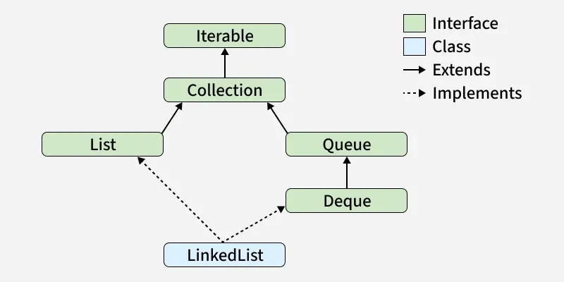

`LinkedList` class extends `AbstractSequentialList` class and implements `List` & `Deque` interface.

### LinkedList declaration
```java
public class LinkedList<E>
    extends AbstractSequentialList<E>
    implements List<E>, Deque<E>, Cloneable, Serializable
```

### When to Use LinkedList?

- Frequent insertions/deletions in middle or beginning
- Implementing queues, deques, task schedulers
- When memory fragmentation isn't a concern
- When element traversal order matters

### When NOT to Use LinkedList?

- When fast random access (get by index) is required → use ArrayList
- For cache-friendly operations
- When memory use must be minimal (LinkedList has overhead per node)

| Feature              | ArrayList                  | LinkedList                     |
| -------------------- | -------------------------- | ------------------------------ |
| Underlying Structure | Dynamic Array (`Object[]`) | Doubly Linked List (nodes)     |
| Access Speed         | **Fast** O(1)              | **Slow** O(n)                  |
| Insert/Delete Middle | Slow (shifting)            | Fast (pointer change)          |
| Memory Usage         | Less                       | More (extra pointers)          |
| Best For             | Read-heavy operations      | Insert/Delete heavy operations |
| Implements           | List                       | List + Deque (queue + stack)   |


## 69. Difference between ArrayList and LinkedList
`ArrayList` and `LinkedList` are two commonly used implementations of the `List` interface in Java. Both store ordered elements and allow duplicates, but they differ **internally**, resulting in different **performance characteristics**.
Both are **non-synchronized** classes.

 ArrayList                      | LinkedList                                                 |
 ------------------------------ | ---------------------------------------------------------- |
 **Dynamic Array** (`Object[]`) | **Doubly Linked List** (nodes with `prev`, `next`, `data`) |
 ArrayList internally uses dynamic array to store the elements.                     |  LinkedList internally uses doubly linked list to store the elements.                            |
 Manipulation with ArrayList is slow bcz it internally uses array. If any element is removed from the array, all the bits are shifted in memory.                        | Manipulation with LinkedList is faster than ArrayList bcz it uses doubly linked list so no bit-shifting is required in memory.                           |
 ArrayList class can act as a list only bcz it implements List only.                        | LinkedList class can act as a list and queue both bcz it implements List and Deque interfaces.                             |
ArrayList is better for storing and accessing data.                       | LinkedList is better for manipulating data.                             |

#### **Performance Comparison**

🔸 **Accessing Elements (get/set)**

* **ArrayList → O(1)**
  Direct index-based access.

* **LinkedList → O(n)**
  Must traverse nodes from start/end.

🔸 **Insertion**

* **At End**
  * ArrayList → O(1) *amortized*
    (May resize occasionally)
  * LinkedList → O(1)

* **At Middle / Beginning**
  * ArrayList → **O(n)** (shifting required)
  * LinkedList → **O(n)** traversal + **O(1)** insertion
    Effective time ≈ O(n)

🔸 **Removal**

* **From End**
  * ArrayList → O(1)
  * LinkedList → O(1)

* **From Middle / Beginning**
  * ArrayList → **O(n)** (elements shift)
  * LinkedList → **O(n)** traversal + **O(1)** deletion

🔸 **Search (contains, indexOf)**
* ArrayList → O(n)
* LinkedList → O(n)

#### **When to Use What?**

**Use ArrayList when:**

- You need **fast access** using indexes
- Insertions happen mostly at the **end**
- Memory efficiency matters
- You want better CPU cache locality (arrays are contiguous)

**Use LinkedList when:**

- You need frequent insertions/deletions in **middle or beginning**
- You need a real **queue/deque** implementation
- You don’t need fast random access

#### Summary Table

| Feature                 | ArrayList             | LinkedList                       |
| ----------------------- | --------------------- | -------------------------------- |
| Access speed            | **Fast (O(1))**       | Slow (O(n))                      |
| Insert/delete at end    | Fast (O(1) amortized) | Fast (O(1))                      |
| Insert/delete in middle | Slow (O(n))           | Medium (O(n)) → traversal + O(1) |
| Memory usage            | Low                   | High (extra pointers)            |
| Internal structure      | Dynamic Array         | Doubly Linked List               |
| Best for                | Read-heavy workloads  | Insert/delete-heavy workloads    |
| Supports random access  | ✔ Yes                 | ✘ No                             |

```java
import java.util.*;

class TestArrayLinked {
    public static void main(String... args){

        // -------------------------------
        // Creating an ArrayList
        // -------------------------------
        // ArrayList uses a dynamic array internally.
        // - Fast for accessing elements (O(1))
        // - Slower for insertion/deletion in the middle (requires shifting)
        List<String> al = new ArrayList<String>();

        al.add("Shaurya"); // Adding elements to ArrayList
        al.add("Dhairya");
        al.add("Anika");
        al.add("Kshama");

        // -------------------------------
        // Creating a LinkedList
        // -------------------------------
        // LinkedList uses a doubly linked list internally.
        // - Fast insertion/deletion at beginning/middle (O(1) after pointer move)
        // - Slower access (O(n)) because it must traverse nodes
        List<String> al2 = new LinkedList<String>();

        al2.add("Aishani"); // Adding elements to LinkedList
        al2.add("Pranav");
        al2.add("Ishani");
        al2.add("Rudra");

        // Printing both lists
        System.out.println("ArrayList: " + al);
        System.out.println("LinkedList: " + al2);
    }
}
```
Output:
```
ArrayList: [Shaurya, Dhairya, Anika, Kshama]
LinkedList: [Aishani, Pranav, Ishani, Rudra]
```

> **ArrayList = best for fast reads**

> **LinkedList = best for fast structural modifications**

## 70. Garbage Collection
In Java, Garbage means unreferenced objects.
Garbage collection in Java is an automatic memory management process that helps Java programs run efficiently.

- Objects are created on the heap area.
- Eventually, some objects will no longer be needed.
- Garbage collection is an automatic process that removes unused objects from heap.

Garbage Collection is a process of reclaiming the runtime unused memory automatically. In other words, it is a way to destroy the unused objects.

To do so, we were using `free()` function in **C** language and `delete()` in **C++**. But in Java, it is performed automatically. So, Java provides better memory management.

Garbage Collection improves memory efficiency and prevents memory leaks.

### Working of Garbage Collection
- It identifies which objects are still in use (referenced) and which are not in use (unreferenced).
- It removes the objects that are unreachable (no longer referenced).
- The programmer does not need to mark objects to be deleted explicitly. - Garbage collection is implemented within the JVM.

Garbage Collector identifies:
- **Reachable objects** → still referenced → **kept**
- **Unreachable objects** → no reference pointing to them → **eligible for GC**

GC runs automatically inside the JVM (not manually controlled by the programmer).

❓: **How can an object be unreferenced?**
▶ There are many ways: 
1. By nulling the references
```java
Employee e = new Employee();
e = null;
```

2. By assigning a reference to another
```java
Employee e1 = new Employee();
Employee e2 = new Employee();
e1 = e2; // now the first object referred by e1 is available for Garbage collection. // First object becomes unreachable
```

3. By anonymous object etc.
```java
new Employee();
```

4. Island of Isolation
Two objects referencing each other but not referenced by any live object:
```java
A a = new A();
B b = new B();
a.b = b;
b.a = a;

a = null;
b = null; // both objects eligible for GC
```

### Types of Activities in Java Garbage Collection
Java heap is divided into generations:

- **Young Generation** 
    - Where new objects are created.
    - Most objects die here quickly.
    - Minor GC cleans this area frequently.
- **Old (Tenured) Generation**
    - Contains long-lived objects.
    - Major GC (Full GC) cleans this area.
    - Happens less frequently but takes longer.

Two types of garbage collection activities usually happen in Java. These are:
- **Minor or Incremental Garbage Collection (GC)**: This occurs when unreachable objects in the Young Generation heap memory are removed.
    - Cleans **Young Generation**.
    - Very fast.

- **Major or Full Garbage Collection (GC)**: This happens when objects that survived minor garbage collection are removed from the Old Generation heap memory. It occurs less frequently than minor garbage collection.
    - Cleans **Old Generation** + sometimes entire heap.
    - Slower and more expensive.

### Key Concepts on Garbage Collection
**1. Unreachable Objects**

An object becomes unreachable if it does not contain any reference to it.
```java 
Integer i = new Integer(4); 
// the new Integer object is reachable  via the reference in 'i'  
i = null; 
// the Integer object is no longer reachable. 
```

**2. Making Objects Eligible for GC**

An object is said to be eligible for garbage collection if it is unreachable. After i = null, integer object 4 in the heap area is suitable for garbage collection in the above image.

**How to Make an Object Eligible for Garbage Collection?**

Even though the programmer is not responsible for destroying useless objects but it is highly recommended to make an object unreachable(thus eligible for GC) if it is no longer required. There are generally four ways to make an object eligible for garbage collection.

- Nullifying the reference variable (`obj = null`).
- Re-assigning the reference variable (`obj = new Object()`).
- An object created inside the method (eligible after method execution).
- Island of Isolation (Objects that are isolated and not referenced by any reachable objects).

**3. Requesting Garbage Collection**

- Once an object is eligible for garbage collection, it may not be destroyed immediately.The garbage collector runs at the JVM's discretion and you cannot predict when it will occur.
- We can also request JVM to run Garbage Collector. There are two ways to do it. fiest using `System.gc()` and second using `Runtime.getRuntime().gc()`:
    - Using `System.gc()`: This static method requests the JVM to perform garbage collection.
    - Using `Runtime.getRuntime().gc()`: This method also requests garbage collection through the Runtime class.

Programmers can **request**, but not force, GC.
    ```java
    System.gc();  
    // OR  
    Runtime.getRuntime().gc();  
    ```
> ❗ JVM may ignore the request. GC timing is NOT guaranteed.    

**4. The `finalize()` Method (Deprecated in Java 9+)**
Before destroying an object, the garbage collector calls the `finalize()` method to perform cleanup activities. The method is defined in the **Object class** as follows:
```java
@Override  
protected void finalize() throws Throwable {  
System.out.println("GC cleaning up...");  
}  
```

The `finalize` method is invoked each time before the object is garbage collected. This method can be used to perform cleaup processing.

> 📝: The Garbage Collector of JVM collects only those objects that are created by `new` keyword. So, if you have created any object without `new`, you can use `finalize` method to perform cleanup processing (destroying remaining objects).

> 📝: `finalize()` method is deprecated since Java 9 because it is unpredictable and can cause performance issues.

> Alternatives like **try-with-resources** or **explicit cleanup** methods are preferred.

> The garbage collector calls `finalize()` at most once per object.

> **Exceptions thrown in finalize() are ignored**.

- Deprecated since **Java 9**
- Removed in **Java 18**
- Not reliable → **may never run**
- Exceptions inside finalize() are ignored
- Called **at most once per object**

✔ **Modern Alternatives**
- try-with-resources
- AutoCloseable
- Explicit close() methods

---
✔ **Stop-the-world pauses**

During GC, JVM may pause all application threads temporarily.
These pauses are small for minor GC, larger for major GC.

✔ **Reference Types Affect GC**

Java has:
* **Strong Reference** (default) → not GC’ed until unreachable
* **Soft Reference** → cleared before OutOfMemoryError
* **Weak Reference** → cleared in next GC cycle
* **Phantom Reference** → used for more controlled cleanup

✔ **GC Algorithms Used by JVM**

Modern JVM uses:
* **Parallel GC**
* **G1 (Garbage First) GC** → default in Java 9+
* **ZGC** → ultra-low pause GC
* **Shenandoah GC** → low-latency GC

### `gc()` method
The `gc()` method is used to invoke the Garbage Collector to perform cleanup processing. The `gc()` is found in System and Runtime classes.
```java
public static void gc() {}
```

> 📝: Garbage Collection is performed by a **daemon thread** called Garbage Collector (GC). This thread calls the `finalize()` method before object is Garbage collected.

```java
public class TestGarbage{
    public void finalize(){ 
        System.out.println("Object is Garbage Collected.");
    }
    public static void main(String... args){
        TestGarbage s1 = new TestGarbage();
        TestGarbage s2 = new TestGarbage();
        s1 = null;
        s2 = null;
        System.gc();
    }
}
```
Output:
```
Object is Garbage Collected.
Object is Garbage Collected.

```

> 📝: Neither finalization nor Garbage collection is guaranteed.

### Advantages of Garbage Collection
The advantages of Garbage Collection in Java are:
- It makes java memory-efficient because the garbage collector removes the unreferenced objects from heap memory.
- It is automatically done by the garbage collector (a part of JVM), so we don't need extra effort.
- Makes Java memory-safe and developer-friendly
- Frees heap space efficiently

## 71. `finalize` method
`finalize()` was a special method in Java used for **cleanup operations** before an object was destroyed by the Garbage Collector (GC). It belonged to the **Object class**, so every class inherited it.

However, **`finalize()` is deprecated since Java 9 and removed in Java 18**, because it was **unpredictable, unsafe, slow**, and caused performance/memory problems.

`finalize()` was called **once** by the Garbage Collector *before* deleting an object, giving a chance to release resources.

**Syntax:**

```java
@Override
protected void finalize() throws Throwable {
    System.out.println("Object is being garbage collected");
}
```

**Key Characteristics:**

* Called **at most once** by GC.
* GC decides **when** (or even *if*) it will run.
* Exceptions inside `finalize()` are ignored.
* Unpredictable → may cause memory leaks.

### Why Was `finalize()` Deprecated

Because it caused several issues:

**1. Unpredictable Execution :**
GC does NOT guarantee when or if `finalize()` will run.

**2. Performance Overhead :**
Objects with `finalize()` go through an extra GC cycle, slowing down memory cleanup.

**3. Security Problems :**
Attackers could resurrect objects (by reassigning `this`), bypassing cleanup.

**4. Encourages Bad Design :**
Cleanup responsibility should be explicit, not left to GC.

### Modern Alternatives to `finalize()`
Today Java recommends **explicit and reliable cleanup mechanisms**:

**1. try-with-resources (Recommended)**

Used for closing resources automatically like:
- Files
- Streams
- Sockets
- Database connections

Introduced in Java 7, it works with any class implementing the `AutoCloseable` interface.

```java
try (FileInputStream fis = new FileInputStream("file.txt")) {
    // use file
} 
// automatically closed
```

- Predictable
- Automatic
- No memory leak
- No GC involvement

**2. Implement `AutoCloseable` Yourself**

For custom cleanup logic:

```java
class MyResource implements AutoCloseable {
    public void use() {
        System.out.println("Using resource...");
    }

    @Override
    public void close() {
        System.out.println("Cleaning up resource...");
    }
}

public class Test {
    public static void main(String[] args) {
        try (MyResource r = new MyResource()) {
            r.use();
        }
    }
}
```

- Cleaner alternative to finalize
- Controlled cleanup logic

**3. Cleaner API (Java 9+)**

The `java.lang.ref.Cleaner` class is the official alternative to `finalize()`.

- More efficient
- More predictable
- Runs cleanup in a background thread
- Does not delay garbage collection

```java
import java.lang.ref.Cleaner;

class Resource {
    private static final Cleaner cleaner = Cleaner.create();

    private final Cleaner.Cleanable cleanable;

    Resource() {
        cleanable = cleaner.register(this, new Task());
    }

    static class Task implements Runnable {
        public void run() {
            System.out.println("Cleaning resources safely...");
        }
    }
}
```
The `Cleaner` cleanup is:
- Always asynchronous
- Never blocks GC
- Safer than finalize()

**4. Phantom References**

For very complex cleanup scenarios, Java provides:
- `PhantomReference`
- `ReferenceQueue`

Used in:
- Memory-sensitive libraries
- Native memory management (e.g., `DirectByteBuffer`)

```java
PhantomReference<Object> pr = new PhantomReference<>(obj, refQueue);
```

- Allows post-mortem cleanup
- Does NOT resurrect objects (unlike finalize())
- Used in frameworks & JVM-level tools
- Most powerful but complex

### Which Technique Should You Use
| Use Case                       | Recommended Alternative     |
| ------------------------------ | --------------------------- |
| Files, streams, connections    | **Try-with-resources**      |
| Class needs manual cleanup     | **Explicit close() method** |
| Want finalize()-like cleanup   | **Cleaner API**             |
| Advanced/native memory cleanup | **PhantomReference**        |

> **When Should finalize() Be Used Today?**
>
>❌ Never in modern Java
It’s only kept for backward compatibility.

---

* `finalize()` → **Deprecated in Java 9**, **Removed in Java 18**
* Unpredictable → GC may *never* call it
* Not reliable for releasing resources
* Alternatives: **try-with-resources**, **AutoCloseable**, **Cleaner API**
* GC calls `finalize()` **once** at most
* Exceptions inside finalize are ignored

## 72. Serialization
**Serialization** in Java is the process of **converting an object into a byte stream**, so it can be:

- Saved to a file
- Sent over a network
- Stored in a database
- Deep-copied

The reverse process—converting the byte stream back into an object is called **Deserialization**.

Java achieves Serialization through the `Serializable` interface.
```plaintext
Object  →  Byte Stream  (Serialization)
Byte Stream → Object    (Deserialization)
```

In Java, serialization plays a very important role it's something that we use a lot in our real life, even if we do not always notice it. Serialization helps us to save the current state of an object so that we can use it further and share complex data between different systems.

### Important Points of Serialisation:

- **Platform-Independent**: In Java, the serialization is a platform-independent process. It means that if we serialize an object using a byte stream on one platform can be easily deserialized on different platforms.
- **Serializable Interface**: If we want to make a class serializable, then it must implement the Serializable interface. This interface does not contain any methods or variables ( marker interface), but it gives a signal that the class is ready for serialization.

#### Why Serialization

Serialization is used when objects need to be:
- Persisted (saved on disk)
- Transferred between JVMs
- Cached
- Sent via sockets / RMI / messaging systems

**Example**: sending a Student object to a server.

#### `java.io.Serializable` interface
Serializable is a **arker interface** (has no data member and method). It is used to "mark" Java classes so that objects of these classes may get the certain capability. The **Cloneable** and **Remote** are also *marker interfaces*.

It must be implemented by the class whose object you want to persist.

The String class and all the wrapper classes implement the `java.io.Serializable` interface by default.

A class must implement the **marker interface** `java.io.Serializable`.
```java
import java.io.Serializable;

class Student implements Serializable {
    int id;
    String name;

    Student(int id, String name){
        this.id = id;
        this.name = name;
    }
}
```
In the above example, Student class implements Serializable interface. Now its object can be converted into stream.

Serializable interface has **no methods** → it is only used to "mark" a class.

#### ObjectOutputStream class
This class is used to primitive data types, and Java objects to an OutputStream. Only objects that support the `java.io.Serializable` interface can be written to streams.

- `public final void writeObject(Object obj) throws IOException` writes the specified object to the ObjectOutputStream.

- `public void flush() throws IOException{}` flushes the current output stream.

- `public void close() throws IOException{}` closees the current output stream.

In the given example, we are going to serialize the object of Student class. The `writeObject()` method of `ObjectOutputStream` class provides the functionality to serialize the object. We are saving the state of the object in the file named `f.txt`.

```java
import java.io.*;

class Persist{
    public static void main(String... args) throws Exception{
        Student s1 = new Student(7, "Ankita");

        FileOutputStream fout = new FileOutputStream("f.txt");
        ObjectOutputStream out = new ObjectOutputStream(fout);

        out.writeObject(s1);
        out.flush();
        System.out.println("Success");
    }
}
```
Output:
```
Success
```

### Advantages of Serialization: 
It is mainly used to travel object's state on the network (which is known as **marshalling**).
- **Persistence**: The serialization allows us to save and persist the state of an object to a file or database. 
- **Network Communication**: Serialization is often used to transfer objects across a network, enabling the communication between different components and or systems.
- Easy storage and retrieval of object state
- Enables distributed systems & socket communication
- Supports deep cloning using byte streams
- Works with RMI, caching, messaging APIs

### Disadvantages of Serialization: 
- Not secure (unless encrypted)
- Not suitable for large objects
- Breaks if class structure changes drastically
- Slow compared to plain text formats (JSON/ProtoBuf)

### Modern Alternatives to Serialization
Serialization is older and less preferred today. Modern applications use:
- **JSON Serialization**
via Jackson/Gson

- **XML Serialization**
via JAXB

- **Protocol Buffers (Google Protobuf)**
for high-performance APIs

- **Kryo Serialization**
for very fast serialization in large systems (e.g., Apache Spark)

These are faster, safer, and more interoperable across languages.

### Deserialization in Java
Deserialization is the reverse process where the byte stream is used to recreate the actual Java object in memory. This mechanism is used to persist the object.

Deserialization is the process of reconstructing the object from the serialized state. It is the reverse operation of Serialization.

#### OutputInputStream class
This class deserializes objects and primitive data written using an ObjectOutputStream.

- `public final Object readObject() throws IOException, ClassNotFoundException{}` reads the next object from the ObjectInputStream.

- `public void close() throws IOException{}` closes ObjectInputStream.

```java
import java.io.*;

class Depersist{
    public static void main(String... args) throws Exception{
        ObjectInputStream in = new ObjectInputStream (new FileInptStream("f.txt"));

        Student s = (Student)in.readObject();
        System.out.println(s.id + " " + s.name);

        in.close();
    }
}
```
Output:
```
7 Ankita
```

#### Important Points of Deserialization:

- **Rebuilds Objects**: Deserialization takes the byte stream and turns it back into the original object with the same state as before.
- **Platform-Independent**: Deserialization works well with different platforms without any issues.
- **Class Must Be Available**: When we deserialize an object, it is necessary that the class definition be present in the program.


#### Advantages of Deserialization

- It turns saved data back into the original objects, so everything works just like before.
- It helps different programs or systems share information easily by rebuilding objects from the saved data.

#### Disadvantages of Deserialization
1. Security Vulnerabilities (MOST IMPORTANT)

Java deserialization is **not safe** by default.
If you deserialize data from an untrusted source, an attacker can craft malicious byte streams that cause:
- Arbitrary code execution
- Remote code execution (RCE)
- Denial of Service (DoS)
- Instantiation of unexpected classes

This is known as the **Java Deserialization Vulnerability**, one of the biggest security issues in Java’s history.

**2. Requires Serial Version Compatibility**

During deserialization, JVM checks:
```java
serialVersionUID
```
If the class has changed since it was serialized:
```java
java.io.InvalidClassException
```
So deserialization is fragile if:
- Fields are added/removed
- Class structure changes
- serialVersionUID is not defined manually

**3. Performance Overhead**

Deserialization is slower because:
- It uses reflection internally
- Requires object creation + verification
- Reads a byte stream and reconstructs the object graph

In applications with high throughput, deserialization becomes a **bottleneck**.

**4. Breaks Encapsulation**

Deserialization allows JVM to:
- Create objects **without calling constructors**
- Modify private fields directly

This violates core OOP principles and allows inconsistencies.

Example: constructor validation is bypassed during deserialization.

**5. The Serialized Form Is Not Human-Readable**

Binary `.ser` data:
- Cannot be easily debugged
- Cannot be edited manually
- Is not cross-language compatible
(Only Java understands it)

**6. Platform and Version Dependency**

Java serialization:
- Works only in Java ecosystem
- May break across JVM versions
- Requires the same package/class structure for deserialization

Not good for distributed systems.

**7. Large Serialized Data Size**
Java’s default serialization is:
- Verbose (extra metadata included)
- Significantly larger than JSON / protobuf

This impacts:
- Network bandwidth
- Storage
- Memory usage

**8. Not Suitable for APIs or Databases**

Most modern systems use:
- JSON
- XML
- Protocol Buffers
- Avro
- Kryo

Because they are:

✔ safer
✔ language-independent
✔ smaller
✔ faster

Java’s built-in deserialization is discouraged in microservices and distributed systems.

### Visual Representation of Serialization and Deserialization Process
The image below demonstrates the process of serialization and deserialization.


**Serialization Process**: The byte stream created is platform independent. So, the object serialized on one platform can be deserialized on a different platform. To make a Java object serializable we implement the `java.io.Serializable` interface. The ObjectOutputStream class contains `writeObject()` method for serializing an Object.
```java
public final void writeObject(Object obj)
                       throws IOException
```

**Deserialization Process**: The ObjectInputStream class contains readObject() method for deserializing an object. 
```java 
public final Object readObject()
        throws IOException,
        ClassNotFoundException
```               

### Points to remember while using Serialization:

- **Parent-Child Serialization**: If a parent class has implemented Serializable interface then child class doesn't need to implement it but vice-versa is not true.
- **Non-static Data Members**: Only non-static data members are saved via Serialization process. Static variable are not serialized becaue they are not associated with any specific instance. 
- **Transient Data Members**: Static data members and transient data members are not saved via Serialization process. So, if you don't want to save value of a non-static data member then make it transient.
- **Constructor Calling**: Constructor of object is never called when an object is deserialized. 
- **Associated Objects**: Associated objects must be implementing Serializable interface.

**Example:**

class A implements Serializable{
// B also implements Serializable
// interface.
B ob=new B();  
}

### SerialVersionUID
The Serialization runtime associates a version number with each Serializable class called a SerialVersionUID, which is used during Deserialization to verify that sender and receiver of a serialized object have loaded classes for that object which are compatible with respect to serialization. If the receiver has loaded a class for the object that has different UID than that of corresponding sender's class, the Deserialization will result in an **InvalidClassException**. 

Syntax:
```java
private static final long serialVersionUID = 3L;
```

**Why needed?**

- Prevents **InvalidClassException** if class structure changes
- Helps JVM verify compatibility of serialized data

If not provided, JVM generates one automatically (not recommended).

### `transient` Keyword

Some fields should not be serialized, such as:

- passwords
- sensitive data
- derived values
- temporary fields

Mark them transient:
```java
class Employee implements Serializable {
    String name;
    transient String password; // will NOT be serialized
}
```

During deserialization → transient fields become **null / 0 / false**.

- **In case of transient variables**: A variable defined with transient keyword is not serialized during serialization process.This variable will be initialized with default value during deserialization. (e.g: for objects it is null, for int it is 0). 
- **In case of static Variables**: A variable defined with static keyword is not serialized during serialization process.This variable will be loaded with current value defined in the class during deserialization. 
Transient Vs Final
The main difference between Transient and Final is listed below:

- Final variables are serialized by their value directly.
- Declaring a final variable as transient has no use because the compiler replaces final variables with their literal values in the bytecode.

### Serialization in Inheritance

👉 If a parent class is Serializable → child becomes Serializable automatically

👉 If parent is NOT Serializable:
- Parent fields will NOT be serialized
- But child fields will be

To handle this, parent must provide a **no-arg constructor**.

### Serialization and static fields

Static fields **are NOT serialized** because they belong to the class, not the instance.

### Serialization vs Deserialization in Java
The main difference between serialization and deserialization is:

- Serialization is the process of converting object to byte stream.
- Deserialization is the process of converting byte stream to object.

## 73. J2EE Web application
A **Web Application** is an application that runs on a server and is accessed through a web browser.
In Java, web applications are commonly built using **J2EE (Java 2 Enterprise Edition)**, now known as **Jakarta EE**.

J2EE provides a **set of specifications, APIs, and tools** for developing large-scale, distributed, secure, and scalable enterprise applications.

**J2EE (now Jakarta EE)** is a platform/framework for building *enterprise-level applications* such as:
- Web applications
- REST APIs
- E-commerce portals
- Banking systems
- Distributed applications
- Multi-tiered applications

It extends standard Java (JSE) by adding powerful APIs for:
- Web development
- Server-side programming
- Databases (JDBC)
- Enterprise components (EJB)
- Security
- Messaging (JMS)
- XML/JSON processing
- Cloud-ready enterprise services

### Why Use J2EE?

Because it provides a standardized architecture that is:
- **Portable** — runs on any Java-based application server
- **Secure** — built-in authentication & authorization
- **Scalable** — suitable for large applications
- **Robust** — managed by the JVM
- **Multi-tiered** — separation of layers: UI, business logic, data

### Components of a Java (J2EE) Web Application

A typical Web Application contains:

1. Client Layer (Presentation Layer)
- Browser (Chrome, Firefox…)
- Sends HTTP requests
- Receives responses (HTML, JSON, XML)

2. Web Layer (Servlets + JSP)
- Servlets → Java programs handling HTTP requests
- JSP → Dynamic web pages
- Filters → Pre-processing (authentication, logging)

3. Business Layer (Service Layer/EJB)
- Contains business logic
- EJB (older)
- Spring Services (modern alternative)

4. Data Layer
- JDBC
- JPA / Hibernate
- Database (MySQL, Oracle, PostgreSQL, etc.)

### J2EE Architecture (3-Tier / Multi-Tier)
```java
Client (Browser)
       |
       v
Web Server (Servlet / JSP / Filters)
       |
       v
Application Server (EJB / Services)
       |
       v
Database (MySQL / Oracle / MongoDB)
```

### J2EE Technologies Used in Web Applications
| Layer        | Technology                                 | Description                |
| ------------ | ------------------------------------------ | -------------------------- |
| Presentation | **JSP**, **HTML**, **CSS**, **JavaScript** | UI components              |
| Server       | **Servlets**, **Filters**                  | Handles HTTP requests      |
| Business     | **EJB**, **Spring (modern)**               | Business logic             |
| Data         | **JDBC**, **JPA**, **Hibernate**           | Database connectivity      |
| Web Services | **REST / JAX-RS**, **SOAP / JAX-WS**       | API development            |
| Messaging    | **JMS**                                    | Asynchronous communication |
| Deployment   | **WAR**, **EAR**                           | Packaging formats          |

### How a Web Application Works (Flow)
1. User clicks a link / submits a form
2. Browser sends HTTP Request
3. Request reaches Tomcat (or another server)
4. Servlet processes request
5. Servlet interacts with:
    - DB (through JDBC/Hibernate)
    - Business layer
6. Servlet prepares data
7. Data forwarded to JSP
8. JSP generates dynamic HTML
9. Browser displays response

**Servlet + JSP Example (Simple Flow)**
```sql
index.html  →  Servlet  →  Database  →  JSP (response)
```

### Advantages of J2EE
- Platform-independent
- Standardized, mature ecosystem
- Secure & scalable
- Supports multi-tier architecture
- Compatible with large enterprise systems

### J2EE Multi-Tier Architecture (Multi-Layer Structure)

Modern Java web applications follow a **multi-tier architecture** to cleanly separate concerns and make applications scalable, maintainable, and modular.

```
Client (Browser / Mobile App / API Client)
        │
        ▼
Web Layer (Web-Container)
  └→ Servlets / JSP / Filters / REST Controllers
        │
        ▼
Business Layer (Application-Container or Service Layer)
  └→ EJB / Spring Services / Business Logic
        │
        ▼
Data Layer (Persistence Layer)
  └→ JDBC / JPA / Hibernate / ORM / Database
```

### Layers Explained

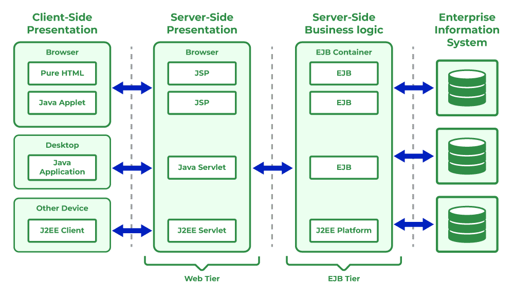

| Layer              | Responsibility / Components                                                                  | Example Technologies                                                     |
| ------------------ | -------------------------------------------------------------------------------------------- | ------------------------------------------------------------------------ |
| **Client Layer**   | UI or client-side that interacts with user — sends HTTP / API requests and renders responses | Browsers, Mobile Apps, API Clients (Postman, etc.)                       |
| **Web Layer**      | Handles HTTP requests & responses, user sessions, request routing, filters (auth, logging)   | Servlets, JSP, Filters, REST controllers (Servlet container e.g. Tomcat) |
| **Business Layer** | Contains business logic, rules, transaction handling, service orchestration, data processing | EJB, Spring Services, Business-Service Classes                           |
| **Data Layer**     | Manages data persistence, ORM, database connections, queries, transactions                   | JDBC, JPA, Hibernate, SQL / NoSQL databases                              |

### Why Multi-Tier Architecture?

* **Separation of Concerns** — UI, business logic, and data logic stay independent.
* **Scalability** — Each layer can be deployed, scaled, or optimized independently.
* **Maintainability** — Easier to modify or replace one layer without impacting others.
* **Reusability** — Services in business layer can be reused across different clients (web, mobile, API).
* **Security & Transaction Management** — Business layer can enforce security, validation, transactions before data layer access.

### Role of Containers

* **Web Container** — manages servlets, JSP, filters, sessions, request lifecycle.
* **Application / EJB Container** — manages business services, transactions, dependency injection, pooling, lifecycle.
* **Data & Persistence** — managed by persistence frameworks (JPA/Hibernate) / JDBC; optionally by a connection pool provider.

### Key Takeaways for J2EE Web Applications

* A well-architected J2EE application separates UI, business logic, and data access.
* Using a multi-tier approach improves modularity, testability, and performance.
* Technologies like Servlets, JSP, JDBC, ORM (Hibernate/JPA), and business services work together based on this architecture.
* Containers (web/app) provide infrastructure support — lifecycle, pooling, security, transactions — enabling developers to focus on business logic.

## 74. Web Architecture and Network Basics
A Web Application is software that runs on a server and is accessed through a web browser. Advanced Java technologies such as Servlets, JSP, JDBC, Spring MVC, Hibernate, and Spring Boot are widely used to develop secure and scalable web applications.

### **Server–Client Architecture**

The **Client–Server model** is the foundation of web applications.

**Client (Browser / App)**
* Sends requests to a server
* Requests webpages, images, API data, etc.
* Examples: Chrome, Firefox, mobile apps, Postman

**Server**
* Receives client requests
* Processes them (business logic)
* Sends back the response (HTML, JSON, files, etc.)
* Examples: Apache Tomcat, JBoss/WildFly, GlassFish

> A **Server** is a computer program or device that provides functionality for other programs or devices, called '**clients**'.

**Communication Flow**
```
Client (Browser) → Request → Server
Server → Response → Client
```

#### Web Clients and Servers
- **Web Client**: A browser or app that sends a request.
- **Web Server**: A server (e.g., Apache Tomcat, Jetty) that processes the request and sends back a response.
- Communication uses the HTTP protocol over TCP/IP.

### **DNS (Domain Name System)**

DNS converts **human-readable domain names** into **IP addresses**.

**Example:**
```
www.google.com  →  142.250.182.206
```
You type the domain → DNS resolves it → browser connects to the server's IP.

Domain Name System (DNS) is an internet service that translates domain names into IP addresses. Because domain names are alphabetic, they're easier to remember.

**How DNS Works (Simplified)**

1. Client sends DNS query
2. DNS Resolver contacts various DNS servers
3. Finds IP address of requested domain
4. Returns IP to browser
5. Browser connects to that IP using HTTP/HTTPS

### **Protocol**

A **Protocol** defines a set of rules for communication between two devices.

A protocol is the special set of rules that end points in a telecommunication connection use when they communicate.
Protocols specify the standards for communication and provide detailed information on processes involved in data transmission.

**Common Internet Protocols:**

| Protocol  | Purpose                   |
| --------- | ------------------------- |
| **HTTP**  | Web communication         |
| **HTTPS** | Secure HTTP using SSL/TLS |
| **TCP**   | Reliable data transfer    |
| **UDP**   | Fast, connectionless data |
| **FTP**   | File transfer             |
| **SMTP**  | Email sending             |

Protocols ensure that:

* Both parties understand each other
* Data is transmitted correctly

### **HTTP (HyperText Transfer Protocol)**

HTTP is an **application-level protocol** used by browsers and servers.

**Key Features:**
* Stateless
* Text-based
* Runs on port **80** (HTTP) and **443** (HTTPS)
* Used for requesting HTML pages, CSS, JS, JSON, images, etc.

HTTP is an application-layer protocol used primarily on the www. HTTP is a protocol which allows the fetching of resources, such as HTML documents.

#### HTTP Protocol in Web Applications
The HTTP protocol defines how requests and responses are exchanged in web applications. Common methods include:

- **GET**: Used to request data or resources from the server (e.g., fetching a web page).
- **POST**: Sends data to the server, typically used in form submissions.
- **PUT**: Updates existing resources on the server.
- **DELETE**: Removes specific resources.

These methods form the backbone of web-based communication and RESTful services.

**HTTPS**

    HTTPS = HTTP + SSL/TLS

→ Provides encryption, authentication, and data integrity.

It is the foundation of any data exchange on the web and a client-server protocol, which means requests are initiated by the recipient, usually the web browser.

### **HTTP Requests**

HTTP requests are sent by the client to the server.
Each request contains:

* **URL**
* **Request Method**
* **Headers**
* **Body** (optional)

It is the request send by the computer to a web server that contains all sorts of potentially intresting information.

**Common HTTP Methods:**

| Method     | Description                        |
| ---------- | ---------------------------------- |
| **GET**    | Retrieve data                      |
| **POST**   | Send data (forms, login, JSON)     |
| **PUT**    | Update entire resource             |
| **PATCH**  | Update part of a resource          |
| **DELETE** | Remove resource                    |
| **HEAD**   | Like GET but without response body |

**Example HTTP Request:**
```
GET /login HTTP/1.1
Host: example.com
User-Agent: Chrome
```

**Example HTTP Response:**
```
HTTP/1.1 200 OK
Content-Type: text/html
<body>Welcome</body>
```


### **CGI (Common Gateway Interface)**

Before servlets, CGI was used to generate dynamic web pages.

The Common Gateway Interface (CGI) is a standard that facilitates communication between web servers and external databases or information sources. It acts as middleware, allowing web servers to interact with applications that process data and send back responses.

**How CGI Worked:**

* Browser sends request to server
* Server executes a program (C, Perl, Python, etc.)
* Program generates output (HTML) and returns it

**Problems with CGI:**

* **Slow** (creates new OS process for each request)
* High memory usage
* Not suitable for high traffic

**Servlets replaced CGI**

Servlets run inside the **JVM** and inside a **web container**, making them:
* Faster
* More efficient
* More scalable

- Java classes that process client requests and return dynamic responses.
- Lifecycle managed by a Servlet Container (e.g., Tomcat).
- Support session tracking, cookies, and request-response handling.

| Servlet                                   | CGI (Common Gateway Interface)          |
|-------------------------------------------|------------------------------------------|
| Servlets are portable and efficient.      | CGI is not portable.                     |
| Sharing data between components is easy.  | Sharing data is not possible.            |
| Servlets can directly communicate with the webserver. | CGI cannot directly communicate with the webserver. |
| Servlets are less expensive (lightweight, no process creation). | CGI is more expensive (creates new process per request). |
| Servlets can handle cookies.              | CGI cannot handle cookies.               |


### **URL Patterns**

URL Pattern = how a URL maps to a servlet.

Defined in:

**web.xml example**

```xml
<servlet-mapping>
    <servlet-name>LoginServlet</servlet-name>
    <url-pattern>/login</url-pattern>
</servlet-mapping>
```

**Annotation example**

```java
@WebServlet("/login")
public class LoginServlet extends HttpServlet {}
```

#### Types of URL Patterns
1. **Exact match** → `/login`
2. **Directory-based** → `/user/*`
3. **Extension-based** → `*.do`, `*.action`
4. **Default servlet** → `/`

### **Container (Servlet Container / Web Container)**

A **Container** is the part of the server that manages the lifecycle of servlets.

**Popular Containers:**
* Apache Tomcat
* Jetty
* WildFly (JBoss)
* GlassFish

#### Responsibilities of a Servlet Container:

| Responsibility                | Description                  |
| ----------------------------- | ---------------------------- |
| **Servlet lifecycle**         | init(), service(), destroy() |
| **Request/Response handling** | HTTP request parsing         |
| **Multi-threading**           | Creates a thread per request |
| **Security**                  | Authentication, SSL          |
| **Memory management**         | Object pooling, GC           |
| **Deployment**                | Deploy WAR files             |

#### Lifecycle of a Servlet

1. **Loading and instantiation**
2. `init()`
3. `service()` → handles GET/POST
4. `destroy()`


| Concept       | Meaning                                 |
| ------------- | --------------------------------------- |
| Server–Client | Client sends requests → Server responds |
| DNS           | Converts domain name to IP              |
| Protocol      | Communication rules                     |
| HTTP          | Web communication protocol              |
| HTTP Requests | Methods like GET/POST                   |
| CGI           | Old dynamic page technology             |
| URL Pattern   | Maps URL to servlet                     |
| Container     | Runs servlets and manages web app       |

### JavaServer Pages (JSP)
- JSP allows developers to embed Java code inside HTML pages for creating dynamic web content.
- It is built on top of Servlets and automatically converted into Servlet code at runtime.
- JSP makes it easier to separate business logic from the presentation layer, improving maintainability of applications.

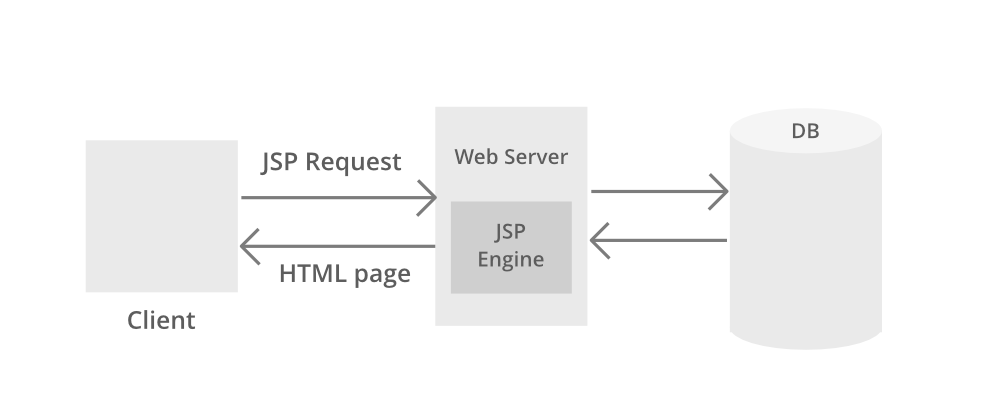

#### When to Use Servlet or JSP
- **Servlet**: When you need to handle business logic, form processing, and request management.
- **JSP**: When you need to build dynamic web pages with UI elements and embed minimal Java logic.

| **Servlet**                                                             | **JSP**                                                                                   |
| ----------------------------------------------------------------------- | ----------------------------------------------------------------------------------------- |
| Servlet is written mostly in **Java code**.                             | JSP is written mostly in **HTML with embedded Java**.                                     |
| Writing code is harder because you mix HTML inside Java.                | Easier to write because Java is embedded inside HTML.                                     |
| Acts as the **Controller** in MVC architecture.                         | Acts as the **View** in MVC architecture (UI).                                            |
| **Faster** than JSP (no translation step).                              | **Slower** than Servlet because JSP is first translated into a Servlet and then compiled. |
| Can accept **all protocol** requests.                                   | Accepts **only HTTP** protocol requests.                                                  |
| Supports overriding the `service()` method.                             | Cannot override the `service()` method.                                                   |
| Session management is **not enabled by default**.                       | Session management is **enabled by default**.                                             |
| Both business logic and presentation logic may end up in the same file. | Business logic is separated from presentation using **JavaBeans / JSTL**.                 |
| Modification requires recompilation, redeployment, and server restart.  | Updating a JSP is faster—just refresh the page.                                           |
| Does **not provide implicit objects**.                                  | Provides many **implicit objects** (request, response, session, out, etc.).               |
| Cannot directly run JavaScript on the client side.                      | Can run JavaScript easily for client-side validation.                                     |
| Packages must be imported at the top of the file.                       | Packages can be imported anywhere in the JSP using `<%@ page import="..." %>`.            |
| Good for **heavy data processing**.                                     | Not suitable for heavy data processing.                                                   |
| No support for writing custom tags.                                     | Supports **JSP Custom Tags** and **JSTL**.                                                |
| Servlets are hosted and executed directly on web servers.               | JSP is first converted into a Servlet, then executed like any servlet.                    |

### Frameworks in Advanced Java
- **Spring MVC**: Implements the Model-View-Controller pattern for structured web applications.
- **Hibernate**: ORM framework that maps Java objects to database tables.
- **JSF (JavaServer Faces)**: Component-based UI framework for Java web apps.

### MVC Architecture in Java Web Apps
- **Model**: Business logic and database layer.
- **View**: Presentation layer (JSP, HTML, or frontend frameworks).
- **Controller**: Handles user requests and directs them to the right resources.

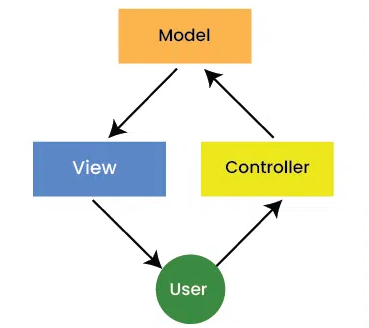

### Spring Boot (Modern Java Web Development)
Spring Boot is a framework built on top of the Spring ecosystem that simplifies web application development.

**Key Features:**

- **Auto-configuration**: Reduces boilerplate setup.
- **Embedded Servers**: Comes with Tomcat, Jetty, or Undertow, so no manual server setup is needed.
- **Production-ready**: Includes monitoring, health checks, and metrics.
- **Microservices support**: Ideal for cloud-native applications.

Spring Boot allows developers to quickly create RESTful APIs, MVC-based web apps, and enterprise applications with minimal configuration.

## 75. Servlet Fundamentals and Lifecycle
A **Servlet** is a Java program that runs on a **server** and handles **HTTP requests and responses**.
Servlets are the core technology of **Java Web Development** and are used to build dynamic web applications.

They run inside a special environment called a **Servlet Container** (e.g., Apache Tomcat).

A Servlet is:
- A server-side Java class
- Used to handle web requests (HTTP)
- Used to generate dynamic responses (HTML, JSON, XML)
- Managed by a Servlet Container (Tomcat, Jetty, WildFly, GlassFish)

### Servlet Class

Every servlet must extend `HttpServlet` and override methods like:
- `doGet()`
- `doPost()`
- `doPut()`
- `doDelete()`
- `service()`

### Features of Java Servlets
- Work on the server-side.
- Efficiently handle complex client requests.
- Generate dynamic responses.
- Provide better performance compared to older technologies like CGI.
- Highly scalable in enterprise-level web applications.

### Java Servlets Architecture
Java servlets container play a very important role. It is responsible for handling important tasks like load balancing, session management and resource allocation, it make sure that all the requests are process efficiently under high traffic. The container distribute requests accross multiple instances, which helps improve the system performance.

Servlet Architecture can be depicted from the image itself as provided below as follows: 


### Servlet Architecture Workflow:
Execution of Servlets basically involves Six basic steps: 

- The Clients send the request to the Web Server.
- The Web Server receives the request.
- The Web Server passes the request to the corresponding servlet.
- The Servlet processes the request and generates the response in the form of output.
- The Servlet sends the response back to the webserver.
- The Web Server sends the response back to the client and the client browser displays it on the screen.

#### Need of Server-Side Extensions
- Server-side extensions allow dynamic web page generation by running programs on the server.
- Web servers provide APIs to help developers build these applications.
- Java Servlets (part of Jakarta EE) are a key API for Java-based web development.

### Lifecycle of a Servlet

Servlet lifecycle is managed entirely by the **Servlet Container**.

```
           Container Loads Servlet
                    ↓
             init() method
                    ↓
       service() called per request
                    ↓
             destroy() method
                    ↓
           Servlet removed from memory
```

**1. Loading and Instantiation**

* Container loads the servlet class into memory
* Creates an instance of the servlet (only once)

**2. init()**

Called **only once** when the servlet is first created.

Used for initialization:

```java
public void init() throws ServletException {
    // Initialize DB connections, resources
}
```

**3. service()**

Called for **every request**.

* Determines request type (GET/POST/etc.)
* Calls the appropriate method:

  * `doGet()`
  * `doPost()`
  * `doPut()`
  * `doDelete()`

Example:

```java
protected void doGet(HttpServletRequest req, HttpServletResponse res)
```

**4. destroy()**

Called only **once** before servlet is removed.

Used for cleanup:

```java
public void destroy() {
    // Close DB connections, release resources
}
```

### Servlet Architecture

Servlet architecture is based on the request–response model.

**Servlet Architecture Flow**

```
Browser → HTTP Request → Servlet Container → Servlet → Response → Browser
```

**Components**

1. **Client** – browser sending HTTP request
2. **Web Server** – receives request
3. **Servlet Container** – runs servlet
4. **Servlet** – processes logic
5. **Response** – HTML/JSON/XML sent back

### Types of Servlets

**1. Generic Servlet**

* Protocol-independent
* Extends `GenericServlet`

**2. HTTP Servlet**

* Most commonly used
* Extends `HttpServlet`
* Designed specifically for HTTP

### Servlet Program Example

**Simple HttpServlet Example**

```java
import java.io.*;
import javax.servlet.*;
import javax.servlet.http.*;

public class HelloServlet extends HttpServlet {

    public void doGet(HttpServletRequest req, HttpServletResponse res)
            throws ServletException, IOException {

        res.setContentType("text/html");
        PrintWriter out = res.getWriter();

        out.println("<h2>Hello from Servlet!</h2>");
    }
}
```

**URL Mapping (web.xml example)**

```xml
<servlet>
    <servlet-name>HelloServlet</servlet-name>
    <servlet-class>HelloServlet</servlet-class>
</servlet>

<servlet-mapping>
    <servlet-name>HelloServlet</servlet-name>
    <url-pattern>/hello</url-pattern>
</servlet-mapping>
```

### Advantages of Servlets

| Advantage     | Description                                     |
| ------------- | ----------------------------------------------- |
| **Fast**      | No new process created per request (unlike CGI) |
| **Portable**  | Java-based, platform independent                |
| **Secure**    | Built-in security APIs                          |
| **Scalable**  | Uses multithreading                             |
| **Efficient** | Uses fewer resources                            |

### Servlets vs Other Technologies

**Servlet vs CGI**

| Servlet          | CGI                |
| ---------------- | ------------------ |
| Multithreaded    | Process-based      |
| Fast             | Slow               |
| Memory-efficient | High memory usage  |
| Supports session | No session support |

**Servlet vs JSP**

| Servlet       | JSP           |
| ------------- | ------------- |
| Java code     | HTML + Java   |
| Harder for UI | Easier for UI |
| Controller    | View          |

### Where Are Servlets Used

* Dynamic websites
* REST APIs
* Login systems
* Admin dashboards
* E-commerce
* Session/cookie management

## 76. MVC (Model View Controller)
MVC stands for Model View and Controller. It is a design pattern that spearates the business logic, presentation logic and data.

MVC stands for **Model–View–Controller**, a design pattern that separates the **business logic**, **presentation logic**, and **application flow**. It helps keep applications **organized, scalable, and easier to maintain**.

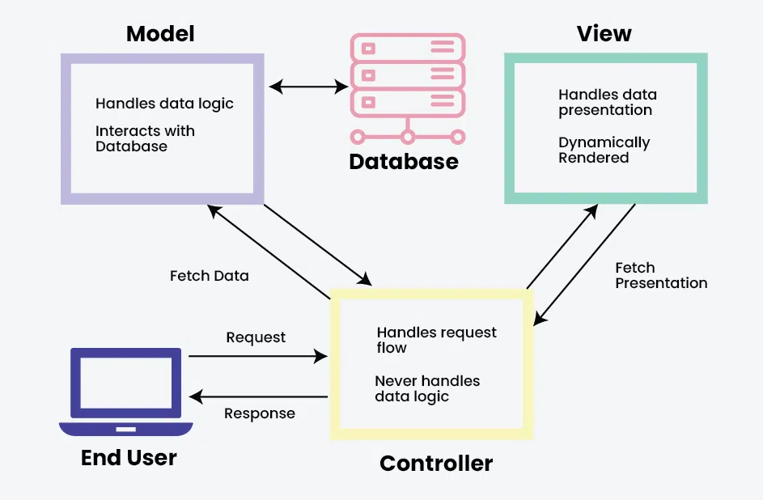

### Components of MVC

**1. Model (Data & Business Logic Layer)**

* Represents the **data**, business logic, and application rules.
* Interacts with the **database**.
* Does not know anything about UI (View).

**2. View (Presentation Layer)**

* Responsible for displaying the data to the user.
* Contains UI elements like JSP, HTML, CSS.
* Receives data from Controller and shows output.

**3. Controller (Request Handling Layer)**

* Acts as a **bridge** between View and Model.
* Receives user requests, processes them, and updates the Model.
* Selects the appropriate View to display data.

### MVC Workflow (How MVC Works)

```
User Request → Controller → Model → Controller → View → Response to User
```

1. User sends a request to the Controller.
2. Controller calls the Model for data.
3. Model returns processed data.
4. Controller forwards data to the View.
5. View displays the response back to the user.

### MVC in Java Web Applications

| MVC Part       | Implemented Using                            |
| -------------- | -------------------------------------------- |
| **Model**      | Java Classes, Beans, DAO, Hibernate Entities |
| **View**       | JSP, JSTL, HTML                              |
| **Controller** | Servlets                                     |

Example MVC Flow (Servlet + JSP):

```java
User → LoginServlet → UserDAO → LoginServlet → login.jsp
```

### Benefits of MVC Architecture

* **Enhanced Organization:** Clear separation keeps code clean.
* **Parallel Development:** Multiple developers can work on M, V, C independently.
* **Code Reusability:** Model can be reused in multiple views.
* **Maintainability:** Easy to update and debug.
* **Testability:** Each layer can be tested separately.

### Disadvantages of MVC

* Too many files (not suitable for small projects).
* Controller can become complex.
* Requires a good understanding of architecture.
* Slower initial setup.

### Where MVC is Used

* Java Web Applications (Servlet + JSP)
* **Spring MVC**
* **Spring Boot**
* Android Architecture (variants like MVVM/MVP)
* Enterprise applications

### Difference Between MVC vs MVVM vs MVP
- **MVC** – View gets data through Controller
- **MVP** – Presenter handles UI logic
- **MVVM** – ViewModel exposes data for View (used in Android)

## 77. Servlet Interface and Its Functions

The **Servlet Interface** is the *core* interface in Java Servlet API.
All servlets **must** implement this interface—directly or indirectly.

Every servlet in Java (GenericServlet, HttpServlet, custom servlets) is ultimately based on this interface.

It defines the **lifecycle methods** that the servlet container (Tomcat, Jetty, etc.) uses to manage a servlet's lifecycle.

Servlet Interface belongs to:

```
jakarta.servlet.Servlet     (Jakarta EE 9+)
javax.servlet.Servlet       (Java EE 8 and earlier)
```

Most developers extend:

* **`GenericServlet`** (for protocol-independent servlets)
* **`HttpServlet`** (for HTTP-specific servlets)

But internally, **everything starts from the `Servlet` interface**.

### What is the `Servlet` Interface?

It is the root interface inside the `javax.servlet` package.

The Servlet Interface provides the **basic contract** between a servlet and the servlet container.

It defines **5 abstract methods**, and **every servlet must implement these methods**, either directly or through a parent class like GenericServlet or HttpServlet.

Most developers do **not** implement Servlet directly.
Instead, they extend:

* `GenericServlet` (protocol-independent)
* `HttpServlet` (HTTP-specific)

```java
public interface Servlet {
    void init(ServletConfig config) throws ServletException;
    ServletConfig getServletConfig();
    void service(ServletRequest req, ServletResponse res) 
         throws ServletException, IOException;
    String getServletInfo();
    void destroy();
}
```

Any servlet must implement these **5 lifecycle methods**.

### Methods of Servlet Interface

**1. `init(ServletConfig config)`**

Called **once** when servlet is first loaded into memory.

**Purpose:**

* Initialize the servlet
* Read configuration values (from `web.xml`)
* Create resources like DB connections

Executed only **once per servlet instance**.

```java
public void init(ServletConfig config) throws ServletException {
    System.out.println("Servlet Initialized");
}
```

**2. `service(ServletRequest req, ServletResponse res)`**

Called **for every request** by container.

* Handles both **request processing** and **response generation**.
* For HttpServlet, this method internally calls:

  * `doGet()` for GET request
  * `doPost()` for POST request
    (and others like PUT, DELETE, etc.)

```java
public void service(ServletRequest req, ServletResponse res) 
       throws ServletException, IOException {
    res.getWriter().println("Processing request...");
}
```

**3. `destroy()`**

Called **once before servlet is removed from memory**.

Used for cleanup operations:

* Closing DB connections
* Releasing resources
* Stopping background tasks

```java
public void destroy() {
    System.out.println("Servlet Destroyed");
}
```

**4. `ServletConfig getServletConfig()`**

Returns the **ServletConfig object**, which contains configuration data defined in `web.xml` or via annotations.

Useful to get initialization parameters:

```java
ServletConfig config = getServletConfig();
String name = config.getInitParameter("username");
```

**5. `String getServletInfo()`**

Returns metadata about servlet such as:

* Author
* Version
* Copyright

Not commonly used.

```java
public String getServletInfo() {
    return "My Servlet v1.0, Created by Asha";
}
```

| Method                                             | Purpose                                                                       |
| -------------------------------------------------- | ----------------------------------------------------------------------------- |
| `init(ServletConfig config)`                       | Called once when servlet is created (initialization).                         |
| `service(ServletRequest req, ServletResponse res)` | Called for **every request**. Dispatches to doGet(), doPost() in HttpServlet. |
| `destroy()`                                        | Called once before servlet is removed (cleanup).                              |
| `getServletConfig()`                               | Returns configuration object (`ServletConfig`).                               |
| `getServletInfo()`                                 | Returns servlet description (developer info).                                 |

### Servlet Lifecycle (Using These Methods)

```
          Client Request
                 ↓
        (Servlet Loaded)
                 ↓
        init() → called once
                 ↓
        service() → called for each request
                 ↓
        destroy() → called once when shutting down
```

Lifecycle managed by the **Servlet Container** (Tomcat, Jetty, GlassFish).

❓ **Why Developers Don’t Implement Servlet Interface Directly?**

▶ Because it requires writing **all 5 methods manually**, which is unnecessary.

Instead:

 ⭐ Extend `GenericServlet`
* Only implement `service()`
* Used for non-HTTP protocols (rare)

 ⭐ Extend `HttpServlet` (most common)
* Implement `doGet()`, `doPost()`, etc.
* No need to handle `service()`, `init()`, or `destroy()`

### Servlet Interface to HttpServlet

```
Servlet (Interface)
      ↑ implements
GenericServlet (Class)
      ↑ extends
HttpServlet (Class)
```

This hierarchy allows you to override only what you need.

#### Quick Comparison: Servlet Interface vs GenericServlet vs HttpServlet

| Class/Interface         | Purpose                                              |
| ----------------------- | ---------------------------------------------------- |
| **Servlet (interface)** | Base interface, defines 5 lifecycle methods          |
| **GenericServlet**      | Simplifies development for *non-HTTP* protocols      |
| **HttpServlet**         | Designed specifically for **HTTP** (GET, POST, etc.) |

Most modern Java web apps use **HttpServlet**.

**Example Custom Servlet Implementing `Servlet` Interface**

```java
import javax.servlet.*;
import java.io.*;

public class MyServlet implements Servlet {
    
    ServletConfig config;

    public void init(ServletConfig config) {
        this.config = config;
        System.out.println("Init called");
    }

    public void service(ServletRequest req, ServletResponse res) 
           throws IOException {
        res.setContentType("text/html");
        PrintWriter out = res.getWriter();
        out.println("<h2>Hello from MyServlet</h2>");
    }

    public void destroy() {
        System.out.println("Destroy called");
    }

    public ServletConfig getServletConfig() {
        return config;
    }

    public String getServletInfo() {
        return "MyServlet 1.0 by Asha";
    }
}
```

Modern applications prefer:

```java
public class MyServlet extends HttpServlet { … }
```

Because it is simpler and supports HTTP methods directly.

| Method                 | Called When               | Purpose                  |
| ---------------------- | ------------------------- | ------------------------ |
| **init()**             | Servlet loads into memory | Initialization           |
| **service()**          | For every request         | Request processing       |
| **destroy()**          | Before servlet unloads    | Cleanup                  |
| **getServletConfig()** | Anytime                   | Access config params     |
| **getServletInfo()**   | Anytime                   | Returns servlet metadata |

### What Happens Internally When Servlet is Loaded

Include these important points:
- A servlet is loaded **on first request** or **at server startup** (<load-on-startup>).
- Container:
    - Loads the class
    - Creates **single instance**
    - Calls `init()`
    - For each request → calls `service()`
    - On shutdown → calls `destroy()`

### ServletConfig and ServletContext Relation

Mention that `init(ServletConfig config)` gives access to:
- `ServletConfig` → servlet-specific parameters
- `ServletContext` → application-wide parameters

### Threading Model (VERY Important in exams)

Servlets are **multi-threaded**:
- Container creates **one servlet instance**
- For each request → **new thread** is created
- Therefore:
    - Servlets are **not thread-safe**
    - Avoid using instance variables

You can mention:
```
Avoid shared variables because multiple threads may modify them.
```

### Exception Handling in Servlet Methods

You can note:
- `service()`, `init()` may throw `ServletException` or `IOException`
- Container logs exceptions and may show 500 error page

### Difference between `GenericServlet` vs `HttpServlet`
| GenericServlet            | HttpServlet                |
| ------------------------- | -------------------------- |
| Protocol-independent      | HTTP-specific              |
| Used rarely               | Used in 99% web apps       |
| Must override `service()` | Override doGet(), doPost() |
| For any protocol          | For HTTP only              |

### Servlet Loading Options

Important for configuration questions:

**On first request (default)**

Servlet loads only when needed.

**At server startup**

Using **web.xml**:
```xml
<load-on-startup>1</load-on-startup>
```
**Lower number = higher priority**

### Additional Concepts in Servlet Interface

* Servlets are **multi-threaded**, meaning one servlet instance handles multiple requests simultaneously.
* Container manages entire servlet lifecycle according to `Servlet` interface.
* `ServletConfig` is provided during initialization and is specific to each servlet.
* `ServletContext` provides application-level information and initialization parameters.
* Developers rarely implement the `Servlet` interface directly; instead, they extend `GenericServlet` or `HttpServlet`.
* `init()` is called once, whereas `service()` is called for every request.
* `destroy()` is called once when the servlet is being taken out of service (server shutdown or redeployment).
* Servlets are **platform and server independent** because the container handles environment differences.

**Example: Implementing Servlet Interface (Not recommended in real apps)**

```java
public class MyServlet implements Servlet {
    public void init(ServletConfig config) { }
    public void service(ServletRequest req, ServletResponse res) { }
    public void destroy() { }
    public ServletConfig getServletConfig() { return null; }
    public String getServletInfo() { return "MyServlet"; }
}
```

**Example: Recommended Approach — Extend HttpServlet**

```java
public class MyHttpServlet extends HttpServlet {
    protected void doGet(HttpServletRequest req, HttpServletResponse res) {
        res.getWriter().println("Hello from GET!");
    }
}
```
---

* Servlet Interface defines the **lifecycle contract**.
* `init()` → called once
* `service()` → called for every request
* `destroy()` → called once before shutdown
* Developers use **HttpServlet** instead of implementing Servlet directly.

## 78. Content Types in HTTP and MIME

When a client (browser) or server sends data over HTTP, it must specify **what type of data** is being sent.
This is done using the **Content-Type header**, also known as the **MIME type**.

MIME = **Multipurpose Internet Mail Extensions**
It defines a standardized way of representing different kinds of content (text, images, audio, video, binary files, JSON, XML, etc.) on the web.

### Content-Type

`Content-Type` tells the browser **how to interpret the data** in the HTTP request or response.

**Example:**

```
Content-Type: text/html
```

This tells the browser, “The following data is HTML.”

### MIME Type

A MIME type consists of **two parts**:

```
type/subtype
```

Examples:

* `text/html`
* `image/png`
* `application/json`

### Why Content-Type is Important

* Helps browser display content correctly
* Helps server understand request body
* Enables file uploads/downloads
* Prevents incorrect data interpretation
* Used in API development (JSON/XML)


### Common MIME Types

**Text Content Types**

| Content Type      | Description              |
| ----------------- | ------------------------ |
| `text/plain`      | Plain text               |
| `text/html`       | HTML documents           |
| `text/css`        | Stylesheets              |
| `text/javascript` | Old JavaScript MIME type |

**Application (Most Important for APIs)**

| Content Type               | Description                    |
| -------------------------- | ------------------------------ |
| `application/json`         | JSON data (REST APIs use this) |
| `application/xml`          | XML data                       |
| `application/pdf`          | PDF documents                  |
| `application/octet-stream` | Binary file download           |
| `application/zip`          | ZIP files                      |

**Images**

| Content Type    | Description |
| --------------- | ----------- |
| `image/png`     | PNG image   |
| `image/jpeg`    | JPEG image  |
| `image/gif`     | GIF image   |
| `image/svg+xml` | SVG images  |

**Audio/Video MIME Types**

| Content Type | Description |
| ------------ | ----------- |
| `audio/mpeg` | MP3 audio   |
| `video/mp4`  | MP4 video   |

#### **Form Submission MIME Types (VERY IMPORTANT)**

**1. application/x-www-form-urlencoded**

Default for HTML forms (simple key-value pairs).

```
username=Shaurya&password=1234
```

**2. multipart/form-data**

Required for **file uploads**.

Used when `<input type="file">` is present.

**3. text/plain**

Rarely used. Sends form fields without encoding.

### Content-Type in HTTP Request

**Example: JSON Request**

```
POST /login HTTP/1.1
Content-Type: application/json

{
  "username": "Shaurya",
  "password": "1234"
}
```

**Example: Form Submission**

```
POST /register
Content-Type: application/x-www-form-urlencoded

name=Shaurya&city=Delhi
```

### Content-Type in HTTP Response

**HTML Response**

```
Content-Type: text/html
```

**JSON Response (most common in APIs)**

```
Content-Type: application/json
```

**File Download**

```
Content-Type: application/octet-stream
Content-Disposition: attachment; filename=report.pdf
```

---

### Accept Header (Client → Server)

Client tells server **what kind of response it can accept**.

Example:

```
Accept: application/json
```

Means: “I want the response in JSON.”

### Difference Between Content-Type and Accept Header

| Header       | Direction                          | Meaning                        |
| ------------ | ---------------------------------- | ------------------------------ |
| Content-Type | Client → Server OR Server → Client | What I am sending              |
| Accept       | Client → Server                    | What format I want in response |

### MIME Type Format

```
type/subtype; charset=UTF-8
```

Example:

```
Content-Type: text/html; charset=UTF-8
```

> charset defines character encoding (UTF-8 recommended).

### Why Developers Must Know MIME Types?

* Writing Servlets/JSP
* Sending/receiving JSON in REST APIs
* File uploads & downloads
* Handling form submissions
* Writing Spring Boot controllers
* Working with AJAX/Fetch API

## 79. Servlet API
Servlets are the Java programs that run on the Java-enabled web server or application server. They are used to handle the request obtained from the webserver, process the request, produce the response, then send a response back to the webserver. In Java, to create web applications we use Servlets. To create Java Servlets, we need to use **Servlet API** which contains all the necessary interfaces and classes. 

The **Servlet API** is a set of **interfaces and classes** provided by Java (Jakarta EE) that allows developers to create dynamic, server-side web applications.
It provides the foundation for working with:
* HTTP requests & responses
* Servlets
* Filters
* Listeners
* Session handling
* Web application lifecycle

Servlet API enables communication between the **web server (container)** and **Java program (servlet)**.

### Packages in Servlet API

Servlet API comes under these main packages:

| Package                                       | Description                                               |
| --------------------------------------------- | --------------------------------------------------------- |
| `jakarta.servlet` / `javax.servlet`           | Core servlet classes and interfaces                       |
| `jakarta.servlet.http` / `javax.servlet.http` | HTTP-specific classes (HttpServlet, HttpSession, Cookies) |

> **Note:**
> As of Jakarta EE 9 → all `javax.servlet.*` moved to `jakarta.servlet.*`.

 

Servlet API provides all the required interfaces, classes, and methods to develop a web application. we need to add the **servlet-api.jar** file in our web application to use the servlet functionality. We can download this jar file from Maven Repository.

### Key Interfaces and Classes in Servlet API

**1. `Servlet` Interface**

The root interface that every servlet must implement.
Defines the 5 core methods:

* `init()`
* `service()`
* `destroy()`
* `getServletConfig()`
* `getServletInfo()`

> Almost all servlets extend `GenericServlet` or `HttpServlet` (not implement `Servlet` directly).

**2. `GenericServlet` (Abstract Class)**

* Provides generic (protocol-independent) servlet functionalities.
* Implements `Servlet` interface except `service()` method.
* Used rarely; HTTP applications normally use `HttpServlet`.

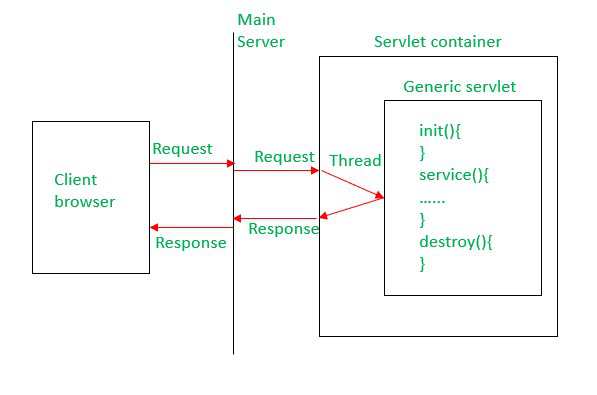

**3. `HttpServlet` (Most Important Class)**

A protocol-specific servlet for **HTTP**.

Defines HTTP lifecycle methods:

* `doGet()`
* `doPost()`
* `doPut()`
* `doDelete()`
* `doHead()`
* `doOptions()`
* `doTrace()`

This is what most web developers extend:

```java
public class MyServlet extends HttpServlet {
    protected void doGet(HttpServletRequest req, HttpServletResponse res) {
        // handle request
    }
}
```


### **Request and Response Handling**

**4. `ServletRequest` Interface**

Used to read incoming request data:

* Request parameters
* Request headers
* Input stream
* Form data

**5. `HttpServletRequest`**

Extends `ServletRequest` with HTTP-specific features:

* `getHeader()`
* `getCookies()`
* `getSession()`
* `getMethod()`
* `getRequestURI()`
* `getQueryString()`

**6. `ServletResponse` Interface**

Used to send data back to the client:

* Set content type
* Write output
* Set status code

**7. `HttpServletResponse`**

HTTP-specific response features:

* `setStatus()`
* `sendRedirect()`
* `addCookie()`
* `setHeader()`
* `getWriter()` / `getOutputStream()`

### **Servlet Configuration and Context**

**8. `ServletConfig`**

Used for servlet **initialization parameters** (per-servlet config).

```xml
<servlet>
  <servlet-name>DBServlet</servlet-name>
  <init-param>
      <param-name>url</param-name>
      <param-value>jdbc:mysql://localhost/db</param-value>
  </init-param>
</servlet>
```

Retrieve it:

```java
String url = getServletConfig().getInitParameter("url");
```

**9. `ServletContext`**

Represents entire web application.

Used for:

* Application-wide parameters
* Logging
* Getting file paths
* Shared resources

```java
ServletContext ctx = getServletContext();
ctx.getInitParameter("driver");
```

### **Filters and Listeners**

**10. `Filter` Interface**

Used to intercept requests:

* Authentication
* Logging
* Compression
* CORS
* Input validation

Implements:

* `init()`
* `doFilter()`
* `destroy()`

### Listeners

Automatically respond to events.

Common listeners:

| Listener                 | Event                                               |
| ------------------------ | --------------------------------------------------- |
| `ServletContextListener` | Application start/stop                              |
| `HttpSessionListener`    | Session creation/destruction                        |
| `ServletRequestListener` | Each request entering/exiting server                |
| Attribute listeners      | Track changes to context/session/request attributes |

Listeners help in:

* Logging
* Analytics
* Cleanup
* Session tracking

### Session Management (Servlet API)

#### Using **HttpSession**

```java
HttpSession session = req.getSession();
session.setAttribute("user", "Asha");
```

#### Managing cookies

```java
Cookie ck = new Cookie("name", "Asha");
res.addCookie(ck);
```

Servlet API handles:

* Session ID creation
* Cookie-based tracking
* URL rewriting if cookies disabled
* Session timeout

### Request Dispatching

Servlet API provides two important mechanisms:

**1. `RequestDispatcher` (Forward/Include)**

```java
RequestDispatcher rd = req.getRequestDispatcher("home.jsp");
rd.forward(req, res);
```

**2. Redirect**

```java
res.sendRedirect("login.jsp");
```

### File Upload (Servlet 3.0+)

Servlet API supports multipart uploads:

```java
@MultipartConfig
public class Upload extends HttpServlet { }
```

### Error Handling

* Custom error pages via `web.xml`
* Setting HTTP error codes using:

```java
res.sendError(404, "Page Not Found");
```

### Thread Safety in Servlets

Important rule:

> **Servlets are multithreaded—one instance handles many requests concurrently.**

Avoid:

* Instance variables
* Shared mutable state

### Servlet API Versions

| Java EE        | Package             |     |
| -------------- | ------------------- | --- |
| Java EE ≤ 8    | `javax.servlet.*`   | Old |
| Jakarta EE ≥ 9 | `jakarta.servlet.*` | New |

Modern servers (Tomcat 10+) require **jakarta.servlet** package.

### Summary Table of Servlet API Components
| Component                                    | Purpose                                 |
| -------------------------------------------- | --------------------------------------- |
| **Servlet Interface**                        | Core interface defining lifecycle       |
| **GenericServlet**                           | Protocol-neutral servlet implementation |
| **HttpServlet**                              | HTTP-specific servlet class (most used) |
| **ServletConfig**                            | Per-servlet initialization settings     |
| **ServletContext**                           | Application-wide settings & metadata    |
| **ServletRequest**                           | Read client request data                |
| **ServletResponse**                          | Send response to client                 |
| **HttpServletRequest / HttpServletResponse** | HTTP-specialized request/response       |

## 80. Steps to create a Servlet
To create a Servlet application you need to follow the below mentioned steps. These steps are common for all the Web server. 

These steps are as follows:
1. Create directory structure for your application.
2. Create a Servlet
3. Compile the Servlet (load `servlet-api.jar`, in case of Apache Tomcat Server)
4. Create Deployement Descriptor for your application (`web.xml` file)
5. Start the server and deploy the application

### Creating a Servlet
There are three different ways to create a servlet.

- By implementing Servlet interface
- By extending GenericServlet class
- By extending HttpServlet class

But mostly a servlet is created by extending **HttpServlet** abstract class. As discussed earlier **HttpServlet** gives the definition of `service()` method of the **Servlet** interface. The servlet class that we will create should not override `service()` method. Our servlet class will override only `doGet()` or `doPost()` method.

When a request comes in for the servlet, the Web Container calls the servlet's `service()` method and depending on the type of request the `service()` method calls either the `doGet()` or `doPost()` method.

> **NOTE**: By default a request is **Get** request.

### Compiling a Servlet
To compile a Servlet a JAR file is required. Different servers require different JAR files. In Apache Tomcat server `servlet-api.jar` file is required to compile a servlet class.

> **NOTE**: After compiling your Servlet class you will have to paste the class file into WEB-INF/classes/ directory.

### Create Deployment Descriptor
**Deployment Descriptor(DD)** is an XML document that is used by Web Container to run Servlets and JSP pages. DD is used for several important purposes such as:

- Mapping URL to Servlet class.
- Initializing parameters.
- Defining Error page.
- Security roles.
- Declaring tag libraries.

## 81. Filters and Listeners in Servlet API

### Filters in Servlets

A **Filter** is an object that intercepts incoming requests and outgoing responses **before** they reach the servlet or **after** the servlet processes them.

### Uses of Filters

* Authentication / Authorization
* Logging & auditing
* Request validation
* Compression
* Image / content optimization
* CORS handling
* Character encoding

### Filter Lifecycle

Filter implements these methods:

```java
init()
doFilter()
destroy()
```

### How a Filter Works

```
Client → Filter → Servlet → Response → Filter → Client
```

### Filter Configuration

#### Using web.xml

```xml
<filter>
   <filter-name>AuthFilter</filter-name>
   <filter-class>com.app.AuthFilter</filter-class>
</filter>

<filter-mapping>
   <filter-name>AuthFilter</filter-name>
   <url-pattern>/secure/*</url-pattern>
</filter-mapping>
```

#### Using Annotations

```java
@WebFilter("/secure/*")
public class AuthFilter implements Filter { }
```

### Listeners in Servlet API

Listeners allow your application to react to **events** happening in the server environment.

### Types of Listeners

| Listener Type            | Purpose / Triggered When…            |
| ------------------------ | ------------------------------------ |
| `ServletContextListener` | App starts or stops                  |
| `HttpSessionListener`    | Session created / destroyed          |
| `ServletRequestListener` | Request enters / leaves container    |
| Attribute Listeners      | Attributes added, removed or changed |

### Common Use Cases

* Count active users (session listener)
* Load configuration on app start
* Free resources on shutdown
* Track request times or logs
* Maintain statistics

**Example: ServletContextListener**

```java
public class AppListener implements ServletContextListener {
    public void contextInitialized(ServletContextEvent e) {
        System.out.println("App Started");
    }

    public void contextDestroyed(ServletContextEvent e) {
        System.out.println("App Stopped");
    }
}
```

### Difference Between Filters & Listeners

| Feature        | Filter                       | Listener                           |
| -------------- | ---------------------------- | ---------------------------------- |
| Purpose        | Intercept requests/responses | Respond to events                  |
| Sequence       | Before/After servlet         | No direct request/response control |
| Examples       | Auth, logging, encoding      | Session count, app startup         |
| Controls flow? | Yes (can block request)      | No                                 |

## 82. HttpServlet Class
`HttpServlet` is the most widely used class in the Servlet API. It provides built-in support for handling **HTTP requests** such as GET, POST, PUT, DELETE, etc. Almost every servlet you create in modern web applications extends `HttpServlet`.

`HttpServlet` belongs to the package:

```
jakarta.servlet.http
```

It simplifies web development by providing **HTTP-specific methods**, so developers don’t need to manually check request types or implement protocol logic.

### What is HttpServlet

`HttpServlet` is an **abstract class** that extends `GenericServlet` and provides methods to handle HTTP protocol requests.

Most web applications use `HttpServlet` because:

* Browsers communicate using **HTTP/HTTPS**
* It supports all HTTP methods
* It provides built-in session, cookie, header, and request handling features
* It simplifies creating REST-style endpoints

### HttpServlet Class Hierarchy

```
Object  
   ↳ GenericServlet  
        ↳ HttpServlet  
```

### **Important Methods in HttpServlet**
**1. `service()`**

Handles every request coming from the client.

Internally, it calls the respective `doXxx()` method based on request type:

| HTTP Method | Called Method |
| ----------- | ------------- |
| GET         | `doGet()`     |
| POST        | `doPost()`    |
| PUT         | `doPut()`     |
| DELETE      | `doDelete()`  |
| HEAD        | `doHead()`    |
| OPTIONS     | `doOptions()` |
| TRACE       | `doTrace()`   |

You rarely override `service()` manually.

**2. `doGet()`**

Used to handle **GET** requests.
Commonly used for:

* Displaying pages
* Fetching data
* URL query parameters

Example:

```java
protected void doGet(HttpServletRequest req, HttpServletResponse resp)
        throws IOException {
    resp.getWriter().println("This is GET request");
}
```
**3. `doPost()`**

Used to handle **POST** requests.
Commonly used for:

* Submitting forms (login, registration)
* Sending JSON data
* Posting files

Example:

```java
protected void doPost(HttpServletRequest req, HttpServletResponse resp)
        throws IOException {
    resp.getWriter().println("This is POST request");
}
```

**4. `doPut()` and `doDelete()`**

They support REST API behaviors:

* `doPut()` updates a resource
* `doDelete()` deletes a resource

Used mostly in API development (not JSP/HTML forms).

**5. `doHead()`**

Sends only headers, no response body.

**6. `doOptions()`**

Lists HTTP methods supported by the servlet.

**7. `doTrace()`**

Echoes back the request header.
(Disabled by default in many servers for security reasons.)

### **Lifecycle of HttpServlet**

| Phase                | Method                             |
| -------------------- | ---------------------------------- |
| **Initialization**   | `init()`                           |
| **Request handling** | `service()` → `doGet()/doPost()/…` |
| **Cleanup**          | `destroy()`                        |

The container creates **only one instance** of the servlet and uses **multiple threads** to handle requests.

### **Example of HttpServlet**

```java
import jakarta.servlet.*;
import jakarta.servlet.http.*;
import java.io.IOException;

public class HelloServlet extends HttpServlet {

    @Override
    protected void doGet(HttpServletRequest req, HttpServletResponse resp)
            throws IOException {

        resp.setContentType("text/html");
        resp.getWriter().println("<h1>Hello from HttpServlet!</h1>");
    }
}
```

### **Features Provided by HttpServlet**

✔ Handles all HTTP methods
✔ Supports session management (`HttpSession`)
✔ Built-in cookie handling
✔ Easy access to headers, parameters, paths
✔ Simplifies REST API development
✔ Cleaner than using `GenericServlet`

### **Difference Between GenericServlet and HttpServlet**

| Feature         | `GenericServlet`          | `HttpServlet`                       |
| --------------- | ------------------------- | ----------------------------------- |
| Protocol        | Protocol-independent      | HTTP-specific                       |
| Methods         | Must override `service()` | Override `doGet()`, `doPost()` etc. |
| Usage           | Rare today                | Standard for all web apps           |
| Session/Cookies | Not supported directly    | Built-in support                    |
| Typical Use     | Non-HTTP protocols        | Modern web applications             |

### When to Use HttpServlet

Use `HttpServlet` when:

* Building web applications
* Processing form data
* Creating REST APIs
* Handling login/logout
* Sending or receiving JSON/XML

This class is the **backbone of Java web development**.

## 83. GET vs POST

`GET` and `POST` are the two most commonly used **HTTP request methods** in web applications. They differ in **purpose, visibility, security, data size, and how browsers handle them**.

### **What is GET?**

`GET` is used to **request data** from the server.

#### Characteristics of GET

* Data is sent in the **URL** (query string).
* Used for **fetching data**, not modifying it.
* Can be **cached** by the browser.
* Can be **bookmarked**.
* Has **length limitations** (URL size).
* More visible, less secure.

#### Typical Uses

* Search queries
* Pagination
* Filters
* Simple form submissions where no sensitive data is involved

#### Example GET request

```
GET /login?user=Shaurya&city=Delhi HTTP/1.1
```

### **What is POST?**

`POST` is used to **send data to the server** for processing.

#### Characteristics of POST

* Data is sent in the **request body**, not URL.
* Used for **form submissions** and actions that **change server data**.
* Cannot be bookmarked.
* Not cached by browser (by default).
* No limit on data size (depends on server settings).
* Safer than GET (still not encrypted unless HTTPS is used).

#### Typical Uses

* Login form
* Registration form
* File upload
* Sending JSON data
* Creating resources (REST API)

#### Example POST request

```
POST /register HTTP/1.1
Content-Type: application/x-www-form-urlencoded

name=Dhairya&email=mail@example.com
```

### **Key Differences Between GET and POST**

| Feature             | GET                               | POST                        |
| ------------------- | --------------------------------- | --------------------------- |
| Purpose             | Retrieve data                     | Submit data                 |
| Data Location       | URL query string                  | Request body                |
| Security            | Less secure (data visible in URL) | More secure than GET        |
| Caching             | Yes                               | No                          |
| Bookmarkable        | Yes                               | No                          |
| Data Length Limit   | Yes (URL length)                  | No                          |
| Encoding Type       | query string encoding             | form-data, JSON, XML, files |
| Idempotent          | Yes                               | Not always                  |
| Use in REST         | Used for **READ**                 | Used for **CREATE/UPDATE**  |
| Browser Back Button | Safe                              | Re-submission warning       |

### **When to Use What?**

#### Use **GET** when:

- Fetching data
- Search operations
- No sensitive information is involved
- Bookmarkable URLs are needed

#### Use **POST** when:

- Submitting forms
- Sending sensitive data
- Uploading files
- Creating or modifying data
- Large amounts of data

#### **GET vs POST in Forms**

```html
<form method="get" action="search">
```

→ Shows data in URL.

```html
<form method="post" action="login">
```

→ Sends sensitive data inside HTTP body.

## 84. GenericServlet Class
`GenericServlet` is an **abstract class** provided by the Servlet API that acts as a **general-purpose, protocol-independent** servlet.
It implements the `Servlet`, `ServletConfig`, and `Serializable` interfaces and provides default implementations for most common methods.

Although modern web apps primarily use `HttpServlet`, understanding `GenericServlet` is important because it forms the **foundation** for servlet development.

### What is GenericServlet?

`GenericServlet` is a **generic (non-HTTP specific)** servlet class that can be used with any protocol (HTTP, FTP, SMTP, etc.).
It is rarely used directly in web development, but it works as the parent class for `HttpServlet`.

#### Class Declaration

```java
public abstract class GenericServlet
        implements Servlet, ServletConfig, Serializable
```

### Why GenericServlet Exists

Before HTTP became the standard, servlets were intended to support **multiple protocols**.
`GenericServlet` provides:

* A common servlet structure
* Lifecycle management
* Initialization support
* Access to ServletConfig & ServletContext

`HttpServlet` expands this class for HTTP-specific usage.

### **Key Features of GenericServlet**

✔ **Protocol-Independent**

It is not tied to HTTP.
(But in practice, almost all implementations use HTTP.)

✔ **Implements All Servlet Methods Except `service()`**

The only abstract method left for the developer:

```java
public abstract void service(ServletRequest req, ServletResponse res)
```

You must override this if you extend `GenericServlet`.

✔ **Provides Built-in Access to:**

* `ServletConfig`
* `ServletContext`
* Initialization parameters
* Logging utilities

✔ **Can Be Used for Non-HTTP Applications**

Rare, but valid—like custom socket-based servers.

### Important Methods in GenericServlet

**1. `init()`**

Initializes the servlet.

```java
public void init(ServletConfig config)
```

You can override:

```java
public void init() {
   // your initialization logic
}
```

**2. `service()` (Mandatory Override)**

Handles incoming client requests.

```java
public abstract void service(ServletRequest req, ServletResponse res)
```

**3. `destroy()`**

Performs cleanup before shutting down.

**4. `getServletConfig()`**

Returns `ServletConfig` object.

**5. `getServletContext()`**

```java
ServletContext ctx = getServletContext();
```

Used for logging, shared attributes, etc.

**6. `log()`**

Logs messages to server logs.

```java
log("Servlet started");
```

### Example of GenericServlet

```java
import jakarta.servlet.*;
import java.io.IOException;

public class MyGenericServlet extends GenericServlet {

    @Override
    public void service(ServletRequest req, ServletResponse res)
            throws IOException {

        res.setContentType("text/html");
        res.getWriter().println("<h2>Hello from GenericServlet!</h2>");
    }
}
```

### **GenericServlet vs HttpServlet**

| Feature                  | `GenericServlet`          | `HttpServlet`                       |
| ------------------------ | ------------------------- | ----------------------------------- |
| Protocol                 | Any protocol              | Only HTTP                           |
| Methods to override      | Must override `service()` | Override `doGet()`, `doPost()` etc. |
| Ease of use              | Less convenient           | Much easier for web apps            |
| Supports session/cookies | No                        | Yes                                 |
| Usage today              | Rare                      | Standard in web development         |

### When to Use GenericServlet

Use it when:

* You want complete control over the request-handling logic
* Protocol is not HTTP (very rare today)

Otherwise, **always prefer `HttpServlet`**.

## 85. ServletRequest Interface

`ServletRequest` is a core interface in the Servlet API that represents **client request data** sent to a servlet.
Every request (HTTP or non-HTTP) enters a servlet through this interface.

It is part of:

```
jakarta.servlet
```

For HTTP-specific features, it is extended by `HttpServletRequest`.

### What is ServletRequest?

`ServletRequest` provides methods to:

* Read **request parameters**
* Read **headers**
* Access **input stream**
* Retrieve **attributes**
* Get **client information**
* Get **protocol, content type, and content length**
* Work with **RequestDispatcher**

It acts as a **generic request wrapper**, independent of protocol.

### Main Responsibilities of ServletRequest

✔ Provides client request data

(Parameters, attributes, metadata)

✔ Helps read form fields and query strings

✔ Allows reading raw input stream

(Useful for binary uploads, JSON bodies)

✔ Allows passing data across servlets via attributes


### Important Methods of ServletRequest

**1. Parameter Handling**

Used for form data, query strings, etc.

```java
String getParameter(String name);
String[] getParameterValues(String name);
Enumeration<String> getParameterNames();
```

**2. Reading Request Body**

Used for reading JSON, XML, files, etc.

```java
BufferedReader getReader();
ServletInputStream getInputStream();
```

**3. Attributes (Inter-Servlet Communication)**

Used to pass data between servlets.

```java
void setAttribute(String name, Object value);
Object getAttribute(String name);
void removeAttribute(String name);
Enumeration<String> getAttributeNames();
```

**4. Client & Request Metadata**

```java
String getRemoteAddr();        // Client IP
String getRemoteHost();        // Client hostname
int getRemotePort();           // Client port
String getProtocol();          // HTTP/1.1, etc.
String getScheme();            // http or https
String getServerName();        // Server hostname
int getServerPort();           // Server port
```

**5. Content Information**

```java
String getContentType();       // MIME type
int getContentLength();
long getContentLengthLong();
```

**6. Locale Information**

```java
Locale getLocale();
Enumeration<Locale> getLocales();
```

**7. RequestDispatcher Methods**

Used for forwarding request to another resource:

```java
RequestDispatcher getRequestDispatcher(String path);
```

**8. Character Encoding**

```java
String getCharacterEncoding();
void setCharacterEncoding(String env);
```

### Relationship with HttpServletRequest

`ServletRequest` is the parent interface of:

```
HttpServletRequest
```

That means:

✔ `HttpServletRequest` contains all of `ServletRequest` methods

➕ additional HTTP-specific features:

* Cookies
* Sessions
* Headers
* Methods (GET/POST)
* URL/URI details


### **Common Usage in Servlets**

Example: reading form data

```java
String name = req.getParameter("username");
```

Example: forwarding request

```java
req.getRequestDispatcher("home.jsp").forward(req, res);
```

Example: setting attributes

```java
req.setAttribute("message", "Welcome!");
```

### Summary Table

| Feature     | `ServletRequest`                 |
| ----------- | -------------------------------- |
| Protocol    | Generic, non-HTTP specific       |
| Reads       | Parameters, body, attributes     |
| Metadata    | Client info, server info         |
| Streams     | Input stream, reader             |
| Dispatching | Supports forwarding to resources |
| Parent of   | `HttpServletRequest`             |


---

### HttpServletRequest Interface

`HttpServletRequest` is a **child interface** of `ServletRequest` and is used specifically for **HTTP-based requests**.

While `ServletRequest` is protocol-independent, `HttpServletRequest` adds all the features needed for web applications such as:

* Reading **HTTP headers**
* Handling **cookies**
* Managing **sessions**
* Knowing the **HTTP method** (GET/POST/etc.)
* Working with **URL / URI details**
* Processing **query strings**
* Reading form data and multipart content

It belongs to:

```
jakarta.servlet.http
```

#### Why HttpServletRequest Is Important

Every servlet that extends `HttpServlet` automatically receives an object of `HttpServletRequest` in:

```java
doGet(HttpServletRequest req, HttpServletResponse res)
doPost(HttpServletRequest req, HttpServletResponse res)
```

This interface is the backbone of **all request processing** in Java web applications.

#### Features Added by HttpServletRequest

**✔ HTTP Request Method Identification**

```java
String getMethod();   // GET, POST, PUT, DELETE
```

**✔ Header Handling**

```java
String getHeader(String name);
Enumeration<String> getHeaderNames();
int getIntHeader(String name);
long getDateHeader(String name);
```

**✔ URL and Path Information**

```java
String getRequestURI();
StringBuffer getRequestURL();
String getContextPath();
String getServletPath();
String getQueryString();
```

These are heavily used in routing and resource mapping.

**✔ Cookie Management**

```java
Cookie[] getCookies();
```

**✔ Session Management**

```java
HttpSession getSession();
HttpSession getSession(boolean create);
```

This supports login systems, user tracking, shopping carts, etc.


**✔ HTTP-Specific Attributes**

```java
String getAuthType();
String getRemoteUser();
boolean isUserInRole(String role);
Principal getUserPrincipal();
```

Useful for authentication and security.

**✔ Multipart/Form Data Handling**

Used for file uploads (Servlet 3.0+):

```java
Collection<Part> getParts();
Part getPart(String name);
```

#### **Comparison: ServletRequest vs HttpServletRequest**

| Feature          | ServletRequest | HttpServletRequest |
| ---------------- | -------------- | ------------------ |
| Protocol         | Generic        | HTTP-specific      |
| Input Stream     | ✔              | ✔                  |
| Parameters       | ✔              | ✔                  |
| Headers          | ❌              | ✔                  |
| Cookies          | ❌              | ✔                  |
| Sessions         | ❌              | ✔                  |
| HTTP Method      | ❌              | ✔                  |
| URL/URI Info     | Limited        | Full support       |
| Multipart Upload | Limited        | ✔                  |


#### Example Usage in Servlet

```java
protected void doGet(HttpServletRequest req, HttpServletResponse res)
        throws IOException {

    String name = req.getParameter("user");
    String method = req.getMethod();
    String agent = req.getHeader("User-Agent");
    HttpSession session = req.getSession();

    res.getWriter().println("User: " + name);
}
```

---

`HttpServletRequest` enhances `ServletRequest` by adding all essential **web, browser, and HTTP-related functionalities**, making it the core API used in modern Java web applications.

## 86. CRUD in Servlet
In Java web applications, **Servlets** handle CRUD operations by:

* Receiving HTTP requests
* Processing data
* Interacting with the database (via JDBC / DAO)
* Sending responses back to the client

#### CRUD Mapping with HTTP Methods

| CRUD Operation | Purpose         | HTTP Method  | Servlet Method           |
| -------------- | --------------- | ------------ | ------------------------ |
| **Create**     | Insert new data | POST         | `doPost()`               |
| **Read**       | Fetch data      | GET          | `doGet()`                |
| **Update**     | Modify data     | PUT / POST   | `doPut()` / `doPost()`   |
| **Delete**     | Remove data     | DELETE / GET | `doDelete()` / `doGet()` |

> In traditional JSP/HTML forms, **GET** and **POST** are most commonly used.

### Typical CRUD Architecture in Servlet

```
Browser
   ↓
Servlet (Controller)
   ↓
DAO / JDBC
   ↓
Database
   ↑
Servlet → JSP (Response)
```

#### **1. CREATE (Insert Data)**

Used to add new records into the database.

**HTTP Method:** POST
**Servlet Method:** `doPost()`

**Example: Insert User**

```java
protected void doPost(HttpServletRequest req, HttpServletResponse res)
        throws IOException {

    String name = req.getParameter("name");
    String email = req.getParameter("email");

    UserDAO dao = new UserDAO();
    dao.insertUser(name, email);

    res.sendRedirect("success.jsp");
}
```

#### **2. READ (Fetch Data)**

Used to retrieve data from the database.

**HTTP Method:** GET
**Servlet Method:** `doGet()`

**Example: Fetch All Users**

```java
protected void doGet(HttpServletRequest req, HttpServletResponse res)
        throws ServletException, IOException {

    UserDAO dao = new UserDAO();
    List<User> users = dao.getAllUsers();

    req.setAttribute("users", users);
    req.getRequestDispatcher("users.jsp").forward(req, res);
}
```

#### **3. UPDATE (Modify Data)**

Used to update existing records.

**HTTP Method:** PUT / POST
**Servlet Method:** `doPut()` or `doPost()`

**Example: Update User**

```java
protected void doPost(HttpServletRequest req, HttpServletResponse res)
        throws IOException {

    int id = Integer.parseInt(req.getParameter("id"));
    String name = req.getParameter("name");

    UserDAO dao = new UserDAO();
    dao.updateUser(id, name);

    res.sendRedirect("viewUsers");
}
```

#### **4. DELETE (Remove Data)**

Used to delete records.

**HTTP Method:** DELETE / GET
**Servlet Method:** `doDelete()` or `doGet()`

**Example: Delete User**

```java
protected void doGet(HttpServletRequest req, HttpServletResponse res)
        throws IOException {

    int id = Integer.parseInt(req.getParameter("id"));

    UserDAO dao = new UserDAO();
    dao.deleteUser(id);

    res.sendRedirect("viewUsers");
}
```

### DAO Layer (Recommended Practice)

Servlets should **not directly contain JDBC logic**.

**DAO (Data Access Object)** handles database operations.

```java
public class UserDAO {

    public void insertUser(String name, String email) {
        // JDBC insert logic
    }

    public List<User> getAllUsers() {
        // JDBC select logic
    }

    public void updateUser(int id, String name) {
        // JDBC update logic
    }

    public void deleteUser(int id) {
        // JDBC delete logic
    }
}
```

### CRUD Using JSP + Servlet Flow

```
JSP Form → Servlet → DAO → Database
Database → DAO → Servlet → JSP (Result)
```

### Best Practices for CRUD in Servlets

- Use **DAO pattern**
- Use **PreparedStatement** (prevent SQL Injection)
- Validate input data
- Handle exceptions properly
- Avoid database logic inside JSP
- Use MVC architecture

| CRUD   | Servlet Role                 |
| ------ | ---------------------------- |
| Create | Accept form data → insert DB |
| Read   | Fetch data → forward to JSP  |
| Update | Modify existing DB records   |
| Delete | Remove records from DB       |

---

❓: **What is SQL Injection?**

▶ SQL Injection is a way attackers trick your application into running harmful database commands by typing malicious input into form fields like:
- Login username
- Password
- Search box
- URL parameters

Instead of normal data, they send SQL code.

> **SQL Injection = User input behaving like SQL code**

> **SQL Injection** is a security vulnerability where an attacker injects malicious SQL statements into an application’s input fields to manipulate or access the database illegally.

## 87. Servlet Collaborations: `RequestDispatcher` and `sendRedirect`

In a Java web application, **servlet collaboration** means **one servlet or resource working with another** to process a request or generate a response.

The Servlet API provides **two main ways** for servlets to collaborate:

1. **`RequestDispatcher`**
2. **`sendRedirect()`**

---

### 1. `RequestDispatcher`

`RequestDispatcher` is used to **forward a request** from one servlet to another resource **within the same server**.

It belongs to:

```
jakarta.servlet
```

#### Key Characteristics

* Works **inside the server**
* Browser **does not know** about the forwarding
* **Same request and response objects** are shared
* Faster than redirect
* Can forward to:

  * Another servlet
  * JSP
  * HTML resource

#### Types of RequestDispatcher Operations

**a) `forward()`**

Transfers control from one servlet to another resource.

```java
RequestDispatcher rd = req.getRequestDispatcher("home.jsp");
rd.forward(req, res);
```

- URL in browser **remains same**
- Request attributes are preserved
- Used in MVC (Controller → View)

**b) `include()`**

Includes content of another resource in the response.

```java
RequestDispatcher rd = req.getRequestDispatcher("header.jsp");
rd.include(req, res);
```

- Used for common content (header, footer)
- Response is **combined**

#### Example: Forwarding Data

```java
req.setAttribute("msg", "Welcome Asha");
RequestDispatcher rd = req.getRequestDispatcher("welcome.jsp");
rd.forward(req, res);
```

### 2. `sendRedirect()`

`sendRedirect()` is used to **redirect the client (browser)** to a **new URL**.

It belongs to:

```
jakarta.servlet.http.HttpServletResponse
```

**Syntax:**

```java
res.sendRedirect("login.jsp");
```

#### How sendRedirect Works

1. Server sends **HTTP 302** response
2. Browser receives new URL
3. Browser sends **new request** to that URL

🚨 **New request is created**

#### Key Characteristics

* Browser **URL changes**
* Request data is **lost**
* Slower (extra request)
* Can redirect to:

  * Same server
  * Different server
  * External sites

**Example:**

```java
res.sendRedirect("https://google.com");
```

### Comparison: RequestDispatcher vs sendRedirect

| Feature                 | RequestDispatcher             | sendRedirect                |
| ----------------------- | ----------------------------- | --------------------------- |
| Works at                | Server-side                   | Client-side (browser)       |
| Number of requests      | 1                             | 2                           |
| URL change in browser   | ❌ No                          | ✔ Yes                       |
| Request object shared   | ✔ Yes                         | ❌ No                        |
| Request attributes kept | ✔ Yes                         | ❌ No                        |
| Performance             | Faster                        | Slower                      |
| External redirection    | ❌ No                          | ✔ Yes                       |
| Typical use             | MVC flow, internal forwarding | Login redirect, PRG pattern |

### When to Use What?

#### Use **RequestDispatcher** when:

* Forwarding to JSP
* Passing data between servlets
* Implementing MVC architecture
* Keeping URL unchanged

#### Use **sendRedirect()** when:

* Redirecting after form submission
* Avoiding duplicate form submission
* Redirecting to another application or site
* Changing browser URL

### Real-World Example

#### Login Success (Forward)

```java
RequestDispatcher rd = req.getRequestDispatcher("dashboard.jsp");
rd.forward(req, res);
```

#### Login Failure (Redirect)

```java
res.sendRedirect("login.jsp?error=true");
```

### One-Line Memory Trick 🧠

> **forward = server work (same request)**
>
> **redirect = browser trip (new request)**

---

Servlet collaboration allows multiple resources to work together using:

* **RequestDispatcher** → internal server-side forwarding
* **sendRedirect()** → client-side redirection

Both are essential for building **structured, scalable Java web applications**.

## 88. ServletConfig Interface
The `ServletConfig` interface is part of the **Servlet API** and provides **configuration information** for a specific servlet.
It is used to read **initialization parameters** defined in `web.xml` (or via annotations), without hard-coding them inside the servlet class.

`ServletConfig` belongs to:

```
jakarta.servlet
```

It is created by the **servlet container** and passed to the servlet during initialization.

### Why ServletConfig Exists

When a servlet is loaded, the container can provide **initialization parameters** such as:

* Database connection settings
* API keys
* File paths
* Environment configurations

This makes servlets **configurable and reusable** without modifying Java code.

### How ServletConfig Is Provided

During servlet initialization, the container calls:

```java
init(ServletConfig config)
```

The `ServletConfig` object passed here contains:

- Initialization parameters (`<init-param>`)
- A reference to the `ServletContext`

### Accessing ServletConfig

You can access `ServletConfig` from anywhere inside your servlet using:

```java
getServletConfig()
```

This returns the `ServletConfig` object associated with that servlet instance.

### Defining Initialization Parameters

#### Using web.xml (Deployment Descriptor)

```xml
<servlet>
    <servlet-name>DBServlet</servlet-name>
    <servlet-class>com.app.DBServlet</servlet-class>

    <init-param>
        <param-name>url</param-name>
        <param-value>jdbc:mysql://localhost:3306/mydb</param-value>
    </init-param>

    <init-param>
        <param-name>username</param-name>
        <param-value>root</param-value>
    </init-param>

</servlet>
```


### Retrieving Init Parameters in Servlet

```java
public void init(ServletConfig config) throws ServletException {

    String url = config.getInitParameter("url");
    String user = config.getInitParameter("username");

    System.out.println("DB URL: " + url);
    System.out.println("DB User: " + user);
}
```

Or directly inside servlet methods:

```java
String url = getServletConfig().getInitParameter("url");
```

### Common Methods of ServletConfig

| Method                          | Purpose                                    |
| ------------------------------- | ------------------------------------------ |
| `getInitParameter(String name)` | Returns value of a specific init parameter |
| `getInitParameterNames()`       | Returns all init parameter names           |
| `getServletContext()`           | Returns the `ServletContext` object        |
| `getServletName()`              | Returns the logical name of the servlet    |

### **Example Using ServletConfig**

**ServletConfig Example Servlet**

```java
import jakarta.servlet.*;
import jakarta.servlet.http.*;
import java.io.IOException;

public class ConfigServlet extends HttpServlet {

    public void init(ServletConfig config) throws ServletException {
        super.init(config);

        String dbUrl = config.getInitParameter("url");
        String user = config.getInitParameter("username");

        System.out.println("DB URL: " + dbUrl);
        System.out.println("User: " + user);
    }

    protected void doGet(HttpServletRequest req,
                         HttpServletResponse res)
                         throws IOException {
        res.getWriter().println("ServletConfig example");
    }
}
```

### **ServletConfig vs ServletContext**

| Feature  | ServletConfig              | ServletContext            |
| -------- | -------------------------- | ------------------------- |
| Scope    | Only for one servlet       | Entire web application    |
| Shared   | Not shared across servlets | Shared among all servlets |
| Used for | Initialization parameters  | App-wide resources & data |
| Access   | `getServletConfig()`       | `getServletContext()`     |

### Why Use ServletConfig?

- Keeps servlet settings separate from code
- Makes applications **configurable without recompiling**
- Useful for credentials, paths, and environment values
- Keeps code cleaner and easier to maintain

---

* `ServletConfig` gives servlet-specific configuration
* Parameters are defined in `web.xml` or annotations
* Used for initialization logic
* Provides servlet name and access to the context

## 89. ServletContext Interface
`ServletContext` is an interface that represents the **entire web application**.
It allows servlets to **share information**, access **application-level parameters**, and interact with the **web container**.

It is part of:

```
jakarta.servlet
```

Unlike `ServletConfig` (which is **per servlet**), `ServletContext` is **one per web application**.

### What is ServletContext?

`ServletContext` provides a way for:

* Servlets to **communicate with each other**
* Accessing **global configuration parameters**
* Managing **shared resources**
* Interacting with the **container environment**

Think of it as a **common meeting room** for all servlets in a web app 🏢

### Key Characteristics

* One `ServletContext` per web application
* Created when the application starts
* Destroyed when the application stops
* Shared across **all servlets, filters, and listeners**

### How to Get ServletContext

```java
ServletContext context = getServletContext();
```

or

```java
ServletContext context = getServletConfig().getServletContext();
```

### Uses of ServletContext

- Sharing data between servlets
- Reading application-wide parameters
- Logging information
- Getting real file paths
- Managing resources

### Important Methods of ServletContext

#### 1. Application Parameters (Global)

Defined in `web.xml`:

```xml
<context-param>
    <param-name>dbDriver</param-name>
    <param-value>com.mysql.cj.jdbc.Driver</param-value>
</context-param>
```

Accessing it:

```java
String driver = context.getInitParameter("dbDriver");
```

Methods:

```java
String getInitParameter(String name);
Enumeration<String> getInitParameterNames();
```

#### 2. Attribute Handling (Shared Data)

Used for sharing objects across servlets.

```java
context.setAttribute("appName", "MyWebApp");
String name = (String) context.getAttribute("appName");
context.removeAttribute("appName");
```

Methods:

```java
void setAttribute(String name, Object value);
Object getAttribute(String name);
void removeAttribute(String name);
Enumeration<String> getAttributeNames();
```

#### 3. Logging

```java
context.log("Application started");
```

Used for server-side logging.

#### 4. Getting Real Path

```java
String path = context.getRealPath("/images/logo.png");
```

Useful for accessing files inside the web app.

#### 5. Request Dispatching

```java
RequestDispatcher rd = context.getRequestDispatcher("/home.jsp");
rd.forward(req, res);
```

### ServletContext vs ServletConfig

| Feature         | ServletConfig        | ServletContext                |
| --------------- | -------------------- | ----------------------------- |
| Scope           | Single servlet       | Entire web application        |
| Object count    | One per servlet      | One per web app               |
| Init parameters | Servlet-specific     | Application-wide              |
| Data sharing    | ❌ No                 | ✔ Yes                         |
| Access method   | `getServletConfig()` | `getServletContext()`         |
| Used for        | Servlet setup        | App-wide configuration & data |

### When to Use ServletContext

Use `ServletContext` when you need to:

* Share data between multiple servlets
* Store global configuration values
* Log application-level events
* Access common resources

### Example Usage

```java
public class FirstServlet extends HttpServlet {
    protected void doGet(HttpServletRequest req, HttpServletResponse res) {
        ServletContext ctx = getServletContext();
        ctx.setAttribute("count", 1);
    }
}
```

```java
public class SecondServlet extends HttpServlet {
    protected void doGet(HttpServletRequest req, HttpServletResponse res) {
        ServletContext ctx = getServletContext();
        int count = (int) ctx.getAttribute("count");
    }
}
```

### Common Use Cases

- Application-wide configuration
- Database connection pooling
- Caching data
- Sharing constants
- Logging
- Resource access

---

> **ServletContext = Application-wide shared object**

It is heavily used in real-world Java web applications for configuration, caching, and resource management.

| Feature              | ServletContext     |
| -------------------- | ------------------ |
| Scope                | Application-wide   |
| Shared between       | All servlets       |
| Parameters           | Context parameters |
| Data storage         | Attributes         |
| Lifecycle managed by | Servlet Container  |
| Listener support     | ✔ Yes              |

* `ServletContext` represents the **entire web application**
* Shared across all servlets
* Used for global parameters and shared data
* Lives as long as the application is running

This interface is a **cornerstone for inter-servlet communication** in Java web applications 🌐

## 90. Attributes in Servlet

**Attributes** in Servlets are used to **store data temporarily** and **share information** between different components of a web application such as servlets, JSPs, and filters.

In Java Servlets, an **Attribute** is an object that is stored inside a **request**, **session**, or **application (context)** scope to **share data** between different components of a web application.

Attributes are mainly used to:

* Transfer data between servlets
* Pass data from servlet to JSP
* Share data across multiple requests or users

An **attribute** is a **key–value pair**:

```
Attribute Name  →  Attribute Value (Object)
```

Example:

```java
"userName" → "Asha"
```

Attributes can store **any Java object**.

An attribute is stored as a **key–value pair**:

```java
setAttribute(String name, Object value)
getAttribute(String name)
removeAttribute(String name)
```

### Attribute Scopes in Servlet

Java web applications provide **four attribute scopes**, based on how long the data lives and who can access it.

| Scope       | Interface/Class Used | Lifetime           |
| ----------- | -------------------- | ------------------ |
| Request     | `ServletRequest`     | Single request     |
| Session     | `HttpSession`        | User session       |
| Application | `ServletContext`     | Entire application |

#### **1. ServletConfig Attributes – Servlet Scope**

**Scope:** One servlet only
**Lifetime:** As long as the servlet exists

`ServletConfig` is used to store **servlet-specific data**.

```java
ServletConfig config = getServletConfig();
```

✔ Used for initialization parameters

❌ Not shared with other servlets

Example:

```java
String driver = config.getInitParameter("dbDriver");
```

📌 **Use case:** Servlet-specific configuration

#### **2. ServletContext Attributes – Application (Context) Scope**

**Scope:** Entire web application
**Lifetime:** Until application stops

`ServletContext` attributes are **shared across all servlets and JSPs**.

```java
ServletContext context = getServletContext();
```

Example:

```java
context.setAttribute("appName", "My Web App");
String name = (String) context.getAttribute("appName");
```

- Scope: **Entire application**
- Shared globally
- Use carefully due to thread-safety concerns
- Ideal for configuration, caching, counters

📌 **Use case:** Application-wide data

#### **3. ServletRequest Attributes – Request Scope**

**Scope:** Single request
**Lifetime:** Until request is completed

Used when forwarding data from one servlet to another or to JSP.

```java
request.setAttribute("msg", "Login Successful");
```

Access in JSP or another servlet:

```java
String msg = (String) request.getAttribute("msg");
```

- Scope: **Single request**
- Lost after response is sent
- Commonly used with `RequestDispatcher.forward()`
- Automatically destroyed after response

📌 **Use case:** Passing data during request forwarding

#### **4. HttpSession Attributes – Session Scope**

**Scope:** One user session
**Lifetime:** Until session expires or is invalidated

Used to store **user-specific data**.

```java
HttpSession session = request.getSession();
session.setAttribute("user", "Asha");
```

Retrieve later:

```java
String user = (String) session.getAttribute("user");
```

- Scope: **Per user**
- Used for login, cart, user preferences
- Exists until session timeout or invalidation
- Persists across multiple requests

📌 **Use case:** User authentication, shopping cart

### Scope Mapping (Important)

| Scope Name        | Interface/Class  | Lifetime           |
| ----------------- | ---------------- | ------------------ |
| Servlet Scope     | `ServletConfig`  | One servlet        |
| Application Scope | `ServletContext` | Entire application |
| Request Scope     | `ServletRequest` | One request        |
| Session Scope     | `HttpSession`    | One user session   |


`ServletConfig` is **Servlet scope**, not page scope

(Page scope is a **JSP concept**, not servlet.)

### Request vs Session vs Application Attributes
| Feature  | Request          | Session          | Application      |
| -------- | ---------------- | ---------------- | ---------------- |
| Scope    | Single request   | One user         | All users        |
| Lifetime | Very short       | Session duration | App lifetime     |
| Storage  | `ServletRequest` | `HttpSession`    | `ServletContext` |
| Use case | Forwarding data  | Login, cart      | Config, caching  |

### Common Use Cases

- Passing data from Servlet to JSP
- Sharing data between servlets
- Maintaining user login state
- Application-level configuration
- Caching frequently used objects

## When to Use What?

- **Request** → Forwarding data
- **Session** → User data
- **Context** → Global/shared data
- **Config** → Servlet initialization

### Quick Memory Trick
**Attributes = server-side shared data containers**

```
Request  → Shortest
Session  → User-level
Context  → Global
Config   → Servlet-only
```

---

* Attributes store **Objects**, not primitive types directly
* Attributes are different from **parameters**
* Request attributes work only with **forward**, not redirect
* Application attributes must be **thread-safe**
* Use minimal data in session to avoid memory issues

## 91. State Management
**State Management** in Servlets is the process of **preserving user data (state)** across **multiple HTTP requests**.

### Why State Management Is Needed

HTTP is a **stateless protocol**, which means:

* Each request is treated as **new**
* Server does **not remember previous requests**
* User information is lost after every response

But real applications need to remember things like:

* Logged-in user
* Shopping cart
* Preferences
* Session data

👉 **State management solves this problem.**

### What Is State?

**State** = User-related data stored between multiple requests

Example:

```
Username, Login status, Cart items
```

### Types of State Management in Servlets

Servlets support **two main types**:

1. **Client-side State Management**
2. **Server-side State Management**

#### 1. Client-Side State Management

Data is stored **on the client (browser)**.

**a) Cookies**

Small key–value data stored in the browser.

```java
Cookie ck = new Cookie("user", "Asha");
response.addCookie(ck);
```

Retrieve:

```java
Cookie[] cookies = request.getCookies();
```

✔ Lightweight

✔ Automatic with browser

❌ Limited size

❌ Not secure (stored on client)


**b) URL Rewriting**

State is passed via URL.

```
profile.jsp?user=Asha
```

```java
response.sendRedirect("profile.jsp?user=Asha");
```

✔ Works when cookies disabled

❌ Visible in URL

❌ Not secure

**c) Hidden Form Fields**

Data stored in hidden input fields.

```html
<input type="hidden" name="user" value="Asha">
```

✔ Simple

❌ Only works with forms

❌ Easily manipulated

#### 2. Server-Side State Management

Data is stored **on the server**.

**a) HttpSession (Most Common)**

Stores user data on server per session.

```java
HttpSession session = request.getSession();
session.setAttribute("user", "Asha");
```

Retrieve later:

```java
String user = (String) session.getAttribute("user");
```

✔ Secure

✔ Easy to use

✔ Most widely used

❌ Uses server memory

**b) ServletContext (Application Scope)**

Shared across all users.

```java
ServletContext ctx = getServletContext();
ctx.setAttribute("count", 100);
```

✔ Global data

❌ Not user-specific

❌ Must handle thread safety

### Comparison of State Management Techniques

| Technique      | Stored Where | Scope       | Secure | Common Use       |
| -------------- | ------------ | ----------- | ------ | ---------------- |
| Cookies        | Client       | Browser     | ❌      | Remember user    |
| URL Rewriting  | Client       | Request     | ❌      | Tracking         |
| Hidden Fields  | Client       | Form        | ❌      | Form flow        |
| HttpSession    | Server       | Per user    | ✔      | Login, cart      |
| ServletContext | Server       | Application | ✔      | Counters, config |

### Which One Should You Use?

* **Login / Cart / User data** → `HttpSession`
* **Global counters / config** → `ServletContext`
* **Lightweight data** → Cookies
* **Cookies disabled** → URL Rewriting

### One-Line Memory Trick 🧠

```
Cookies → Client
Session → User
Context → App
```

---
* HTTP is **stateless**
* State management keeps user data across requests
* `HttpSession` is the **most commonly used**
* Cookies are **client-side**
* Session is **server-side**
* Application data must be **thread-safe**

## 92. Session Tracking in Servlets
**Session Tracking** is the mechanism used to **maintain user state** across multiple HTTP requests.

Since **HTTP is stateless**, the server does not remember the user between requests.
Session tracking helps the server **identify the same user** and **retain data** like login status, preferences, or cart items.

### Why Session Tracking Is Needed

Without session tracking:

* Each request is treated as a **new user**
* Login information is lost
* Shopping carts reset
* Personalization is impossible

So we need a way to **track users across requests**.

### Common Session Tracking Techniques in Servlets

Java Servlets support **four main session tracking techniques**:

| Technique          | Description                |
| ------------------ | -------------------------- |
| Cookies            | Client-side storage        |
| HttpSession        | Server-side session object |
| URL Rewriting      | Session ID appended to URL |
| Hidden Form Fields | Hidden input fields        |

#### 1. Cookies

A **cookie** is a small piece of data stored on the **client browser**.

### How It Works

* Server sends cookie → browser stores it
* Browser sends cookie back with every request

Example:

```java
Cookie ck = new Cookie("user", "Asha");
res.addCookie(ck);
```

Reading cookie:

```java
Cookie[] cookies = req.getCookies();
```

**Pros**

✔ Simple

✔ Automatic transmission

**Cons**

❌ Can be disabled by browser

❌ Security concerns

❌ Limited size

📌 **Use case:** Light client-side tracking

#### 2. HttpSession (Most Important)

`HttpSession` is the **most commonly used session tracking technique** in Servlets.

It stores data on the **server side**.

##### Creating / Accessing Session

```java
HttpSession session = request.getSession();
```

##### Storing Data

```java
session.setAttribute("user", "Asha");
```

##### Retrieving Data

```java
String user = (String) session.getAttribute("user");
```

##### Ending Session

```java
session.invalidate();
```

**Pros**

✔ Secure (server-side)

✔ Stores complex objects

✔ Easy to use

**Cons**

❌ Uses server memory

📌 **Use case:** Login systems, shopping carts, dashboards

#### 3. URL Rewriting

Session ID is appended to the URL when cookies are disabled.

Example URL:

```
http://example.com/home;jsessionid=12345
```

Code:

```java
res.encodeURL("home.jsp");
```

### Pros

✔ Works when cookies are disabled

### Cons

❌ Ugly URLs

❌ Security risk (URL sharing)

📌 **Use case:** Backup when cookies are off

#### 4. Hidden Form Fields

Data is stored inside hidden HTML inputs.

```html
<input type="hidden" name="user" value="Asha">
```

Retrieved using:

```java
request.getParameter("user");
```

### Pros

✔ Simple

### Cons

❌ Works only with forms

❌ Not secure

❌ Manual handling

📌 **Use case:** Small form-based flows

### Comparison of Session Tracking Techniques

| Technique     | Storage | Secure | Persistent | Common Usage |
| ------------- | ------- | ------ | ---------- | ------------ |
| Cookies       | Client  | ❌      | Yes        | Low          |
| HttpSession   | Server  | ✔      | Yes        | Very High    |
| URL Rewriting | URL     | ❌      | Yes        | Rare         |
| Hidden Fields | Form    | ❌      | No         | Rare         |

### Session Timeout

Default session timeout can be set in `web.xml`:

```xml
<session-config>
    <session-timeout>30</session-timeout>
</session-config>
```

(Time in minutes)

### Key Points to Remember

* HTTP is **stateless**
* Session tracking adds **state**
* `HttpSession` is the **preferred and safest method**
* Cookies + HttpSession often work together
* Always invalidate session on logout

### One-Line Memory Trick

**Session Tracking = remembering the user across requests**

```
Stateless HTTP + Session Tracking = Stateful Web App
```

## 93. Servlet with Annotation

Servlet annotations were introduced in **Servlet 3.0** to **simplify servlet configuration** by eliminating the need for `web.xml` in most cases.

Using annotations, we can **define servlets, URL mappings, filters, and listeners directly in Java code**.

### What is Servlet Annotation?

A **Servlet Annotation** is a metadata tag placed above a servlet class to:

* Declare a servlet
* Map URLs
* Configure initialization parameters
* Control loading behavior

This makes servlet configuration **easier, cleaner, and less error-prone**.

### Why Use Annotations?

Before annotations, servlet configuration was done in `web.xml`, which had issues like:

* Large XML files
* Difficult maintenance
* Duplicate servlet mappings
* Hard to debug configuration errors

Annotations solve this by keeping **configuration close to code**.

### `@WebServlet` Annotation

`@WebServlet` is used to declare a servlet and define its URL pattern.

**Package:**

```
jakarta.servlet.annotation
```

### Basic Syntax

```java
@WebServlet("/hello")
public class HelloServlet extends HttpServlet {
}
```

This replaces the need for:

```xml
<servlet>
    <servlet-name>HelloServlet</servlet-name>
    <servlet-class>HelloServlet</servlet-class>
</servlet>

<servlet-mapping>
    <servlet-name>HelloServlet</servlet-name>
    <url-pattern>/hello</url-pattern>
</servlet-mapping>
```

### Example: Servlet Using Annotation

```java
import jakarta.servlet.*;
import jakarta.servlet.http.*;
import jakarta.servlet.annotation.*;
import java.io.IOException;

@WebServlet("/welcome")
public class WelcomeServlet extends HttpServlet {

    protected void doGet(HttpServletRequest req, HttpServletResponse res)
            throws IOException {

        res.setContentType("text/html");
        res.getWriter().println("<h1>Welcome using Annotation!</h1>");
    }
}
```

Access using:

```
http://localhost:8080/app/welcome
```

### URL Pattern Options

```java
@WebServlet("/login")
@WebServlet({"/login", "/signin"})
@WebServlet("/user/*")
@WebServlet("*.do")
```

| Pattern   | Meaning                |
| --------- | ---------------------- |
| `/login`  | Exact match            |
| `/user/*` | All URLs under `/user` |
| `*.do`    | Extension mapping      |

### Init Parameters Using Annotation

```java
@WebServlet(
    urlPatterns = "/db",
    initParams = {
        @WebInitParam(name = "driver", value = "com.mysql.cj.jdbc.Driver"),
        @WebInitParam(name = "url", value = "jdbc:mysql://localhost/db")
    }
)
public class DBServlet extends HttpServlet {
}
```

Access parameters:

```java
String driver = getServletConfig().getInitParameter("driver");
```

### Load Servlet on Startup

```java
@WebServlet(urlPatterns = "/load", loadOnStartup = 1)
```

| Value | Meaning                     |
| ----- | --------------------------- |
| `0`   | Load when first requested   |
| `>0`  | Load at application startup |

### Annotations vs `web.xml`

| Feature             | Annotation           | web.xml    |
| ------------------- | -------------------- | ---------- |
| Configuration style | Java-based           | XML-based  |
| Readability         | High                 | Lower      |
| Maintenance         | Easy                 | Difficult  |
| Dynamic changes     | ❌ Requires recompile | ✔ Possible |
| Enterprise control  | Limited              | Better     |

📌 **Best practice:**
Use annotations for most cases, `web.xml` only for advanced configurations.

### Common Servlet Annotations

| Annotation      | Purpose                       |
| --------------- | ----------------------------- |
| `@WebServlet`   | Declare servlet & URL mapping |
| `@WebFilter`    | Define filters                |
| `@WebListener`  | Define listeners              |
| `@WebInitParam` | Init parameters               |

### Important Notes

* Annotations require **Servlet 3.0+**
* Tomcat 7+ supports annotations
* If both `web.xml` and annotation exist, **`web.xml` takes priority**
* No restart needed for mapping changes in annotation-based apps (in dev tools)

### When to Use Servlet Annotations?

✔ Small to medium applications

✔ Quick development

✔ Clean configuration

✔ Reduced XML dependency

❌ Complex enterprise deployments (prefer `web.xml`)

### Key Point to Remember

> **Servlet annotations remove the need for `web.xml` by enabling Java-based configuration.**

## 94. HTTP Session

An **HTTP Session** is a mechanism used to **maintain state between multiple requests** from the same user.

Since **HTTP is stateless**, the server does not remember users between requests.
`HttpSession` helps the server **identify a user and store user-specific data** across multiple requests.

It belongs to:

```
jakarta.servlet.http
```

### What is HttpSession?

`HttpSession` is an **interface** that represents a **session between a client (browser) and server**.

A session:

* Starts when a user first accesses the web application
* Ends when:

  * Session times out
  * User logs out (session invalidated)
  * Browser is closed (in many cases)

Each user gets a **unique session ID**.

### Why HttpSession Is Needed

Without session tracking:

* User must log in on every request
* Shopping cart would be lost on page refresh
* User preferences cannot be remembered

`HttpSession` solves this by storing data **on the server side**.

### How to Get HttpSession Object

```java
HttpSession session = request.getSession();
```

Create session only if it exists:

```java
HttpSession session = request.getSession(false);
```

| Method              | Meaning                                     |
| ------------------- | ------------------------------------------- |
| `getSession()`      | Returns existing session or creates new one |
| `getSession(false)` | Returns session only if exists              |

### Storing Data in HttpSession (Session Attributes)

Session data is stored as **attributes (key–value pairs)**.

```java
session.setAttribute("user", "Asha");
```

Retrieve data:

```java
String user = (String) session.getAttribute("user");
```

Remove attribute:

```java
session.removeAttribute("user");
```

### Common Use Cases of HttpSession

✔ User login information

✔ Shopping cart data

✔ User preferences

✔ Authentication status

✔ Temporary user-specific data

### Session Lifetime and Timeout

Default session timeout is set in `web.xml`:

```xml
<session-config>
    <session-timeout>30</session-timeout> <!-- minutes -->
</session-config>
```

Or programmatically:

```java
session.setMaxInactiveInterval(1800); // seconds
```

### Invalidating a Session (Logout)

```java
session.invalidate();
```

This:

* Removes all session attributes
* Destroys the session
* Generates a new session ID next time

📌 **Used during logout**

### Session ID

Each session has a unique ID:

```java
String sessionId = session.getId();
```

Session ID is stored using:

* Cookies (JSESSIONID) ✅
* URL rewriting (if cookies disabled)

### HttpSession vs Cookies

| Feature   | HttpSession  | Cookies                  |
| --------- | ------------ | ------------------------ |
| Storage   | Server-side  | Client-side              |
| Security  | More secure  | Less secure              |
| Data size | Large        | Limited (~4KB)           |
| Lifetime  | Configurable | Browser / expiry         |
| Usage     | Login, cart  | Remember-me, preferences |

### HttpSession Lifecycle

| Stage        | Description              |
| ------------ | ------------------------ |
| Creation     | First request from user  |
| Usage        | Data stored & retrieved  |
| Timeout      | Inactivity exceeds limit |
| Invalidation | Explicit logout          |

---

### HttpSessionListener (Optional)

Used to track session events:

```java
@WebListener
public class SessionListener implements HttpSessionListener {

    public void sessionCreated(HttpSessionEvent se) {
        System.out.println("Session created");
    }

    public void sessionDestroyed(HttpSessionEvent se) {
        System.out.println("Session destroyed");
    }
}
```

### Best Practices

✔ Store minimal data in session

✔ Avoid large objects

✔ Always invalidate session on logout

✔ Do not store sensitive data directly

✔ Use HTTPS for session security

### Key Point to Remember

> **HttpSession = Server-side storage for user-specific data**

It is the **backbone of authentication, authorization, and personalization** in Java web applications.

## 95. Cookie Class
A **Cookie** is a small piece of data stored on the **client’s browser** and sent back to the server with every subsequent request.
In Servlets, the `Cookie` class is used for **client-side state management**.

Cookies help the server **remember users** between requests.

The `Cookie` class belongs to:

```
jakarta.servlet.http
```

### What is a Cookie?

A **Cookie** is a **name–value pair** stored in the browser.

Example:

```
username = Asha
```

Cookies are commonly used to:

* Track user sessions
* Remember login details
* Store preferences (language, theme)
* Implement “Remember Me” functionality

### How Cookies Work (Simple Flow)

1. Server creates a cookie
2. Cookie is sent to browser in response
3. Browser stores the cookie
4. Browser sends cookie back with every request
5. Server reads the cookie

```
Client → Request
Server → Response + Cookie
Client → Stores Cookie
Client → Sends Cookie in next request
```

### Creating a Cookie

```java
Cookie cookie = new Cookie("user", "Asha");
```

### Sending a Cookie to Client

```java
response.addCookie(cookie);
```

### Reading Cookies from Request

```java
Cookie[] cookies = request.getCookies();

for (Cookie c : cookies) {
    if (c.getName().equals("user")) {
        String value = c.getValue();
    }
}
```

### Important Cookie Methods

| Method                 | Description          |
| ---------------------- | -------------------- |
| `getName()`            | Returns cookie name  |
| `getValue()`           | Returns cookie value |
| `setValue()`           | Updates value        |
| `setMaxAge(int)`       | Sets cookie lifetime |
| `getMaxAge()`          | Returns age          |
| `setPath(String)`      | Sets URL path        |
| `setSecure(boolean)`   | HTTPS only           |
| `setHttpOnly(boolean)` | JS access disabled   |

### Cookie Lifetime

#### 1. Session Cookie (Default)

* Stored in browser memory
* Deleted when browser closes

```java
cookie.setMaxAge(-1);
```

#### 2. Persistent Cookie

* Stored on disk
* Survives browser restart

```java
cookie.setMaxAge(60 * 60 * 24); // 1 day
```

#### 3. Delete a Cookie

```java
cookie.setMaxAge(0);
response.addCookie(cookie);
```

### Cookie Path

Defines where the cookie is accessible.

```java
cookie.setPath("/myapp");
```

* Limits cookie visibility
* Improves security

### Security with Cookies

```java
cookie.setHttpOnly(true); // Prevents JS access
cookie.setSecure(true);   // HTTPS only
```

✔ Helps prevent XSS attacks

✔ Recommended for session cookies

### Limitations of Cookies

❌ Stored on client side

❌ Can be disabled by user

❌ Limited size (~4KB)

❌ Less secure than sessions

❌ Sent with every request (bandwidth cost)

### Cookie vs HttpSession

| Feature          | Cookie        | HttpSession    |
| ---------------- | ------------- | -------------- |
| Stored at        | Client        | Server         |
| Security         | Low           | High           |
| Size limit       | ~4KB          | Large          |
| Lifetime         | Browser-based | Server-managed |
| Disabled by user | Yes           | No             |
| Best for         | Preferences   | Login data     |

### When to Use Cookies

Use cookies when:

* Data is small
* Security is not critical
* You want client-side persistence
* Remembering user preferences

Avoid cookies for:

* Passwords
* Sensitive data
* Large objects

### Key Points to Remember

* Cookies store data on **client side**
* Always validate cookie data on server
* Use **HttpSession** for sensitive data
* Cookies are sent with **every HTTP request**

> **Cookie = client-side memory**

## 96. Hidden Form Field
A **Hidden Form Field** is a **client-side state management technique** used in web applications to store and transfer data **between requests** without displaying it to the user.

It uses an HTML `<input>` field with `type="hidden"`.

```html
<input type="hidden" name="userId" value="101">
```

The value is **not visible on the UI**, but it is **sent to the server** when the form is submitted.

### Why Hidden Form Fields Are Used

Hidden form fields are mainly used to:

* Maintain **state** between multiple HTTP requests
* Pass data from one page to another
* Store temporary values like IDs, flags, or tokens
* Avoid using server memory (unlike sessions)

### How Hidden Form Fields Work

1. Server sends an HTML form with hidden fields
2. User submits the form
3. Browser sends hidden field data along with the request
4. Servlet reads the data using `getParameter()`

### Example: Hidden Form Field with Servlet

**HTML Form**

```html
<form action="NextServlet" method="post">
    <input type="hidden" name="username" value="Asha">
    <input type="submit" value="Continue">
</form>
```

**Servlet Code**

```java
protected void doPost(HttpServletRequest req, HttpServletResponse res)
        throws IOException {

    String user = req.getParameter("username");
    res.getWriter().println("User: " + user);
}
```

### Characteristics of Hidden Form Fields

* Data is stored on the **client side**
* Sent with every form submission
* Works only with **POST/GET form submissions**
* Data is visible in **page source**
* Limited to **string data**

### Advantages of Hidden Form Fields

✔ Simple to implement

✔ No server memory usage

✔ Useful for small data transfer

✔ Works without cookies or sessions

### Disadvantages of Hidden Form Fields

❌ Not secure (user can modify values)

❌ Works only with form-based navigation

❌ Not suitable for large data

❌ Cannot be used if user skips pages

❌ Not reliable for sensitive information

### Hidden Form Field vs Session vs Cookie

| Feature    | Hidden Field    | Session          | Cookie           |
| ---------- | --------------- | ---------------- | ---------------- |
| Storage    | Client (HTML)   | Server           | Client (Browser) |
| Security   | Low             | High             | Medium           |
| Size limit | Small           | Large            | ~4KB             |
| Lifetime   | One form submit | Session duration | Configurable     |
| Visibility | View Source     | Not visible      | Browser tools    |

### When to Use Hidden Form Fields

Use Hidden Form Fields when:

* Data is **non-sensitive**
* Navigation is **form-based**
* Temporary values need to be passed
* Server memory usage must be avoided

Avoid them for:

* Authentication data
* Passwords
* Payment information

### Key Point to Remember

> **Hidden Form Fields are a simple client-side way to maintain state using HTML forms, but they are not secure.**

## 97. Lambda Expression

A **Lambda Expression** is a feature introduced in **Java 8** that allows us to write **anonymous functions** in a concise and readable way.

It is mainly used to **implement functional interfaces** (interfaces with only one abstract method).

Lambda expressions help reduce **boilerplate code** and make Java more **functional, expressive, and modern**.

### What is a Lambda Expression?

A **lambda expression** represents a block of code that can be passed around and executed later.

Instead of writing a full class or anonymous class, we can write **compact inline logic**.

**Syntax:**

```
(parameters) -> { body }
```

Example:

```java
(a, b) -> a + b
```

### Why Lambda Expressions?

Before Java 8, we used **anonymous inner classes**, which were verbose.

**Before Lambda (Anonymous Class):**

```java
Runnable r = new Runnable() {
    public void run() {
        System.out.println("Thread running");
    }
};
```

**With Lambda:**

```java
Runnable r = () -> System.out.println("Thread running");
```

✔ Less code

✔ More readable

✔ Cleaner logic

### Functional Interface

A **Functional Interface** is an interface that contains **exactly one abstract method**.

Examples:

* `Runnable`
* `Callable`
* `Comparator`
* `Consumer`
* `Supplier`
* `Predicate`

Custom functional interface example:

```java
@FunctionalInterface
interface Calculator {
    int add(int a, int b);
}
```

### Lambda Expression with Functional Interface

```java
Calculator c = (a, b) -> a + b;
System.out.println(c.add(10, 20));
```

### Types of Lambda Expressions

#### 1. Lambda with No Parameters

```java
() -> System.out.println("Hello Lambda");
```

#### 2. Lambda with One Parameter

```java
(a) -> a * a
```

or

```java
a -> a * a
```

#### 3. Lambda with Multiple Parameters

```java
(a, b) -> a + b
```

#### 4. Lambda with Multiple Statements

```java
(a, b) -> {
    int sum = a + b;
    return sum;
}
```

### Lambda Expression with Threads

```java
new Thread(() -> {
    System.out.println("Thread running using lambda");
}).start();
```

### Lambda Expression with Collections

Example using `forEach()`:

```java
List<String> list = List.of("Java", "Spring", "Servlet");

list.forEach(item -> System.out.println(item));
```

### Lambda with Comparator

```java
List<Integer> nums = Arrays.asList(5, 2, 8, 1);

Collections.sort(nums, (a, b) -> a - b);
```

### Lambda vs Anonymous Class

| Feature          | Lambda Expression     | Anonymous Class       |
| ---------------- | --------------------- | --------------------- |
| Code size        | Very small            | Large                 |
| Readability      | High                  | Low                   |
| Boilerplate code | Minimal               | More                  |
| `this` reference | Refers to outer class | Refers to inner class |
| Java version     | Java 8+               | All versions          |

### Advantages of Lambda Expressions

✔ Reduces boilerplate code

✔ Improves readability

✔ Enables functional programming

✔ Works well with Streams API

✔ Makes code cleaner and expressive

### Limitations of Lambda Expressions

✘ Works only with **functional interfaces**

✘ Can reduce readability if overused

✘ Debugging can be harder for beginners

### Where Lambda Expressions Are Used

* Collections (`forEach`, `sort`, `filter`)
* Streams API
* Multithreading
* Event handling
* Functional programming
* Modern Java frameworks (Spring, etc.)

### Key Points to Remember

* Introduced in **Java 8**
* Used with **functional interfaces**
* Syntax uses `->`
* Makes Java concise and modern
* Backbone of **Streams API**

## 98. HashMap
`HashMap` is a **Map implementation** in Java that stores data in **key–value pairs**.
It is part of the **Java Collections Framework** and is used when fast data lookup is required.

It belongs to the package:

```
java.util
```

### What is HashMap?

A `HashMap` stores data in the form:

```
Key → Value
```

Example:

```java
101 → "Anika"
102 → "Ravi"
```

✔ Each **key is unique**

✔ Values **can be duplicated**

✔ One **null key** is allowed

✔ Multiple **null values** are allowed

### Why HashMap is Used

`HashMap` is used when:

* Fast **search**, **insert**, and **delete** operations are needed
* Data needs to be accessed using a **key**
* Ordering of elements is **not important**

Average time complexity for basic operations is **O(1)**.

### Creating a HashMap

```java
import java.util.HashMap;

HashMap<Integer, String> map = new HashMap<>();
```

### Adding Elements

```java
map.put(1, "Java");
map.put(2, "Python");
map.put(3, "C++");
```

### Accessing Elements

```java
String value = map.get(2);   // Python
```

If the key does not exist, `get()` returns `null`.

### Removing Elements

```java
map.remove(1);
```

### Checking Key or Value

```java
map.containsKey(2);    // true
map.containsValue("Java"); // true
```

### Iterating a HashMap

**Using entrySet() (Most common)**

```java
for (Map.Entry<Integer, String> entry : map.entrySet()) {
    System.out.println(entry.getKey() + " : " + entry.getValue());
}
```

**Using keySet()**

```java
for (Integer key : map.keySet()) {
    System.out.println(key + " : " + map.get(key));
}
```

### Internal Working of HashMap (Conceptual)

1. HashMap uses a **hash function** on the key
2. Hash code decides the **bucket index**
3. Value is stored in that bucket
4. In case of **collision**, elements are stored using:

   * Linked List (Java 7)
   * Balanced Tree (Java 8+ after threshold)

📌 This is why keys should have proper `hashCode()` and `equals()` methods.

### Important Characteristics of HashMap

| Feature          | Description                |
| ---------------- | -------------------------- |
| Ordering         | ❌ No insertion order       |
| Duplicate keys   | ❌ Not allowed              |
| Duplicate values | ✔ Allowed                  |
| Null key         | ✔ One                      |
| Null values      | ✔ Multiple                 |
| Thread-safe      | ❌ No                       |
| Performance      | ✔ Very fast (O(1) average) |

### HashMap vs Hashtable

| Feature      | HashMap   | Hashtable     |
| ------------ | --------- | ------------- |
| Thread-safe  | ❌ No      | ✔ Yes         |
| Null key     | ✔ One     | ❌ Not allowed |
| Null values  | ✔ Allowed | ❌ Not allowed |
| Performance  | Faster    | Slower        |
| Legacy class | ❌ No      | ✔ Yes         |

### HashMap vs LinkedHashMap

| Feature     | HashMap     | LinkedHashMap             |
| ----------- | ----------- | ------------------------- |
| Order       | No order    | Maintains insertion order |
| Performance | Faster      | Slightly slower           |
| Use case    | Fast lookup | Ordered data              |

### When to Use HashMap

✔ Caching data

✔ Storing user data (id → object)

✔ Configuration values

✔ Counting frequency

✔ Fast lookups

**Example Program:**

```java
import java.util.HashMap;

public class HashMapExample {
    public static void main(String[] args) {

        HashMap<Integer, String> map = new HashMap<>();

        map.put(1, "Anika");
        map.put(2, "Ravi");
        map.put(3, "Neha");

        System.out.println(map.get(2));
        System.out.println(map);
    }
}
```

**Output:**

```
Ravi
{1=Anika, 2=Ravi, 3=Neha}
```

### Key Points to Remember

* HashMap is **not synchronized**
* Use `Collections.synchronizedMap()` for thread safety
* For concurrent environments, prefer **ConcurrentHashMap**
* Keys should be **immutable**
* HashMap does **not maintain order**

## 99. CAPTCHA

CAPTCHA means "**Completely Automated Public Turing test to tell Computers and Humans Apart**", a security test for websites to differentiate real users from bots by presenting challenges (like distorted text or image selection) that are easy for humans but hard for automated programs to solve, preventing spam and abuse.

**CAPTCHA** is a security mechanism used in web applications to **distinguish human users from automated programs (bots)**.

It helps protect websites from:

* Spam submissions
* Automated attacks
* Fake registrations
* Brute-force login attempts

In simple words:

> **CAPTCHA asks a challenge that is easy for humans but difficult for bots.**

### Why CAPTCHA Is Needed

Without CAPTCHA, bots can:

* Submit thousands of fake forms
* Create fake user accounts
* Overload servers
* Attempt password cracking

CAPTCHA ensures that **only real humans can perform sensitive actions**.

### Common Places Where CAPTCHA Is Used

* Login pages
* Registration forms
* Contact forms
* Comment sections
* Password reset pages
* Online polls

### Types of CAPTCHA

#### 1. Text-based CAPTCHA

User is asked to type distorted letters/numbers shown in an image.

Example:

```
X7A9k
```

✔ Easy to implement

❌ Can be cracked using OCR tools

#### 2. Image-based CAPTCHA

User selects images matching a condition.

Example:

> Select all images with traffic lights

✔ Harder for bots

✔ Widely used (Google reCAPTCHA)

#### 3. Audio CAPTCHA

An audio clip is played and user types what they hear.

✔ Useful for visually impaired users

❌ Less common

#### 4. Math CAPTCHA

Simple math question.

Example:

```
What is 7 + 3?
```

✔ Very simple

❌ Weak security

#### 5. reCAPTCHA (Most Popular)

Developed by **Google**.

Types:

* reCAPTCHA v2 (“I’m not a robot” checkbox)
* reCAPTCHA v3 (background score-based)
* Invisible reCAPTCHA

✔ Strong security

✔ User-friendly

✔ Most widely used today

### CAPTCHA in Java Web Applications

In Servlets/JSP, CAPTCHA is implemented by:

1. Generating a CAPTCHA value
2. Storing it in **session**
3. Displaying CAPTCHA to user
4. Validating user input on submit

#### Simple Flow

```
Generate CAPTCHA → Store in session → Show to user
User submits form → Compare input with session CAPTCHA
```

### Example (Simple CAPTCHA Logic)

```java
String captcha = "AB12";
session.setAttribute("captcha", captcha);
```

Validation:

```java
String userCaptcha = request.getParameter("captcha");
String realCaptcha = (String) session.getAttribute("captcha");

if(userCaptcha.equals(realCaptcha)) {
    // Valid user
} else {
    // Invalid CAPTCHA
}
```

### Advantages of CAPTCHA

* Prevents automated abuse
* Improves website security
* Reduces spam
* Protects server resources

### Disadvantages of CAPTCHA

* Can frustrate users
* Accessibility issues
* Sometimes hard to read
* Bots are getting smarter

### CAPTCHA vs Authentication

| CAPTCHA            | Authentication             |
| ------------------ | -------------------------- |
| Verifies **human** | Verifies **user identity** |
| Stops bots         | Confirms user              |
| Used before login  | Used during login          |

### Key Points to Remember

* CAPTCHA ≠ Login security
* CAPTCHA prevents bots, not hackers
* Best used with:
  * Authentication
  * Session management
  * Input validation

> **CAPTCHA is a security technique used to differentiate humans from bots by presenting challenges that are easy for humans but difficult for automated programs.**

### CAPTCHA vs reCAPTCHA

Both **CAPTCHA** and **reCAPTCHA** are used to **distinguish humans from bots**, but they differ in implementation, usability, and intelligence.

| Feature         | CAPTCHA                                                                    | reCAPTCHA                            |
| --------------- | -------------------------------------------------------------------------- | ------------------------------------ |
| Full Form       | Completely Automated Public Turing test to tell Computers and Humans Apart | Google reCAPTCHA                     |
| Developer       | General concept                                                            | Developed by **Google**              |
| User Effort     | High                                                                       | Low                                  |
| Common Type     | Text-based distorted characters                                            | Checkbox, image selection, invisible |
| AI-based        | ❌ No                                                                       | ✔ Yes                                |
| Security Level  | Basic                                                                      | Advanced                             |
| User Experience | Poor                                                                       | Better                               |
| Bot Detection   | Rule-based                                                                 | Behavior + risk analysis             |

### Traditional CAPTCHA

Traditional CAPTCHA requires users to **manually solve a challenge**, such as:

* Typing distorted text
* Solving simple math
* Identifying characters

Example:

```
Type the text shown: X7kP9@
```

**Problems with CAPTCHA:**

* Hard to read
* Frustrating for users
* Less effective against modern bots
* Accessibility issues

### Google reCAPTCHA

**reCAPTCHA** uses **AI and behavioral analysis** to detect bots.

Types of reCAPTCHA:

#### 1. reCAPTCHA v2 (Checkbox)

```
☑ I’m not a robot
```

* Tracks mouse movement
* Checks browser behavior
* May show image challenges if suspicious

#### 2. reCAPTCHA v2 (Image-based)

Select all images containing:

* traffic lights
* buses
* crosswalks

#### 3. reCAPTCHA v3 (Invisible)

* No user interaction
* Assigns a **risk score (0.0 – 1.0)**
* Used silently in background

### How reCAPTCHA Works (Simplified)

1. User interacts with the website
2. Google analyzes:

   * Mouse movement
   * Keystrokes
   * Browser fingerprint
   * IP reputation
3. A **score** or **challenge** is generated
4. Website decides whether to allow or block

### CAPTCHA / reCAPTCHA in Java Web Applications

Used to protect:

* Login forms
* Registration pages
* Password reset
* Comment sections

Usually implemented with:

* HTML + JavaScript (frontend)
* Servlet / Controller validation (backend)

### When to Use What?

* **CAPTCHA** → Learning/demo projects
* **reCAPTCHA** → Real-world production apps

### Key Points 

* CAPTCHA is **manual**
* reCAPTCHA is **AI-driven**
* reCAPTCHA improves **security + user experience**
* Invisible reCAPTCHA requires **no user action**

### One-line Summary 

> **CAPTCHA requires human input, while reCAPTCHA intelligently detects humans using behavior analysis.**

## 100. MD5 (Message Digest Algorithm 5)

**MD5** stands for **Message Digest Algorithm 5**.
It is a **cryptographic hash function** that converts input data into a **fixed-length 128-bit (16-byte) hash value**.

In simple words:

> **MD5 converts data (like passwords or files) into a unique fixed-size hash.**

The output is usually represented as a **32-character hexadecimal string**.

Example:

```
MD5("hello") → 5d41402abc4b2a76b9719d911017c592
```

### What Is a Hash Function?

A **hash function**:

* Takes input of any size
* Produces a fixed-size output (hash)
* Is **one-way** (cannot be reversed)

```
Input (any size) → Hash Function → Fixed-length Hash
```

### Why MD5 Was Used

MD5 was commonly used for:

* Password hashing
* File integrity checking
* Digital signatures
* Checksums

It helped ensure:

* Data integrity
* Data consistency
* Detection of accidental changes

### Key Features of MD5

✔ Produces **128-bit hash**

✔ Fast computation

✔ Deterministic (same input → same hash)

✔ One-way function

❌ Not reversible

### MD5 in Java

Java provides MD5 via `MessageDigest`.

#### Example: MD5 Hash in Java

```java
import java.security.MessageDigest;

public class MD5Example {
    public static void main(String[] args) throws Exception {

        String input = "password";
        MessageDigest md = MessageDigest.getInstance("MD5");
        byte[] hashBytes = md.digest(input.getBytes());

        StringBuilder sb = new StringBuilder();
        for (byte b : hashBytes) {
            sb.append(String.format("%02x", b));
        }

        System.out.println(sb.toString());
    }
}
```

Output:

```
5f4dcc3b5aa765d61d8327deb882cf99
```

### MD5 for Password Storage (Old Practice)

Earlier:

```java
store MD5(password)
```

Now considered **unsafe**.

### Why MD5 Is NOT Secure Anymore ❌

MD5 is **cryptographically broken**.

Major problems:

#### 1. Collision Attacks

Two different inputs can produce the **same MD5 hash**.

```
Input A ≠ Input B
MD5(A) = MD5(B)
```

This breaks security guarantees.

#### 2. Fast Hashing = Bad for Passwords

MD5 is very fast → attackers can try **billions of passwords per second**.

#### 3. Vulnerable to Rainbow Tables

Precomputed hash tables can easily crack MD5 hashes.

#### 4. Not Resistant to Modern Attacks

MD5 fails against:

* Collision attacks
* Preimage attacks
* Brute-force attacks

### MD5 vs Modern Hash Algorithms

| Algorithm | Secure Today | Use Case                |
| --------- | ------------ | ----------------------- |
| MD5       | ❌ No         | Legacy / checksums only |
| SHA-1     | ❌ No         | Deprecated              |
| SHA-256   | ✔ Yes        | Integrity, signatures   |
| bcrypt    | ✔ Yes        | Password hashing        |
| PBKDF2    | ✔ Yes        | Password hashing        |
| Argon2    | ✔ Yes        | Best modern choice      |

### MD5 Current Valid Uses (Limited)

MD5 is still used for **non-security purposes**:

✔ File integrity checks
✔ Detecting accidental corruption
✔ Legacy systems
✔ Checksums (not authentication)

Example:

```
Download file → compare MD5 checksum
```

### MD5 vs Encryption

| MD5 (Hashing)      | Encryption          |
| ------------------ | ------------------- |
| One-way            | Two-way             |
| Cannot be reversed | Can be decrypted    |
| No key involved    | Uses encryption key |
| Used for integrity | Used for secrecy    |

### MD5 in Web Applications

❌ **Do NOT use MD5 for:**

* Passwords
* Tokens
* Authentication
* Security keys

✔ **Use instead:**

* bcrypt
* Argon2
* PBKDF2
* SHA-256 + salt

### One-Line Summary

> **MD5 is a fast hashing algorithm that produces a 128-bit hash, but it is cryptographically broken and should not be used for security-sensitive purposes.**

## 101. JavaServer Pages (JSP)
**JavaServer Pages (JSP)** is a server-side technology used to **create dynamic web pages** in Java.

JSP allows you to **embed Java code inside HTML**, making it easier to generate dynamic content compared to writing everything in servlets.

In simple words:

> **JSP = HTML + Java code to generate dynamic web pages**

JSP is part of the **Java EE / Jakarta EE** web technologies.

It belongs to:

```
jakarta.servlet.jsp
```

### Why JSP Is Used

Using servlets alone for UI is difficult because servlets generate HTML using Java code.

JSP solves this problem by:

* Separating **presentation (UI)** from **business logic**
* Making code more readable
* Reducing Java code inside HTML pages
* Supporting MVC architecture

### JSP vs Servlet (Quick Idea)

* Servlet → Java-heavy, logic-focused
* JSP → HTML-heavy, UI-focused

In real applications:

* **Servlets** handle logic
* **JSP** handles display

### How JSP Works (Behind the Scenes)

1. Client requests a `.jsp` page
2. Server converts JSP into a **Servlet**
3. Servlet is compiled
4. Servlet executes and generates HTML
5. HTML is sent to the browser

📌 **JSP is ultimately a servlet**

### Basic JSP Example

```jsp
<html>
<body>
    <h1>Welcome to JSP</h1>
    <%
        String name = "Asha";
    %>
    <p>Hello, <%= name %></p>
</body>
</html>
```

Output in browser:

```
Hello, Asha
```

### JSP Scripting Elements

JSP provides three main scripting elements:

#### 1. Scriptlet `<% %>`

Used to write Java code.

```jsp
<%
    int a = 10;
    int b = 20;
    out.println(a + b);
%>
```

#### 2. Expression `<%= %>`

Used to print output.

```jsp
<%= "Welcome User" %>
```

#### 3. Declaration `<%! %>`

Used to declare variables or methods.

```jsp
<%!
    int count = 0;
%>
```

### JSP Implicit Objects (Very Important)

JSP provides **9 implicit objects**, available without creating them.

| Object        | Purpose               |
| ------------- | --------------------- |
| `request`     | Client request data   |
| `response`    | Response to client    |
| `session`     | User session data     |
| `application` | Application-wide data |
| `out`         | Output stream         |
| `config`      | ServletConfig         |
| `pageContext` | Page-level context    |
| `page`        | Current JSP object    |
| `exception`   | Error handling        |

Example:

```jsp
<%= request.getParameter("name") %>
```

### JSP Directives

Directives give instructions to the container.

#### 1. Page Directive

```jsp
<%@ page language="java" contentType="text/html" %>
```

Used for:

* Importing packages
* Setting error pages
* Content type

#### 2. Include Directive

```jsp
<%@ include file="header.jsp" %>
```

Includes content at **compile time**.

#### 3. Taglib Directive

Used for JSTL and custom tags.

### JSP Action Tags

Action tags perform actions at runtime.

Common tags:

```jsp
<jsp:include page="header.jsp" />
<jsp:forward page="home.jsp" />
```

Difference:

* `<%@ include %>` → Compile time
* `<jsp:include>` → Runtime

### JSP and MVC Architecture

* **Model** → Java classes / DAO
* **Controller** → Servlet
* **View** → JSP

Flow:

```
Browser → Servlet → JSP → Browser
```

- **Client Layer**: The browser sends a request to the server.
- **Web Server Layer**: The server processes the request using a JSP engine.
- **Database/Backend Layer**: Interacts with the database and returns the response to the client.

 

### Advantages of JSP

✔ Easy to write UI

✔ Less Java code than servlets

✔ Supports MVC

✔ Implicit objects reduce boilerplate

✔ Good for dynamic pages

### Disadvantages of JSP

❌ Mixing Java and HTML can get messy

❌ Scriptlets are discouraged today

❌ Hard to debug large JSPs

📌 Modern apps use:

* JSTL
* EL (Expression Language)
* Frameworks (Spring MVC)

### JSP vs HTML

| Feature           | HTML | JSP   |
| ----------------- | ---- | ----- |
| Dynamic content   | ❌ No | ✔ Yes |
| Server-side logic | ❌ No | ✔ Yes |
| Database access   | ❌ No | ✔ Yes |

### Differences Between JSP and Servlets

| Feature           | JSP                              | Servlet                          |
|-------------------|----------------------------------|----------------------------------|
| Code Length       | JSP requires less code           | Servlets require more code       |
| Ease of Use       | JSP is simple to use             | Servlet is more complex to use   |
| Dynamic Content   | Easily embedded in HTML          | Requires HTML generation in code |
| Page Maintenance  | Easier to maintain               | More challenging                 |

### Key Points

* JSP is **translated into a servlet**
* JSP runs on the **server**
* JSP simplifies UI development
* Implicit objects are auto-created
* JSP follows MVC pattern

### One-line Summary

> **JSP is a server-side Java technology used to create dynamic web pages by embedding Java code inside HTML.**

## 102. JSP Implicit Objects
**JSP Implicit Objects** are **predefined objects** that are automatically available in a JSP page without explicit declaration or creation.

These objects are created by the **JSP container** and help developers easily access request data, session data, application data, and output streams.

👉 You **do NOT need to create or import them**.

### Why Implicit Objects Are Needed

JSP implicit objects make it easy to:

* Read request parameters
* Access session data
* Share application-level data
* Write output to browser
* Handle exceptions
* Access servlet context and config

They reduce boilerplate code and simplify JSP development.

### List of JSP Implicit Objects

There are **9 implicit objects** in JSP:

| Implicit Object | Type / Interface      | Scope            |
| --------------- | --------------------- | ---------------- |
| `request`       | `HttpServletRequest`  | Request          |
| `response`      | `HttpServletResponse` | Page             |
| `out`           | `JspWriter`           | Page             |
| `session`       | `HttpSession`         | Session          |
| `application`   | `ServletContext`      | Application      |
| `config`        | `ServletConfig`       | Page             |
| `pageContext`   | `PageContext`         | Page             |
| `page`          | `Object`              | Page             |
| `exception`     | `Throwable`           | Page (error JSP) |

### 1. `request` Object

Represents the **client request**.

Used to:

* Read form data
* Get parameters
* Access request attributes

Example:

```jsp
<%= request.getParameter("username") %>
```

Scope: **Request**

### 2. `response` Object

Represents the **server response** sent to client.

Used to:

* Redirect user
* Set content type
* Add cookies

Example:

```jsp
<%
response.sendRedirect("login.jsp");
%>
```

Scope: **Page**

### 3. `out` Object

Used to **write output** to the browser.

Example:

```jsp
<%= "Welcome to JSP" %>
```

Equivalent servlet method:

```java
PrintWriter out = response.getWriter();
```

Scope: **Page**

### 4. `session` Object

Used to store **user-specific data** across multiple requests.

Example:

```jsp
<%
session.setAttribute("user", "Asha");
%>
```

Retrieve:

```jsp
<%= session.getAttribute("user") %>
```

Scope: **Session**

### 5. `application` Object

Represents the **entire web application**.

Used for:

* Global data
* Configuration
* Shared resources

Example:

```jsp
<%
application.setAttribute("appName", "Java Web App");
%>
```

Scope: **Application**

### 6. `config` Object

Used to access **servlet initialization parameters**.

Example:

```jsp
<%= config.getInitParameter("dbDriver") %>
```

Scope: **Page**

### 7. `pageContext` Object

Most powerful implicit object.

Used to:

* Access all scopes
* Forward requests
* Manage attributes

Example:

```jsp
<%
pageContext.setAttribute("msg", "Hello");
%>
```

Accessing scopes:

```jsp
pageContext.getAttribute("msg", PageContext.REQUEST_SCOPE);
```

Scope: **Page (controls all scopes)**

### 8. `page` Object

Represents the **current JSP page instance**.

Equivalent to:

```java
this
```

Rarely used in practice.

Scope: **Page**

### 9. `exception` Object

Available **only in error pages**.

Used to handle runtime exceptions.

Error page declaration:

```jsp
<%@ page isErrorPage="true" %>
```

Usage:

```jsp
<%= exception.getMessage() %>
```

Scope: **Page**

### Scope Summary

| Scope       | Objects Used                   |
| ----------- | ------------------------------ |
| Page        | page, out, config, pageContext |
| Request     | request                        |
| Session     | session                        |
| Application | application                    |

### JSP Implicit Objects vs Servlet Objects

| JSP Object    | Servlet Equivalent  |
| ------------- | ------------------- |
| `request`     | HttpServletRequest  |
| `response`    | HttpServletResponse |
| `session`     | HttpSession         |
| `application` | ServletContext      |
| `config`      | ServletConfig       |
| `out`         | PrintWriter         |

### Key Points to Remember

* Implicit objects are **auto-created**
* Available **only in JSP**, not in Servlets
* Reduce boilerplate code
* `exception` works only in error JSP
* `pageContext` can access **all scopes**

### One-Line Summary

> **JSP implicit objects are container-created objects that simplify access to request, response, session, and application data without explicit creation.**

## 103. Types of JSP tags
In **JavaServer Pages (JSP)**, **tags** are used to embed logic inside HTML pages.
JSP tags make web pages **dynamic** and help separate **presentation** from **business logic**.

JSP provides **four main types of tags**.

### 1. JSP Scriptlet Tags

Scriptlet tags allow you to write **Java code inside JSP**.

**Syntax:**

```jsp
<%
    // Java code
%>
```

**Example:**

```jsp
<%
    int a = 10;
    out.println(a);
%>
```

📌 **Note**:

* Code inside scriptlet runs **on server**
* Not recommended in modern applications (mixes Java + HTML)

### 2. JSP Expression Tags

Expression tags are used to **print values directly to the output**.

**Syntax:**

```jsp
<%= expression %>
```

**Example:**

```jsp
<%= 10 + 20 %>
```

Output:

```
30
```

📌 Internally, it uses `out.print()`.

### 3. JSP Declaration Tags

Declaration tags are used to declare **variables or methods** that become part of the servlet class.

**Syntax:**

```jsp
<%! declaration %>
```

**Example:**

```jsp
<%! 
    int count = 0;

    int square(int x) {
        return x * x;
    }
%>
```

📌 Variables declared here are **class-level**, not request-level.

### 4. JSP Directive Tags

Directive tags give instructions to the JSP container.

**Syntax:**

```jsp
<%@ directive %>
```

#### Types of Directives:

##### a) Page Directive

Defines page-level settings.

```jsp
<%@ page language="java" contentType="text/html" %>
```

Common attributes:

* `language`
* `contentType`
* `import`
* `session`
* `errorPage`

##### b) Include Directive

Includes another file **at translation time**.

```jsp
<%@ include file="header.jsp" %>
```

##### c) Taglib Directive

Used to include **custom tags** or JSTL.

```jsp
<%@ taglib uri="http://java.sun.com/jsp/jstl/core" prefix="c" %>
```

### 5. JSP Action Tags

Action tags perform actions at **request time**.

**Syntax:**

```jsp
<jsp:action />
```

#### Common Action Tags:

| Tag                 | Purpose                        |
| ------------------- | ------------------------------ |
| `<jsp:include>`     | Includes another resource      |
| `<jsp:forward>`     | Forwards request               |
| `<jsp:useBean>`     | Creates or accesses a JavaBean |
| `<jsp:setProperty>` | Sets bean property             |
| `<jsp:getProperty>` | Gets bean property             |

**Example:**

```jsp
<jsp:include page="menu.jsp" />
```

### 6. JSTL Tags (Recommended)

**JSTL (JavaServer Pages Standard Tag Library)** removes Java code from JSP.

Example:

```jsp
<c:if test="${age > 18}">
    Eligible
</c:if>
```

✔ Cleaner

✔ More readable

✔ Industry standard


### Comparison of JSP Tag Types

| Tag Type    | Purpose                   | Java Code Allowed |
| ----------- | ------------------------- | ----------------- |
| Scriptlet   | Write Java code           | ✔ Yes             |
| Expression  | Print value               | ✔ Yes             |
| Declaration | Declare variables/methods | ✔ Yes             |
| Directive   | Page instructions         | ❌ No              |
| Action      | Runtime operations        | ❌ No              |
| JSTL        | Logic without Java        | ❌ No              |

### Important Points

* Scriptlets are **deprecated in practice**
* JSTL + EL is preferred
* JSP tags are converted into **Servlet code**
* JSP runs on **server-side**

### One-Line Summary

> **JSP tags are used to embed logic into JSP pages and make web pages dynamic.**

## 104. EL (Expression Language)
**EL (Expression Language)** is a **simplified syntax** used in JSP to **access data stored in Java objects** (attributes, beans, collections) **without writing Java code** inside JSP pages.

EL was introduced to **separate presentation from business logic** and make JSP pages **cleaner, readable, and maintainable**.

### What is Expression Language (EL)?

EL allows you to:

* Access **request, session, application attributes**
* Read **JavaBeans properties**
* Access **arrays, lists, maps**
* Perform **basic operations** (arithmetic, logical, relational)
* Avoid scriptlets (`<% %>`)

EL expressions are written using:

```
${ ... }
```

### Why EL is Needed

Without EL (using scriptlets):

```jsp
<%= request.getAttribute("name") %>
```

With EL:

```jsp
${name}
```

✔ Cleaner syntax

✔ No Java code in JSP

✔ Better MVC design

✔ Easier to maintain

### How EL Works

EL searches for variables in the following order:

1. **Page scope**
2. **Request scope**
3. **Session scope**
4. **Application scope**

This is called **implicit scope resolution**.

### Accessing Attributes Using EL

Assume this is set in servlet:

```java
request.setAttribute("user", "Asha");
```

Access in JSP:

```jsp
${user}
```

### EL Implicit Objects

| EL Object          | Description               |
| ------------------ | ------------------------- |
| `param`            | Request parameters        |
| `paramValues`      | Multiple parameter values |
| `header`           | Request headers           |
| `headerValues`     | Multiple header values    |
| `cookie`           | Cookies                   |
| `sessionScope`     | Session attributes        |
| `requestScope`     | Request attributes        |
| `applicationScope` | Application attributes    |
| `pageScope`        | Page attributes           |
| `initParam`        | Context init parameters   |

### Examples of EL Implicit Objects

**Request parameter**

```
URL: login.jsp?user=Asha
```

```jsp
${param.user}
```

**Session attribute**

```jsp
${sessionScope.user}
```

**Context parameter**

```jsp
${initParam.dbDriver}
```

### Accessing JavaBean Properties

JavaBean:

```java
public class User {
    private String name;
    public String getName() { return name; }
}
```

Stored as:

```java
request.setAttribute("user", userObj);
```

Access in JSP:

```jsp
${user.name}
```

✔ Calls `getName()` internally

### Accessing Arrays, Lists, Maps

**Array / List**

```jsp
${names[0]}
```

**Map**

```jsp
${map['key']}
```

or

```jsp
${map.key}
```

### EL Operators

#### Arithmetic Operators

| Operator     | Meaning        |
| ------------ | -------------- |
| `+`          | Addition       |
| `-`          | Subtraction    |
| `*`          | Multiplication |
| `/` or `div` | Division       |
| `%` or `mod` | Modulus        |

Example:

```jsp
${10 + 5}
```

#### Relational Operators

| Operator     | Meaning               |
| ------------ | --------------------- |
| `==` or `eq` | Equal                 |
| `!=` or `ne` | Not equal             |
| `<` or `lt`  | Less than             |
| `>` or `gt`  | Greater than          |
| `<=` or `le` | Less than or equal    |
| `>=` or `ge` | Greater than or equal |

Example:

```jsp
${age >= 18}
```

#### Logical Operators

| Operator      | Meaning |         |    |
| ------------- | ------- | ------- | -- |
| `&&` or `and` | AND     |         |    |
| `             |         | `or`or` | OR |
| `!` or `not`  | NOT     |         |    |

### EL with Conditional Logic (JSTL)

EL is commonly used with JSTL:

```jsp
<c:if test="${age >= 18}">
    Adult
</c:if>
```

### EL vs JSP Scriptlet

| Feature     | Scriptlet | EL        |
| ----------- | --------- | --------- |
| Java code   | ✔         | ❌         |
| Readability | Poor      | Excellent |
| MVC support | Weak      | Strong    |
| Recommended | ❌ No      | ✔ Yes     |

### Key Points to Remember

* EL **cannot execute Java methods**
* EL is **read-only**
* EL replaces most JSP scriptlets
* Used heavily with **JSTL**
* Default in modern JSP applications

### One-line Summary

> **EL (Expression Language) allows JSP pages to access data easily without writing Java code, improving readability and maintainability.**

## 105. JSP Lifecycle
The **JSP Lifecycle** describes the **sequence of steps** a JSP page goes through from creation to destruction.

A JSP page is **not executed directly**.
First, it is **translated into a Servlet**, then managed like any other servlet by the container.

### JSP Lifecycle Phases

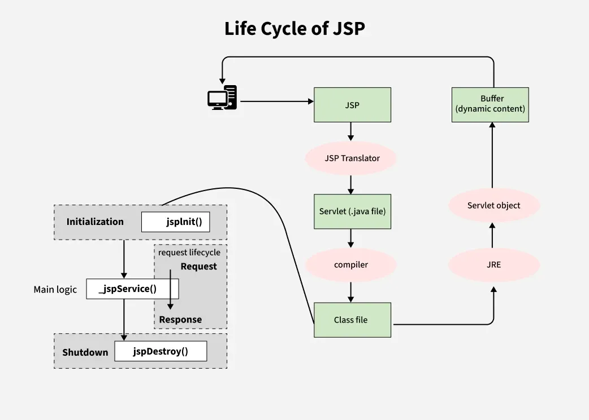

1. Translation of JSP page to Servlet
2. Compilation of JSP page(Compilation of JSP into test.java)
3. Classloading (test.java to test.class)
4. Instantiation(Object of the generated Servlet is created)
5. Initialization(jspInit() method is invoked by the container)
6. Request processing(_jspService()is invoked by the container)
7. JSP Cleanup (jspDestroy() method is invoked by the container)

> We can override jspInit(), jspDestroy() but we can't override _jspService() method.

```
JSP Page
   ↓
Translation
   ↓
Compilation
   ↓
Loading
   ↓
Instantiation
   ↓
Initialization
   ↓
Request Processing
   ↓
Destruction
```

### 1. Translation Phase

* JSP page is converted into a **Servlet (.java file)**
* Happens only **once** (or when JSP is modified)
* Done by the JSP container (Tomcat, Jetty, etc.)

Example:

```
hello.jsp → hello_jsp.java
```

### 2. Compilation Phase

* Generated servlet code is **compiled into a .class file**
* Any syntax errors in JSP appear here

### 3. Loading Phase

* The compiled servlet class is **loaded into JVM**
* Managed by the servlet container

### 4. Instantiation Phase

* Servlet container creates **one instance** of the JSP servlet
* Uses default constructor

### 5. Initialization Phase (`jspInit()`)

Called **once** during JSP lifecycle.

```java
public void jspInit() {
    // Initialization code
}
```

Used for:

* Resource initialization
* Database connections
* Loading configuration

### 6. Request Processing Phase (`_jspService()`)

* Called **for every request**
* Handles client requests and generates response
* Cannot be overridden by developer

```java
public void _jspService(HttpServletRequest request,
                        HttpServletResponse response)
```

📌 This is where:

* HTML is generated
* JSP implicit objects are used
* EL and JSTL are evaluated

### 7. Destruction Phase (`jspDestroy()`)

Called **once** when:

* Server shuts down
* JSP is unloaded
* Application is redeployed

```java
public void jspDestroy() {
    // Cleanup code
}
```

Used for:

* Closing DB connections
* Releasing resources

### JSP Lifecycle Methods Summary

| Method          | Called When             | Frequency |
| --------------- | ----------------------- | --------- |
| `jspInit()`     | JSP initialized         | Once      |
| `_jspService()` | Each client request     | Multiple  |
| `jspDestroy()`  | JSP removed from memory | Once      |

### JSP Lifecycle vs Servlet Lifecycle

| JSP Lifecycle         | Servlet Lifecycle |
| --------------------- | ----------------- |
| Translated to servlet | Already servlet   |
| `jspInit()`           | `init()`          |
| `_jspService()`       | `service()`       |
| `jspDestroy()`        | `destroy()`       |

### Key Points

✔ JSP is converted into a **Servlet**

✔ Lifecycle is managed by **container**

✔ `_jspService()` is **auto-generated**

✔ Only **one instance**, multiple requests

✔ Thread-safe coding is important

### One-Line Memory Trick 🧠

**JSP → Translate → Compile → Load → Init → Service → Destroy**

## 106. JSP Elements
**JSP Elements** are the **building blocks of a JSP page**.
They allow developers to **embed Java code, expressions, directives, and actions** inside HTML to create **dynamic web pages**.

In simple terms:

> **JSP Elements tell the container what to do while generating the response.**

### Types of JSP Elements

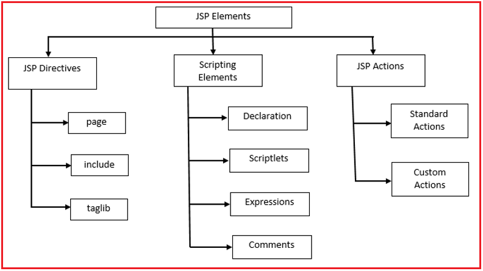 

JSP elements are broadly classified into **four main categories**:

| Type       | Purpose                               |
| ---------- | ------------------------------------- |
| Directive  | Provide instructions to the container |
| Scriptlet  | Write Java code                       |
| Expression | Output data to response               |
| Action     | Perform predefined actions            |

### 1. JSP Directives

Directives give **instructions to the JSP container** about how to process the JSP page.

They do **not produce output directly**.

Syntax:

```jsp
<%@ directive attribute="value" %>
```

#### Types of JSP Directives

##### a) Page Directive

Controls page-level settings.

```jsp
<%@ page language="java" contentType="text/html" %>
```

Common attributes:

* `language`
* `contentType`
* `import`
* `session`
* `errorPage`
* `isErrorPage`

Example:

```jsp
<%@ page import="java.util.Date" %>
```

##### b) Include Directive

Used to include another file **at translation time**.

```jsp
<%@ include file="header.jsp" %>
```

✔ Static include

✔ Code is merged before compilation

---

##### c) Taglib Directive

Used to include **custom tags / JSTL**.

```jsp
<%@ taglib uri="http://java.sun.com/jsp/jstl/core" prefix="c" %>
```

### 2. JSP Scriptlet

Scriptlets allow embedding **Java code inside JSP**.

Syntax:

```jsp
<%
   Java code
%>
```

Example:

```jsp
<%
   int a = 10;
   out.println(a);
%>
```

📌 **Not recommended in modern JSP**
(Use EL + JSTL instead)

### 3. JSP Expression

Used to **display data directly in the output**.

Syntax:

```jsp
<%= expression %>
```

Example:

```jsp
<%= new java.util.Date() %>
```

✔ Automatically converted to `out.print()`

✔ Cannot contain statements (only expressions)

### 4. JSP Declaration

Used to declare **variables and methods** at class level.

Syntax:

```jsp
<%! declaration %>
```

Example:

```jsp
<%! int count = 0; %>
```

```jsp
<%! 
   int add(int a, int b) {
       return a + b;
   }
%>
```

📌 Declared variables are **shared across requests**
(Be careful with thread safety)

### 5. JSP Action Tags

Action tags perform predefined tasks at **runtime**.

Syntax:

```jsp
<jsp:actionName />
```

### Common JSP Action Tags

#### a) `<jsp:include>`

Includes another resource **at runtime**.

```jsp
<jsp:include page="header.jsp" />
```

✔ Dynamic include

✔ Changes reflect immediately


#### b) `<jsp:forward>`

Forwards request to another resource.

```jsp
<jsp:forward page="home.jsp" />
```

#### c) `<jsp:useBean>`

Creates or locates a JavaBean.

```jsp
<jsp:useBean id="user" class="com.model.User" scope="session" />
```

#### d) `<jsp:setProperty>` and `<jsp:getProperty>`

```jsp
<jsp:setProperty name="user" property="name" value="Asha" />
<jsp:getProperty name="user" property="name" />
```

### Directive vs Scriptlet vs Expression

| Feature     | Directive   | Scriptlet  | Expression |
| ----------- | ----------- | ---------- | ---------- |
| Purpose     | Instruction | Java logic | Output     |
| Output      | ❌ No        | ✔ Yes      | ✔ Yes      |
| Syntax      | `<%@ %>`    | `<% %>`    | `<%= %>`   |
| Usage Today | ✔ Yes       | ❌ Avoid    | Limited    |

### JSP Elements vs EL & JSTL

| JSP Element | Modern Replacement |
| ----------- | ------------------ |
| Scriptlet   | EL + JSTL          |
| Expression  | EL                 |
| Logic       | JSTL tags          |

**Example (EL):**

```jsp
${user.name}
```

### Key Points

* JSP Elements are processed **on the server**
* Scriptlets are discouraged
* Directives are processed at **translation time**
* Actions are processed at **runtime**
* JSP ultimately converts to a **Servlet**

### One-line Summary

> **JSP Elements define how Java, HTML, and server logic work together to generate dynamic web pages.**

## 107. JSP Directives (page, include, taglib)

**JSP Directives** are special instructions used to give **metadata and configuration information** to the JSP container.

They guide the JSP container on **how the JSP page should be translated into a servlet**, but they **do not generate any output** themselves.

📌 JSP directives are processed at **translation time** (before compilation).

### General Syntax of JSP Directive

```jsp
<%@ directiveName attribute="value" %>
```

There are **three types of JSP Directives**:

1. `page`
2. `include`
3. `taglib`

### page Directive

The **page directive** is used to define **page-level settings** for a JSP page.

It controls:

* Imports
* Content type
* Session usage
* Error handling
* Buffering
* Thread behavior

📌 A JSP page can have **multiple page directives**, but conflicting attributes are not allowed.

#### Syntax

```jsp
<%@ page attribute="value" %>
```

#### Common page Directive Attributes

**1. `import`**

Used to import Java classes or packages into JSP.

```jsp
<%@ page import="java.util.Date, java.sql.*" %>
```

📌 Similar to `import` in Java.

**2. `contentType`**

Defines the MIME type and character encoding of the response.

```jsp
<%@ page contentType="text/html;charset=UTF-8" %>
```

📌 Default:

```
text/html;charset=ISO-8859-1
```
**3. `language`**

Specifies the scripting language.

```jsp
<%@ page language="java" %>
```

📌 Java is the **only supported language**.

**4. `session`**

Controls availability of the `session` implicit object.

```jsp
<%@ page session="true" %>   <!-- default -->
<%@ page session="false" %>
```

* `true` → session object available
* `false` → accessing session causes compilation error

**5. `errorPage`**

Specifies another JSP to handle runtime exceptions.

```jsp
<%@ page errorPage="error.jsp" %>
```

**6. `isErrorPage`**

Used in error handling JSP page.

```jsp
<%@ page isErrorPage="true" %>
```

📌 Enables access to implicit object `exception`.

**7. `buffer`**

Specifies output buffer size.

```jsp
<%@ page buffer="8kb" %>
```

📌 Default: `8kb`

**8. `autoFlush`**

Controls automatic flushing of buffer.

```jsp
<%@ page autoFlush="true" %>
```

* `true` → auto flush buffer
* `false` → throws exception if buffer overflows

**9. `isThreadSafe`**

Controls thread safety.

```jsp
<%@ page isThreadSafe="true" %>   <!-- default -->
<%@ page isThreadSafe="false" %>
```

📌 `false` behaves like deprecated `SingleThreadModel`.

#### Example: page Directive Usage

```jsp
<%@ page import="java.util.Date"
         contentType="text/html;charset=UTF-8"
         session="true" %>

<html>
<body>
    Current Date: <%= new Date() %>
</body>
</html>
```

### include Directive

The **include directive** is used to include another file **at translation time**.

📌 The content of the included file becomes part of the JSP **before compilation**.

#### Syntax

```jsp
<%@ include file="header.jsp" %>
```

#### Characteristics of include Directive

* Static inclusion
* Happens at translation time
* Included content is merged into one servlet
* Faster execution
* Best for static content (header, footer, menu)

#### Example: include Directive

**header.jsp**

```html
<h1>Welcome</h1>
```

**home.jsp**

```jsp
<%@ include file="header.jsp" %>
<p>This is home page</p>
```

📌 The final servlet contains both header and page content.

### taglib Directive

The **taglib directive** is used to define a **custom tag library** or **JSTL** in a JSP page.

It enables the use of **custom tags instead of Java code**.

#### Syntax

```jsp
<%@ taglib uri="URI" prefix="prefixName" %>
```

#### Example: JSTL Core Tag Library

```jsp
<%@ taglib uri="http://java.sun.com/jsp/jstl/core" prefix="c" %>
```

Usage:

```jsp
<c:out value="${username}" />

<c:if test="${age >= 18}">
    Adult
</c:if>
```

#### Why taglib is Important

* Removes Java code from JSP
* Improves readability
* Supports MVC architecture
* Encourages clean separation of concerns

### Key Notes

* JSP directives start with `<%@` and end with `%>`
* Directives are processed at **translation time**
* They do **not generate output**
* `page` → page configuration
* `include` → static file inclusion
* `taglib` → enables custom/JSTL tags
* `include` directive ≠ `<jsp:include>` action tag

---

❓: **What is the purpose of JSP directives?**
▶ JSP directives provide instructions to the JSP container about how the JSP page should be translated and compiled.

❓: **At what time are JSP directives processed?**
▶ At **translation time**, before the JSP is compiled into a servlet.

❓: **Can a JSP page have multiple page directives?**
▶ Yes, but duplicate or conflicting attributes are not allowed.

❓: **Why is taglib preferred over scriptlets?**
▶ Because it avoids Java code in JSP, improves readability, and supports MVC architecture.

❓: **Whatis the difference between include directive and JSP include action?**
▶ Include directive is processed at translation time (static), whereas JSP include action is processed at request time (dynamic).

## 108. Include Directive vs `<jsp:include>` Action
In JSP, content from another resource can be included in **two different ways**:

1. **Include Directive** (`<%@ include %>`)
2. **Include Action** (`<jsp:include>`)

Although both are used to include one JSP into another, they behave **very differently** in terms of **time of execution, flexibility, and use cases**.

Understanding this difference is a **common interview topic**.

### Include Directive (`<%@ include %>`)

The **include directive** performs **static inclusion**.

📌 The content of the included file is **copied into the JSP at translation time**, before the JSP is compiled into a servlet.

#### Syntax

```jsp
<%@ include file="header.jsp" %>
```

#### How it Works (Conceptual)

* JSP container **merges both files**
* Generates **one single servlet**
* Any change in the included file requires **recompilation**
* Variables, methods, and declarations are **shared**

Think of it like **copy–paste before compilation**.

#### Characteristics

* Happens at **translation time**
* Static inclusion
* Faster execution at runtime
* Included file cannot receive request parameters
* Suitable for static content

#### Example

```jsp
<%@ include file="header.jsp" %>
<p>Main page content</p>
```

If `header.jsp` contains HTML or declarations, they become part of the same servlet.

### `<jsp:include>` Action

The **include action** performs **dynamic inclusion**.

📌 The included resource is invoked **at request time**, and its output is inserted into the response.

#### Syntax

```jsp
<jsp:include page="header.jsp" />
```

With parameters:

```jsp
<jsp:include page="header.jsp">
    <jsp:param name="title" value="Home Page" />
</jsp:include>
```

#### How it Works (Conceptual)

* Each JSP is compiled into a **separate servlet**
* At runtime, control is passed to the included resource
* Output is returned and embedded in the response
* Changes in included JSP **do not require recompilation**

Think of it like **calling another servlet dynamically**.

#### Characteristics

* Happens at **request time**
* Dynamic inclusion
* Slightly slower than directive
* Can pass request parameters
* Better for dynamic content

### Key Differences: Include Directive vs Include Action

| Feature                        | Include Directive | `<jsp:include>` Action |
| ------------------------------ | ----------------- | ---------------------- |
| Inclusion time                 | Translation time  | Request time           |
| Type                           | Static            | Dynamic                |
| Servlet generated              | Single servlet    | Multiple servlets      |
| Recompilation needed on change | Yes               | No                     |
| Can pass parameters            | No                | Yes                    |
| Performance                    | Faster            | Slightly slower        |
| Best use case                  | Static content    | Dynamic content        |

### When to Use Which

* Use **Include Directive** when:

  * Content is static (header, footer)
  * You want faster performance
  * No dynamic data is required

* Use **`<jsp:include>` Action** when:

  * Content changes frequently
  * You need to pass parameters
  * Output depends on request data

### Key Notes

* Both are used to include one resource into another
* Main difference is **time of execution**
* Include directive merges code
* `<jsp:include>` merges output
* Interviewers often ask this as a **conceptual comparison**

---

❓ **Why is include directive faster than `<jsp:include>`?**
▶ Because the directive includes content at translation time, so no extra request is made at runtime.

❓ **Can variables declared in included JSP be accessed by the parent JSP?**
▶ Yes with include directive, because both become part of the same servlet. No with `<jsp:include>`, as they are separate servlets.

❓ **Why is `<jsp:include>` preferred for dynamic pages?**
▶ Because it executes at request time and supports passing parameters, making it suitable for dynamic content.

❓ **Which one follows better modular design?**
▶ `<jsp:include>` supports better modularity since each JSP remains independent.

❓ **Is `<jsp:include>` similar to RequestDispatcher include?**
▶ Yes conceptually. Both include output of another resource during request processing.

## 109. JSP Action Tags
**JSP Action Tags** are special XML-based tags used to **perform actions at request time**.

Unlike directives, which affect translation, **action tags are executed when a request is processed**.
They help JSP pages **interact with JavaBeans, include resources dynamically, and control page flow**.

📌 JSP action tags follow **XML syntax** and are executed at **request time**.

### General Syntax of JSP Action Tags

```jsp
<jsp:actionName attribute="value" />
```

or with body:

```jsp
<jsp:actionName attribute="value">
    ...
</jsp:actionName>
```

### Why JSP Action Tags Are Needed

* Reduce Java code inside JSP
* Improve readability and maintainability
* Support MVC architecture
* Enable dynamic behavior at runtime

### Common JSP Action Tags

The most commonly used JSP action tags are:

1. `<jsp:include>`
2. `<jsp:forward>`
3. `<jsp:param>`
4. `<jsp:useBean>`
5. `<jsp:setProperty>`
6. `<jsp:getProperty>`

### `<jsp:include>`

Includes another resource **at request time** and merges its **output** into the response.

#### Syntax

```jsp
<jsp:include page="header.jsp" />
```

With parameters:

```jsp
<jsp:include page="header.jsp">
    <jsp:param name="title" value="Home" />
</jsp:include>
```

#### Concept Explanation

* Executes the included resource dynamically
* Each JSP remains a separate servlet
* Useful for content that changes frequently

### `<jsp:forward>`

Forwards the request to another resource **without returning control** to the current JSP.

#### Syntax

```jsp
<jsp:forward page="login.jsp" />
```

With parameters:

```jsp
<jsp:forward page="dashboard.jsp">
    <jsp:param name="role" value="admin" />
</jsp:forward>
```

#### Concept Explanation

* Request is forwarded on the server side
* Browser URL does not change
* Similar to `RequestDispatcher.forward()`

### `<jsp:param>`

Used to pass parameters to `<jsp:include>` or `<jsp:forward>`.

#### Syntax

```jsp
<jsp:param name="username" value="Asha" />
```

📌 Cannot be used independently.

### `<jsp:useBean>`

Creates or locates a JavaBean and makes it available to the JSP.

#### Syntax

```jsp
<jsp:useBean id="user" class="com.example.User" scope="session" />
```

#### Concept Explanation

* Creates bean if it doesn’t exist
* Reuses existing bean if already present in scope
* Encourages separation of logic and presentation

### `<jsp:setProperty>`

Sets values into JavaBean properties.

#### Syntax

```jsp
<jsp:setProperty name="user" property="username" value="Asha" />
```

Auto-population:

```jsp
<jsp:setProperty name="user" property="*" />
```

### `<jsp:getProperty>`

Retrieves values from JavaBean properties.

#### Syntax

```jsp
<jsp:getProperty name="user" property="username" />
```

### Flow Example Using Action Tags

```jsp
<jsp:useBean id="user" class="com.example.User" scope="request" />
<jsp:setProperty name="user" property="*" />

<jsp:include page="profile.jsp" />
```

📌 This keeps business logic in JavaBeans and JSP clean.

### Key Notes

* JSP action tags execute at **request time**
* They follow **XML syntax**
* Promote clean MVC-based JSP design
* `<jsp:include>` ≠ include directive
* JavaBeans integration is a core use case

---

❓ **How are JSP action tags different from directives?**
▶ Directives affect translation, action tags execute at request time.

❓ **Why are action tags preferred over scriptlets?**
▶ They improve readability, maintain separation of concerns, and reduce embedded Java code.

❓ **When would you use `<jsp:forward>` instead of `<jsp:include>`?**
▶ When control should permanently move to another resource.

❓ **What happens if a bean already exists in the given scope?**
▶ `<jsp:useBean>` reuses it instead of creating a new one.

❓ **Is `<jsp:include>` similar to RequestDispatcher include?**
▶ Yes, both include output dynamically during request processing.

## 110. JavaBeans Architecture and `<jsp:useBean>`

**JavaBeans Architecture** defines a reusable, component-based Java class design that is used to **encapsulate data and business logic**.

In JSP, JavaBeans are commonly used to:

* Store form data
* Share data between JSPs
* Keep Java code out of JSP pages

The `<jsp:useBean>` action tag is the **bridge between JSP and JavaBeans**.

📌 JavaBeans support **clean separation of concerns**, a key idea behind MVC architecture.

### What is a JavaBean?

A **JavaBean** is a simple Java class that follows certain conventions.

To qualify as a JavaBean, a class must:

* Be a **public class**
* Have a **public no-argument constructor**
* Use **private fields**
* Provide **getter and setter methods**
* Be **Serializable** (recommended)

### Example: Simple JavaBean

```java
package com.example;

import java.io.Serializable;

public class User implements Serializable {

    private String username;
    private int age;

    public User() { }

    public String getUsername() {
        return username;
    }

    public void setUsername(String username) {
        this.username = username;
    }

    public int getAge() {
        return age;
    }

    public void setAge(int age) {
        this.age = age;
    }
}
```

📌 Fields are accessed indirectly via getters and setters.

### Why JavaBeans are Used in JSP

* Avoid Java code inside JSP
* Improve maintainability
* Enable reuse across multiple pages
* Align with MVC design
* Make JSP pages easier to test and debug

### `<jsp:useBean>` Action Tag

The `<jsp:useBean>` tag is used to **create or locate a JavaBean object** and bind it to a variable.

#### Syntax

```jsp
<jsp:useBean id="beanName"
             class="fully.qualified.ClassName"
             scope="scopeType" />
```

### How `<jsp:useBean>` Works (Conceptual)

1. JSP container checks if a bean with the given `id` exists in the specified scope
2. If found, it **reuses the existing object**
3. If not found, it **creates a new instance** using the no-arg constructor
4. The bean becomes accessible in the JSP

This behavior is often asked in interviews.

### Scope Attribute in `<jsp:useBean>`

The `scope` defines **how long the bean lives** and **who can access it**.

* `page` – Available only in the current JSP (default)
* `request` – Available throughout the request
* `session` – Available for the user session
* `application` – Shared across the entire application

```jsp
<jsp:useBean id="user" class="com.example.User" scope="session" />
```

### Setting Properties Using `<jsp:setProperty>`

You can populate bean properties using request parameters or explicit values.

#### Manual Assignment

```jsp
<jsp:setProperty name="user" property="username" value="Asha" />
```

#### Automatic Population

```jsp
<jsp:setProperty name="user" property="*" />
```

📌 Automatically maps request parameters to matching bean properties.

### Getting Properties Using `<jsp:getProperty>`

```jsp
<jsp:getProperty name="user" property="username" />
```

📌 Internally calls the getter method.

### End-to-End Flow Example

```jsp
<jsp:useBean id="user" class="com.example.User" scope="request" />
<jsp:setProperty name="user" property="*" />

Welcome,
<jsp:getProperty name="user" property="username" />
```

📌 JSP handles presentation, JavaBean handles data.

### JavaBeans Architecture in MVC

* **Model** → JavaBeans (data + business logic)
* **View** → JSP
* **Controller** → Servlet

JavaBeans act as the **Model**, keeping JSP clean and focused on UI.

### Key Notes

* JavaBeans follow strict naming conventions
* `<jsp:useBean>` creates or reuses beans
* Scope controls lifecycle and visibility
* `<jsp:setProperty>` supports auto-population
* Core to MVC-based JSP applications

---

❓ **Why must a JavaBean have a no-argument constructor?**
▶ Because JSP container uses reflection to create the object.

❓ **What happens if a bean already exists in the given scope?**
▶ `<jsp:useBean>` reuses the existing instance instead of creating a new one.

❓ **Why are getters and setters mandatory in JavaBeans?**
▶ JSP accesses properties through these methods, not directly through fields.

❓ **When would you prefer session scope over request scope?**
▶ When data must persist across multiple requests from the same user.

❓ **Is JavaBean the same as a normal Java class?**
▶ Conceptually yes, but JavaBeans follow specific conventions to support frameworks and JSP.

## 111. JSP Error Handling

**Error handling in JSP** lets you gracefully manage exceptions and HTTP errors that occur during request processing.

Rather than showing a stack trace to the user, JSP provides mechanisms to **forward errors to a dedicated page** where you can display friendly messages, logging info, or recovery options.

### Types of Errors in JSP

* **Runtime Exceptions** – e.g., `NullPointerException`, arithmetic errors
* **HTTP Errors** – e.g., 404 (Not Found), 500 (Internal Server Error)

JSP supports **both** kinds of error handling.

### Built-In Error Handling Using Directives

JSP provides two key attributes to support error handling:

#### 1. `errorPage` (on the main JSP)

Used on a JSP page to specify another JSP to handle exceptions.

```jsp
<%@ page errorPage="error.jsp" %>
```

📌 This tells the JSP container:
*If this page throws an exception, forward to `error.jsp`.*

#### 2. `isErrorPage` (on the error handling JSP)

Used on the designated error page.

```jsp
<%@ page isErrorPage="true" %>
```

📌 This allows the error page to access the implicit object `exception`, which holds the thrown exception.

### Example: Basic Error Handling

**main.jsp**

```jsp
<%@ page errorPage="error.jsp" %>

<%
    int result = 10 / 0; // Causes ArithmeticException
%>
```

**error.jsp**

```jsp
<%@ page isErrorPage="true" %>

<h2>Oops! Something went wrong.</h2>
<p>Error: <%= exception.getMessage() %></p>
```

📌 Here, `exception` is available because of `isErrorPage="true"`.

### How Error Handling Works (Conceptually)

* JSP container monitors the page for runtime errors
* On exception, it **forwards** the request to the designated error page
* The original request attributes and exception object are preserved
* You can display custom messages and recover politely

### Handling Specific HTTP Errors via `web.xml`

Although JSP directives handle runtime exceptions, HTTP errors like 404/500 are often centralized in **web.xml**.

```xml
<error-page>
    <error-code>404</error-code>
    <location>/notfound.jsp</location>
</error-page>

<error-page>
    <error-code>500</error-code>
    <location>/servererror.jsp</location>
</error-page>
```

📌 This method works even for **non-JSP errors** (like missing resources).

### Best Practices for JSP Error Handling

* Always design a friendly error page (UX matters)
* Avoid exposing sensitive stack traces to users
* Log the actual exception server-side
* Use a **consistency layout** for error pages
* Combine with servlet filters if needed for centralized logic

### Key Notes

* `errorPage` specifies where errors should be handled
* `isErrorPage="true"` makes the error page receive the exception
* Implicit object `exception` is available only on error pages
* Runtime exceptions are forwarded by the container
* HTTP errors like 404/500 are usually handled via `web.xml`

---

❓ **What is the role of `errorPage` in JSP?**
▶ It instructs the JSP container to redirect to a designated page on exception.

❓ **Why do we use `isErrorPage="true"`?**
▶ To allow access to the `exception` implicit object inside the error page.

❓ **Can the error page access request attributes from the original page?**
▶ Yes, because forwarding preserves the original request scope.

❓ **How do you handle HTTP error codes like 404?**
▶ By configuring `<error-page>` entries in `web.xml`.

❓ **Should we always display raw exception messages to users?**
▶ No; raw stack traces can expose internal details. Use friendly messages instead.

## 112. Custom Error Pages in JSP

**Custom error pages in JSP** allow you to handle application errors in a **centralized, user-friendly, and maintainable way**.

Instead of showing default server error messages, custom error pages let you:

* Display meaningful messages to users
* Maintain a consistent UI
* Log errors safely on the server

This is a **real-world requirement**, often discussed in interviews when talking about production-ready JSP applications.

### Why Custom Error Pages Are Needed

* Default server error pages look unprofessional
* Stack traces expose internal implementation details
* Different errors require different user responses
* Centralized handling improves maintainability

### Ways to Configure Custom Error Pages

Custom error pages in JSP can be configured in **two ways**:

1. Using **JSP directives** (`errorPage`, `isErrorPage`)
2. Using **`web.xml` error-page configuration** (recommended)

### Method 1: Custom Error Pages Using JSP Directives

This approach handles **runtime exceptions thrown by a specific JSP**.

#### Step 1: Configure `errorPage` in the JSP

```jsp
<%@ page errorPage="error.jsp" %>

<%
    // This will cause ArithmeticException
    int result = 10 / 0;
%>
```

📌 If an exception occurs, the container forwards the request to `error.jsp`.

#### Step 2: Configure `isErrorPage` in the Error JSP

```jsp
<%@ page isErrorPage="true" %>

<!-- Display a user-friendly message -->
<h2>Something went wrong</h2>

<!-- Access the exception implicit object -->
<p>Error Message: <%= exception.getMessage() %></p>
```

📌 `exception` is available only because `isErrorPage="true"` is set.

### Limitations of Directive-Based Error Pages

* Works only for JSP pages
* Cannot handle HTTP errors like 404
* Error handling is scattered across JSPs

Because of these limitations, **`web.xml` is preferred in real projects**.

### Method 2: Custom Error Pages Using `web.xml` (Recommended)

This method provides **centralized error handling** for the entire application.

#### Handling HTTP Error Codes

```xml
<error-page>
    <!-- Handle "Page Not Found" errors -->
    <error-code>404</error-code>
    <location>/errors/404.jsp</location>
</error-page>

<error-page>
    <!-- Handle internal server errors -->
    <error-code>500</error-code>
    <location>/errors/500.jsp</location>
</error-page>
```

📌 These pages are triggered automatically by the container.

#### Handling Specific Exceptions

```xml
<error-page>
    <!-- Handle NullPointerException globally -->
    <exception-type>java.lang.NullPointerException</exception-type>
    <location>/errors/null-error.jsp</location>
</error-page>
```

📌 This applies to **JSPs, Servlets, and filters**.

### Example: Custom Error Page JSP

**/errors/500.jsp**

```jsp
<%@ page isErrorPage="true" %>

<!-- Custom UI for server errors -->
<h2>Internal Server Error</h2>

<!-- Safe message for users -->
<p>We are working on fixing the issue. Please try again later.</p>

<!-- Optional: log technical details (not shown to user) -->
<%
    // exception object contains the root cause
    System.out.println("Error occurred: " + exception);
%>
```

### How Custom Error Pages Work (Conceptually)

* Container detects an error
* Matches it against `web.xml` rules
* Forwards request to mapped error page
* Original request and exception are preserved
* Browser URL does **not change**

### Best Practices for Custom Error Pages

* Always use `web.xml` for centralized handling
* Keep messages user-friendly
* Log exceptions securely
* Avoid exposing exception details in UI
* Reuse a common layout for all error pages

### Key Notes

* Custom error pages improve UX and security
* JSP directives are page-specific
* `web.xml` provides global error handling
* HTTP errors and exceptions can be handled separately
* Error pages use server-side forwarding

---

❓ **Why is `web.xml` preferred over JSP directives for error handling?**
▶ Because it centralizes error handling and works for JSPs, Servlets, and static resources.

❓ **Can one error page handle multiple error codes?**
▶ No. Each `<error-page>` entry handles a single error code or exception type.

❓ **Is `isErrorPage="true"` required for all custom error pages?**
▶ Yes, if you want access to the `exception` implicit object.

❓ **Does redirect happen when an error page is shown?**
▶ No. The container forwards the request internally.

❓ **Should logging be done inside JSP error pages?**
▶ Minimal logging is acceptable, but serious logging should be handled by servlets or filters.

## 113. JSTL (JavaServer Pages Standard Tag Library)
**JSTL (JavaServer Pages Standard Tag Library)** is a collection of **standard JSP tags** that replace Java code inside JSP pages.

It helps developers write **cleaner, readable, and maintainable JSPs** by moving logic out of scriptlets and into reusable tags.

📌 JSTL works on top of **Expression Language (EL)** and is a core part of modern JSP development.

### Why JSTL is Needed

* Eliminates Java scriptlets from JSP
* Improves readability and maintainability
* Encourages MVC architecture
* Reduces boilerplate code
* Makes JSPs easier to debug and test

### JSTL Tag Libraries

JSTL is divided into several tag libraries:

| Library    | Prefix | Purpose                                  |
| ---------- | ------ | ---------------------------------------- |
| Core       | `c`    | Flow control, URL handling, variables    |
| Formatting | `fmt`  | Date, number, and i18n formatting        |
| Functions  | `fn`   | String manipulation                      |
| SQL        | `sql`  | Database access (not recommended in MVC) |
| XML        | `x`    | XML processing                           |

### Enabling JSTL in JSP

Before using JSTL, it must be declared using the `taglib` directive.

```jsp
<%@ taglib uri="http://java.sun.com/jsp/jstl/core" prefix="c" %>
```

📌 This makes JSTL core tags available with prefix `c`.

### Core JSTL Tags (Most Used)

#### `<c:out>`

Used to display data safely by **escaping HTML characters**.

```jsp
<!-- Prints the username safely (prevents XSS) -->
<c:out value="${username}" />
```

📌 Preferred over `<%= %>` for output.

#### `<c:set>`

Used to create or update variables.

```jsp
<!-- Set a variable named 'count' with value 10 -->
<c:set var="count" value="10" />
```

#### `<c:if>`

Used for conditional logic.

```jsp
<!-- Check condition using EL -->
<c:if test="${age >= 18}">
    <!-- Content shown only if condition is true -->
    Adult User
</c:if>
```

#### `<c:choose>`, `<c:when>`, `<c:otherwise>`

Used for multiple conditional branches (similar to if–else).

```jsp
<c:choose>
    <!-- First condition -->
    <c:when test="${score >= 90}">
        Excellent
    </c:when>

    <!-- Second condition -->
    <c:when test="${score >= 60}">
        Passed
    </c:when>

    <!-- Default case -->
    <c:otherwise>
        Failed
    </c:otherwise>
</c:choose>
```

#### `<c:forEach>`

Used to iterate over collections or ranges.

```jsp
<!-- Loop from 1 to 5 -->
<c:forEach var="i" begin="1" end="5">
    <!-- Print loop counter -->
    <p>Count: ${i}</p>
</c:forEach>
```

```jsp
<!-- Iterate over a list stored in request scope -->
<c:forEach var="user" items="${userList}">
    <!-- Access bean properties using EL -->
    <p>${user.username}</p>
</c:forEach>
```

#### `<c:remove>`

Used to remove variables from scope.

```jsp
<!-- Remove 'count' variable from all scopes -->
<c:remove var="count" />
```

### Formatting Tags (`fmt`)

```jsp
<%@ taglib uri="http://java.sun.com/jsp/jstl/fmt" prefix="fmt" %>
```

#### `<fmt:formatDate>`

```jsp
<!-- Format date for display -->
<fmt:formatDate value="${today}" pattern="dd-MM-yyyy" />
```

### JSTL Functions (`fn`)

```jsp
<%@ taglib uri="http://java.sun.com/jsp/jstl/functions" prefix="fn" %>
```

```jsp
<!-- Check length of string -->
${fn:length(username)}
```

### JSTL vs Scriptlets (Conceptual)

| Aspect          | JSTL   | Scriptlets |
| --------------- | ------ | ---------- |
| Readability     | High   | Low        |
| MVC support     | Strong | Weak       |
| Maintainability | Easy   | Hard       |
| Recommended     | Yes    | No         |

### Key Notes

* JSTL replaces Java code in JSP
* Works with Expression Language (EL)
* Core library is most commonly used
* Improves security and readability
* Essential for interview-ready JSP knowledge

---

❓ **Why is JSTL preferred over scriptlets?**
▶ Because it keeps JSPs clean, readable, and aligned with MVC architecture.

❓ **Does JSTL replace servlets?**
▶ No. JSTL is used in the view layer, while servlets handle control logic.

❓ **Is JSTL executed at translation time?**
▶ No. JSTL tags are executed at **request time**.

❓ **What happens if JSTL is not available in the classpath?**
▶ JSP compilation fails with tag library errors.

❓ **Is SQL JSTL recommended in real projects?**
▶ No. Database logic should remain in DAO or service layers.

## 114. Core JSTL Tags (`c:if`, `c:forEach`, `c:choose`)
The **Core JSTL tags** provide **control flow and iteration** capabilities in JSP without using Java scriptlets.

They are the **most frequently used JSTL tags** and form the backbone of clean, readable JSP pages.

📌 These tags work with **Expression Language (EL)** and are executed at **request time**.

### Why Core JSTL Tags Matter

* Remove conditional and looping logic from Java scriptlets
* Improve readability and maintainability
* Align JSP with MVC architecture
* Make JSP pages interview-ready and production-safe

### `<c:if>`

The `<c:if>` tag is used for **simple conditional rendering**.

It evaluates a condition and includes its body **only if the condition is true**.

#### Syntax

```jsp
<!-- Execute block only when condition evaluates to true -->
<c:if test="${age >= 18}">
    <!-- Content visible for adults only -->
    Adult User
</c:if>
```

#### Concept Explanation

* Similar to a simple `if` statement
* Does **not** support `else`
* Best for single-condition checks

### `<c:forEach>`

The `<c:forEach>` tag is used to **iterate over collections, arrays, maps, or ranges**.

It replaces Java `for` and `while` loops inside JSP.

#### Iterating Over a Numeric Range

```jsp
<!-- Loop from 1 to 5 -->
<c:forEach var="i" begin="1" end="5">
    <!-- Display current loop counter -->
    <p>Count: ${i}</p>
</c:forEach>
```

#### Iterating Over a Collection

```jsp
<!-- Iterate over a list of User beans stored in request scope -->
<c:forEach var="user" items="${userList}">
    <!-- Access bean property using EL -->
    <p>${user.username}</p>
</c:forEach>
```

#### Common Attributes of `<c:forEach>`

* `var` – loop variable
* `items` – collection or array
* `begin`, `end`, `step` – numeric iteration
* `varStatus` – loop status information

```jsp
<!-- Use varStatus to access index and count -->
<c:forEach var="item" items="${items}" varStatus="status">
    <!-- status.index starts from 0, status.count starts from 1 -->
    <p>${status.count}. ${item}</p>
</c:forEach>
```

### `<c:choose>`, `<c:when>`, `<c:otherwise>`

Used for **multiple conditional branches**, similar to `if–else if–else`.

This is preferred over chaining multiple `<c:if>` tags.

#### Syntax and Example

```jsp
<c:choose>
    <!-- First condition -->
    <c:when test="${score >= 90}">
        Excellent
    </c:when>

    <!-- Second condition -->
    <c:when test="${score >= 60}">
        Passed
    </c:when>

    <!-- Default case -->
    <c:otherwise>
        Failed
    </c:otherwise>
</c:choose>
```

#### Concept Explanation

* Exactly **one branch executes**
* Cleaner and more readable than multiple `c:if`
* Ideal for grading, role-based UI, or status checks

### Common Mistakes to Avoid

* Using multiple `<c:if>` where `<c:choose>` is more suitable
* Mixing scriptlets with JSTL
* Forgetting EL `${}` inside test conditions

### Key Notes

* Core JSTL tags control **flow and iteration**
* `<c:if>` → simple condition
* `<c:forEach>` → loops and collections
* `<c:choose>` → multi-branch conditions
* Executed at **request time**
* Strongly preferred over scriptlets

---

❓ **Why doesn’t `<c:if>` support an else block?**
▶ JSTL encourages cleaner branching using `<c:choose>` for multiple conditions.

❓ **When should `<c:choose>` be preferred over multiple `<c:if>` tags?**
▶ When conditions are mutually exclusive and only one block should execute.

❓ **What is `varStatus` used for in `<c:forEach>`?**
▶ It provides loop metadata like index, count, first, and last.

❓ **Are Core JSTL tags faster than scriptlets?**
▶ Performance is similar, but JSTL is safer, cleaner, and easier to maintain.

❓ **Can Core JSTL tags work without EL?**
▶ No. Core JSTL tags rely heavily on Expression Language.

## 115. JSTL Functions (`fn:length`, `fn:contains`, etc.)
**JSTL Functions** provide a set of **EL-based utility functions** mainly used for **string manipulation and collection inspection** inside JSP pages.

They help you perform common operations **without writing Java code or scriptlets**, keeping JSP clean and expressive.

📌 JSTL functions are used **inside Expression Language (EL)** and are evaluated at **request time**.

### Enabling JSTL Functions

To use JSTL functions, you must declare the functions tag library.

```jsp
<%@ taglib uri="http://java.sun.com/jsp/jstl/functions" prefix="fn" %>
```

📌 This makes functions available using the `fn:` prefix.

### Why JSTL Functions Are Useful

* Avoid Java code in JSP
* Improve readability of expressions
* Work seamlessly with EL
* Ideal for UI-level logic
* Commonly tested in JSP interviews

### Common JSTL Functions

#### `fn:length()`

Returns the **length of a string**, array, collection, or map.

```jsp
<!-- Get length of a string -->
<p>Username length: ${fn:length(username)}</p>

<!-- Get size of a collection -->
<p>Total users: ${fn:length(userList)}</p>
```

📌 Works with strings and collections alike.

#### `fn:contains()`

Checks whether a string **contains another string**.

```jsp
<!-- Check if email contains '@' -->
<c:if test="${fn:contains(email, '@')}">
    <!-- Valid email format (basic check) -->
    Email looks valid
</c:if>
```

#### `fn:containsIgnoreCase()`

Same as `contains`, but **case-insensitive**.

```jsp
<!-- Case-insensitive substring check -->
<c:if test="${fn:containsIgnoreCase(role, 'admin')}">
    <!-- User has admin role -->
    Admin User
</c:if>
```

#### `fn:startsWith()` and `fn:endsWith()`

Checks string prefix or suffix.

```jsp
<!-- Check if filename ends with .pdf -->
<c:if test="${fn:endsWith(fileName, '.pdf')}">
    <!-- File is a PDF -->
    PDF File
</c:if>
```

#### `fn:substring()`

Extracts a portion of a string.

```jsp
<!-- Extract substring from index 0 to 4 -->
<p>Short code: ${fn:substring(code, 0, 4)}</p>
```

#### `fn:substringBefore()` and `fn:substringAfter()`

Splits strings around a delimiter.

```jsp
<!-- Get username from email -->
<p>User: ${fn:substringBefore(email, '@')}</p>

<!-- Get domain from email -->
<p>Domain: ${fn:substringAfter(email, '@')}</p>
```

#### `fn:toUpperCase()` and `fn:toLowerCase()`

Converts string case.

```jsp
<!-- Convert username to uppercase -->
<p>${fn:toUpperCase(username)}</p>
```

#### `fn:trim()`

Removes leading and trailing spaces.

```jsp
<!-- Trim whitespace from input -->
<p>${fn:trim(userInput)}</p>
```

### Typical Use Case Example

```jsp
<%@ taglib uri="http://java.sun.com/jsp/jstl/functions" prefix="fn" %>

<!-- Check if list has items before displaying -->
<c:if test="${fn:length(userList) > 0}">
    <!-- Display total users -->
    <p>Total users: ${fn:length(userList)}</p>
</c:if>
```

📌 Prevents empty list rendering.

### JSTL Functions vs Java Methods (Conceptual)

| Aspect          | JSTL Functions | Java Methods      |
| --------------- | -------------- | ----------------- |
| Where used      | JSP (EL)       | Java classes      |
| Purpose         | UI-level logic | Business logic    |
| Recommended for | Views          | Models / Services |

### Key Notes

* JSTL functions work only inside EL
* Used mainly for string and collection operations
* Evaluated at request time
* Should not replace business logic
* Improve JSP readability and safety

---

❓ **Can JSTL functions modify data?**
▶ No. They are read-only utility functions.

❓ **Are JSTL functions available without declaring taglib?**
▶ No. The functions taglib must be declared explicitly.

❓ **Should complex logic be implemented using JSTL functions?**
▶ No. Complex logic belongs in Java classes, not JSP.

❓ **Do JSTL functions work with null values?**
▶ Some return safe defaults, but null handling should be done carefully.

❓ **Are JSTL functions evaluated at compile time?**
▶ No. They are evaluated at request time along with EL.

## 116. EL + JSTL vs JSP Scriptlets (Best Practices)

In JSP development, there are **two ways** to implement logic inside pages:

1. **JSP Scriptlets** (`<% %>`)
2. **Expression Language (EL) + JSTL**

Modern JSP development **strongly prefers EL + JSTL**. Scriptlets are considered **legacy** and should be avoided in production code.

📌 Interviewers often ask *why* scriptlets are discouraged, not just *what* replaces them.

### JSP Scriptlets

**Scriptlets** allow embedding raw Java code directly inside JSP pages.

#### Example: Scriptlet Usage

```jsp
<%
    // Java logic written directly inside JSP (NOT recommended)
    if (age >= 18) {
        out.println("Adult User");
    }
%>
```

#### Problems with Scriptlets

* Mix Java logic with HTML
* Reduce readability
* Harder to maintain and debug
* Break MVC separation
* Difficult to test
* Considered outdated

### EL + JSTL Approach

**EL (Expression Language)** is used for data access, and **JSTL** is used for flow control and utility operations.

Together, they replace almost all scriptlet use cases.

#### Example: Same Logic Using EL + JSTL

```jsp
<!-- Conditional rendering using JSTL -->
<c:if test="${age >= 18}">
    <!-- Clean, readable output -->
    Adult User
</c:if>
```

📌 No Java code inside JSP. Only expressions and tags.

### Comparison: Scriptlets vs EL + JSTL

| Aspect                | JSP Scriptlets | EL + JSTL         |
| --------------------- | -------------- | ----------------- |
| Readability           | Poor           | High              |
| MVC compliance        | Weak           | Strong            |
| Maintainability       | Difficult      | Easy              |
| Testing               | Hard           | Easier            |
| Industry usage        | Deprecated     | Standard practice |
| Interview expectation | ❌              | ✅                 |

### Why EL + JSTL Is Best Practice

* Keeps JSP focused on **presentation**
* Moves logic to **Java classes and controllers**
* Improves security (e.g., automatic escaping with `c:out`)
* Makes JSP files easier to review and maintain
* Aligns with MVC and clean architecture principles

### Typical Migration Example

#### Scriptlet-Based Code

```jsp
<%
    // Loop through list using Java code
    for (User user : userList) {
        out.println(user.getUsername());
    }
%>
```

#### EL + JSTL Equivalent

```jsp
<!-- Iterate over collection using JSTL -->
<c:forEach var="user" items="${userList}">
    <!-- Access bean property using EL -->
    <p>${user.username}</p>
</c:forEach>
```

📌 Same functionality, drastically improved clarity.

### When Scriptlets Might Still Appear

* Legacy applications
* Very old frameworks
* Quick prototypes (still discouraged)

📌 In interviews, always **recommend refactoring scriptlets**.

### Best Practices for JSP Development

* Use **EL for data access**
* Use **JSTL for flow control**
* Keep business logic in **Servlets / Services**
* Avoid Java code inside JSP
* Treat JSP strictly as the **View layer**

### Key Notes

* Scriptlets are outdated and discouraged
* EL + JSTL is the modern standard
* Improves readability, security, and maintainability
* Strongly aligns with MVC architecture
* Always preferred in interviews and real projects

---

❓ **Why are JSP scriptlets considered bad practice?**
▶ They mix Java logic with UI code, making applications hard to maintain and test.

❓ **Can EL + JSTL completely replace scriptlets?**
▶ For almost all view-level logic, yes. Business logic still belongs in Java classes.

❓ **Do EL + JSTL improve performance?**
▶ Performance is similar, but maintainability and clarity improve significantly.

❓ **Is it okay to use scriptlets in new projects?**
▶ No. Modern JSP development avoids scriptlets entirely.

❓ **What should you say in interviews when asked about scriptlets?**
▶ Acknowledge them as legacy and recommend EL + JSTL as best practice.

## 117. MVC Architecture using Servlet + JSP

**MVC (Model–View–Controller)** is a design pattern that separates an application into **three distinct layers**, each with a clear responsibility.

In Java web applications:

* **Servlets** act as the **Controller**
* **JavaBeans / Services** act as the **Model**
* **JSP** acts as the **View**

This architecture is **foundational knowledge** for JSP/Servlet interviews and real-world projects.

### Why MVC Is Important

* Separates concerns clearly
* Improves maintainability and scalability
* Makes applications easier to test
* Enables team-based development
* Prevents business logic inside JSP

### What Problem Does MVC Solve?

Without MVC:

* Business logic, presentation, and control flow get mixed
* JSP pages become cluttered with Java code
* Applications are hard to test and maintain

MVC enforces **separation of concerns**, making code cleaner and easier to evolve.

### MVC Components in Servlet + JSP

### Model

The **Model** represents application data and business logic.

Typically implemented using:

* JavaBeans
* DAO classes
* Service classes

>The model **does not know** about the UI or HTTP.

📌 The Model should **not** depend on JSP or Servlets.

#### Example: Model (JavaBean)

```java
public class User {
    private String username;

    // No-arg constructor required for JavaBean
    public User() {}

    // Getter method used by JSP via EL
    public String getUsername() {
        return username;
    }

    // Setter method used by controller to populate data
    public void setUsername(String username) {
        this.username = username;
    }
}
```

### Controller (Servlet)

The **Controller** handles:

* Incoming requests (HTTP requests)
* Input validation
* Business logic coordination
* Request forwarding to views
* Deciding which view to render

In Java web apps, this role is played by **Servlets**.

📌 Servlets act as the **traffic controller**.

#### Example: Controller Servlet

```java
@WebServlet("/login")
public class LoginServlet extends HttpServlet {

    protected void doPost(HttpServletRequest request, HttpServletResponse response)
            throws ServletException, IOException {

        // Read request parameter from client
        String username = request.getParameter("username");

        // Create and populate model
        User user = new User();
        user.setUsername(username);

        // Store model in request scope
        request.setAttribute("user", user);

        // Forward request to JSP view
        request.getRequestDispatcher("welcome.jsp")
               .forward(request, response);
    }
}
```

### View (JSP)

The **View** is responsible only for **presentation**.

JSP should:

* Display data using EL
* Use JSTL for flow control
* Avoid Java code
* Contains no business logic

> 📌 JSP should never directly access the database.

#### Example: View JSP

```jsp
<%@ taglib uri="http://java.sun.com/jsp/jstl/core" prefix="c" %>

<!-- Display user data using EL -->
<h2>Welcome, ${user.username}</h2>
```

📌 JSP never creates or modifies business logic.

### Forward vs Redirect in MVC

* **Forward**

  * Server-side
  * Request data preserved
  * Preferred in MVC

* **Redirect**

  * Client-side
  * New request created
  * Used after form submission (PRG pattern)

### Request Flow in MVC (Conceptual)

1. Client sends HTTP request
2. Servlet (Controller) receives request
3. Servlet calls Model to process data
4. Model returns data
5. Servlet stores data in request/session scope
6. Servlet forwards request to JSP (View)
7. JSP renders the response using EL + JSTL

> 📌 JSP never talks directly to the database.

### Why MVC Improves JSP Applications

* Clear separation of concerns
* Easier maintenance and testing
* JSP remains clean and readable
* Business logic stays reusable
* Encourages team collaboration

### Common Mistakes to Avoid

* Writing database code in JSP
* Using scriptlets (for logic) in views 
* Accessing request parameters directly in JSP
* Skipping controller layer
* Tight coupling between JSP and model
* Not using EL + JSTL

### MVC vs Model 1 Architecture

| Feature         | Model 1      | MVC (Model 2)      |
| --------------- | ------------ | ------------------ |
| JSP role        | Logic + View | View only          |
| Servlet role    | Minimal      | Central controller |
| Maintainability | Low          | High               |
| Industry usage  | Obsolete     | Standard           |

📌 MVC using Servlets + JSP is also called **Model 2 architecture**.

### Key Notes

* MVC separates Model, View, and Controller
* Servlets act as controllers (**Servlet = Controller**)
* **JavaBeans/Services = Model**
* **JSP = View**
* JSP acts as the view layer. JSP should contain no business logic
* JavaBeans/services form the model
* MVC improves scalability and maintainability

---

❓ **Why are Servlets used as controllers instead of JSP?**
▶ Servlets are better suited for request handling, validation, and flow control.

❓ **Should JSP ever access request parameters directly?**
▶ No. The controller should prepare data and forward it to the JSP.

❓ **What scope is commonly used to pass data from Servlet to JSP?**
▶ Request scope, to avoid unnecessary session usage.

❓ **Is MVC mandatory for small applications?**
▶ Not mandatory, but strongly recommended for clean structure and growth.

❓ **What is Model 2 architecture?**
▶ It is MVC implemented using Servlets as controllers and JSP as views.

❓ **Should JSP ever access request parameters directly?**
▶ No. The controller should prepare data and forward it to the JSP.

## 118. JSP vs Servlet (Role in MVC Architecture)

In Java web applications, **JSP and Servlets serve different purposes**, even though both ultimately run on the server and generate responses.

Understanding **where JSP fits and where Servlets fit in MVC** is a **very common interview discussion**, especially to judge architectural clarity.

📌 Short answer:
**Servlet = Controller**, **JSP = View**

### Servlet in MVC (Controller Role)

A **Servlet** acts as the **Controller** in MVC.

Its responsibility is to **handle requests and control application flow**, not to generate UI.

#### What a Servlet Does

* Receives HTTP requests
* Reads request parameters
* Performs validation
* Calls business logic (Model)
* Stores data in request/session scope
* Forwards or redirects to a JSP

> 📌 A servlet should **never generate HTML-heavy UI**.

#### Example: Servlet as Controller

```java
// Servlet acting as Controller in MVC
@WebServlet("/profile")
public class ProfileServlet extends HttpServlet {

    protected void doGet(HttpServletRequest request, HttpServletResponse response)
            throws ServletException, IOException {

        // Call model/service layer (simulated here)
        String username = "Asha";

        // Store data in request scope for JSP
        request.setAttribute("username", username);

        // Forward request to JSP view
        request.getRequestDispatcher("profile.jsp")
               .forward(request, response);
    }
}
```

> 📌 Servlet prepares data and decides **which view to render**.

### JSP in MVC (View Role)

A **JSP** acts as the **View** in MVC.

Its responsibility is to **display data**, not to process requests or contain business logic.

#### What a JSP Does

* Reads data using EL
* Uses JSTL for conditional rendering
* Displays UI elements
* Avoids Java logic

📌 JSP should be **logic-light and presentation-heavy**.

#### Example: JSP as View

```jsp
<!-- JSP view displaying data using EL -->
<h2>Welcome, ${username}</h2>

<!-- Conditional display using JSTL -->
<c:if test="${not empty username}">
    <p>User profile loaded successfully.</p>
</c:if>
```

📌 No Java code. Only rendering logic.

### JSP vs Servlet: Side-by-Side Comparison

| Aspect                 | Servlet                     | JSP                 |
| ---------------------- | --------------------------- | ------------------- |
| MVC role               | Controller                  | View                |
| Primary responsibility | Request handling            | Presentation        |
| Handles HTTP logic     | Yes                         | No                  |
| Business logic         | Coordinates                 | Never               |
| UI generation          | Minimal                     | Main responsibility |
| Uses EL & JSTL         | No                          | Yes                 |
| Interview expectation  | Strong controller knowledge | Clean view design   |

### Why JSP Should Not Replace Servlets

* JSPs are not designed for request handling
* Mixing logic with UI breaks MVC
* Scriptlets reduce maintainability
* Harder to test and scale

📌 JSP-as-controller is considered **poor design**.

### Can a Servlet Replace JSP?

Technically yes, but **not recommended**.

```java
// Servlet generating HTML directly (discouraged)
PrintWriter out = response.getWriter();
out.println("<h1>Hello</h1>");
```

📌 This approach:

* Makes code unreadable
* Couples logic with UI
* Is hard to maintain

### Best Practice Flow in MVC

1. Client sends request
2. Servlet processes request
3. Model performs business logic
4. Servlet forwards to JSP
5. JSP renders response

📌 Clear separation = cleaner codebase.

### Key Notes

* Servlet = Controller
* JSP = View
* Servlets handle logic and flow
* JSP handles presentation only
* EL + JSTL replace scriptlets
* MVC clarity is a common interview focus

---

❓ **Why is JSP considered a View and not a Controller?**
▶ Because JSP is meant for rendering UI, not handling requests or business logic.

❓ **Why are Servlets better suited as Controllers?**
▶ Servlets are designed for request processing, validation, and flow control.

❓ **Is it okay to access request parameters directly in JSP?**
▶ For display purposes only. Processing and validation belong in Servlets.

❓ **Can JSP forward requests like Servlets?**
▶ JSP can forward, but flow control should remain in Servlets.

❓ **What should you answer in interviews if asked “JSP vs Servlet”?**
▶ JSP is the View, Servlet is the Controller, and mixing roles breaks MVC.

## 119. Form Handling in JSP & Servlets

**Form handling** is one of the most common tasks in Java web applications.
It involves **collecting user input from HTML forms**, processing it on the server, and sending an appropriate response back to the user.

In an MVC-based application:

* **JSP** displays the form (View)
* **Servlet** processes the form submission (Controller)
* **Model** holds and validates data (optional but recommended)

📌 This topic is frequently asked in interviews because it ties together **JSP, Servlets, MVC, and HTTP concepts**.

### HTML Form Basics

Forms typically use either **GET** or **POST** method.

```html
<!-- Simple login form rendered using JSP -->
<form action="login" method="post">
    <!-- Username input field -->
    <input type="text" name="username" />

    <!-- Password input field -->
    <input type="password" name="password" />

    <!-- Submit button -->
    <input type="submit" value="Login" />
</form>
```

📌 `action` maps to a servlet URL pattern.

### Handling Form Submission in Servlet

A servlet reads form data using `getParameter()` methods.

#### Servlet Example (Controller)

```java
// Servlet handling form submission
@WebServlet("/login")
public class LoginServlet extends HttpServlet {

    protected void doPost(HttpServletRequest request, HttpServletResponse response)
            throws ServletException, IOException {

        // Read form parameters from request
        String username = request.getParameter("username");
        String password = request.getParameter("password");

        // Simple validation (example only)
        if (username == null || username.isEmpty()) {

            // Store error message in request scope
            request.setAttribute("error", "Username is required");

            // Forward back to form JSP
            request.getRequestDispatcher("login.jsp")
                   .forward(request, response);
            return;
        }

        // On successful validation, store data for view
        request.setAttribute("username", username);

        // Forward to success JSP
        request.getRequestDispatcher("welcome.jsp")
               .forward(request, response);
    }
}
```

📌 Servlet handles **validation and flow control**, not presentation.

### Displaying Form Data in JSP

```jsp
<!-- Display submitted username -->
<h2>Welcome, ${username}</h2>

<!-- Display error message if present -->
<c:if test="${not empty error}">
    <p style="color:red">${error}</p>
</c:if>
```

📌 JSP only displays data using EL + JSTL.

### GET vs POST (Conceptual)

| Aspect          | GET             | POST         |
| --------------- | --------------- | ------------ |
| Data visibility | URL             | Request body |
| Security        | Less secure     | More secure  |
| Data length     | Limited         | Larger       |
| Use case        | Search, filters | Login, forms |

📌 Interviews often test this distinction.

### Using JavaBeans for Form Data (Best Practice)

Instead of passing raw parameters, data can be wrapped in a **JavaBean**.

```java
// JavaBean to hold form data
public class LoginBean {

    private String username;
    private String password;

    // Required no-arg constructor
    public LoginBean() {}

    // Getter and setter methods
    public String getUsername() {
        return username;
    }

    public void setUsername(String username) {
        this.username = username;
    }
}
```

```java
// Inside servlet: populate bean
LoginBean bean = new LoginBean();
bean.setUsername(username);

// Store bean in request scope
request.setAttribute("loginBean", bean);
```

```jsp
<!-- Access bean properties in JSP -->
<p>User: ${loginBean.username}</p>
```

📌 This aligns with MVC and improves clarity.

### Common Form Handling Mistakes

* Processing logic inside JSP
* Using scriptlets for validation
* Not validating user input
* Exposing sensitive data via GET
* Not handling character encoding

### Best Practices for Form Handling

* Use POST for sensitive data
* Validate input in Servlets
* Use JavaBeans to carry form data
* Use request scope for single submission
* Apply PRG (Post–Redirect–Get) when needed

### Key Notes

* JSP displays forms, Servlets process them
* `getParameter()` reads form values
* Validation belongs in Servlets
* EL + JSTL used for display
* MVC flow keeps code clean

---

❓ **Why should form processing not be done in JSP?**
▶ Because it mixes presentation with logic and breaks MVC separation.

❓ **When should POST be preferred over GET?**
▶ When handling sensitive or large amounts of data.

❓ **What scope is best for form data?**
▶ Request scope, since form submission is a single request.

❓ **Why use JavaBeans for form handling?**
▶ They group related data and improve maintainability.

❓ **What is PRG pattern and why is it used?**
▶ Post–Redirect–Get prevents duplicate form submissions on page refresh.

## 120. Form Validation (Client-side & Server-side)

**Form validation** ensures that user input is **correct, complete, and safe** before it is processed or stored.

In Java web applications, validation is performed at **two levels**:

1. **Client-side validation** (browser)
2. **Server-side validation** (Servlet)

### Why Form Validation Is Necessary

* Prevents invalid data entry
* Improves user experience
* Protects against malicious input
* Reduces server errors
* Ensures data integrity

📌 Client-side validation improves UX, but **server-side validation is mandatory**.

### Client-side Validation

**Client-side validation** is performed in the browser before the form is submitted.

It is implemented using:

* HTML5 attributes
* JavaScript (optional)

#### HTML5 Client-side Validation

```html
<!-- Login form with built-in HTML5 validation -->
<form action="login" method="post">

    <!-- Username field: cannot be empty -->
    <input type="text" name="username"
           required
           minlength="3"
           placeholder="Enter username" />

    <!-- Email field: browser validates email format -->
    <input type="email" name="email"
           required
           placeholder="Enter email" />

    <!-- Password field: minimum length enforced -->
    <input type="password" name="password"
           required
           minlength="6" />

    <!-- Submit button -->
    <input type="submit" value="Login" />
</form>
```

📌 Validation happens **before request reaches the server**.

#### JavaScript-based Client Validation (Optional)

```html
<script>
    // Validate form before submission
    function validateForm() {

        // Read input value
        const username = document.forms["loginForm"]["username"].value;

        // Check if username is empty
        if (username === "") {
            alert("Username must not be empty");
            return false; // Prevent form submission
        }

        return true; // Allow submission
    }
</script>
```

📌 JavaScript validation can be **bypassed**, so never rely on it alone.

### Server-side Validation

**Server-side validation** is performed inside **Servlets**.

It ensures correctness **even if client-side validation is skipped or manipulated**.

#### Server-side Validation in Servlet

```java
// Servlet handling server-side validation
@WebServlet("/register")
public class RegisterServlet extends HttpServlet {

    protected void doPost(HttpServletRequest request, HttpServletResponse response)
            throws ServletException, IOException {

        // Read form parameters
        String username = request.getParameter("username");
        String password = request.getParameter("password");

        // Server-side validation: username must not be empty
        if (username == null || username.trim().isEmpty()) {

            // Store error message in request scope
            request.setAttribute("error", "Username is required");

            // Forward back to form JSP
            request.getRequestDispatcher("register.jsp")
                   .forward(request, response);
            return;
        }

        // Server-side validation: password length check
        if (password == null || password.length() < 6) {

            request.setAttribute("error", "Password must be at least 6 characters");

            request.getRequestDispatcher("register.jsp")
                   .forward(request, response);
            return;
        }

        // If validation passes, continue processing
        request.setAttribute("message", "Registration successful");

        // Forward to success page
        request.getRequestDispatcher("success.jsp")
               .forward(request, response);
    }
}
```

📌 Server-side validation is **non-negotiable**.

### Displaying Validation Errors in JSP

```jsp
<!-- Display validation error message -->
<c:if test="${not empty error}">
    <p style="color:red">${error}</p>
</c:if>

<!-- Display success message -->
<c:if test="${not empty message}">
    <p style="color:green">${message}</p>
</c:if>
```

📌 Error messages are passed via **request scope**.

### Client-side vs Server-side Validation

| Aspect          | Client-side | Server-side |
| --------------- | ----------- | ----------- |
| Runs in         | Browser     | Server      |
| Improves UX     | Yes         | No          |
| Security        | No          | Yes         |
| Can be bypassed | Yes         | No          |
| Mandatory       | No          | Yes         |

📌 rule: **Always validate on server**.

---

### Common Validation Mistakes

* Relying only on client-side validation
* Writing validation logic in JSP
* Not trimming input values
* Exposing detailed error messages
* Repeating validation code (no reuse)

### Best Practices for Validation

* Use client-side validation for fast feedback
* Always validate again on server
* Centralize validation logic if possible
* Show user-friendly error messages
* Log detailed errors server-side

### Key Notes

* Validation must happen on both client and server
* Client-side improves UX only
* Server-side ensures security and correctness
* Validation logic belongs in Servlets or services
* JSP only displays validation results

---

❓ **Why is server-side validation mandatory even if client-side exists?**
▶ Because client-side validation can be bypassed or disabled.

❓ **Should validation logic be written in JSP?**
▶ No. JSP should only display validation messages.

❓ **Where should validation ideally reside?**
▶ In Servlets or a dedicated service layer.

❓ **Can JavaScript validation improve security?**
▶ No. It only improves user experience.

❓ **What is the interviewer’s expected answer for validation strategy?**
▶ Use client-side for UX and server-side for security.

## 121. Session Management in Web Applications
**Session management** is the mechanism used to **maintain user state across multiple HTTP requests**.

HTTP is **stateless**, meaning each request is independent.
Sessions allow the server to remember **who the user is** and **what they have already done**.

### Why Session Management Is Needed

Without sessions:

* Each request looks like a new user
* Login state cannot be preserved
* Shopping carts, preferences, and workflows break

Sessions provide **continuity** over multiple requests.

### What Is a Session

A **session** is a server-side storage area that:

* Is associated with a unique user
* Is identified by a **session ID**
* Persists across multiple requests

📌 The session ID is usually stored in a **cookie** (`JSESSIONID`).

### How Session Management Works (Conceptually)

1. Client sends first request
2. Server creates a session
3. Server generates a unique session ID
4. Session ID is sent to client (usually as a cookie)
5. Client sends session ID with every subsequent request
6. Server uses it to retrieve session data

### Creating and Accessing Session in Servlet

```java
// Servlet demonstrating session creation and usage
@WebServlet("/login")
public class LoginServlet extends HttpServlet {

    protected void doPost(HttpServletRequest request, HttpServletResponse response)
            throws ServletException, IOException {

        // Get or create a new session
        HttpSession session = request.getSession();

        // Store user data in session scope
        session.setAttribute("username", "Asha");

        // Redirect user to dashboard
        response.sendRedirect("dashboard.jsp");
    }
}
```

📌 `getSession()` creates a session if one does not exist.

### Accessing Session Data in JSP

```jsp
<!-- Access session attribute using EL -->
<h2>Welcome, ${sessionScope.username}</h2>
```

📌 EL provides direct access to session scope.

### Session Invalidation (Logout)

```java
// Servlet handling logout
@WebServlet("/logout")
public class LogoutServlet extends HttpServlet {

    protected void doGet(HttpServletRequest request, HttpServletResponse response)
            throws ServletException, IOException {

        // Get existing session without creating a new one
        HttpSession session = request.getSession(false);

        if (session != null) {
            // Invalidate session and clear all data
            session.invalidate();
        }

        // Redirect to login page
        response.sendRedirect("login.jsp");
    }
}
```

📌 `invalidate()` destroys the session completely.

### Session Timeout

A session automatically expires after a period of inactivity.

Configured in `web.xml`:

```xml
<!-- Session timeout configuration -->
<session-config>
    <!-- Timeout in minutes -->
    <session-timeout>30</session-timeout>
</session-config>
```

📌 Timeout is **based on inactivity**, not total lifetime.

### Session Scope vs Other Scopes

| Scope       | Lifetime                       |
| ----------- | ------------------------------ |
| Request     | Single request                 |
| Session     | Multiple requests by same user |
| Application | Entire application             |

📌 Sessions are ideal for **user-specific data**.

### Common Use Cases of Sessions

* Login authentication
* Shopping carts
* User preferences
* Multi-step forms

### Common Session Management Mistakes

* Storing large objects in session
* Never invalidating sessions
* Using session for temporary request data
* Assuming session always exists

### 📝 Rules / Points to Remember

* HTTP is stateless; sessions maintain state
* Session data is stored on the server
* Session ID links client to server session
* `getSession()` creates a session if absent
* `getSession(false)` avoids creating a new session
* Always invalidate session on logout
* Do not store sensitive or large objects unnecessarily

---

❓: **Where is session data actually stored?**
▶ Session data is stored **on the server**, not in the browser. The browser only stores the session ID.

❓: **Is a session the same as a cookie?**
▶ No. A cookie stores data on the client. A session stores data on the server and uses a cookie to track the session ID.

❓: **What happens if cookies are disabled?**
▶ Session tracking can still work using **URL rewriting**, where the session ID is appended to the URL.

❓: **Does calling `getSession()` always create a new session?**
▶ No. It returns an existing session if present; otherwise, it creates a new one.

❓: **Why is `getSession(false)` important?**
▶ It prevents accidental session creation when only checking for an existing session (e.g., during logout).

❓: **What happens to session data after timeout?**
▶ The session is destroyed and all stored attributes are lost.

--- 

### Cookies vs Sessions

**Cookies** and **Sessions** are both mechanisms to maintain user state, but they differ fundamentally in **where data is stored** and **how secure they are**.

#### Cookies

A **cookie** is a small piece of data stored on the **client (browser)**.

```java
// Creating a cookie in servlet
Cookie userCookie = new Cookie("username", "Asha");

// Set cookie expiry time (in seconds)
userCookie.setMaxAge(60 * 60); // 1 hour

// Add cookie to response
response.addCookie(userCookie);
```

📌 Cookies travel with every request to the server.

#### Sessions

A **session** stores data on the **server** and uses a cookie only to store the **session ID**.

```java
// Store data in session
HttpSession session = request.getSession();
session.setAttribute("username", "Asha");
```

#### Cookies vs Sessions Comparison

| Aspect         | Cookies         | Sessions        |
| -------------- | --------------- | --------------- |
| Storage        | Client-side     | Server-side     |
| Security       | Lower           | Higher          |
| Size limit     | ~4 KB           | Larger          |
| Performance    | Faster          | Slight overhead |
| Sensitive data | Not recommended | Recommended     |

📝 **Rules / Points to Remember**

* Cookies store data on the browser
* Sessions store data on the server
* Sessions usually depend on cookies
* Sensitive data should never be stored in cookies
* Sessions are safer but consume server memory

---

❓: **Can a session exist without cookies?**
▶ Yes. Using URL rewriting, session IDs can be passed through URLs.

❓: **Why are sessions considered more secure than cookies?**
▶ Because session data is never exposed to the client.

---

### URL Rewriting

**URL Rewriting** is a session-tracking technique where the **session ID is appended to the URL**.

It is mainly used when **cookies are disabled**.

#### Example of URL Rewriting

```java
// Encode URL with session ID
String encodedURL = response.encodeURL("dashboard.jsp");

// Redirect using encoded URL
response.sendRedirect(encodedURL);
```

📌 The container automatically appends `;jsessionid=XYZ`.

#### How URL Rewriting Works

1. Server generates a session
2. Session ID is embedded into URLs
3. Client sends session ID via URL
4. Server retrieves session using that ID

📝 **Rules / Points to Remember**

* URL rewriting is a fallback mechanism
* Session ID becomes visible in URL
* Less secure than cookies
* Used only when cookies are disabled

---

❓: **Why is URL rewriting considered unsafe?**
▶ Because session IDs can be bookmarked, logged, or shared.

❓: **Does URL rewriting work automatically?**
▶ Only if `encodeURL()` or `encodeRedirectURL()` is used.

---

### Authentication & Authorization Basics

**Authentication** and **Authorization** are core security concepts often implemented using sessions.

#### Authentication

Authentication answers: **Who is the user?**

```java
// After successful login
HttpSession session = request.getSession();
session.setAttribute("user", authenticatedUser);
```

📌 Session maintains login state across requests.

#### Authorization

Authorization answers: **What is the user allowed to do?**

```java
// Check user role before accessing resource
if (!"ADMIN".equals(session.getAttribute("role"))) {
    response.sendRedirect("accessDenied.jsp");
    return;
}
```

#### Authentication vs Authorization

| Aspect        | Authentication | Authorization        |
| ------------- | -------------- | -------------------- |
| Purpose       | Identify user  | Grant permissions    |
| Happens first | Yes            | After authentication |
| Based on      | Credentials    | Roles / privileges   |

📝 **Rules / Points to Remember**

* Authentication establishes identity
* Authorization controls access
* Sessions maintain authentication state
* Authorization checks should happen on every request
* Never trust client-side role checks

---

❓: **Can authorization exist without authentication?**
▶ No. You must know *who* the user is before checking permissions.

❓: **Why should authorization not be handled in JSP alone?**
▶ Because JSP can be bypassed; checks must exist in controllers or filters.

## 122. Login and Logout Flow using HTTP Sessions
A **login/logout flow** using HTTP sessions is a standard way to **authenticate users and maintain their logged-in state** across multiple requests.

The session acts as the **single source of truth** for whether a user is logged in or not.

### What Problem This Solves

Without sessions:

* User would need to authenticate on every request
* Protected pages could not distinguish logged-in users
* Logout would be meaningless

Sessions provide **continuity and control** over user access.

### High-Level Login–Logout Flow

1. User submits login form
2. Server validates credentials
3. Server creates a session
4. User identity is stored in session
5. Protected pages check session data
6. User logs out
7. Session is invalidated

### Login Form (JSP – View)

```jsp
<!-- Login form -->
<form action="login" method="post">

    <!-- Username input -->
    <input type="text" name="username" required />

    <!-- Password input -->
    <input type="password" name="password" required />

    <!-- Submit button -->
    <input type="submit" value="Login" />
</form>

<!-- Display login error if present -->
<c:if test="${not empty error}">
    <p style="color:red">${error}</p>
</c:if>
```

📌 JSP only collects input and displays messages.

### Login Servlet (Authentication + Session Creation)

```java
// Servlet handling login logic
@WebServlet("/login")
public class LoginServlet extends HttpServlet {

    protected void doPost(HttpServletRequest request, HttpServletResponse response)
            throws ServletException, IOException {

        // Read credentials from request
        String username = request.getParameter("username");
        String password = request.getParameter("password");

        // Simple authentication check (example only)
        if ("admin".equals(username) && "1234".equals(password)) {

            // Create a new session or reuse existing one
            HttpSession session = request.getSession();

            // Store user identity in session
            session.setAttribute("loggedInUser", username);

            // Redirect to dashboard after successful login
            response.sendRedirect("dashboard.jsp");

        } else {

            // Authentication failed
            request.setAttribute("error", "Invalid username or password");

            // Forward back to login page
            request.getRequestDispatcher("login.jsp")
                   .forward(request, response);
        }
    }
}
```

📌 Authentication result decides whether a session is created.

### Access Control for Protected Pages

Protected pages should **check session data before rendering content**.

#### Session Check (Servlet or JSP)

```jsp
<!-- Check login status using session -->
<c:if test="${empty sessionScope.loggedInUser}">
    <!-- Redirect to login page if not logged in -->
    <c:redirect url="login.jsp" />
</c:if>

<h2>Welcome, ${sessionScope.loggedInUser}</h2>
```

📌 Access is granted only if session contains login data.

### Logout Servlet (Session Invalidation)

```java
// Servlet handling logout
@WebServlet("/logout")
public class LogoutServlet extends HttpServlet {

    protected void doGet(HttpServletRequest request, HttpServletResponse response)
            throws ServletException, IOException {

        // Get existing session without creating a new one
        HttpSession session = request.getSession(false);

        if (session != null) {
            // Invalidate session and remove all attributes
            session.invalidate();
        }

        // Redirect user to login page
        response.sendRedirect("login.jsp");
    }
}
```

📌 Logout = complete session destruction.

### What Happens After Logout

* Session ID becomes invalid
* All session attributes are cleared
* User must log in again to access protected pages
* Old session ID cannot be reused

### Common Login/Logout Mistakes

* Not invalidating session on logout
* Trusting client-side login state
* Storing passwords in session
* Not checking session on protected pages
* Using request scope instead of session scope

### 📝 Points to Remember

* Login state must be stored in session
* Session creation happens after successful authentication
* Protected resources must always check session
* Logout must invalidate the session
* Never store passwords in session
* Use `getSession(false)` during logout checks

---

❓: **Why should login status be stored in session and not in request scope?**
▶ Request scope lasts only for a single request. Login state must persist across multiple requests.

❓: **Is redirect preferred over forward after successful login?**
▶ Yes. Redirect prevents form resubmission and creates a clean request flow.

❓: **What happens if a user opens a protected page in a new tab after logout?**
▶ Access is denied because the session no longer exists.

❓: **Can logout be implemented without invalidating the session?**
▶ It can be simulated by removing attributes, but invalidation is safer and cleaner.

❓: **Why should access control not rely only on JSP checks?**
▶ Because JSP can be bypassed; controllers or filters should enforce security.

## 123. Authentication and Authorization Basics

**Authentication** and **Authorization** are core security concepts used to **control access to web applications**.

They solve two different problems and must always be handled **in the correct order**.

### Authentication

**Authentication** answers the question:

> **Who is the user?**

It verifies a user’s identity using credentials such as:

* Username and password
* Token
* Session ID

📌 Authentication establishes **identity**, not permissions.

### How Authentication Works (Conceptually)

1. User submits credentials
2. Server validates credentials
3. Server creates a session
4. User identity is stored in session
5. Subsequent requests rely on session data

### Authentication Example using Session

```java
// After successful credential verification
HttpSession session = request.getSession();

// Store authenticated user identity
session.setAttribute("authenticatedUser", username);
```

📌 Presence of this attribute indicates the user is logged in.

### Authorization

**Authorization** answers the question:

> **What is the user allowed to do?**

It controls access based on:

* Roles (ADMIN, USER)
* Permissions
* Privileges

📌 Authorization always happens **after authentication**.

### How Authorization Works (Conceptually)

1. User is authenticated
2. Server checks user role or permission
3. Access is either granted or denied
4. Restricted resources remain protected

### Authorization Example using Session

```java
// Retrieve session without creating a new one
HttpSession session = request.getSession(false);

// Read user role from session
String role = (String) session.getAttribute("role");

// Authorization check
if (!"ADMIN".equals(role)) {
    // Deny access if role does not match
    response.sendRedirect("accessDenied.jsp");
    return;
}
```

📌 Authorization checks must be enforced on **every protected request**.

### Authentication vs Authorization

| Aspect            | Authentication | Authorization        |
| ----------------- | -------------- | -------------------- |
| Purpose           | Identify user  | Control access       |
| Question answered | Who are you?   | What can you do?     |
| Depends on        | Credentials    | Roles / permissions  |
| Happens first     | Yes            | After authentication |
| Stored in session | Identity       | Role / permissions   |

### Where Authentication and Authorization Should Live

* Authentication logic → **Servlet / Service layer**
* Authorization checks → **Servlets / Filters**
* JSP → **Display only**

📌 JSP should never decide access control alone.

### Common Mistakes

* Mixing authentication and authorization
* Trusting client-side role checks
* Storing passwords in session
* Performing authorization only in JSP
* Not validating session existence

### 📝 Rules / Points to Remember

* Authentication verifies identity
* Authorization verifies permissions
* Authorization always follows authentication
* Sessions maintain authentication state
* Never store credentials in session
* Access control must be server-side
* JSP should not enforce security rules

---

❓ **Can a user be authenticated but not authorized?**
▶ Yes. A user can be logged in but still lack permission to access certain resources.

❓ **Can authorization exist without authentication?**
▶ No. Permissions are meaningless without knowing the user’s identity.

❓ **Why should authorization not be done only in JSP?**
▶ JSP can be bypassed. Security must be enforced in controllers or filters.

❓ **Is storing role in session safe?**
▶ Yes, if it is set server-side and never trusted from client input.

❓ **What happens if session expires during an authorized request?**
▶ The user must be treated as unauthenticated and access must be denied.

## 124. File Upload and Download in Web Applications

**File upload and download** allow users to send files to the server and retrieve files from it later.

In web applications:

* **Upload** → client → server
* **Download** → server → client

These operations must be handled carefully to ensure **correctness, security, and performance**.

### Why File Handling Is Special

Files are different from normal form fields because:

* They can be large
* They are binary data
* They require special request handling
* They introduce security risks

### File Upload

#### How File Upload Works (Conceptually)

1. User selects a file in a form
2. Browser sends file as multipart request
3. Server parses multipart data
4. File is saved to server storage
5. Metadata may be stored in database

📌 File upload requires **multipart/form-data** encoding.

#### Upload Form (JSP – View)

```jsp
<!-- File upload form -->
<form action="upload" method="post" enctype="multipart/form-data">

    <!-- File selection input -->
    <input type="file" name="file" />

    <!-- Submit button -->
    <input type="submit" value="Upload" />
</form>
```

📌 `enctype="multipart/form-data"` is mandatory.

#### Upload Servlet (Server-side Processing)

```java
// Servlet handling file upload
@WebServlet("/upload")
@MultipartConfig // Enables multipart request processing
public class FileUploadServlet extends HttpServlet {

    protected void doPost(HttpServletRequest request, HttpServletResponse response)
            throws ServletException, IOException {

        // Retrieve uploaded file part
        Part filePart = request.getPart("file");

        // Get original file name
        String fileName = filePart.getSubmittedFileName();

        // Define upload directory on server
        String uploadPath = getServletContext().getRealPath("/") + "uploads";

        // Create directory if it does not exist
        new File(uploadPath).mkdirs();

        // Save file to server directory
        filePart.write(uploadPath + File.separator + fileName);

        // Send confirmation response
        response.getWriter().println("File uploaded successfully");
    }
}
```

📌 `@MultipartConfig` tells the container to handle file data.

#### Common Upload Validation Checks

* File size limit
* Allowed file types
* Empty file check
* Directory existence

### File Download

#### How File Download Works (Conceptually)

1. Client requests a file
2. Server locates file
3. Response headers are set
4. File bytes are streamed to client
5. Browser downloads the file

#### Download Servlet Example

```java
// Servlet handling file download
@WebServlet("/download")
public class FileDownloadServlet extends HttpServlet {

    protected void doGet(HttpServletRequest request, HttpServletResponse response)
            throws ServletException, IOException {

        // File to be downloaded
        String fileName = "example.pdf";

        // File path on server
        String filePath = getServletContext().getRealPath("/") + "uploads/" + fileName;

        File file = new File(filePath);

        // Set response content type
        response.setContentType("application/pdf");

        // Tell browser this is a download
        response.setHeader("Content-Disposition", "attachment; filename=\"" + fileName + "\"");

        // Stream file to response output
        try (FileInputStream fis = new FileInputStream(file);
             OutputStream os = response.getOutputStream()) {

            byte[] buffer = new byte[1024];
            int bytesRead;

            // Read file and write to response
            while ((bytesRead = fis.read(buffer)) != -1) {
                os.write(buffer, 0, bytesRead);
            }
        }
    }
}
```

📌 Streaming avoids loading entire file into memory.

### Upload vs Download (Quick Comparison)

| Aspect    | Upload              | Download            |
| --------- | ------------------- | ------------------- |
| Direction | Client → Server     | Server → Client     |
| Encoding  | multipart/form-data | Normal response     |
| Key API   | `Part`              | `OutputStream`      |
| Risk      | Malicious files     | Unauthorized access |

### Common Mistakes

* Forgetting `multipart/form-data`
* Not validating file type or size
* Overwriting existing files
* Exposing file paths
* Loading large files into memory

### 📝Points to Remember

* File uploads require multipart requests
* Always validate file size and type
* Never trust client-side file names
* Store uploads outside public directories if possible
* Stream files during download
* Set correct response headers
* Protect download URLs with authorization

---

❓ **Why can’t file uploads be handled like normal form fields?**
▶ Files are binary data and require multipart request parsing.

❓ **What happens if `enctype="multipart/form-data"` is missing?**
▶ File data will not be sent correctly to the server.

❓ **Why should uploaded files not be stored directly under web root?**
▶ It can expose files publicly and create security risks.

❓ **Why is streaming preferred for downloads?**
▶ It prevents high memory usage for large files.

❓ **Is file name from client always safe to use?**
▶ No. It must be sanitized to avoid path traversal attacks.

## 125. Pagination in Web Applications

**Pagination** is the technique of **splitting large data sets into smaller, manageable pages** instead of loading everything at once.

It improves:

* Performance
* Memory usage
* User experience
* Server scalability

### Why Pagination Is Needed

Without pagination:

* Large result sets slow down responses
* High memory consumption occurs
* Network bandwidth is wasted
* UI becomes difficult to navigate

Pagination ensures **controlled data loading**.

### How Pagination Works (Conceptually)

1. Client requests a specific page number
2. Server calculates offset and limit
3. Server fetches only required records
4. Data is sent to the view
5. Navigation links allow page switching

### Pagination Parameters

Common parameters used:

* `page` → current page number
* `pageSize` → number of records per page
* `offset` → starting record index

📌 `offset = (page - 1) × pageSize`

## Pagination with Servlet + JSP

### Request Example

```
/users?page=2
```

📌 Page numbering usually starts from **1**, not 0.

### Servlet Handling Pagination Logic

```java
// Servlet handling paginated data
@WebServlet("/users")
public class UserListServlet extends HttpServlet {

    protected void doGet(HttpServletRequest request, HttpServletResponse response)
            throws ServletException, IOException {

        // Default values
        int page = 1;
        int pageSize = 10;

        // Read page number from request
        String pageParam = request.getParameter("page");

        if (pageParam != null) {
            page = Integer.parseInt(pageParam);
        }

        // Calculate offset for database query
        int offset = (page - 1) * pageSize;

        // Fetch paginated data from database/service
        List<User> users = userService.getUsers(offset, pageSize);

        // Get total record count
        int totalUsers = userService.getTotalUserCount();

        // Calculate total pages
        int totalPages = (int) Math.ceil((double) totalUsers / pageSize);

        // Store data for JSP
        request.setAttribute("users", users);
        request.setAttribute("currentPage", page);
        request.setAttribute("totalPages", totalPages);

        // Forward to JSP
        request.getRequestDispatcher("users.jsp")
               .forward(request, response);
    }
}
```

📌 Pagination logic belongs on the server.

### JSP Display with Pagination Controls

```jsp
<!-- Display user list -->
<c:forEach var="user" items="${users}">
    <p>${user.username}</p>
</c:forEach>

<!-- Pagination navigation -->
<c:forEach var="i" begin="1" end="${totalPages}">
    <c:choose>
        <c:when test="${i == currentPage}">
            <!-- Highlight current page -->
            <strong>${i}</strong>
        </c:when>
        <c:otherwise>
            <!-- Page navigation link -->
            <a href="users?page=${i}">${i}</a>
        </c:otherwise>
    </c:choose>
</c:forEach>
```

📌 JSP only renders navigation and data.

### Database-Level Pagination (Concept)

Most databases support pagination directly.

Example (SQL-style):

```sql
-- Fetch limited records with offset
SELECT * FROM users
LIMIT 10 OFFSET 20;
```

📌 Always paginate at database level, not in memory.

### Common Pagination Mistakes

* Fetching all records and slicing in Java
* Not validating page number
* Hardcoding page size everywhere
* Not handling empty pages
* Ignoring total record count

### 📝 Points to Remember

* Pagination improves performance and UX
* Always paginate on the server
* Use offset and limit
* Validate page parameters
* Avoid loading full datasets
* Keep page size configurable

---

❓ **Why is pagination done on the server instead of JSP?**
▶ Because JSP should only render data, not control how much data is fetched.

❓ **What happens if page number is out of range?**
▶ Server should clamp it to valid bounds or return an empty result.

❓ **Why is database-level pagination preferred?**
▶ It avoids loading unnecessary data into memory.

❓ **Is offset-based pagination always efficient?**
▶ No. Large offsets can be slow; cursor-based pagination may be better.

❓ **Can pagination work without knowing total record count?**
▶ Yes, but page navigation becomes limited.

## 126. J2EE / Jakarta EE Architecture Overview

**J2EE / Jakarta EE** is a **multi-tier enterprise application architecture** designed to build **scalable, secure, and maintainable server-side applications**.

### Why an Architecture Overview Is Important

Without architectural clarity:

* Code becomes tightly coupled
* Business logic leaks into UI
* Security becomes inconsistent
* Applications fail to scale

Architecture provides **structure, separation of concerns, and flow control**.

### Evolution: J2EE → Java EE → Jakarta EE

* **J2EE** (Java 2 Enterprise Edition) – Original enterprise platform
* **Java EE** – Simplified naming and APIs
* **Jakarta EE** – Community-driven evolution under Eclipse Foundation

📌 Only the **name and governance changed**. Core concepts remain the same.

### High-Level Multi-Tier Architecture

J2EE / Jakarta EE applications are typically structured into **layers (tiers)**:

1. Client Tier
2. Web Tier
3. Business Tier
4. Persistence Tier
5. Database Tier

Each tier has a **clear responsibility**.

### Client Tier

The **Client Tier** is where requests originate.

Examples:

* Web browsers
* Mobile apps
* REST clients
* External systems

📌 Clients never access business logic or databases directly.

### Web Tier (Presentation Layer)

The **Web Tier** handles:

* HTTP requests and responses
* Input validation
* Request routing
* View rendering

#### Technologies Used

* Servlets
* JSP
* JSTL
* Expression Language (EL)
* Filters
* Controllers (MVC)

📌 This tier acts as the **entry point** to the application.

#### Request Flow in Web Tier (Conceptually)

1. Client sends HTTP request
2. Servlet receives request
3. Input is validated
4. Business layer is invoked
5. Response is forwarded to JSP

📌 JSP is for **presentation only**, not logic.

### Business Tier (Service Layer)

The **Business Tier** contains:

* Business rules
* Domain logic
* Workflow coordination
* Transaction management

#### Technologies Used

* Plain Java services
* EJBs (in full Jakarta EE)
* CDI-managed beans

📌 This layer is **UI-agnostic**.

#### Why Business Logic Must Be Isolated

If business logic is mixed with JSP or Servlets:

* Code becomes untestable
* Changes break UI
* Reuse becomes impossible

📌 Business tier ensures **reusability and maintainability**.

### Persistence Tier (Data Access Layer)

The **Persistence Tier** manages data access.

Responsibilities:

* CRUD operations
* Query execution
* Object-relational mapping

#### Technologies Used

* JDBC
* JPA
* DAOs / Repositories

📌 This layer shields the rest of the app from database details.

### Database Tier

The **Database Tier** stores application data.

Examples:

* MySQL
* PostgreSQL
* Oracle
* MongoDB

📌 No business rules should live here.

### Containers in J2EE / Jakarta EE

Containers provide **runtime services**.

#### Web Container

Manages:

* Servlets
* JSP
* Filters
* Sessions
* Request lifecycle

Example: Tomcat

#### Application / EJB Container

Manages:

* Business components
* Transactions
* Security
* Dependency injection

Example: WildFly, GlassFish

📌 Containers remove boilerplate from developers.

### End-to-End Request Flow (Big Picture)

1. Client sends request
2. Web container receives it
3. Servlet processes request
4. Business service executes logic
5. DAO interacts with database
6. Result flows back to JSP
7. Response is sent to client

📌 Each layer handles **one responsibility only**.

### 📝 Points to Remember

* J2EE is a layered architecture
* Each tier has a clear role
* JSP belongs only to presentation
* Servlets control request flow
* Business logic must stay isolated
* Persistence layer abstracts database access
* Containers provide infrastructure services

---

❓ **Why is J2EE called a multi-tier architecture?**
▶ Because responsibilities are split across independent layers.

❓ **Can JSP directly access the database?**
▶ Technically possible, architecturally wrong.

❓ **Why do we need containers at all?**
▶ They handle lifecycle, security, transactions, and resource management.

❓ **Is MVC part of J2EE architecture?**
▶ MVC fits naturally inside the Web Tier.

❓ **What breaks if layers are mixed?**
▶ Scalability, maintainability, testability, and security.

## 127. WAR File Structure

A **WAR (Web Application Archive)** file is a **standard deployment unit** used to package and deploy Java web applications to a **web container** (such as Tomcat).

It bundles all components required to run a web application into a **single, portable archive**.

### Why WAR Files Are Needed

Without a standard archive structure:

* Deployment becomes inconsistent
* Configuration files get scattered
* Library conflicts increase
* Web containers cannot reliably load applications

WAR files establish a **clear contract** between the application and the container.

### What a WAR File Contains (Overview)

A WAR file is essentially a **ZIP file** with a predefined directory layout understood by the servlet container.

Example:

```
myapp.war
```

When deployed, it is extracted as:

```
myapp/
```

### Standard WAR Directory Structure

```
myapp/
│
├── index.jsp
├── login.jsp
├── css/
│   └── style.css
├── js/
│   └── app.js
├── images/
│   └── logo.png
│
└── WEB-INF/
    ├── web.xml
    ├── classes/
    │   └── com/example/servlet/LoginServlet.class
    └── lib/
        └── mysql-connector.jar
```

📌 Anything inside `WEB-INF` is **not directly accessible** from the browser.

### Root Directory (Public Area)

Files placed in the **root directory** are publicly accessible over HTTP.

Typical contents:

* JSP files
* HTML files
* CSS, JavaScript, images
* Static client-side resources

📌 These resources can be accessed directly using URLs.

Example:

```
http://localhost:8080/myapp/login.jsp
```

### WEB-INF Directory (Protected Area)

The `WEB-INF` directory acts as a **security boundary** for the application.

* Browser access is blocked
* Only the container can access its contents
* Critical configuration lives here

#### WEB-INF/web.xml

`web.xml` is the **deployment descriptor** of the web application.

It is used to configure:

* Servlet mappings
* Filters
* Listeners
* Session configuration
* Error pages
* Security constraints

```xml
<!-- Deployment descriptor -->
<web-app>

    <!-- Servlet declaration -->
    <servlet>
        <servlet-name>LoginServlet</servlet-name>
        <servlet-class>com.example.servlet.LoginServlet</servlet-class>
    </servlet>

    <!-- Servlet URL mapping -->
    <servlet-mapping>
        <servlet-name>LoginServlet</servlet-name>
        <url-pattern>/login</url-pattern>
    </servlet-mapping>

</web-app>
```

📌 Even annotation-based applications may still use `web.xml` for centralized control.

#### WEB-INF/classes

This directory contains **compiled Java classes**.

Includes:

* Servlets
* Filters
* Listeners
* Utility and service classes

Example:

```
WEB-INF/classes/com/example/service/UserService.class
```

📌 The package structure must be preserved.

#### WEB-INF/lib

Contains **external dependency JAR files** required by the application.

Examples:

* JDBC drivers
* Logging frameworks
* Utility libraries

📌 All JARs placed here are automatically added to the application’s classpath.

### Class Loading in a WAR File

Simplified class loading order:

1. Web container libraries
2. JARs in `WEB-INF/lib`
3. Classes in `WEB-INF/classes`

📌 Application-level libraries can override container-provided classes.

### Deployment of WAR Files

WAR files can be deployed by:

* Copying to the `webapps/` directory
* Uploading via server admin console
* CI/CD pipeline automation

📌 The container automatically extracts and initializes the application.

### Context Path

The **WAR file name** becomes the **context path** of the application.

Example:

```
myapp.war → /myapp
```

Access URL:

```
http://localhost:8080/myapp
```

📌 Renaming the WAR file changes the application URL.

### 📝 Points to Remember

* WAR is a deployable web application archive
* It follows a strict directory structure
* Root directory is publicly accessible
* `WEB-INF` is protected from direct access
* `web.xml` defines deployment behavior
* `WEB-INF/lib` manages dependencies
* WAR file name determines context path

---

❓ **Why is the WEB-INF directory not accessible via browser?**
▶ To prevent direct access to configuration files and compiled classes.

❓ **Can JSP files be placed inside WEB-INF?**
▶ Yes, but they must be accessed via forwarding, not direct URLs.

❓ **Is `web.xml` mandatory in modern applications?**
▶ No, annotations can replace it, but it is still supported and useful.

❓ **What happens if multiple JARs contain the same class?**
▶ Class loading order determines which class is used, which can cause conflicts.

❓ **How is WAR different from JAR?**
▶ WAR is for web applications; JAR is a general-purpose Java archive.

## 128. Deployment Descriptor (web.xml)
The **Deployment Descriptor (`web.xml`)** is a **central configuration file** that defines how a Java web application behaves inside a **web container**.

It tells the container:

* what components exist
* how requests are mapped
* how sessions, security, and errors are handled

📌 `web.xml` is read **when the application starts**, before any request is processed.

### Why web.xml Exists

Without a deployment descriptor:

* Configuration would be scattered across code
* Behavior would be hard to change without recompiling
* Central control would be impossible

`web.xml` provides a **declarative, centralized configuration model**.

### Location of web.xml

```
WEB-INF/web.xml
```

📌 Files under `WEB-INF` are protected from direct browser access.

### Responsibilities of web.xml

`web.xml` is used to configure:

* Servlet declarations and mappings
* Filters and filter mappings
* Listeners
* Session timeout
* Error pages
* Security constraints
* Welcome files

### Basic Structure of web.xml

```xml
<!-- Root element defining a web application -->
<web-app>

    <!-- Configuration elements go here -->

</web-app>
```

📌 All configurations must be inside `<web-app>`.

### Servlet Configuration in web.xml

#### Servlet Declaration

```xml
<!-- Declare a servlet class -->
<servlet>
    <servlet-name>LoginServlet</servlet-name>
    <servlet-class>com.example.servlet.LoginServlet</servlet-class>
</servlet>
```

#### Servlet Mapping

```xml
<!-- Map servlet to a URL pattern -->
<servlet-mapping>
    <servlet-name>LoginServlet</servlet-name>
    <url-pattern>/login</url-pattern>
</servlet-mapping>
```

📌 Declaration defines *what*, mapping defines *where*.

### Filter Configuration

#### Filter Declaration

```xml
<!-- Define a filter -->
<filter>
    <filter-name>AuthFilter</filter-name>
    <filter-class>com.example.filter.AuthFilter</filter-class>
</filter>
```

#### Filter Mapping

```xml
<!-- Apply filter to URL patterns -->
<filter-mapping>
    <filter-name>AuthFilter</filter-name>
    <url-pattern>/*</url-pattern>
</filter-mapping>
```

📌 Filters intercept requests **before servlets**.

### Listener Configuration

```xml
<!-- Register an application lifecycle listener -->
<listener>
    <listener-class>com.example.listener.AppStartupListener</listener-class>
</listener>
```

📌 Listeners react to lifecycle events, not requests.

---

### Session Configuration

```xml
<!-- Configure session behavior -->
<session-config>
    <!-- Timeout in minutes -->
    <session-timeout>30</session-timeout>
</session-config>
```

📌 Timeout is based on inactivity.

### Error Page Configuration

```xml
<!-- Handle HTTP 404 errors -->
<error-page>
    <error-code>404</error-code>
    <location>/notfound.jsp</location>
</error-page>

<!-- Handle server-side exceptions -->
<error-page>
    <exception-type>java.lang.Exception</exception-type>
    <location>/error.jsp</location>
</error-page>
```

📌 Centralized error handling improves consistency.

### Welcome File Configuration

```xml
<!-- Default page loaded on root access -->
<welcome-file-list>
    <welcome-file>index.jsp</welcome-file>
</welcome-file-list>
```

📌 Avoid hardcoding landing pages in code.

### web.xml vs Annotations

| Aspect                     | web.xml     | Annotations |
| -------------------------- | ----------- | ----------- |
| Configuration              | Centralized | Scattered   |
| Change without recompiling | Yes         | No          |
| Visibility                 | High        | Lower       |
| Flexibility                | Higher      | Limited     |

📌 Modern applications often use **both together**.

### When web.xml Is Still Preferred

* Security rules
* Global filters
* Session configuration
* Error handling
* Legacy system compatibility

### 📝 Points to Remember

* `web.xml` is read at application startup
* It centralizes application behavior
* URL mappings are declarative
* Filters execute before servlets
* Annotations do not replace all web.xml use cases
* `WEB-INF` protects configuration files

---

❓ **Is web.xml mandatory in modern applications?**
▶ No, but it is still fully supported and often necessary.

❓ **Which loads first: web.xml or annotations?**
▶ `web.xml` loads first and can override annotation behavior.

❓ **Can we mix annotations and web.xml?**
▶ Yes, and this is common in real projects.

❓ **Why prefer web.xml for security configuration?**
▶ Because security rules should be centralized and declarative.

❓ **What happens if servlet mapping conflicts occur?**
▶ Deployment fails or mapping precedence rules apply.

## 129. Web Application Lifecycle

The **Web Application Lifecycle** describes the **sequence of events** from the moment a web application is deployed to the moment it is shut down.

It explains:

* when configuration is read
* when resources are initialized
* how requests are handled
* when cleanup happens

📌 Lifecycle understanding is essential for **resource management, performance, and stability**.

### Phases of Web Application Lifecycle

A Java web application goes through these major phases:

1. Deployment
2. Initialization
3. Request Processing
4. Destruction

Each phase is managed by the **web container**.

### Deployment Phase

During deployment:

* WAR file is extracted
* `web.xml` is read
* Annotations are scanned
* Servlets, filters, listeners are registered
* Context path is assigned

📌 No user requests are handled at this stage.

### Initialization Phase

Initialization happens **once**, when the application starts.

#### Application Initialization (Context Level)

The container creates a **ServletContext** for the application.

```java
// Listener triggered when application starts
public class AppStartupListener implements ServletContextListener {

    @Override
    public void contextInitialized(ServletContextEvent sce) {
        // Executed once during application startup

        // Access application-wide context
        ServletContext context = sce.getServletContext();

        // Initialize shared resources
        context.setAttribute("appName", "MyWebApp");

        // Example: initialize database connection pool
    }

    @Override
    public void contextDestroyed(ServletContextEvent sce) {
        // Executed once during application shutdown

        // Cleanup shared resources
    }
}
```

📌 Use listeners for **global initialization**, not servlets.

#### Servlet Initialization

Each servlet is initialized **once** before serving requests.

```java
@WebServlet("/login")
public class LoginServlet extends HttpServlet {

    @Override
    public void init() throws ServletException {
        // Called once when servlet is created

        // Initialize servlet-specific resources
    }

    @Override
    protected void doPost(HttpServletRequest request, HttpServletResponse response) {
        // Handles client requests
    }
}
```

📌 `init()` runs before any request reaches the servlet.

### Request Processing Phase

This phase repeats **for every client request**.

#### Request Handling Flow

1. Client sends HTTP request
2. Filters intercept request
3. Servlet processes request
4. Business logic executes
5. Response is generated
6. JSP renders output
7. Response sent to client

📌 This is the **most frequently executed phase**.

#### Servlet Request Methods

```java
@Override
protected void doGet(HttpServletRequest request, HttpServletResponse response)
        throws ServletException, IOException {

    // Executed for every GET request

    // Read request parameters
    String username = request.getParameter("username");

    // Process request and forward to JSP
    request.getRequestDispatcher("dashboard.jsp")
           .forward(request, response);
}
```

📌 Do not store request-specific data in instance variables.

### Destruction Phase

Triggered when:

* Server shuts down
* Application is undeployed
* Application is redeployed

#### Servlet Destruction

```java
@Override
public void destroy() {
    // Called once before servlet is removed

    // Release servlet-specific resources
}
```

📌 Called only once per servlet lifecycle.

#### Application Shutdown (Context Destruction)

```java
@Override
public void contextDestroyed(ServletContextEvent sce) {
    // Executed once during application shutdown

    // Close database pools, threads, files
}
```

📌 Always clean up resources here.

### Lifecycle of Major Components

| Component      | Created                 | Destroyed              |
| -------------- | ----------------------- | ---------------------- |
| ServletContext | App startup             | App shutdown           |
| Servlet        | First request / startup | App shutdown           |
| Filter         | App startup             | App shutdown           |
| Listener       | App startup             | App shutdown           |
| HttpSession    | On demand               | Timeout / invalidation |

### Common Lifecycle Mistakes

* Initializing heavy resources in JSP
* Using servlet constructors instead of `init()`
* Forgetting to release resources
* Storing request data in instance variables
* Creating background threads without cleanup

### 📝 Points to Remember

* Lifecycle is container-managed
* Initialization happens once
* Request processing happens per request
* Destruction happens once
* Use listeners for application-wide setup
* Always clean up resources properly

---

❓ **When is `web.xml` read during the lifecycle?**
▶ During the deployment phase, before initialization.

❓ **How many times is `init()` called on a servlet?**
▶ Exactly once per servlet lifecycle.

❓ **Can multiple requests run concurrently in a servlet?**
▶ Yes, unless explicitly synchronized.

❓ **Where should database pools be initialized?**
▶ In application startup listeners, not servlets.

❓ **What happens if resources are not released on shutdown?**
▶ Memory leaks and resource exhaustion can occur.

## 130. Servlet Authentication with JDBC (Login / Signup)
**Servlet Authentication with JDBC** is the process of **verifying user identity** by checking credentials against a **database** using JDBC.

It is a foundational pattern for:

* Login systems
* Signup / registration flows
* Session-based authentication
* Secure access control

📌 Authentication answers **“Who is the user?”**, not **“What can the user do?”**.

### Why JDBC-Based Authentication Is Used

Using JDBC allows:

* Persistent user storage
* Centralized credential management
* Server-side verification
* Integration with sessions and roles

📌 Credentials must **never be trusted from the client**.

### High-Level Authentication Flow

1. User submits login/signup form
2. Servlet receives request
3. Input is validated
4. Database is queried via JDBC
5. Credentials are verified
6. Session is created on success
7. User is redirected to secured area

### Database Table Design (Users)

```sql
-- Table storing user credentials
CREATE TABLE users (
    id INT PRIMARY KEY AUTO_INCREMENT,
    username VARCHAR(50) UNIQUE NOT NULL,
    password VARCHAR(255) NOT NULL
);
```

📌 Passwords should be **hashed**, never stored as plain text.

### Signup Flow (Registration)

#### Signup HTML Form

```html
<!-- User registration form -->
<form action="signup" method="post">
    <input type="text" name="username" placeholder="Username" required />
    <input type="password" name="password" placeholder="Password" required />
    <button type="submit">Sign Up</button>
</form>
```

📌 Client-side validation improves UX but does not replace server validation.

#### Signup Servlet Logic

```java
@WebServlet("/signup")
public class SignupServlet extends HttpServlet {

    protected void doPost(HttpServletRequest request, HttpServletResponse response)
            throws ServletException, IOException {

        // Read user input from request
        String username = request.getParameter("username");
        String password = request.getParameter("password");

        // Validate input (basic example)
        if (username == null || password == null) {
            response.sendRedirect("signup.jsp");
            return;
        }

        // Insert user into database using JDBC
        try (Connection con = DBUtil.getConnection();
             PreparedStatement ps = con.prepareStatement(
                     "INSERT INTO users(username, password) VALUES (?, ?)")) {

            // Set query parameters
            ps.setString(1, username);
            ps.setString(2, password); // Should be hashed in real apps

            ps.executeUpdate();

            // Redirect to login after successful signup
            response.sendRedirect("login.jsp");

        } catch (Exception e) {
            // Handle duplicate users or DB errors
            e.printStackTrace();
            response.sendRedirect("signup.jsp");
        }
    }
}
```

📌 Always use `PreparedStatement` to prevent SQL injection.

### Login Flow

#### Login HTML Form

```html
<!-- Login form -->
<form action="login" method="post">
    <input type="text" name="username" placeholder="Username" required />
    <input type="password" name="password" placeholder="Password" required />
    <button type="submit">Login</button>
</form>
```

#### Login Servlet Logic

```java
@WebServlet("/login")
public class LoginServlet extends HttpServlet {

    protected void doPost(HttpServletRequest request, HttpServletResponse response)
            throws ServletException, IOException {

        // Read credentials from request
        String username = request.getParameter("username");
        String password = request.getParameter("password");

        // Validate input
        if (username == null || password == null) {
            response.sendRedirect("login.jsp");
            return;
        }

        // Verify credentials using JDBC
        try (Connection con = DBUtil.getConnection();
             PreparedStatement ps = con.prepareStatement(
                     "SELECT * FROM users WHERE username=? AND password=?")) {

            ps.setString(1, username);
            ps.setString(2, password);

            ResultSet rs = ps.executeQuery();

            if (rs.next()) {
                // Create session on successful login
                HttpSession session = request.getSession();
                session.setAttribute("username", username);

                // Redirect to secured page
                response.sendRedirect("dashboard.jsp");
            } else {
                // Invalid credentials
                response.sendRedirect("login.jsp");
            }

        } catch (Exception e) {
            e.printStackTrace();
            response.sendRedirect("login.jsp");
        }
    }
}
```

📌 Authentication success should always result in **session creation**.

### Logout Flow

```java
@WebServlet("/logout")
public class LogoutServlet extends HttpServlet {

    protected void doGet(HttpServletRequest request, HttpServletResponse response)
            throws IOException {

        // Get existing session without creating a new one
        HttpSession session = request.getSession(false);

        if (session != null) {
            // Invalidate session to logout user
            session.invalidate();
        }

        // Redirect to login page
        response.sendRedirect("login.jsp");
    }
}
```

📌 Logout is simply **session invalidation**.

### Security Considerations

* Hash passwords (BCrypt, PBKDF2)
* Never store plain text passwords
* Use HTTPS for forms
* Protect dashboard URLs with filters
* Prevent session fixation

### 📝 Points to Remember

* Authentication verifies user identity
* JDBC handles database interaction
* PreparedStatement prevents SQL injection
* Sessions maintain login state
* Logout means invalidating session
* Never trust client-side validation

---

❓ **Why should authentication logic not be placed in JSP?**
▶ JSPs are meant for presentation. Putting authentication logic in JSP mixes UI with business logic, makes code hard to maintain, and exposes security risks. Servlets act as controllers and provide a safer, centralized place for authentication.

❓ **Why is session creation required after successful login?**
▶ HTTP is stateless. Without a session, the server cannot remember that the user is authenticated. Sessions store authentication state across multiple requests.

❓ **Why is `PreparedStatement` preferred over `Statement`?**
▶ `PreparedStatement` separates SQL logic from user input, preventing SQL injection attacks and improving performance through query precompilation.

❓ **Why should passwords never be stored in plain text?**
▶ If the database is compromised, plain text passwords expose all user accounts. Hashing ensures that even leaked data cannot be directly used.

❓ **What happens if session invalidation is skipped during logout?**
▶ The user may remain authenticated, allowing unauthorized access and session hijacking risks.

## 131. Role-Based Access Control (RBAC)

**Role-Based Access Control (RBAC)** is a security model where **access to resources is granted based on user roles**, not individual users.

Instead of checking *who* the user is everywhere, the system checks **what role the user has**.

📌 RBAC answers **“What is the user allowed to do?”**, after authentication.

### Why RBAC Is Needed

Without RBAC:

* Authorization logic gets duplicated
* Permissions become hard-coded
* Security rules scatter across code
* Applications become hard to scale

RBAC provides **centralized, consistent authorization**.

### Core RBAC Concepts

RBAC is built on three core ideas:

* **User** → an authenticated identity
* **Role** → a named set of permissions
* **Permission** → access to a resource or action

📌 Users are assigned roles, roles define permissions.

### Typical Roles in Web Applications

Common examples:

* `ADMIN`
* `USER`
* `MANAGER`
* `GUEST`

📌 Roles are **business concepts**, not technical ones.

### Where Roles Are Stored

Roles are usually stored in:

* Database tables
* Session attributes
* Security context

📌 Roles should never be trusted from the client.

### Database Design for RBAC

#### Users Table

```sql
-- Stores user accounts
CREATE TABLE users (
    id INT PRIMARY KEY AUTO_INCREMENT,
    username VARCHAR(50) UNIQUE NOT NULL,
    password VARCHAR(255) NOT NULL
);
```

#### Roles Table

```sql
-- Defines available roles
CREATE TABLE roles (
    id INT PRIMARY KEY AUTO_INCREMENT,
    role_name VARCHAR(50) UNIQUE NOT NULL
);
```

#### User–Role Mapping Table

```sql
-- Maps users to roles
CREATE TABLE user_roles (
    user_id INT,
    role_id INT
);
```

📌 This design supports **multiple roles per user**.

### Assigning Roles After Login

After authentication, roles are loaded and stored in session.

```java
// After successful authentication
HttpSession session = request.getSession();

// Store username
session.setAttribute("username", username);

// Store user role (example: single role)
session.setAttribute("role", "ADMIN");
```

📌 Role assignment happens **once per login**.

### Role Check in Servlet

```java
// Retrieve existing session
HttpSession session = request.getSession(false);

if (session == null) {
    // User not logged in
    response.sendRedirect("login.jsp");
    return;
}

// Read role from session
String role = (String) session.getAttribute("role");

// Authorize based on role
if (!"ADMIN".equals(role)) {
    // Access denied
    response.sendRedirect("accessDenied.jsp");
    return;
}

// Authorized user continues
```

📌 Authorization checks must be server-side.

### Role Check Using Filter (Recommended)

#### Authorization Filter

```java
public class AdminFilter implements Filter {

    public void doFilter(ServletRequest request, ServletResponse response,
                         FilterChain chain)
            throws IOException, ServletException {

        HttpServletRequest req = (HttpServletRequest) request;
        HttpServletResponse res = (HttpServletResponse) response;

        // Get existing session
        HttpSession session = req.getSession(false);

        // Check authentication and role
        if (session == null || !"ADMIN".equals(session.getAttribute("role"))) {
            // Block unauthorized access
            res.sendRedirect("accessDenied.jsp");
            return;
        }

        // User authorized, continue request
        chain.doFilter(request, response);
    }
}
```

📌 Filters enforce authorization **before** reaching servlets.

### Securing URLs with RBAC

RBAC is commonly applied to:

* Admin dashboards
* Management endpoints
* Sensitive operations
* Configuration pages

📌 URL-level protection is safer than JSP-level checks.

### Common RBAC Mistakes

* Hardcoding roles in JSP
* Trusting client-side role flags
* Repeating role checks in every servlet
* Storing roles in cookies
* Mixing authentication and authorization

### 📝 Points to Remember

* Authentication identifies the user
* RBAC controls access using roles
* Roles group permissions logically
* Authorization should be centralized
* Filters are ideal for RBAC enforcement
* Never trust roles sent from the client

---

❓ **Why is RBAC preferred over user-based checks?**
▶ User-based checks require hardcoding permissions per user, which does not scale. RBAC groups permissions under roles, making authorization easier to manage, audit, and extend.

❓ **Why should role checks be done in filters instead of JSP?**
▶ Filters run before any servlet or JSP logic executes. This prevents unauthorized users from even reaching protected resources, improving both security and code cleanliness.

❓ **Can a user have multiple roles? How is it handled?**
▶ Yes. Users can be mapped to multiple roles using a mapping table. During login, all roles are loaded and stored in session or security context for authorization checks.

❓ **What happens if roles are stored on the client side?**
▶ Client-side role storage can be tampered with, leading to privilege escalation. Roles must always be validated on the server.

❓ **Is RBAC enough for fine-grained security?**
▶ RBAC works well for coarse-grained control. For finer control, it is often combined with permission-based or attribute-based access control.

## 132. Servlet Filters for Authentication and Authorization

**Servlet Filters** are components that **intercept HTTP requests and responses** before they reach servlets or JSPs.

They are ideal for **authentication and authorization** because security checks should happen **before any business logic executes**.

📌 Filters sit **outside** servlets in the request flow.

### Why Use Filters for Security

Using filters for authentication and authorization:

* Centralizes security logic
* Avoids duplicate checks in servlets
* Prevents unauthorized access early
* Keeps controllers clean

📌 Security is a **cross-cutting concern**, and filters are designed for that.

### Filter Lifecycle (Brief)

A filter follows this lifecycle:

1. `init()` – called once at application startup
2. `doFilter()` – called for every matching request
3. `destroy()` – called once at application shutdown

📌 Filters are managed by the web container.

### Authentication vs Authorization in Filters

* **Authentication filter**
  Checks whether the user is logged in

* **Authorization filter**
  Checks whether the user has permission (role)

📌 Authentication happens **before** authorization.

### Authentication Filter Example

#### Authentication Filter Logic

```java
public class AuthFilter implements Filter {

    @Override
    public void doFilter(ServletRequest request, ServletResponse response,
                         FilterChain chain)
            throws IOException, ServletException {

        HttpServletRequest req = (HttpServletRequest) request;
        HttpServletResponse res = (HttpServletResponse) response;

        // Get existing session without creating a new one
        HttpSession session = req.getSession(false);

        // Check if user is authenticated
        if (session == null || session.getAttribute("username") == null) {
            // User not logged in, redirect to login page
            res.sendRedirect("login.jsp");
            return;
        }

        // User is authenticated, continue request
        chain.doFilter(request, response);
    }
}
```

📌 This filter blocks unauthenticated users early.

### Authorization Filter Example (Role-Based)

#### Authorization Filter Logic

```java
public class AdminFilter implements Filter {

    @Override
    public void doFilter(ServletRequest request, ServletResponse response,
                         FilterChain chain)
            throws IOException, ServletException {

        HttpServletRequest req = (HttpServletRequest) request;
        HttpServletResponse res = (HttpServletResponse) response;

        // Retrieve existing session
        HttpSession session = req.getSession(false);

        // Check authentication first
        if (session == null) {
            res.sendRedirect("login.jsp");
            return;
        }

        // Retrieve role from session
        String role = (String) session.getAttribute("role");

        // Check authorization
        if (!"ADMIN".equals(role)) {
            // User is authenticated but not authorized
            res.sendRedirect("accessDenied.jsp");
            return;
        }

        // Authorized user, proceed to servlet
        chain.doFilter(request, response);
    }
}
```

📌 Authorization filters prevent privilege escalation.

### Filter Mapping

Filters must be mapped to URLs.

#### Using web.xml

```xml
<!-- Authentication filter -->
<filter>
    <filter-name>AuthFilter</filter-name>
    <filter-class>com.example.filter.AuthFilter</filter-class>
</filter>

<filter-mapping>
    <filter-name>AuthFilter</filter-name>
    <url-pattern>/secure/*</url-pattern>
</filter-mapping>
```

📌 Filters apply to all matching requests.

### Multiple Filters in a Chain

Multiple filters can be applied in sequence:

```
Request → AuthFilter → AdminFilter → Servlet → Response
```

📌 Order matters. Authentication must run before authorization.

### Common Security Mistakes with Filters

* Applying filters only to JSPs
* Forgetting to protect REST endpoints
* Creating sessions inside filters unnecessarily
* Hardcoding roles in multiple places
* Skipping filter ordering

### 📝 Points to Remember

* Filters intercept requests before servlets
* Security checks should run early
* Authentication precedes authorization
* Filters centralize security logic
* Order of filters matters
* Filters improve maintainability

---

❓ **Why are filters better than checking sessions inside every servlet?**
▶ Filters remove repetitive code by enforcing security once, before requests reach servlets. This ensures consistency and reduces the risk of missing checks.

❓ **Why should authentication be checked before authorization?**
▶ Authorization assumes an authenticated identity. Without knowing who the user is, role or permission checks are meaningless.

❓ **Can filters block both requests and responses?**
▶ Yes. Filters can modify or block requests before they reach servlets and also process responses on the way back.

❓ **What happens if `chain.doFilter()` is not called?**
▶ The request stops at the filter and never reaches the servlet, effectively blocking processing.

❓ **Should filters create sessions?**
▶ Generally no. Filters should check existing sessions. Creating sessions unnecessarily increases memory usage and can cause security issues.

## 133. Session Security Best Practices

**Session security** focuses on protecting the **session lifecycle and session identifier** from attacks such as hijacking, fixation, and unauthorized reuse.

Since sessions represent an authenticated user, **compromising a session is equivalent to compromising the user**.

📌 Strong authentication is useless if sessions are weak.

### Why Session Security Matters

Without proper session security:

* Attackers can hijack active sessions
* Users can be impersonated
* Sensitive data can be exposed
* Logout may not actually log users out

Session security protects **authenticated state**, not just credentials.

### Secure Session ID Handling

The **session ID** uniquely identifies a user session.

Best practices:

* Use container-generated session IDs
* Never expose session IDs in URLs
* Avoid logging session IDs
* Regenerate session ID after login

📌 Session IDs must be **unguessable and short-lived**.

### Preventing Session Fixation

**Session fixation** occurs when an attacker forces a victim to use a known session ID.

#### Regenerating Session ID After Login

```java
// Invalidate old session after successful authentication
HttpSession oldSession = request.getSession(false);

if (oldSession != null) {
    oldSession.invalidate();
}

// Create a new session for authenticated user
HttpSession newSession = request.getSession(true);

// Store authentication details
newSession.setAttribute("username", username);
newSession.setAttribute("role", role);
```

📌 Always regenerate session ID after login.

### Secure Cookie Configuration

Session IDs are usually stored in cookies.

Best practices:

* Use `HttpOnly` cookies
* Enable `Secure` flag
* Set appropriate cookie path

#### Cookie Configuration Example

```java
// Create a secure cookie manually (conceptual example)
Cookie sessionCookie = new Cookie("JSESSIONID", session.getId());

// Prevent JavaScript access
sessionCookie.setHttpOnly(true);

// Ensure cookie is sent only over HTTPS
sessionCookie.setSecure(true);

// Add cookie to response
response.addCookie(sessionCookie);
```

📌 Most containers allow configuring these flags globally.

### Session Timeout Management

Sessions should expire automatically after inactivity.

#### web.xml Session Timeout

```xml
<!-- Session timeout configuration -->
<session-config>
    <!-- Timeout in minutes -->
    <session-timeout>30</session-timeout>
</session-config>
```

📌 Timeout is based on inactivity, not total lifetime.

### Proper Logout Handling

Logout must fully terminate the session.

#### Secure Logout Example

```java
// Logout servlet logic
HttpSession session = request.getSession(false);

if (session != null) {
    // Invalidate session and clear all attributes
    session.invalidate();
}

// Redirect to login page
response.sendRedirect("login.jsp");
```

📌 Invalidating the session ensures session ID is destroyed.

### Avoiding Sensitive Data in Sessions

Do not store:

* Passwords
* Credit card details
* Large objects
* Database connections

📌 Store only identifiers and minimal user context.

### Protecting Against Concurrent Session Abuse

Optional strategies:

* Restrict one active session per user
* Track login timestamps
* Invalidate old sessions on new login

📌 This limits account sharing and hijacking damage.

### Common Session Security Mistakes

* Using URL rewriting unnecessarily
* Not invalidating sessions on logout
* Long or infinite session timeouts
* Storing sensitive data in session
* Trusting session data blindly

### 📝 Points to Remember

* Sessions represent authenticated users
* Session IDs must be protected
* Regenerate session after login
* Use secure cookie flags
* Set reasonable session timeouts
* Always invalidate session on logout
* Keep session data minimal

---

❓ **Why is session fixation dangerous even after authentication?**
▶ Because the attacker already knows the session ID. If the ID is not regenerated after login, the attacker can reuse the same ID to impersonate the user, even though authentication succeeded.

❓ **Why should session IDs never appear in URLs?**
▶ URLs can be logged, bookmarked, cached, or shared. If a session ID appears in a URL, anyone who obtains that URL can hijack the session.

❓ **Why is `HttpOnly` important for session cookies?**
▶ `HttpOnly` prevents JavaScript from accessing the cookie, protecting sessions from XSS-based theft.

❓ **Does invalidating a session also remove the cookie?**
▶ The server-side session is destroyed, and the cookie becomes useless. The container usually instructs the browser to discard it.

❓ **Why is regenerating session ID better than just adding attributes?**
▶ Regeneration breaks any association with a previously known session ID, eliminating fixation attacks.

Here is the topic written **exactly in your established format**, with **clean hierarchy**, **commented examples**, **no extra separators**, and **explanatory conceptual answers**.

You can paste this directly into `Notes.md`.

---

## 134. Cookies vs Sessions (Security Perspective)

**Cookies** and **Sessions** are both used to maintain **user state** in web applications, but they differ fundamentally in **where data is stored**, **how it is protected**, and **what security risks they introduce**.

From a security perspective, **sessions are generally safer**, while cookies must be handled with extreme care.

---

### Where Data Is Stored

* **Cookies**
  Stored on the **client (browser)**

* **Sessions**
  Stored on the **server**

📌 Storage location directly impacts security.

---

### Cookies (Security View)

A **cookie** is a small key-value pair stored in the browser and sent with every request.

---

#### Cookie Creation Example

```java
// Create a cookie storing non-sensitive data
Cookie themeCookie = new Cookie("theme", "dark");

// Set cookie expiry (in seconds)
themeCookie.setMaxAge(60 * 60);

// Restrict cookie to HTTPS
themeCookie.setSecure(true);

// Prevent JavaScript access
themeCookie.setHttpOnly(true);

// Add cookie to response
response.addCookie(themeCookie);
```

📌 Cookies are **visible and modifiable** by the client.

---

### Cookie Security Risks

Cookies are vulnerable to:

* Client-side tampering
* XSS attacks (if not HttpOnly)
* Session hijacking
* Replay attacks
* Accidental leakage via logs or URLs

📌 Cookies should never store sensitive data.

---

### Sessions (Security View)

A **session** stores data on the server and uses a cookie only to store a **session ID**.

---

#### Session Usage Example

```java
// Create or retrieve session
HttpSession session = request.getSession();

// Store minimal user identity
session.setAttribute("userId", userId);
session.setAttribute("role", role);
```

📌 The browser never sees actual session data.

---

### Session Security Advantages

Sessions provide:

* Server-side control
* Reduced data exposure
* Easier invalidation
* Better protection against tampering

📌 Stealing a session ID is harder than modifying cookie data.

---

### Session Security Risks

Sessions can still be compromised if:

* Session IDs are exposed
* HTTPS is not enforced
* Session fixation is allowed
* Long timeouts are configured

📌 Sessions are safer, but **not automatically secure**.

---

### Cookies vs Sessions (Security Comparison)

| Aspect               | Cookies     | Sessions    |
| -------------------- | ----------- | ----------- |
| Data location        | Client-side | Server-side |
| Tampering risk       | High        | Low         |
| Sensitive data       | Unsafe      | Safer       |
| XSS exposure         | High        | Limited     |
| Server memory usage  | None        | Yes         |
| Invalidation control | Weak        | Strong      |

---

### When Cookies Are Acceptable

Cookies are suitable for:

* UI preferences
* Language settings
* Theme selection
* Non-sensitive flags

📌 Never use cookies for authentication data.

---

### When Sessions Are Required

Sessions should be used for:

* Login state
* User identity
* Roles and permissions
* Shopping carts
* Multi-step workflows

📌 Authentication must always be session-based.

---

### Best Practices Combining Cookies and Sessions

* Store only session ID in cookie
* Use `HttpOnly` and `Secure` flags
* Regenerate session ID after login
* Avoid URL rewriting
* Set reasonable session timeouts

📌 Cookies and sessions work together, not against each other.

---

### 📝 Points to Remember

* Cookies store data on the client
* Sessions store data on the server
* Cookies are easy to tamper with
* Sessions provide better security
* Never store credentials in cookies
* Protect session IDs aggressively

---

❓ **Why are sessions considered more secure than cookies?**
▶ Sessions keep all sensitive data on the server, where the client cannot read or modify it. The client only holds a session ID, which significantly reduces exposure and tampering risk.

❓ **If sessions use cookies, why are they still safer?**
▶ Because the cookie only contains a random session ID, not actual user data. Even if intercepted, proper safeguards like HTTPS, regeneration, and timeouts limit abuse.

❓ **Can cookies ever replace sessions for authentication?**
▶ No. Cookies alone cannot guarantee integrity because they are client-controlled. Authentication must rely on server-side session validation.

❓ **What happens if a session cookie is stolen?**
▶ The attacker can impersonate the user until the session expires or is invalidated. This is why HTTPS, `HttpOnly`, and session regeneration are critical.

❓ **Why is URL rewriting worse than cookies for sessions?**
▶ Session IDs in URLs can be logged, shared, cached, or bookmarked, making hijacking far easier than cookie-based session tracking.

## 135. CSRF and XSS Attacks
**CSRF (Cross-Site Request Forgery)** and **XSS (Cross-Site Scripting)** are two of the most common and dangerous web security attacks.

They exploit **trust relationships**:

* CSRF abuses the trust a server has in a user’s browser
* XSS abuses the trust a user has in a website

📌 Both attacks target **authenticated users**, not servers.

### What Is CSRF (Cross-Site Request Forgery)

**CSRF** occurs when a malicious site tricks a logged-in user’s browser into sending an **unintended request** to a trusted website.

The browser automatically includes:

* Cookies
* Session IDs
* Authentication headers

📌 The server cannot distinguish between a legitimate request and a forged one.

### How CSRF Attack Works (Conceptually)

1. User logs into a trusted site
2. Session cookie is stored in browser
3. User visits a malicious website
4. Malicious page triggers a request to the trusted site
5. Browser sends session cookie automatically
6. Server executes the request, assuming it is legitimate

📌 The attacker never sees the session ID.

### Example of CSRF Attack

```html
<!-- Malicious hidden request -->

```

📌 The browser sends cookies automatically, causing unauthorized action.

### CSRF Protection Techniques

#### CSRF Tokens (Most Important)

A **CSRF token** is a unique, unpredictable value generated by the server and validated on submission.

#### CSRF Token Generation (Servlet)

```java
// Generate CSRF token
String csrfToken = UUID.randomUUID().toString();

// Store token in session
HttpSession session = request.getSession();
session.setAttribute("CSRF_TOKEN", csrfToken);
```

#### CSRF Token in Form

```jsp
<!-- Embed CSRF token in form -->
<form action="transfer" method="post">
    <input type="hidden" name="csrfToken" value="${sessionScope.CSRF_TOKEN}" />
    <button type="submit">Transfer</button>
</form>
```

#### CSRF Token Validation

```java
// Retrieve token from session
String sessionToken = (String) session.getAttribute("CSRF_TOKEN");

// Retrieve token from request
String requestToken = request.getParameter("csrfToken");

// Validate tokens
if (sessionToken == null || !sessionToken.equals(requestToken)) {
    // Possible CSRF attack
    response.sendError(HttpServletResponse.SC_FORBIDDEN);
    return;
}
```

📌 Tokens prevent forged requests from succeeding.

### Additional CSRF Defenses

* Use POST instead of GET for state-changing actions
* Use SameSite cookie attribute
* Validate Referer / Origin headers (secondary defense)
* Require re-authentication for critical actions

📌 Tokens are still the primary defense.

### What Is XSS (Cross-Site Scripting)

**XSS** occurs when an attacker injects **malicious scripts** into web pages viewed by other users.

Unlike CSRF:

* XSS executes **inside the user’s browser**
* It can steal cookies, session IDs, or manipulate pages

### Types of XSS

#### Stored XSS

Malicious script is stored in the database and served to users.

Example:

* Comment fields
* User profiles

#### Reflected XSS

Script is reflected from request parameters.

Example:

```
/search?q=<script>alert(1)</script>
```

#### DOM-Based XSS

Attack occurs entirely in client-side JavaScript.

📌 All types execute in the victim’s browser.

### Example of XSS Vulnerability

```jsp
<!-- Vulnerable output -->
Welcome, <%= request.getParameter("name") %>
```

📌 Untrusted input is rendered directly.

### Preventing XSS

#### Output Encoding (Primary Defense)

```jsp
<!-- Safe output using JSTL -->
<c:out value="${param.name}" />
```

📌 Escapes HTML and script content.

### Additional XSS Defenses

* Avoid scriptlets
* Use EL and JSTL
* Validate and sanitize input
* Use `HttpOnly` cookies
* Apply Content Security Policy (CSP)

📌 Assume all user input is untrusted.

### CSRF vs XSS (Key Differences)

| Aspect              | CSRF          | XSS             |
| ------------------- | ------------- | --------------- |
| Target              | Server trust  | User trust      |
| Executes where      | Server        | Browser         |
| Uses victim session | Yes           | Yes             |
| Steals data         | No (directly) | Yes             |
| Primary defense     | CSRF tokens   | Output encoding |

### 📝 Points to Remember

* CSRF abuses authenticated sessions
* XSS injects malicious scripts
* CSRF does not steal cookies
* XSS can steal cookies if not protected
* CSRF tokens are mandatory
* Output encoding prevents XSS
* Never trust user input

---

❓ **Why does CSRF work even without stealing cookies?**
▶ Because browsers automatically attach cookies to requests. The attacker does not need the cookie value; they only need the browser to send the request.

❓ **Why can’t CSRF tokens be guessed by attackers?**
▶ Tokens are random, unique, and stored on the server. Attackers cannot read them due to same-origin restrictions.

❓ **Why is output encoding more effective than input filtering for XSS?**
▶ Input filtering is error-prone and can be bypassed. Output encoding ensures that data is safe in its execution context, regardless of input.

❓ **Can XSS be used to bypass CSRF protection?**
▶ Yes. If an attacker executes JavaScript via XSS, they can read CSRF tokens and send valid requests. This is why XSS prevention is critical.

❓ **Why is `HttpOnly` important against XSS?**
▶ It prevents JavaScript from accessing cookies, reducing session theft even if XSS occurs.

## 136. MVC Frameworks Introduction (Spring MVC, Jakarta MVC)
**MVC frameworks** provide a structured way to build web applications by **separating responsibilities** into clear layers.

They solve problems caused by:

* Mixing business logic inside JSPs
* Repetitive servlet code
* Poor maintainability as applications grow

📌 MVC frameworks sit **on top of Servlets and JSP**, not outside them.

### What Is MVC (Model–View–Controller)

**MVC** is an architectural pattern that separates application concerns.

### MVC Components

#### Model

* Holds business data and business rules
* Represents domain objects (e.g., User, Order)
* Independent of UI and HTTP

📌 Model should not know about JSP or Servlets.

#### View

* Responsible for rendering UI
* Typically JSP, HTML, Thymeleaf
* Displays data provided by controller

📌 View must not contain business logic.

#### Controller

* Handles incoming requests
* Coordinates between Model and View
* Controls application flow

📌 Controller is the traffic police of the application 🚦

### Problems Without an MVC Framework

Without a framework:

* Every servlet handles routing manually
* Validation, binding, and navigation are repetitive
* Business logic leaks into JSPs
* Code becomes tightly coupled and fragile

📌 MVC frameworks standardize these concerns.

### What MVC Frameworks Provide

Common features across MVC frameworks:

* Central request handling
* URL-to-controller mapping
* Automatic request parameter binding
* Validation support
* Clean separation of concerns
* Better testability

📌 Frameworks reduce boilerplate, not control.

### Spring MVC Overview

**Spring MVC** is a popular, annotation-based MVC framework built on the Servlet API.

It follows the **Front Controller pattern** using `DispatcherServlet`.

### Spring MVC Architecture (Conceptual)

1. Request hits `DispatcherServlet`
2. Handler mapping finds controller
3. Controller processes request
4. Model data is returned
5. View resolver selects view
6. Response is rendered

📌 All requests flow through one entry point.

### Simple Spring MVC Controller Example

```java
// Marks this class as a Spring MVC controller
@Controller
public class LoginController {

    // Maps HTTP GET request to /login
    @GetMapping("/login")
    public String showLoginPage() {
        // Returns logical view name
        return "login";
    }

    // Handles form submission
    @PostMapping("/login")
    public String processLogin(@RequestParam String username,
                               @RequestParam String password,
                               Model model) {

        // Business logic (simplified)
        if ("admin".equals(username)) {
            // Add data to model for view rendering
            model.addAttribute("user", username);
            return "dashboard";
        }

        // Error case
        model.addAttribute("error", "Invalid credentials");
        return "login";
    }
}
```

📌 No `HttpServletRequest` needed unless required.

### Key Concepts in Spring MVC

* `@Controller` defines controller classes
* `@RequestMapping`, `@GetMapping`, `@PostMapping` map URLs
* `Model` passes data to views
* View names are resolved automatically

📌 Configuration is mostly annotation-driven.

### Jakarta MVC Overview

**Jakarta MVC** is the official MVC specification under **Jakarta EE**.

It is based on:

* Servlets
* CDI (Contexts and Dependency Injection)
* JAX-RS (for routing)

📌 Jakarta MVC is **standardized**, not proprietary.

### Jakarta MVC Architecture (Conceptual)

1. Request enters Servlet container
2. JAX-RS routes request
3. Controller processes logic
4. Model data is prepared
5. JSP renders the response

📌 It integrates tightly with Jakarta EE stack.

### Jakarta MVC Controller Example

```java
// Defines base path for controller
@Path("/login")
@Controller
public class LoginController {

    // Handles GET request
    @GET
    public String showLogin() {
        return "login.jsp";
    }

    // Handles POST request
    @POST
    public String processLogin(@FormParam("username") String username) {

        // Simple validation
        if ("admin".equals(username)) {
            return "dashboard.jsp";
        }

        return "login.jsp";
    }
}
```

📌 Uses JAX-RS annotations instead of Spring annotations.

### Spring MVC vs Jakarta MVC

| Aspect               | Spring MVC  | Jakarta MVC        |
| -------------------- | ----------- | ------------------ |
| Type                 | Framework   | Specification      |
| Routing              | Annotations | JAX-RS             |
| Dependency Injection | Spring DI   | CDI                |
| Ecosystem            | Very large  | Jakarta EE         |
| Flexibility          | High        | Standardized       |
| Adoption             | Widely used | Enterprise-focused |

📌 Spring prioritizes flexibility; Jakarta prioritizes standards.

### When to Use MVC Frameworks

Use MVC frameworks when:

* Application complexity increases
* Multiple developers work together
* Validation and binding grow complex
* Maintainability matters

📌 For small demos, raw servlets may suffice.

### 📝 Points to Remember

* MVC separates concerns cleanly
* Controllers should stay thin
* Views must not contain business logic
* Models are framework-agnostic
* MVC frameworks reduce boilerplate
* Spring MVC is framework-driven
* Jakarta MVC is specification-driven

---

❓ **Why are MVC frameworks built on Servlets instead of replacing them?**
▶ Because Servlets are the low-level HTTP foundation defined by the Java platform. MVC frameworks abstract repetitive tasks but still rely on the Servlet container for request handling, lifecycle, threading, and security.

❓ **Why is a Front Controller important in MVC frameworks?**
▶ A single entry point centralizes routing, security checks, logging, and error handling. This avoids duplicated logic across multiple servlets and ensures consistent behavior.

❓ **Why should controllers remain thin?**
▶ Thin controllers improve testability and maintainability. Business logic belongs in service layers so it can be reused, tested independently, and changed without affecting request flow.

❓ **Can JSP act as a controller in MVC?**
▶ No. JSP is a view technology. Using JSP as a controller mixes concerns, makes logic harder to maintain, and breaks MVC principles.

❓ **Why is Spring MVC more popular than Jakarta MVC?**
▶ Spring MVC offers richer tooling, faster innovation, broader ecosystem support, and easier standalone deployment compared to Jakarta MVC’s enterprise-centric approach.

## 137. Database Connection Pooling (DataSource vs DriverManager)

**Database connection pooling** is a technique to **reuse database connections** instead of creating a new one for every request.

It improves:

* Performance
* Resource utilization
* Scalability of web applications

📌 Creating a database connection is **expensive**; pooling avoids repeated overhead.

### Why Connection Pooling Is Needed

Without pooling:

* Each request creates a new connection → slow
* Database may hit max connection limits
* Application performance degrades under load

Connection pooling **maintains a ready pool** of connections for reuse.

### DriverManager vs DataSource

#### DriverManager

* Traditional way to obtain JDBC connections
* Example:

```java
// Create connection via DriverManager
Connection con = DriverManager.getConnection(
        "jdbc:mysql://localhost:3306/dbname", "root", "password");
```

**Limitations:**

* New connection for every request → costly
* No built-in pooling
* Hard to manage in large applications

📌 Suitable only for small, low-traffic apps.

#### DataSource

* Preferred way to obtain connections
* Supports **connection pooling** and **JNDI lookups**
* Example:

```java
// Lookup DataSource via JNDI
Context ctx = new InitialContext();
DataSource ds = (DataSource) ctx.lookup("java:/comp/env/jdbc/MyDB");

// Get connection from pool
Connection con = ds.getConnection();
```

**Advantages:**

* Connection pooling support
* Centralized configuration
* Better scalability
* Can integrate with application servers (Tomcat, GlassFish, etc.)

📌 `DataSource` is the modern standard in enterprise apps.

### How Connection Pooling Works (Conceptually)

1. Pool initializes a set of connections at startup
2. When a request needs a connection, it borrows one from the pool
3. After use, the connection is returned to the pool
4. Connections are reused for future requests

📌 Pool size, timeout, and validation settings are configurable.

### Example: Using Apache DBCP Pool

```java
// Create BasicDataSource
BasicDataSource ds = new BasicDataSource();
ds.setUrl("jdbc:mysql://localhost:3306/dbname");
ds.setUsername("root");
ds.setPassword("password");

// Pool settings
ds.setInitialSize(5);     // initial connections
ds.setMaxTotal(20);       // max connections

// Get connection from pool
try (Connection con = ds.getConnection()) {
    // Use connection
    PreparedStatement ps = con.prepareStatement("SELECT * FROM users");
    ResultSet rs = ps.executeQuery();
    while (rs.next()) {
        System.out.println(rs.getString("username"));
    }
} catch (SQLException e) {
    e.printStackTrace();
}
```

📌 Using `try-with-resources` ensures connection is returned to the pool automatically.

### Key Differences: DriverManager vs DataSource

| Feature             | DriverManager  | DataSource / Pooling |
| ------------------- | -------------- | -------------------- |
| Connection creation | New every time | Reuse from pool      |
| Performance         | Low            | High                 |
| Pooling support     | No             | Yes                  |
| Configuration       | Hardcoded      | Centralized via JNDI |
| Scalability         | Low            | High                 |

### 📝 Points to Remember

* Connection creation is expensive; pooling saves time
* `DriverManager` → old, no pooling
* `DataSource` → preferred, supports pooling
* Always close connections (returns to pool)
* Pool settings affect performance
* Use try-with-resources for safety

---

❓ **Why is DataSource preferred over DriverManager?**
▶ DataSource supports pooling, centralized configuration, and better scalability. DriverManager always creates new connections, which is costly under load.

❓ **What happens if you forget to close a pooled connection?**
▶ Connection is not returned to the pool → pool depletion → application may block or fail.

❓ **Can a DataSource work without pooling?**
▶ Yes, but most enterprise DataSource implementations include pooling. A non-pooling DataSource is rarely used in production.

❓ **Why is connection pooling important in web apps?**
▶ Web apps handle many simultaneous requests. Pooling avoids creating new connections repeatedly, improving performance and reducing database load.

❓ **How can you tune a connection pool?**
▶ By configuring initial size, max total connections, max idle, min idle, and validation query.

## 138. DAO (Data Access Object) Pattern

**DAO (Data Access Object) Pattern** is a design pattern that **abstracts and encapsulates all access to a data source** (like a database), providing a *clean API for CRUD operations* while keeping business logic separate from persistence logic.

It improves:

* Separation of concerns
* Maintainability of code
* Testability and flexibility

📌 DAO hides database interaction details (SQL, queries, connections) from the rest of the application.

> DAO allows you to separate data access logic from business logic, making your codebase cleaner, modular, and easier to test.

### Why DAO Pattern Is Needed

Without DAO:

* Database access logic directly littered throughout business services
* Difficult to modify or swap data sources
* Hard to test business logic without real database access

DAO creates an **interface for persistence**, so business logic does not depend on underlying data storage.

### Core Components

| Component              | Purpose                                                                   |
| ---------------------- | ------------------------------------------------------------------------- |
| **Model / Entity**     | Represents application data (e.g., `User`).                               |
| **DAO Interface**      | Defines standard CRUD methods (e.g., `save`, `find`, `update`, `delete`). |
| **DAO Implementation** | Implements interface to interact with the database or data source.        |
| **Business / Service** | Uses DAO interface instead of direct database calls.                      |

📌 The DAO interface and implementation ensure consistency in how you interact with different types of databases or data sources.


### Example: DAO Interface (Java)

```java
// Create the Model/Entity Class 
public interface UserDAO {
    void addUser(User user);
    User getUser(int id);
    void updateUser(User user);
    void deleteUser(int id);
}
```

📌 Defines basic CRUD operations without tying them to any database technology.

### Example: DAO Implementation (JDBC)

```java
import java.sql.Connection;
import java.sql.PreparedStatement;
import java.sql.ResultSet;
import java.sql.SQLException;

public class UserDAOImpl implements UserDAO {
    // JDBC Connection object used for database operations
    private Connection connection;

    // Constructor: injects the Connection from outside (DI-friendly)
    public UserDAOImpl(Connection connection) {
        this.connection = connection;
    }

    @Override
    public void addUser(User user) {
        // SQL query to insert a new user record
        String sql = "INSERT INTO users (name, email) VALUES (?, ?)";
        try (PreparedStatement stmt = connection.prepareStatement(sql)) {
            // Set parameters from User object
            stmt.setString(1, user.getName());
            stmt.setString(2, user.getEmail());
            // Execute the INSERT operation
            stmt.executeUpdate();
        } catch (SQLException e) {
            // Print stack trace for debugging (in production, log properly)
            e.printStackTrace();
        }
    }

    @Override
    public User getUser(int id) {
        User user = null;
        // SQL query to fetch a user by ID
        String sql = "SELECT * FROM users WHERE id = ?";
        try (PreparedStatement stmt = connection.prepareStatement(sql)) {
            // Set the ID parameter
            stmt.setInt(1, id);
            // Execute SELECT query
            ResultSet rs = stmt.executeQuery();
            // Map result set to User object if a record exists
            if (rs.next()) {
                user = new User();
                user.setId(rs.getInt("id"));       // Map 'id' column
                user.setName(rs.getString("name")); // Map 'name' column
                user.setEmail(rs.getString("email")); // Map 'email' column
            }
        } catch (SQLException e) {
            e.printStackTrace();
        }
        // Return the User object or null if not found
        return user;
    }

    @Override
    public void updateUser(User user) {
        // SQL query to update a user's name and email by ID
        String sql = "UPDATE users SET name = ?, email = ? WHERE id = ?";
        try (PreparedStatement stmt = connection.prepareStatement(sql)) {
            // Set parameters from User object
            stmt.setString(1, user.getName());
            stmt.setString(2, user.getEmail());
            stmt.setInt(3, user.getId());
            // Execute the UPDATE operation
            stmt.executeUpdate();
        } catch (SQLException e) {
            e.printStackTrace();
        }
    }

    @Override
    public void deleteUser(int id) {
        // SQL query to delete a user by ID
        String sql = "DELETE FROM users WHERE id = ?";
        try (PreparedStatement stmt = connection.prepareStatement(sql)) {
            // Set the ID parameter
            stmt.setInt(1, id);
            // Execute the DELETE operation
            stmt.executeUpdate();
        } catch (SQLException e) {
            e.printStackTrace();
        }
    }
}
```

- Try-with-resources ensures automatic closing of PreparedStatement, reducing resource leaks.
- Exceptions are printed here for simplicity, but in production, a logger should be used instead.
- Constructor injection allows flexibility and easier unit testing with mock connections.

📌 Concrete implementation encapsulates SQL details.

### How DAO Works (Conceptually)

1. Business layer calls a **DAO interface method**
2. The **DAO implementation** runs database operations
3. Results are returned as **entity objects**
4. Business logic stays unaffected if DAO changes

```
[Business / Service] → uses → [DAO Interface] → implemented by → [DAO Implementation] → accesses → [Database]
```

📌 The DAO pattern separates concerns and makes persistence interchangeable.

### Pros and Cons

**Advantages:**

* Code organization and separation of concerns
* Easier to switch databases or persistence technology
* Improves testability through mockable interfaces

**Drawbacks:**

* Additional abstraction layer adds overhead in very small apps
* DAO may feel redundant when using advanced ORM frameworks with built‑in repositories

### 📝 Points to Remember

* DAO abstracts data access logic away from business logic
* Always design DAO with interfaces for flexibility
* Implementations encapsulate persistence details
* Works well with dependency injection for testing
* DAO interfaces can be mocked easily in unit tests

---

❓ **Is DAO still useful with ORMs like JPA or Hibernate?**
▶ Yes. Even ORMs benefit from DAO‑style abstraction (e.g., repository layers) to decouple persistence logic.

❓ **Does DAO support transactions?**
▶ Transactions are typically managed at the service layer or by frameworks (e.g., Spring), not directly inside DAO.

❓ **Why use DAO instead of writing SQL in service classes?**
▶ DAO isolates SQL/persistence code from business logic, making maintenance and testing easier.

❓ **Can DAO work with non-database sources?**
▶ Yes, DAO can abstract access to *any* data source (REST APIs, NoSQL databases, or even files).

❓ **How does DAO improve testability?**
▶ DAO interfaces can be mocked during unit tests, so business logic can be tested without a real database.

❓ **What happens if DAO implementation changes?**
▶ Business logic remains unaffected as long as the interface stays the same.

## 139. MVC with DAO + JDBC + JSP

**Combining MVC, DAO, JDBC, and JSP** allows building a **structured web application** where:

* **MVC** separates responsibilities into Model, View, and Controller
* **DAO** abstracts data access logic
* **JDBC** handles database operations
* **JSP** renders the user interface

📌 This approach keeps code modular, maintainable, and scalable.

### Why Combine MVC + DAO + JDBC + JSP

Without this structure:

* Business logic and database access mix inside JSP → hard to maintain
* Changing database structure affects multiple parts of the app
* Code becomes difficult to test

Combining these patterns ensures:

* **Controller** handles requests and delegates to DAO
* **DAO** manages database operations
* **Model** represents data entities
* **JSP** presents data to the user

### Typical Flow

1. **User request** → Controller servlet
2. Controller calls **DAO methods** to access database
3. DAO interacts with **JDBC** to execute queries
4. Controller adds results to **request/session attributes**
5. Forward to **JSP** for display

```
[User Request] → [Controller Servlet] → [DAO Interface/Impl] → [JDBC / Database]
                                           ↓
                                       [Model/POJO]
                                           ↓
                                       [JSP View]
```

### Example: Controller Servlet

```java
@WebServlet("/users")
public class UserController extends HttpServlet {
    private UserDAO userDAO;

    public void init() {
        // Initialize DAO with JDBC connection
        Connection conn = DatabaseUtil.getConnection();
        userDAO = new UserDAOImpl(conn);
    }

    protected void doGet(HttpServletRequest request, HttpServletResponse response)
            throws ServletException, IOException {
        List<User> users = userDAO.findAll(); // Fetch data via DAO
        request.setAttribute("userList", users); // Add data to request
        RequestDispatcher dispatcher = request.getRequestDispatcher("users.jsp");
        dispatcher.forward(request, response); // Forward to JSP view
    }
}
```

📌 Controller does **not contain SQL**; it delegates to DAO.

### Example: JSP View (`users.jsp`)

```jsp
<%@ page contentType="text/html;charset=UTF-8" language="java" %>
<html>
<head><title>User List</title></head>
<body>
<h2>Users</h2>
<table border="1">
    <tr><th>ID</th><th>Name</th><th>Email</th></tr>
    <c:forEach var="user" items="${userList}">
        <tr>
            <td>${user.id}</td>
            <td>${user.name}</td>
            <td>${user.email}</td>
        </tr>
    </c:forEach>
</table>
</body>
</html>
```

📌 JSP only displays data; no database logic is present.

### Example: DAO Interface

```java
public interface UserDAO {
    List<User> findAll();
    User findById(int id);
    void addUser(User user);
    void updateUser(User user);
    void deleteUser(int id);
}
```

### Example: DAO Implementation (JDBC)

```java
public class UserDAOImpl implements UserDAO {
    private Connection conn;

    public UserDAOImpl(Connection conn) {
        this.conn = conn;
    }

    @Override
    public List<User> findAll() {
        // JDBC code to fetch all users from database
    }

    // Other CRUD methods (add, update, delete) using JDBC
}
```

📌 DAO encapsulates all SQL operations; Controller and JSP remain clean.

### 📝 Points to Remember

* **MVC** separates responsibilities → easier to maintain
* **DAO** isolates database logic → flexible and testable
* **JSP** only handles presentation → no business or SQL code
* **JDBC** handles actual database operations
* Use **request attributes** to pass data from Controller to JSP
* Connection management (e.g., connection pool) improves performance

---

❓ **Why use DAO with MVC?**
▶ DAO ensures database logic is decoupled from Controller and JSP, making the application modular and maintainable.

❓ **Can JSP directly access JDBC?**
▶ Technically yes, but it violates MVC principles and makes code hard to maintain. Always use DAO and Controller layers.

❓ **How does MVC + DAO improve testability?**
▶ Controller can be tested with mock DAOs; DAO can be tested independently with mock connections.

❓ **Why forward to JSP using `RequestDispatcher`?**
▶ Allows passing data via request attributes without exposing database logic to the view.

